# Complete Use Case Sequence Diagrams
## Hệ thống Quản lý Đất đai Blockchain - Theo SRS Tinh Gọn

---

## 📋 **MODULE 1: XÁC THỰC VÀ QUẢN LÝ TÀI KHOẢN**

### **Task 1.1: Đăng ký và Tạo tài khoản**

---

## UC-01: Đăng ký tài khoản

### Mô tả ngắn gọn
Công dân đăng ký tài khoản mới với xác thực OTP

### Sequence Diagram
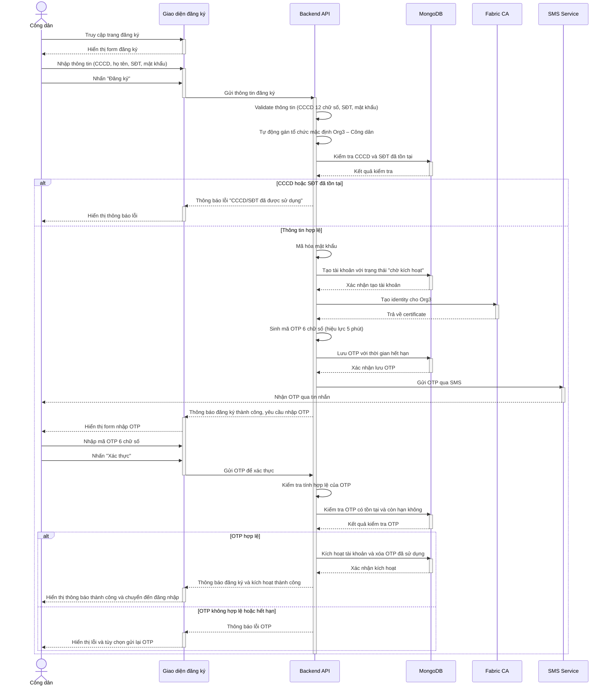
```mermaid
sequenceDiagram
    actor Citizen as Công dân
    participant UI as Giao diện đăng ký
    participant API as Backend API
    participant DB as MongoDB
    participant CA as Fabric CA
    participant SMS as SMS Service

    Citizen ->> UI: Truy cập trang đăng ký
    activate UI
    UI -->> Citizen: Hiển thị form đăng ký
    deactivate UI
    Citizen ->> UI: Nhập thông tin (CCCD, họ tên, SĐT, mật khẩu)
    
    activate UI
    Citizen ->> UI: Nhấn "Đăng ký"
    UI ->> API: Gửi thông tin đăng ký
    deactivate UI

    activate API
    API ->> API: Validate thông tin (CCCD 12 chữ số, SĐT, mật khẩu)
    API ->> API: Tự động gán tổ chức mặc định Org3 – Công dân
    API ->> DB: Kiểm tra CCCD và SĐT đã tồn tại
    
    activate DB 
    DB -->> API: Kết quả kiểm tra
    deactivate DB

    alt CCCD hoặc SĐT đã tồn tại
        API -->> UI: Thông báo lỗi "CCCD/SĐT đã được sử dụng"
        activate UI
        UI -->> Citizen: Hiển thị thông báo lỗi
        deactivate UI
    else Thông tin hợp lệ
        API ->> API: Mã hóa mật khẩu

        API ->> DB: Tạo tài khoản với trạng thái "chờ kích hoạt"
        activate DB
        DB -->> API: Xác nhận tạo tài khoản
        deactivate DB

        API ->> CA: Tạo identity cho Org3
        activate CA
        CA -->> API: Trả về certificate
        deactivate CA

        API ->> API: Sinh mã OTP 6 chữ số (hiệu lực 5 phút)

        API ->> DB: Lưu OTP với thời gian hết hạn
        activate DB
        DB -->> API: Xác nhận lưu OTP
        deactivate DB

        API ->> SMS: Gửi OTP qua SMS
        activate SMS
        SMS -->> Citizen: Nhận OTP qua tin nhắn
        deactivate SMS

        API -->> UI: Thông báo đăng ký thành công, yêu cầu nhập OTP
              
        activate UI
        UI -->> Citizen: Hiển thị form nhập OTP

        Citizen ->> UI: Nhập mã OTP 6 chữ số
        Citizen ->> UI: Nhấn "Xác thực"
        UI ->> API: Gửi OTP để xác thực
        deactivate UI

        API ->> API: Kiểm tra tính hợp lệ của OTP

        API ->> DB: Kiểm tra OTP có tồn tại và còn hạn không
        activate DB
        DB -->> API: Kết quả kiểm tra OTP
        deactivate DB

        alt OTP hợp lệ
            API ->> DB: Kích hoạt tài khoản và xóa OTP đã sử dụng
            activate DB
            DB -->> API: Xác nhận kích hoạt
            deactivate DB

            API -->> UI: Thông báo đăng ký và kích hoạt thành công
            activate UI
            UI -->> Citizen: Hiển thị thông báo thành công và chuyển đến đăng nhập
            deactivate UI
        else OTP không hợp lệ hoặc hết hạn
            API -->> UI: Thông báo lỗi OTP
            activate UI
            UI -->> Citizen: Hiển thị lỗi và tùy chọn gửi lại OTP
            deactivate UI
        end
    end

    deactivate API
```

## UC-02: Tạo tài khoản cán bộ

### Mô tả ngắn gọn
Admin tạo tài khoản cho cán bộ trong tổ chức của mình

### Sequence Diagram
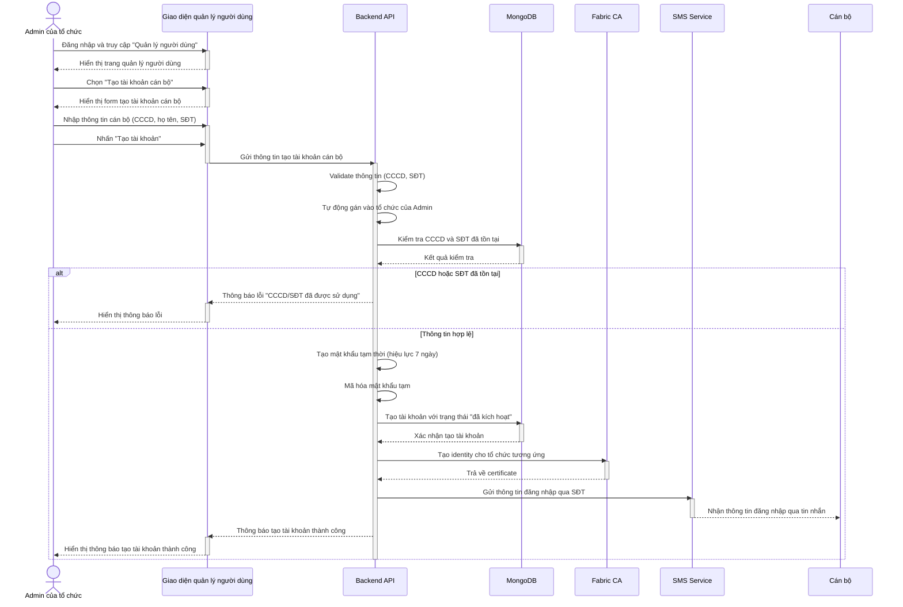
```mermaid
sequenceDiagram
    actor Admin as Admin của tổ chức
    participant UI as Giao diện quản lý người dùng
    participant API as Backend API
    participant DB as MongoDB
    participant CA as Fabric CA
    participant SMS as SMS Service

    Admin ->> UI: Đăng nhập và truy cập "Quản lý người dùng"
    activate UI
    UI -->> Admin: Hiển thị trang quản lý người dùng
    deactivate UI

    Admin ->> UI: Chọn "Tạo tài khoản cán bộ"
    activate UI
    UI -->> Admin: Hiển thị form tạo tài khoản cán bộ
    deactivate UI

    Admin ->> UI: Nhập thông tin cán bộ (CCCD, họ tên, SĐT)
    activate UI
    Admin ->> UI: Nhấn "Tạo tài khoản"
    UI ->> API: Gửi thông tin tạo tài khoản cán bộ
    deactivate UI

    activate API
    API ->> API: Validate thông tin (CCCD, SĐT)
    API ->> API: Tự động gán vào tổ chức của Admin

    API ->> DB: Kiểm tra CCCD và SĐT đã tồn tại
    activate DB
    DB -->> API: Kết quả kiểm tra
    deactivate DB

    alt CCCD hoặc SĐT đã tồn tại
        API -->> UI: Thông báo lỗi "CCCD/SĐT đã được sử dụng"
        activate UI
        UI -->> Admin: Hiển thị thông báo lỗi
        deactivate UI
    else Thông tin hợp lệ
        API ->> API: Tạo mật khẩu tạm thời (hiệu lực 7 ngày)
        API ->> API: Mã hóa mật khẩu tạm

        API ->> DB: Tạo tài khoản với trạng thái "đã kích hoạt"
        activate DB
        DB -->> API: Xác nhận tạo tài khoản
        deactivate DB

        API ->> CA: Tạo identity cho tổ chức tương ứng
        activate CA
        CA -->> API: Trả về certificate
        deactivate CA

        API ->> SMS: Gửi thông tin đăng nhập qua SĐT
        activate SMS
        SMS -->> Cán bộ: Nhận thông tin đăng nhập qua tin nhắn
        deactivate SMS

        API -->> UI: Thông báo tạo tài khoản thành công
        activate UI
        UI -->> Admin: Hiển thị thông báo tạo tài khoản thành công
        deactivate UI
    end

    deactivate API
```

---

### **Task 1.2: Đăng nhập và Quản lý phiên**

---

## UC-03: Đăng nhập hệ thống

### Mô tả ngắn gọn
Xác thực danh tính và truy cập vào hệ thống

### Sequence Diagram

```mermaid
sequenceDiagram
    actor User as Tất cả người dùng
    participant UI as Giao diện đăng nhập
    participant API as Backend API
    participant DB as MongoDB
    participant CA as Fabric CA

    User ->> UI: Truy cập trang đăng nhập
    activate UI
    UI -->> User: Hiển thị form đăng nhập
    deactivate UI

    User ->> UI: Nhập CCCD và mật khẩu
    activate UI
    User ->> UI: Nhấn "Đăng nhập"
    UI ->> API: Gửi thông tin đăng nhập
    deactivate UI

    activate API
    API ->> DB: Kiểm tra tài khoản có tồn tại không
    activate DB
    DB -->> API: Kết quả kiểm tra tài khoản
    deactivate DB

    alt Tài khoản không tồn tại
        API -->> UI: Thông báo "Tài khoản không tồn tại"
        activate UI
        UI -->> User: Hiển thị thông báo lỗi
        deactivate UI
    else Tài khoản tồn tại
        API ->> API: Kiểm tra mật khẩu có đúng không

        alt Mật khẩu sai
            API -->> UI: Thông báo "Mật khẩu không đúng"
            activate UI
            UI -->> User: Hiển thị thông báo lỗi
            deactivate UI
        else Mật khẩu đúng
            API ->> DB: Kiểm tra tài khoản có bị khóa không
            activate DB
            DB -->> API: Kết quả kiểm tra trạng thái
            deactivate DB

            alt Tài khoản bị khóa
                API -->> UI: Thông báo "Tài khoản đã bị khóa"
                activate UI
                UI -->> User: Hiển thị thông báo lỗi
                deactivate UI
            else Tài khoản không bị khóa
                API ->> CA: Lấy identity certificate
                activate CA
                CA -->> API: Trả về certificate
                deactivate CA

                API ->> API: Tạo phiên đăng nhập và token (hiệu lực 8 giờ)
                API ->> DB: Ghi lại thời gian đăng nhập
                activate DB
                DB -->> API: Xác nhận ghi log
                deactivate DB

                API -->> UI: Trả về token xác thực và thông tin user
                activate UI
                UI -->> User: Chuyển hướng đến trang chính theo quyền hạn
                deactivate UI
            end
        end
    end

    deactivate API
```

---

## UC-04: Đăng xuất hệ thống

### Mô tả ngắn gọn
Kết thúc phiên làm việc và bảo mật tài khoản

### Sequence Diagram
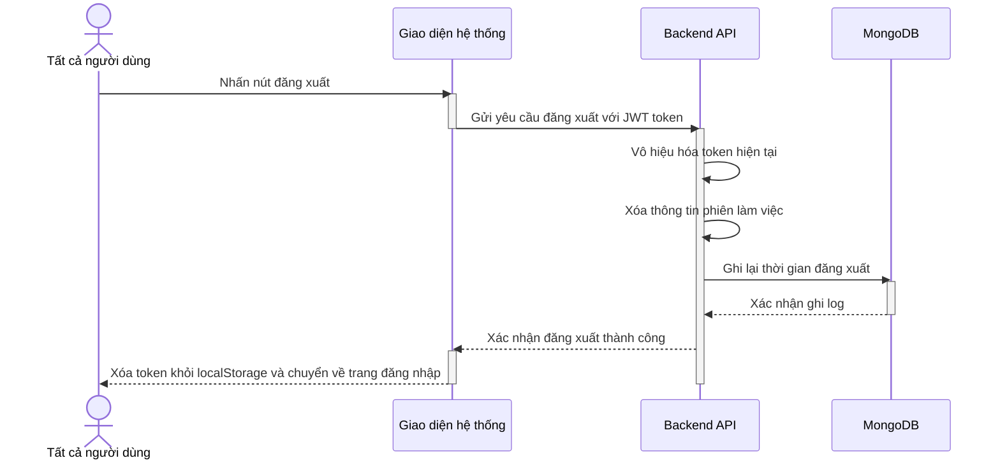
```mermaid
sequenceDiagram
    actor User as Tất cả người dùng
    participant UI as Giao diện hệ thống
    participant API as Backend API
    participant DB as MongoDB

    User ->> UI: Nhấn nút đăng xuất
    activate UI
    UI ->> API: Gửi yêu cầu đăng xuất với JWT token
    deactivate UI

    activate API
    API ->> API: Vô hiệu hóa token hiện tại
    API ->> API: Xóa thông tin phiên làm việc

    API ->> DB: Ghi lại thời gian đăng xuất
    activate DB
    DB -->> API: Xác nhận ghi log
    deactivate DB

    API -->> UI: Xác nhận đăng xuất thành công
    activate UI
    UI -->> User: Xóa token khỏi localStorage và chuyển về trang đăng nhập
    deactivate UI

    deactivate API

```

---

### **Task 1.3: Quản lý mật khẩu**

---

## UC-05: Đổi mật khẩu

### Mô tả ngắn gọn
Cập nhật mật khẩu mới để tăng cường bảo mật

### Sequence Diagram
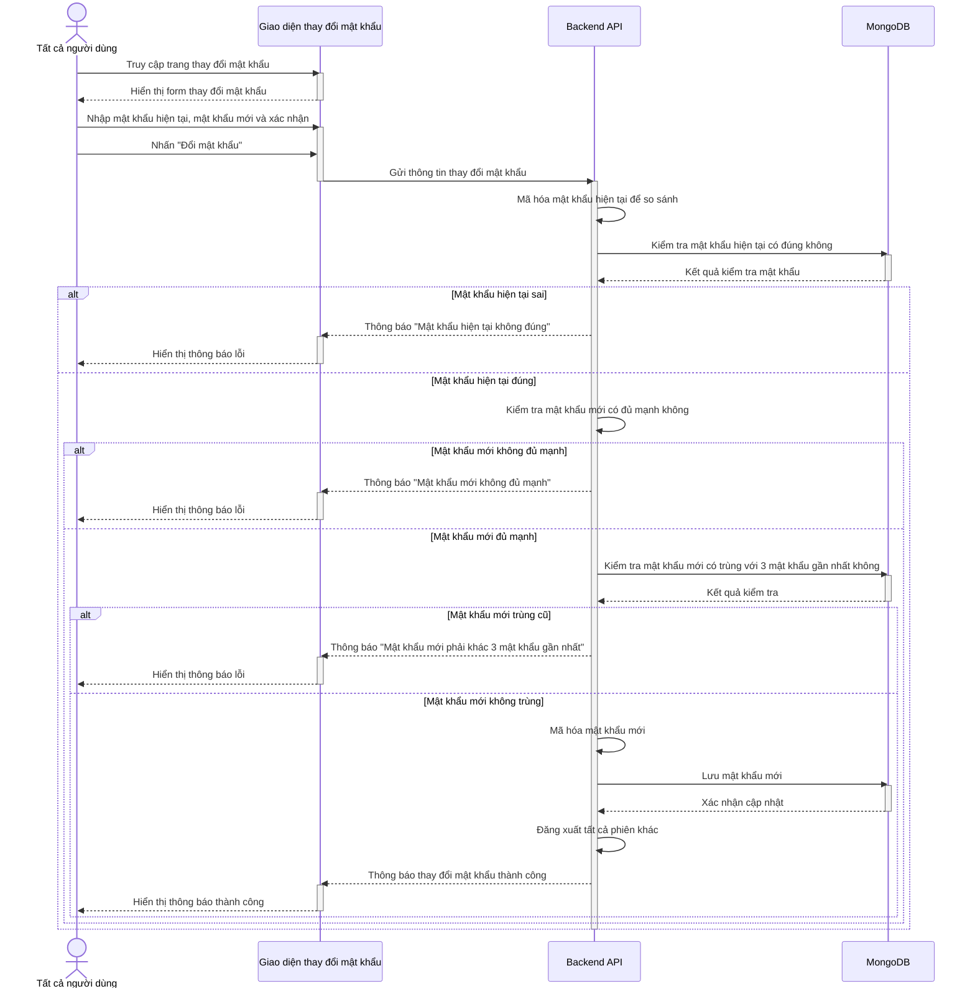
```mermaid
sequenceDiagram
    actor User as Tất cả người dùng
    participant UI as Giao diện thay đổi mật khẩu
    participant API as Backend API
    participant DB as MongoDB

    User ->> UI: Truy cập trang thay đổi mật khẩu
    activate UI
    UI -->> User: Hiển thị form thay đổi mật khẩu
    deactivate UI

    User ->> UI: Nhập mật khẩu hiện tại, mật khẩu mới và xác nhận
    activate UI
    User ->> UI: Nhấn "Đổi mật khẩu"
    UI ->> API: Gửi thông tin thay đổi mật khẩu
    deactivate UI

    activate API
    API ->> API: Mã hóa mật khẩu hiện tại để so sánh
    API ->> DB: Kiểm tra mật khẩu hiện tại có đúng không
    activate DB
    DB -->> API: Kết quả kiểm tra mật khẩu
    deactivate DB

    alt Mật khẩu hiện tại sai
        API -->> UI: Thông báo "Mật khẩu hiện tại không đúng"
        activate UI
        UI -->> User: Hiển thị thông báo lỗi
        deactivate UI
    else Mật khẩu hiện tại đúng
        API ->> API: Kiểm tra mật khẩu mới có đủ mạnh không

        alt Mật khẩu mới không đủ mạnh
            API -->> UI: Thông báo "Mật khẩu mới không đủ mạnh"
            activate UI
            UI -->> User: Hiển thị thông báo lỗi
            deactivate UI
        else Mật khẩu mới đủ mạnh
            API ->> DB: Kiểm tra mật khẩu mới có trùng với 3 mật khẩu gần nhất không
            activate DB
            DB -->> API: Kết quả kiểm tra
            deactivate DB

            alt Mật khẩu mới trùng cũ
                API -->> UI: Thông báo "Mật khẩu mới phải khác 3 mật khẩu gần nhất"
                activate UI
                UI -->> User: Hiển thị thông báo lỗi
                deactivate UI
            else Mật khẩu mới không trùng
                API ->> API: Mã hóa mật khẩu mới
                API ->> DB: Lưu mật khẩu mới
                activate DB
                DB -->> API: Xác nhận cập nhật
                deactivate DB

                API ->> API: Đăng xuất tất cả phiên khác
                API -->> UI: Thông báo thay đổi mật khẩu thành công
                activate UI
                UI -->> User: Hiển thị thông báo thành công
                deactivate UI
            end
        end
    end

    deactivate API
```

---

## UC-06: Quên mật khẩu

### Mô tả ngắn gọn
Khôi phục quyền truy cập tài khoản khi quên mật khẩu

### Sequence Diagram
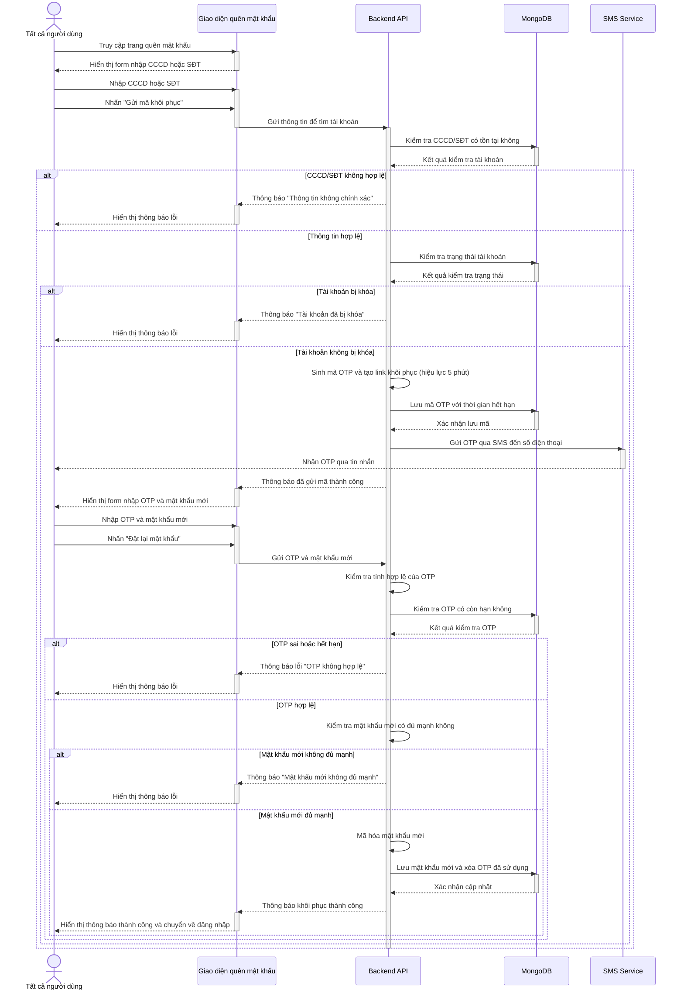
```mermaid
sequenceDiagram
    actor User as Tất cả người dùng
    participant UI as Giao diện quên mật khẩu
    participant API as Backend API
    participant DB as MongoDB
    participant SMS as SMS Service

    User ->> UI: Truy cập trang quên mật khẩu
    activate UI
    UI -->> User: Hiển thị form nhập CCCD hoặc SĐT
    deactivate UI

    User ->> UI: Nhập CCCD hoặc SĐT
    activate UI
    User ->> UI: Nhấn "Gửi mã khôi phục"
    UI ->> API: Gửi thông tin để tìm tài khoản
    deactivate UI

    activate API
    API ->> DB: Kiểm tra CCCD/SĐT có tồn tại không
    activate DB
    DB -->> API: Kết quả kiểm tra tài khoản
    deactivate DB

    alt CCCD/SĐT không hợp lệ
        API -->> UI: Thông báo "Thông tin không chính xác"
        activate UI
        UI -->> User: Hiển thị thông báo lỗi
        deactivate UI
    else Thông tin hợp lệ
        API ->> DB: Kiểm tra trạng thái tài khoản
        activate DB
        DB -->> API: Kết quả kiểm tra trạng thái
        deactivate DB

        alt Tài khoản bị khóa
            API -->> UI: Thông báo "Tài khoản đã bị khóa"
            activate UI
            UI -->> User: Hiển thị thông báo lỗi
            deactivate UI
        else Tài khoản không bị khóa
            API ->> API: Sinh mã OTP và tạo link khôi phục (hiệu lực 5 phút)

            API ->> DB: Lưu mã OTP với thời gian hết hạn
            activate DB
            DB -->> API: Xác nhận lưu mã
            deactivate DB

            API ->> SMS: Gửi OTP qua SMS đến số điện thoại
            activate SMS
            SMS -->> User: Nhận OTP qua tin nhắn
            deactivate SMS

            API -->> UI: Thông báo đã gửi mã thành công
            activate UI
            UI -->> User: Hiển thị form nhập OTP và mật khẩu mới
            deactivate UI

            User ->> UI: Nhập OTP và mật khẩu mới
            activate UI
            User ->> UI: Nhấn "Đặt lại mật khẩu"
            UI ->> API: Gửi OTP và mật khẩu mới
            deactivate UI

            API ->> API: Kiểm tra tính hợp lệ của OTP

            API ->> DB: Kiểm tra OTP có còn hạn không
            activate DB
            DB -->> API: Kết quả kiểm tra OTP
            deactivate DB

            alt OTP sai hoặc hết hạn
                API -->> UI: Thông báo lỗi "OTP không hợp lệ"
                activate UI
                UI -->> User: Hiển thị thông báo lỗi
                deactivate UI
            else OTP hợp lệ
                API ->> API: Kiểm tra mật khẩu mới có đủ mạnh không

                alt Mật khẩu mới không đủ mạnh
                    API -->> UI: Thông báo "Mật khẩu mới không đủ mạnh"
                    activate UI
                    UI -->> User: Hiển thị thông báo lỗi
                    deactivate UI
                else Mật khẩu mới đủ mạnh
                    API ->> API: Mã hóa mật khẩu mới
                    API ->> DB: Lưu mật khẩu mới và xóa OTP đã sử dụng
                    activate DB
                    DB -->> API: Xác nhận cập nhật
                    deactivate DB

                    API -->> UI: Thông báo khôi phục thành công
                    activate UI
                    UI -->> User: Hiển thị thông báo thành công và chuyển về đăng nhập
                    deactivate UI
                end
            end
        end
    end

    deactivate API

```

---

### **Task 1.4: Quản lý tài khoản**

---

## UC-07: Cập nhật thông tin tài khoản

### Mô tả ngắn gọn
Người dùng cập nhật thông tin cá nhân của chính mình

### Sequence Diagram
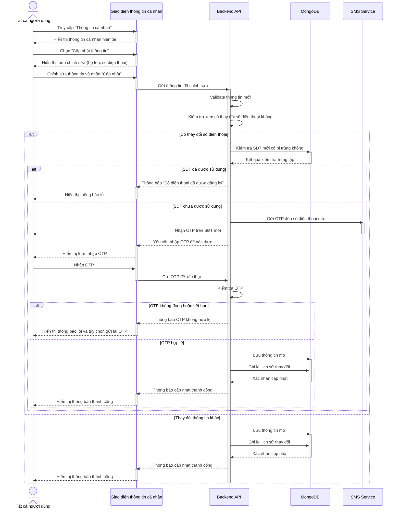
```mermaid
sequenceDiagram
    actor User as Tất cả người dùng
    participant UI as Giao diện thông tin cá nhân
    participant API as Backend API
    participant DB as MongoDB
    participant SMS as SMS Service

    User ->> UI: Truy cập "Thông tin cá nhân"
    activate UI
    UI -->> User: Hiển thị thông tin cá nhân hiện tại
    deactivate UI

    User ->> UI: Chọn "Cập nhật thông tin"
    activate UI
    UI -->> User: Hiển thị form chỉnh sửa (họ tên, số điện thoại)
    deactivate UI

    User ->> UI: Chỉnh sửa thông tin và nhấn "Cập nhật"
    activate UI
    UI ->> API: Gửi thông tin đã chỉnh sửa
    deactivate UI

    activate API
    API ->> API: Validate thông tin mới
    API ->> API: Kiểm tra xem có thay đổi số điện thoại không

    alt Có thay đổi số điện thoại
        API ->> DB: Kiểm tra SĐT mới có bị trùng không
        activate DB
        DB -->> API: Kết quả kiểm tra trùng lặp
        deactivate DB

        alt SĐT đã được sử dụng
            API -->> UI: Thông báo "Số điện thoại đã được đăng ký"
            activate UI
            UI -->> User: Hiển thị thông báo lỗi
            deactivate UI
        else SĐT chưa được sử dụng
            API ->> SMS: Gửi OTP đến số điện thoại mới
            activate SMS
            SMS -->> User: Nhận OTP trên SĐT mới
            deactivate SMS

            API -->> UI: Yêu cầu nhập OTP để xác thực
            activate UI
            UI -->> User: Hiển thị form nhập OTP
            User ->> UI: Nhập OTP
            UI ->> API: Gửi OTP để xác thực
            deactivate UI

            API ->> API: Kiểm tra OTP

            alt OTP không đúng hoặc hết hạn
                API -->> UI: Thông báo OTP không hợp lệ
                activate UI
                UI -->> User: Hiển thị thông báo lỗi và tùy chọn gửi lại OTP
                deactivate UI
            else OTP hợp lệ
                API ->> DB: Lưu thông tin mới
                activate DB
                API ->> DB: Ghi lại lịch sử thay đổi
                DB -->> API: Xác nhận cập nhật
                deactivate DB

                API -->> UI: Thông báo cập nhật thành công
                activate UI
                UI -->> User: Hiển thị thông báo thành công
                deactivate UI
            end
        end
    else Thay đổi thông tin khác
        API ->> DB: Lưu thông tin mới
        activate DB
        API ->> DB: Ghi lại lịch sử thay đổi
        DB -->> API: Xác nhận cập nhật
        deactivate DB

        API -->> UI: Thông báo cập nhật thành công
        activate UI
        UI -->> User: Hiển thị thông báo thành công
        deactivate UI
    end

    deactivate API
```

---

## UC-08: Khóa/Mở khóa tài khoản

### Mô tả ngắn gọn
Kiểm soát trạng thái hoạt động tài khoản

### Sequence Diagram
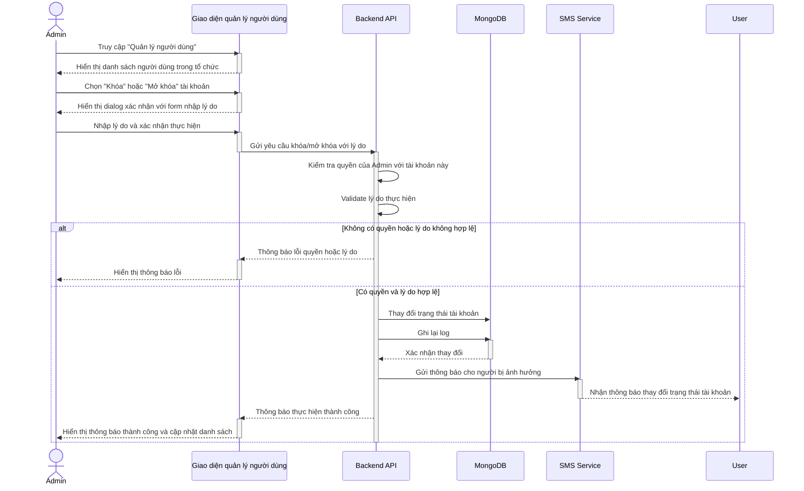
```mermaid
sequenceDiagram
    actor Admin as Admin
    participant UI as Giao diện quản lý người dùng
    participant API as Backend API
    participant DB as MongoDB
    participant SMS as SMS Service

    Admin ->> UI: Truy cập "Quản lý người dùng"
    activate UI
    UI -->> Admin: Hiển thị danh sách người dùng trong tổ chức
    deactivate UI

    Admin ->> UI: Chọn "Khóa" hoặc "Mở khóa" tài khoản
    activate UI
    UI -->> Admin: Hiển thị dialog xác nhận với form nhập lý do
    deactivate UI

    Admin ->> UI: Nhập lý do và xác nhận thực hiện
    activate UI
    UI ->> API: Gửi yêu cầu khóa/mở khóa với lý do
    deactivate UI

    activate API
    API ->> API: Kiểm tra quyền của Admin với tài khoản này
    API ->> API: Validate lý do thực hiện

    alt Không có quyền hoặc lý do không hợp lệ
        API -->> UI: Thông báo lỗi quyền hoặc lý do
        activate UI
        UI -->> Admin: Hiển thị thông báo lỗi
        deactivate UI
    else Có quyền và lý do hợp lệ
        API ->> DB: Thay đổi trạng thái tài khoản
        API ->> DB: Ghi lại log
        activate DB
        DB -->> API: Xác nhận thay đổi
        deactivate DB

        API ->> SMS: Gửi thông báo cho người bị ảnh hưởng
        activate SMS
        SMS -->> User: Nhận thông báo thay đổi trạng thái tài khoản
        deactivate SMS

        API -->> UI: Thông báo thực hiện thành công
        activate UI
        UI -->> Admin: Hiển thị thông báo thành công và cập nhật danh sách
        deactivate UI
    end

    deactivate API
```

---

## 📋 **MODULE 2: QUẢN LÝ THỬA ĐẤT**

### **Task 2.1: Tạo và Cập nhật thửa đất**

---

## UC-09: Tạo thửa đất mới

### Mô tả ngắn gọn
Ghi nhận quyền sử dụng đất hợp pháp vào blockchain

### Sequence Diagram
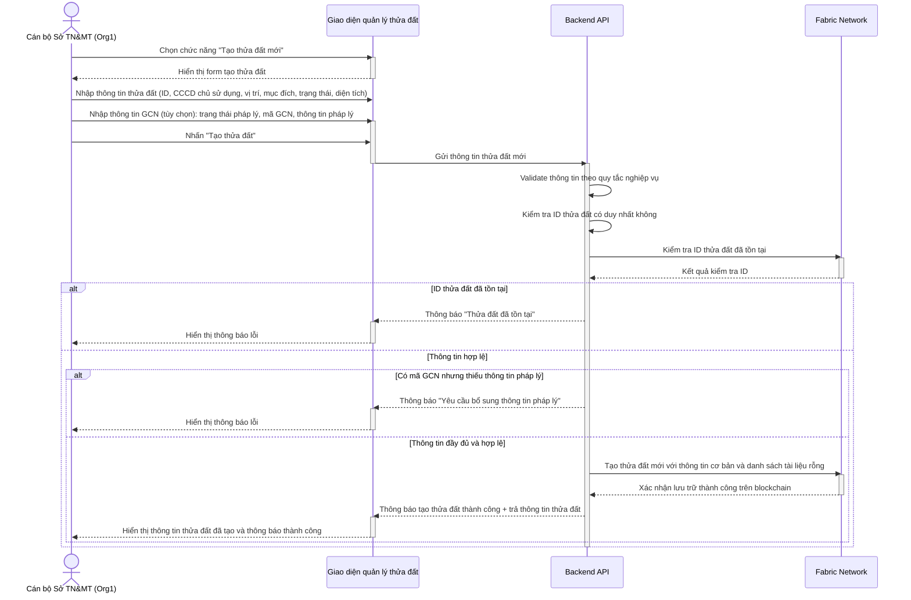
```mermaid
sequenceDiagram
    actor Officer as Cán bộ Sở TN&MT (Org1)
    participant UI as Giao diện quản lý thửa đất
    participant API as Backend API
    participant Blockchain as Fabric Network

    Officer ->> UI: Chọn chức năng "Tạo thửa đất mới"
    activate UI
    UI -->> Officer: Hiển thị form tạo thửa đất
    deactivate UI

    Officer ->> UI: Nhập thông tin thửa đất (ID, CCCD chủ sử dụng, vị trí, mục đích, trạng thái, diện tích)
    Officer ->> UI: Nhập thông tin GCN (tùy chọn): trạng thái pháp lý, mã GCN, thông tin pháp lý
    activate UI
    Officer ->> UI: Nhấn "Tạo thửa đất"
    UI ->> API: Gửi thông tin thửa đất mới
    deactivate UI

    activate API
    API ->> API: Validate thông tin theo quy tắc nghiệp vụ
    API ->> API: Kiểm tra ID thửa đất có duy nhất không

    API ->> Blockchain: Kiểm tra ID thửa đất đã tồn tại
    activate Blockchain
    Blockchain -->> API: Kết quả kiểm tra ID
    deactivate Blockchain

    alt ID thửa đất đã tồn tại
        API -->> UI: Thông báo "Thửa đất đã tồn tại"
        activate UI
        UI -->> Officer: Hiển thị thông báo lỗi
        deactivate UI
    else Thông tin hợp lệ
        alt Có mã GCN nhưng thiếu thông tin pháp lý
            API -->> UI: Thông báo "Yêu cầu bổ sung thông tin pháp lý"
            activate UI
            UI -->> Officer: Hiển thị thông báo lỗi
            deactivate UI
        else Thông tin đầy đủ và hợp lệ
            API ->> Blockchain: Tạo thửa đất mới với thông tin cơ bản và danh sách tài liệu rỗng
            activate Blockchain
            Blockchain -->> API: Xác nhận lưu trữ thành công trên blockchain
            deactivate Blockchain

            API -->> UI: Thông báo tạo thửa đất thành công + trả thông tin thửa đất
            activate UI
            UI -->> Officer: Hiển thị thông tin thửa đất đã tạo và thông báo thành công
            deactivate UI
        end
    end

    deactivate API

```

---

## UC-10: Cập nhật thông tin thửa đất

### Mô tả ngắn gọn
Cập nhật thông tin thửa đất khi có thay đổi

### Sequence Diagram
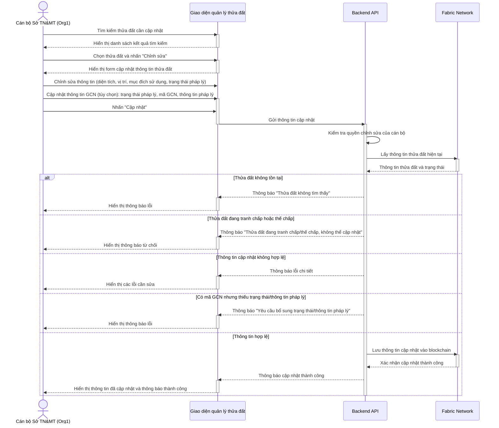
```mermaid
sequenceDiagram
    actor Officer as Cán bộ Sở TN&MT (Org1)
    participant UI as Giao diện quản lý thửa đất
    participant API as Backend API
    participant Blockchain as Fabric Network

    Officer ->> UI: Tìm kiếm thửa đất cần cập nhật
    activate UI
    UI -->> Officer: Hiển thị danh sách kết quả tìm kiếm
    deactivate UI

    Officer ->> UI: Chọn thửa đất và nhấn "Chỉnh sửa"
    activate UI
    UI -->> Officer: Hiển thị form cập nhật thông tin thửa đất
    deactivate UI

    Officer ->> UI: Chỉnh sửa thông tin (diện tích, vị trí, mục đích sử dụng, trạng thái pháp lý)
    Officer ->> UI: Cập nhật thông tin GCN (tùy chọn): trạng thái pháp lý, mã GCN, thông tin pháp lý
    activate UI
    Officer ->> UI: Nhấn "Cập nhật"
    UI ->> API: Gửi thông tin cập nhật
    deactivate UI

    activate API
    API ->> API: Kiểm tra quyền chỉnh sửa của cán bộ

    API ->> Blockchain: Lấy thông tin thửa đất hiện tại
    activate Blockchain
    Blockchain -->> API: Thông tin thửa đất và trạng thái
    deactivate Blockchain

    alt Thửa đất không tồn tại
        API -->> UI: Thông báo "Thửa đất không tìm thấy"
        activate UI
        UI -->> Officer: Hiển thị thông báo lỗi
        deactivate UI
    else Thửa đất đang tranh chấp hoặc thế chấp
        API -->> UI: Thông báo "Thửa đất đang tranh chấp/thế chấp, không thể cập nhật"
        activate UI
        UI -->> Officer: Hiển thị thông báo từ chối
        deactivate UI
    else Thông tin cập nhật không hợp lệ
        API -->> UI: Thông báo lỗi chi tiết
        activate UI
        UI -->> Officer: Hiển thị các lỗi cần sửa
        deactivate UI
    else Có mã GCN nhưng thiếu trạng thái/thông tin pháp lý
        API -->> UI: Thông báo "Yêu cầu bổ sung trạng thái/thông tin pháp lý"
        activate UI
        UI -->> Officer: Hiển thị thông báo lỗi
        deactivate UI
    else Thông tin hợp lệ
        API ->> Blockchain: Lưu thông tin cập nhật vào blockchain
        activate Blockchain
        Blockchain -->> API: Xác nhận cập nhật thành công
        deactivate Blockchain

        API -->> UI: Thông báo cập nhật thành công
        activate UI
        UI -->> Officer: Hiển thị thông tin đã cập nhật và thông báo thành công
        deactivate UI
    end

    deactivate API

```

---

### **Task 2.2: Tìm kiếm và Xem thông tin thửa đất**

---

## UC-11: Tìm kiếm thửa đất

### Mô tả ngắn gọn
Tra cứu thông tin thửa đất nhanh chóng và chính xác theo nhiều tiêu chí

### Sequence Diagram
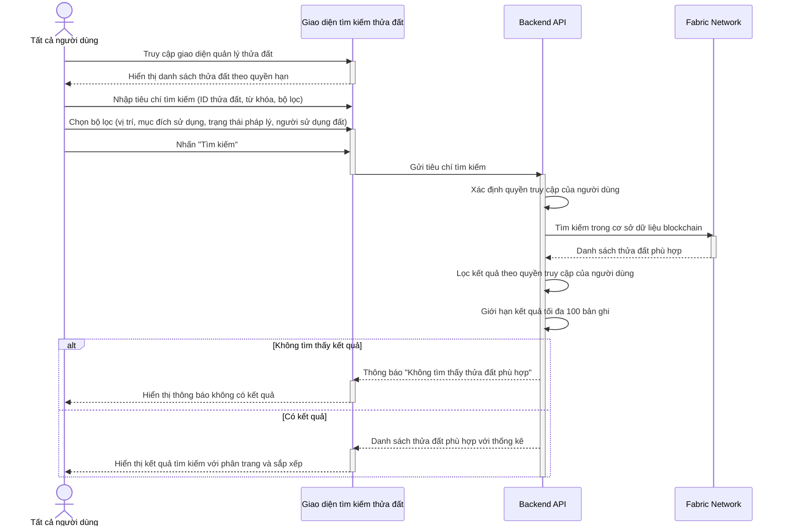
```mermaid
sequenceDiagram
    actor User as Tất cả người dùng
    participant UI as Giao diện tìm kiếm thửa đất
    participant API as Backend API
    participant Blockchain as Fabric Network

    User ->> UI: Truy cập giao diện quản lý thửa đất
    activate UI
    UI -->> User: Hiển thị danh sách thửa đất theo quyền hạn
    deactivate UI

    User ->> UI: Nhập tiêu chí tìm kiếm (ID thửa đất, từ khóa, bộ lọc)
    User ->> UI: Chọn bộ lọc (vị trí, mục đích sử dụng, trạng thái pháp lý, người sử dụng đất)
    activate UI
    User ->> UI: Nhấn "Tìm kiếm"
    UI ->> API: Gửi tiêu chí tìm kiếm
    deactivate UI

    activate API
    API ->> API: Xác định quyền truy cập của người dùng

    API ->> Blockchain: Tìm kiếm trong cơ sở dữ liệu blockchain
    activate Blockchain
    Blockchain -->> API: Danh sách thửa đất phù hợp
    deactivate Blockchain

    API ->> API: Lọc kết quả theo quyền truy cập của người dùng
    API ->> API: Giới hạn kết quả tối đa 100 bản ghi

    alt Không tìm thấy kết quả
        API -->> UI: Thông báo "Không tìm thấy thửa đất phù hợp"
        activate UI
        UI -->> User: Hiển thị thông báo không có kết quả
        deactivate UI
    else Có kết quả
        API -->> UI: Danh sách thửa đất phù hợp với thống kê
        activate UI
        UI -->> User: Hiển thị kết quả tìm kiếm với phân trang và sắp xếp
        deactivate UI
    end

    deactivate API

```

---

## UC-12: Xem chi tiết thửa đất

### Mô tả ngắn gọn
Xem đầy đủ thông tin và trạng thái hiện tại của thửa đất

### Sequence Diagram
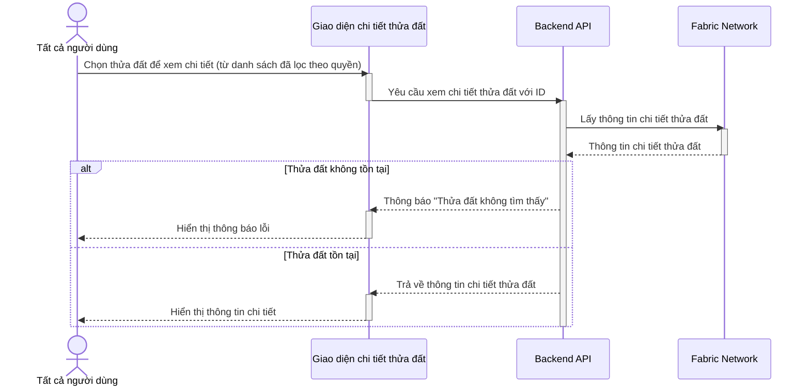
```mermaid
sequenceDiagram
    actor User as Tất cả người dùng
    participant UI as Giao diện chi tiết thửa đất
    participant API as Backend API
    participant Blockchain as Fabric Network

    User ->> UI: Chọn thửa đất để xem chi tiết (từ danh sách đã lọc theo quyền)
    activate UI
    UI ->> API: Yêu cầu xem chi tiết thửa đất với ID
    deactivate UI

    activate API
    API ->> Blockchain: Lấy thông tin chi tiết thửa đất
    activate Blockchain
    Blockchain -->> API: Thông tin chi tiết thửa đất
    deactivate Blockchain

    alt Thửa đất không tồn tại
        API -->> UI: Thông báo "Thửa đất không tìm thấy"
        activate UI
        UI -->> User: Hiển thị thông báo lỗi
        deactivate UI
    else Thửa đất tồn tại
        API -->> UI: Trả về thông tin chi tiết thửa đất
        activate UI
        UI -->> User: Hiển thị thông tin chi tiết
        deactivate UI
    end

    deactivate API

```

---

## UC-13: Xem lịch sử thay đổi thửa đất

### Mô tả ngắn gọn
Theo dõi quá trình thay đổi thông tin thuộc tính của thửa đất theo thời gian

### Sequence Diagram
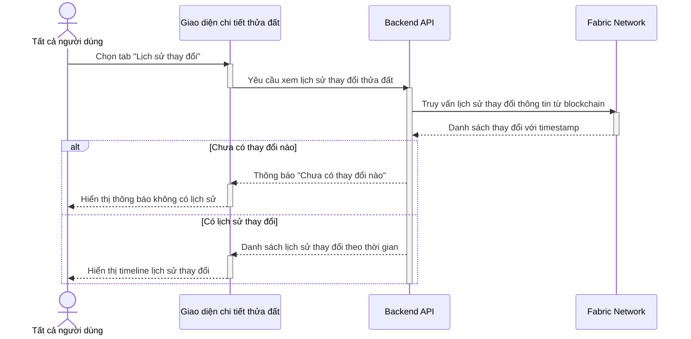
```mermaid
sequenceDiagram
    actor User as Tất cả người dùng
    participant UI as Giao diện chi tiết thửa đất
    participant API as Backend API
    participant Blockchain as Fabric Network

    User ->> UI: Chọn tab "Lịch sử thay đổi"
    activate UI
    UI ->> API: Yêu cầu xem lịch sử thay đổi thửa đất
    deactivate UI

    activate API
    API ->> Blockchain: Truy vấn lịch sử thay đổi thông tin từ blockchain
    activate Blockchain
    Blockchain -->> API: Danh sách thay đổi với timestamp
    deactivate Blockchain

    alt Chưa có thay đổi nào
        API -->> UI: Thông báo "Chưa có thay đổi nào"
        activate UI
        UI -->> User: Hiển thị thông báo không có lịch sử
        deactivate UI
    else Có lịch sử thay đổi
        API -->> UI: Danh sách lịch sử thay đổi theo thời gian
        activate UI
        UI -->> User: Hiển thị timeline lịch sử thay đổi
        deactivate UI
    end

    deactivate API

```

---

### **Task 2.3: Cấp giấy chứng nhận**

---

## UC-14: Cấp giấy chứng nhận quyền sử dụng đất

### Mô tả ngắn gọn
Cấp giấy chứng nhận quyền sử dụng đất cho thửa đất đã đủ điều kiện

### Sequence Diagram
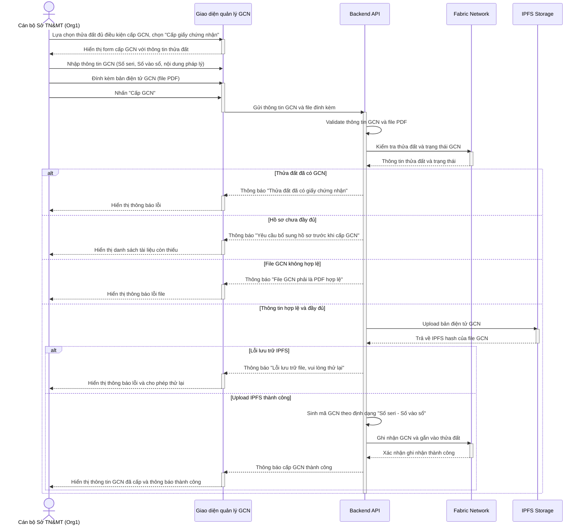
```mermaid
sequenceDiagram
    actor Officer as Cán bộ Sở TN&MT (Org1)
    participant UI as Giao diện quản lý GCN
    participant API as Backend API
    participant Blockchain as Fabric Network
    participant IPFS as IPFS Storage

    Officer ->> UI: Lựa chọn thửa đất đủ điều kiện cấp GCN, chọn "Cấp giấy chứng nhận"
    activate UI
    UI -->> Officer: Hiển thị form cấp GCN với thông tin thửa đất
    deactivate UI

    Officer ->> UI: Nhập thông tin GCN (Số seri, Số vào sổ, nội dung pháp lý)
    Officer ->> UI: Đính kèm bản điện tử GCN (file PDF)
    activate UI
    Officer ->> UI: Nhấn "Cấp GCN"
    UI ->> API: Gửi thông tin GCN và file đính kèm
    deactivate UI

    activate API
    API ->> API: Validate thông tin GCN và file PDF

    API ->> Blockchain: Kiểm tra thửa đất và trạng thái GCN
    activate Blockchain
    Blockchain -->> API: Thông tin thửa đất và trạng thái
    deactivate Blockchain

    alt Thửa đất đã có GCN
        API -->> UI: Thông báo "Thửa đất đã có giấy chứng nhận"
        activate UI
        UI -->> Officer: Hiển thị thông báo lỗi
        deactivate UI
    else Hồ sơ chưa đầy đủ
        API -->> UI: Thông báo "Yêu cầu bổ sung hồ sơ trước khi cấp GCN"
        activate UI
        UI -->> Officer: Hiển thị danh sách tài liệu còn thiếu
        deactivate UI
    else File GCN không hợp lệ
        API -->> UI: Thông báo "File GCN phải là PDF hợp lệ"
        activate UI
        UI -->> Officer: Hiển thị thông báo lỗi file
        deactivate UI
    else Thông tin hợp lệ và đầy đủ
        API ->> IPFS: Upload bản điện tử GCN
        activate IPFS
        IPFS -->> API: Trả về IPFS hash của file GCN
        deactivate IPFS

        alt Lỗi lưu trữ IPFS
            API -->> UI: Thông báo "Lỗi lưu trữ file, vui lòng thử lại"
            activate UI
            UI -->> Officer: Hiển thị thông báo lỗi và cho phép thử lại
            deactivate UI
        else Upload IPFS thành công
            API ->> API: Sinh mã GCN theo định dạng "Số seri - Số vào sổ"

            API ->> Blockchain: Ghi nhận GCN và gắn vào thửa đất
            activate Blockchain
            Blockchain -->> API: Xác nhận ghi nhận thành công
            deactivate Blockchain

            API -->> UI: Thông báo cấp GCN thành công
            activate UI
            UI -->> Officer: Hiển thị thông tin GCN đã cấp và thông báo thành công
            deactivate UI
        end
    end

    deactivate API

```

---

## 📋 **MODULE 3: QUẢN LÝ TÀI LIỆU**

### **Task 3.1: Tạo và Quản lý tài liệu**

---

## UC-15: Tạo tài liệu

### Mô tả ngắn gọn
Tạo và tải lên tài liệu mới vào hệ thống

### Sequence Diagram
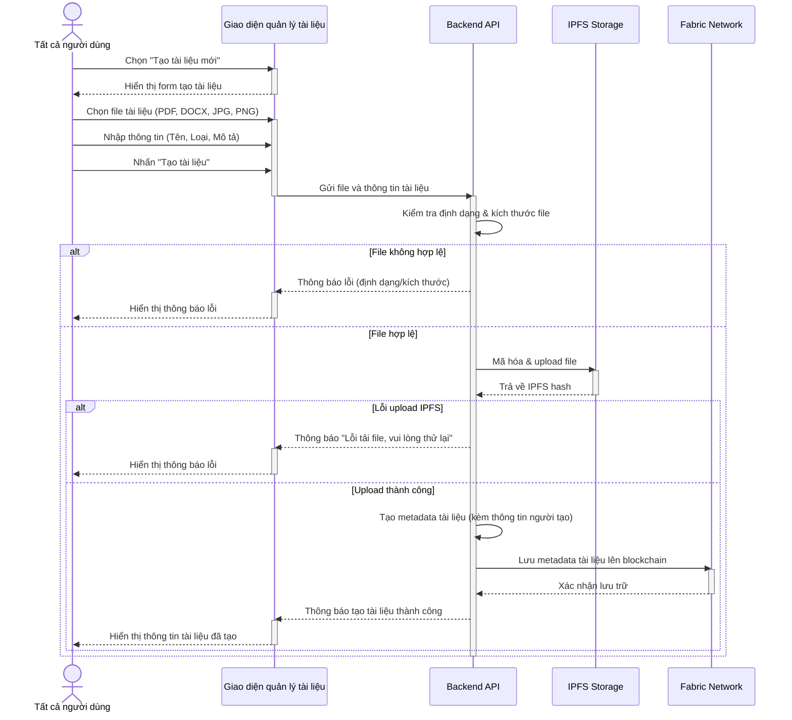
```mermaid
sequenceDiagram
    actor User as Tất cả người dùng
    participant UI as Giao diện quản lý tài liệu
    participant API as Backend API
    participant IPFS as IPFS Storage
    participant Blockchain as Fabric Network

    User ->> UI: Chọn "Tạo tài liệu mới"
    activate UI
    UI -->> User: Hiển thị form tạo tài liệu
    deactivate UI

    User ->> UI: Chọn file tài liệu (PDF, DOCX, JPG, PNG)
    activate UI
    User ->> UI: Nhập thông tin (Tên, Loại, Mô tả)
    User ->> UI: Nhấn "Tạo tài liệu"
    UI ->> API: Gửi file và thông tin tài liệu
    deactivate UI

    activate API
    API ->> API: Kiểm tra định dạng & kích thước file

    alt File không hợp lệ
        API -->> UI: Thông báo lỗi (định dạng/kích thước)
        activate UI
        UI -->> User: Hiển thị thông báo lỗi
        deactivate UI
    else File hợp lệ
        API ->> IPFS: Mã hóa & upload file
        activate IPFS
        IPFS -->> API: Trả về IPFS hash
        deactivate IPFS

        alt Lỗi upload IPFS
            API -->> UI: Thông báo "Lỗi tải file, vui lòng thử lại"
            activate UI
            UI -->> User: Hiển thị thông báo lỗi
            deactivate UI
        else Upload thành công
            API ->> API: Tạo metadata tài liệu (kèm thông tin người tạo)

            API ->> Blockchain: Lưu metadata tài liệu lên blockchain
            activate Blockchain
            Blockchain -->> API: Xác nhận lưu trữ
            deactivate Blockchain

            API -->> UI: Thông báo tạo tài liệu thành công
            activate UI
            UI -->> User: Hiển thị thông tin tài liệu đã tạo
            deactivate UI
        end
    end

    deactivate API

```

---

## UC-16: Xem chi tiết tài liệu

### Mô tả ngắn gọn
Hiển thị thông tin chi tiết và nội dung tài liệu

### Sequence Diagram
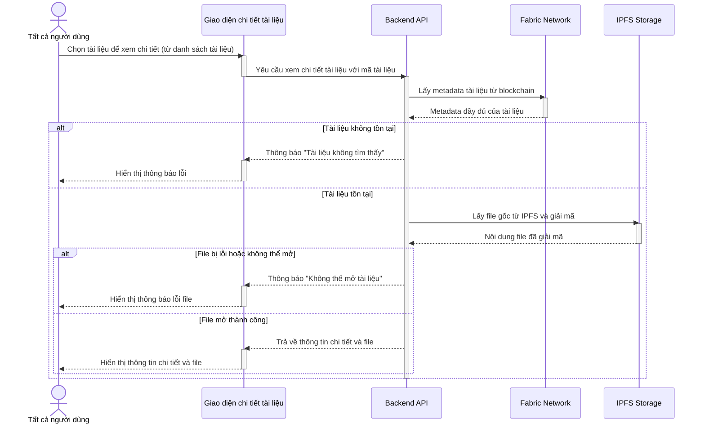
```mermaid
sequenceDiagram
    actor User as Tất cả người dùng
    participant UI as Giao diện chi tiết tài liệu
    participant API as Backend API
    participant Blockchain as Fabric Network
    participant IPFS as IPFS Storage

    User ->> UI: Chọn tài liệu để xem chi tiết (từ danh sách tài liệu)
    activate UI
    UI ->> API: Yêu cầu xem chi tiết tài liệu với mã tài liệu
    deactivate UI

    activate API
    API ->> Blockchain: Lấy metadata tài liệu từ blockchain
    activate Blockchain
    Blockchain -->> API: Metadata đầy đủ của tài liệu
    deactivate Blockchain

    alt Tài liệu không tồn tại
        API -->> UI: Thông báo "Tài liệu không tìm thấy"
        activate UI
        UI -->> User: Hiển thị thông báo lỗi
        deactivate UI
    else Tài liệu tồn tại
        API ->> IPFS: Lấy file gốc từ IPFS và giải mã
        activate IPFS
        IPFS -->> API: Nội dung file đã giải mã
        deactivate IPFS

        alt File bị lỗi hoặc không thể mở
            API -->> UI: Thông báo "Không thể mở tài liệu"
            activate UI
            UI -->> User: Hiển thị thông báo lỗi file
            deactivate UI
        else File mở thành công
            API -->> UI: Trả về thông tin chi tiết và file
            activate UI
            UI -->> User: Hiển thị thông tin chi tiết và file
            deactivate UI
        end
    end

    deactivate API

```

---

### **Task 3.2: Liên kết tài liệu**

---

## UC-17: Liên kết tài liệu bổ sung cho thửa đất

### Mô tả ngắn gọn
Liên kết tài liệu bổ sung với thửa đất; tài liệu được liên kết sẽ tự động được xác thực

### Sequence Diagram
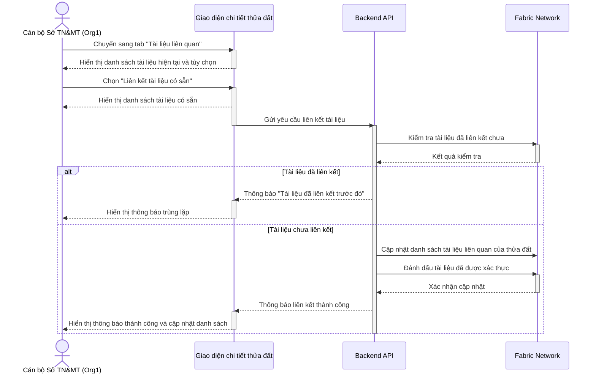
```mermaid
sequenceDiagram
    actor Officer as Cán bộ Sở TN&MT (Org1)
    participant UI as Giao diện chi tiết thửa đất
    participant API as Backend API
    participant Blockchain as Fabric Network

    Officer ->> UI: Chuyển sang tab "Tài liệu liên quan"
    activate UI
    UI -->> Officer: Hiển thị danh sách tài liệu hiện tại và tùy chọn
    deactivate UI

    Officer ->> UI: Chọn "Liên kết tài liệu có sẵn"
    activate UI
    UI -->> Officer: Hiển thị danh sách tài liệu có sẵn
    UI ->> API: Gửi yêu cầu liên kết tài liệu
    deactivate UI

    activate API
    API ->> Blockchain: Kiểm tra tài liệu đã liên kết chưa
    activate Blockchain
    Blockchain -->> API: Kết quả kiểm tra
    deactivate Blockchain

    alt Tài liệu đã liên kết
        API -->> UI: Thông báo "Tài liệu đã liên kết trước đó"
        activate UI
        UI -->> Officer: Hiển thị thông báo trùng lặp
        deactivate UI
    else Tài liệu chưa liên kết
        API ->> Blockchain: Cập nhật danh sách tài liệu liên quan của thửa đất
        API ->> Blockchain: Đánh dấu tài liệu đã được xác thực
        activate Blockchain
        Blockchain -->> API: Xác nhận cập nhật
        deactivate Blockchain

        API -->> UI: Thông báo liên kết thành công
        activate UI
        UI -->> Officer: Hiển thị thông báo thành công và cập nhật danh sách
        deactivate UI
    end

    deactivate API

```

---

## UC-18: Liên kết tài liệu bổ sung cho giao dịch

### Mô tả ngắn gọn
Công dân đính kèm tài liệu bổ sung vào hồ sơ giao dịch theo yêu cầu của cán bộ Org2

### Sequence Diagram
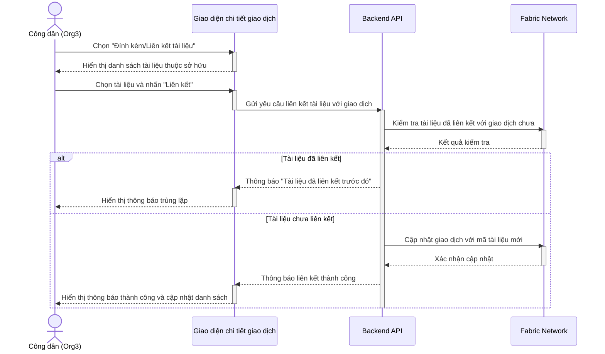
```mermaid
sequenceDiagram
    actor Citizen as Công dân (Org3)
    participant UI as Giao diện chi tiết giao dịch
    participant API as Backend API
    participant Blockchain as Fabric Network

    Citizen ->> UI: Chọn "Đính kèm/Liên kết tài liệu"
    activate UI
    UI -->> Citizen: Hiển thị danh sách tài liệu thuộc sở hữu
    deactivate UI

    Citizen ->> UI: Chọn tài liệu và nhấn "Liên kết"
    activate UI
    UI ->> API: Gửi yêu cầu liên kết tài liệu với giao dịch
    deactivate UI

    activate API
    API ->> Blockchain: Kiểm tra tài liệu đã liên kết với giao dịch chưa
    activate Blockchain
    Blockchain -->> API: Kết quả kiểm tra
    deactivate Blockchain

    alt Tài liệu đã liên kết
        API -->> UI: Thông báo "Tài liệu đã liên kết trước đó"
        activate UI
        UI -->> Citizen: Hiển thị thông báo trùng lặp
        deactivate UI
    else Tài liệu chưa liên kết
        API ->> Blockchain: Cập nhật giao dịch với mã tài liệu mới
        activate Blockchain
        Blockchain -->> API: Xác nhận cập nhật
        deactivate Blockchain

        API -->> UI: Thông báo liên kết thành công
        activate UI
        UI -->> Citizen: Hiển thị thông báo thành công và cập nhật danh sách
        deactivate UI
    end

    deactivate API

```

---

### **Task 3.3: Cập nhật và Xóa tài liệu**

---

## UC-19: Cập nhật tài liệu

### Mô tả ngắn gọn
Cập nhật thông tin mô tả và phân loại tài liệu

### Sequence Diagram
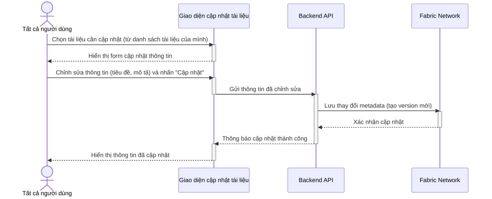
```mermaid
sequenceDiagram
    actor User as Tất cả người dùng
    participant UI as Giao diện cập nhật tài liệu
    participant API as Backend API
    participant Blockchain as Fabric Network

    User ->> UI: Chọn tài liệu cần cập nhật (từ danh sách tài liệu của mình)
    activate UI
    UI -->> User: Hiển thị form cập nhật thông tin
    deactivate UI

    User ->> UI: Chỉnh sửa thông tin (tiêu đề, mô tả) và nhấn "Cập nhật"
    activate UI
    UI ->> API: Gửi thông tin đã chỉnh sửa
    deactivate UI

    activate API
    API ->> Blockchain: Lưu thay đổi metadata (tạo version mới)
    activate Blockchain
    Blockchain -->> API: Xác nhận cập nhật
    deactivate Blockchain

    API -->> UI: Thông báo cập nhật thành công
    deactivate API
    
    activate UI
    UI -->> User: Hiển thị thông tin đã cập nhật
    deactivate UI

```

---

## UC-20: Xóa tài liệu

### Mô tả ngắn gọn
Loại bỏ tài liệu không cần thiết hoặc sai sót

### Sequence Diagram
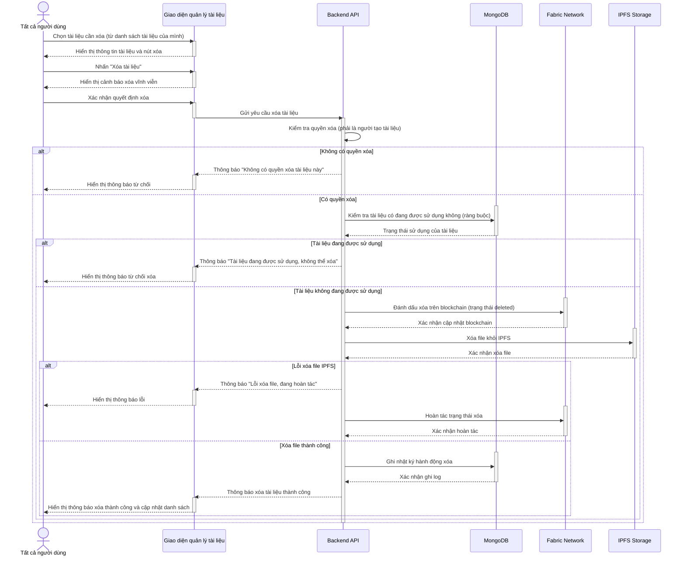
```mermaid
sequenceDiagram
    actor User as Tất cả người dùng
    participant UI as Giao diện quản lý tài liệu
    participant API as Backend API
    participant DB as MongoDB
    participant Blockchain as Fabric Network
    participant IPFS as IPFS Storage

    User ->> UI: Chọn tài liệu cần xóa (từ danh sách tài liệu của mình)
    activate UI
    UI -->> User: Hiển thị thông tin tài liệu và nút xóa
    deactivate UI

    User ->> UI: Nhấn "Xóa tài liệu"
    activate UI
    UI -->> User: Hiển thị cảnh báo xóa vĩnh viễn
    deactivate UI

    User ->> UI: Xác nhận quyết định xóa
    activate UI
    UI ->> API: Gửi yêu cầu xóa tài liệu
    deactivate UI

    activate API
    API ->> API: Kiểm tra quyền xóa (phải là người tạo tài liệu)

    alt Không có quyền xóa
        API -->> UI: Thông báo "Không có quyền xóa tài liệu này"
        activate UI
        UI -->> User: Hiển thị thông báo từ chối
        deactivate UI
    else Có quyền xóa
        activate DB
        API ->> DB: Kiểm tra tài liệu có đang được sử dụng không (ràng buộc)
        DB -->> API: Trạng thái sử dụng của tài liệu
        deactivate DB

        alt Tài liệu đang được sử dụng
            API -->> UI: Thông báo "Tài liệu đang được sử dụng, không thể xóa"
            activate UI
            UI -->> User: Hiển thị thông báo từ chối xóa
            deactivate UI
        else Tài liệu không đang được sử dụng
            activate Blockchain
            API ->> Blockchain: Đánh dấu xóa trên blockchain (trạng thái deleted)
            Blockchain -->> API: Xác nhận cập nhật blockchain
            deactivate Blockchain

            activate IPFS
            API ->> IPFS: Xóa file khỏi IPFS
            IPFS -->> API: Xác nhận xóa file
            deactivate IPFS

            alt Lỗi xóa file IPFS
                API -->> UI: Thông báo "Lỗi xóa file, đang hoàn tác"
                activate UI
                UI -->> User: Hiển thị thông báo lỗi
                deactivate UI

                activate Blockchain
                API ->> Blockchain: Hoàn tác trạng thái xóa
                Blockchain -->> API: Xác nhận hoàn tác
                deactivate Blockchain
            else Xóa file thành công
                activate DB
                API ->> DB: Ghi nhật ký hành động xóa
                DB -->> API: Xác nhận ghi log
                deactivate DB

                API -->> UI: Thông báo xóa tài liệu thành công
                activate UI
                UI -->> User: Hiển thị thông báo xóa thành công và cập nhật danh sách
                deactivate UI
            end
        end
    end

    deactivate API
```

---

### **Task 3.4: Xác minh và Tìm kiếm tài liệu**

---

## UC-21: Xác minh tài liệu

### Mô tả ngắn gọn
Xác minh tính xác thực và hợp lệ của tài liệu, so khớp thông tin với dữ liệu blockchain

### Sequence Diagram
```mermaid
sequenceDiagram
    actor Officer as Cán bộ UBND cấp xã (Org2)
    participant UI as Giao diện xác minh tài liệu
    participant API as Backend API
    participant Blockchain as Fabric Network
    participant IPFS as IPFS Storage

    Officer ->> UI: Chọn tài liệu cần xác minh
    activate UI
    UI -->> Officer: Hiển thị chi tiết tài liệu và form xác minh
    deactivate UI

    Officer ->> UI: Kiểm tra nội dung và so khớp với dữ liệu blockchain
    activate UI
    UI ->> API: Lấy dữ liệu blockchain để so khớp
    deactivate UI

    activate API
    API ->> Blockchain: Truy vấn dữ liệu liên quan để so khớp
    activate Blockchain
    Blockchain -->> API: Dữ liệu blockchain để đối chiếu
    deactivate Blockchain

    API ->> IPFS: Lấy nội dung file để kiểm tra
    activate IPFS
    IPFS -->> API: Nội dung file gốc
    deactivate IPFS

    API -->> UI: Dữ liệu để so khớp và nội dung file
    activate UI
    UI -->> Officer: Hiển thị thông tin so khớp
    deactivate UI

    Officer ->> UI: Nhập nhận xét và kết quả xác minh (Đã xác thực / Không hợp lệ) kèm lý do
    activate UI
    UI ->> API: Gửi kết quả xác minh và lý do
    deactivate UI

    API ->> Blockchain: Ghi nhận kết quả xác minh (Đã xác thực/Không hợp lệ) + lý do
    activate Blockchain
    Blockchain -->> API: Xác nhận cập nhật blockchain
    deactivate Blockchain

    API -->> UI: Thông báo xác minh hoàn tất
    deactivate API
    activate UI
    UI -->> Officer: Hiển thị kết quả xác minh và cập nhật danh sách
    deactivate UI

```

---

## UC-22: Tìm kiếm tài liệu

### Mô tả ngắn gọn
Tra cứu tài liệu nhanh chóng và chính xác theo nhiều tiêu chí

### Sequence Diagram
```mermaid
sequenceDiagram
    actor User as Tất cả người dùng
    participant UI as Giao diện Quản lý tài liệu
    participant API as Backend API
    participant Blockchain as Fabric Network

    User ->> UI: Nhập từ khóa tìm kiếm hoặc bộ lọc (trạng thái, loại)
    activate UI
    User ->> UI: Nhấn "Tìm kiếm"
    UI ->> API: Gửi tiêu chí tìm kiếm
    deactivate UI

    activate API
    API ->> API: Validate tiêu chí tìm kiếm

    alt Tiêu chí tìm kiếm không hợp lệ
        API -->> UI: Thông báo "Tiêu chí tìm kiếm không hợp lệ"
        activate UI
        UI -->> User: Hiển thị thông báo lỗi
        deactivate UI
    else Tiêu chí hợp lệ
        API ->> Blockchain: Tìm kiếm tài liệu theo tiêu chí
        activate Blockchain
        Blockchain -->> API: Danh sách tài liệu phù hợp
        deactivate Blockchain

        API ->> API: Lọc kết quả theo phân quyền
        API ->> API: Giới hạn tối đa 100 bản ghi

        alt Không tìm thấy kết quả
            API -->> UI: Thông báo "Không tìm thấy tài liệu phù hợp"
            activate UI
            UI -->> User: Hiển thị thông báo
            deactivate UI
        else Có kết quả
            API -->> UI: Danh sách tài liệu phù hợp
            activate UI
            UI -->> User: Hiển thị kết quả tìm kiếm (phân trang, sắp xếp)
            deactivate UI
        end
    end

    deactivate API

```

---

## UC-23: Xem lịch sử thay đổi tài liệu

```mermaid
sequenceDiagram
    actor User as Tất cả người dùng
    participant UI as Giao diện chi tiết tài liệu
    participant API as Backend API
    participant Blockchain as Fabric Network

    User ->> UI: Chọn tab "Lịch sử thay đổi"
    activate UI
    UI ->> API: Yêu cầu xem lịch sử thay đổi tài liệu
    deactivate UI

    activate API
    activate Blockchain
    API ->> Blockchain: Truy vấn lịch sử thay đổi thông tin từ blockchain
    Blockchain -->> API: Danh sách lịch sử thay đổi
    deactivate Blockchain

    API -->> UI: Danh sách lịch sử thay đổi
    activate UI
    UI -->> User: Hiển thị timeline lịch sử thay đổi
    deactivate UI

    deactivate API

```

---

## 📋 **MODULE 4: QUẢN LÝ GIAO DỊCH**

### **Task 4.1: Tạo các loại giao dịch**

---

## UC-24: Tạo giao dịch chuyển nhượng

```mermaid
sequenceDiagram
    actor Owner as Chủ sử dụng đất (Org3)
    participant UI as Giao diện quản ly giao dịch
    participant API as Backend API
    participant Blockchain as Fabric Network
    participant DB as MongoDB

    Owner ->> UI: Chọn "Tạo giao dịch"
    activate UI
    Owner ->> UI: Chọn loại giao dịch "Chuyển nhượng"
    UI -->> Owner: Hiển thị form tạo giao dịch chuyển nhượng
    deactivate UI

    Owner ->> UI: Chọn thửa đất cần chuyển nhượng
    
    activate UI
    Owner ->> UI: Nhập thông tin bên nhận (CCCD) và các tài liệu bắt buộc
    Owner ->> UI: Nhấn "Tạo giao dịch"
    UI ->> API: Gửi thông tin giao dịch chuyển nhượng
    deactivate UI

    activate API
    API ->> Blockchain: Kiểm tra trạng thái thửa đất
    activate Blockchain
    Blockchain -->> API: Thông tin trạng thái thửa đất
    deactivate Blockchain

    API ->> Blockchain: Kiểm tra bên nhận
    activate Blockchain
    Blockchain -->> API: Thông tin bên nhận
    deactivate Blockchain

    alt Thửa đất đang tranh chấp/thế chấp/đang trong giao dịch khác
        API -->> UI: Thông báo "Thửa đất không thể chuyển nhượng" kèm lý do
        activate UI
        UI -->> Owner: Hiển thị thông báo từ chối
        deactivate UI
    else Bên nhận không tồn tại
        API -->> UI: Thông báo "Bên nhận không có tài khoản trong hệ thống"
        activate UI
        UI -->> Owner: Hiển thị thông báo lỗi
        deactivate UI
    else Thông tin hợp lệ
        API ->> Blockchain: Tạo giao dịch chuyển nhượng
        activate Blockchain
        Blockchain -->> API: Xác nhận tạo giao dịch
        deactivate Blockchain

        API ->> Blockchain: Cập nhật trạng thái thửa đất
        activate Blockchain
        Blockchain -->> API: Xác nhận cập nhật trạng thái
        deactivate Blockchain

        API ->> DB: Lưu thông báo cho bên nhận
        activate DB
        DB -->> API: Xác nhận lưu
        deactivate DB

        API -->> UI: Thông báo tạo giao dịch thành công
        activate UI
        UI -->> Owner: Hiển thị thông báo thành công và mã giao dịch
        deactivate UI
    end

    deactivate API

```

---

## UC-25: Tạo giao dịch tách thửa

```mermaid
sequenceDiagram
    actor Owner as Chủ sử dụng đất (Org3)
    participant UI as Giao diện quản lý giao dịch
    participant API as Backend API
    participant Blockchain as Fabric Network
    participant DB as MongoDB

    Owner ->> UI: Chọn "Tạo giao dịch"
    activate UI
    Owner ->> UI: Chọn loại giao dịch "Tách thửa"
    UI -->> Owner: Hiển thị form tạo giao dịch tách thửa
    deactivate UI

    Owner ->> UI: Chọn thửa đất cần tách
    activate UI
    Owner ->> UI: Nhập thông tin các thửa mới (diện tích, vị trí) và liên kết tài liệu bắt buộc
    Owner ->> UI: Nhấn "Tạo giao dịch"
    UI ->> API: Gửi yêu cầu tạo giao dịch tách thửa
    deactivate UI

    activate API
    API ->> Blockchain: Kiểm tra trạng thái thửa đất gốc
    activate Blockchain
    Blockchain -->> API: Thông tin trạng thái và diện tích
    deactivate Blockchain

    API ->> API: Validate thông tin giao dịch tách thửa (tranh chấp/thế chấp, tổng diện tích)

    alt Thửa đất đang tranh chấp/thế chấp
        API -->> UI: Thông báo "Thửa đất không thể tách"
        activate UI
        UI -->> Owner: Hiển thị thông báo từ chối
        deactivate UI
    else Diện tích các thửa mới không khớp
        API -->> UI: Thông báo "Tổng diện tích các thửa mới phải bằng diện tích gốc"
        activate UI
        UI -->> Owner: Hiển thị thông báo lỗi và yêu cầu sửa
        deactivate UI
    else Thông tin hợp lệ
        API ->> Blockchain: Tạo yêu cầu giao dịch tách thửa (chưa cập nhật thửa mới)
        activate Blockchain
        Blockchain -->> API: Xác nhận tạo giao dịch
        deactivate Blockchain

        API ->> DB: Lưu thông báo cho cơ quan hành chính (Org2) về giao dịch mới
        activate DB
        DB -->> API: Xác nhận lưu
        deactivate DB

        API -->> UI: Thông báo tạo giao dịch thành công
        activate UI
        UI -->> Owner: Hiển thị thông báo thành công và mã giao dịch
        deactivate UI
    end

    deactivate API
```

---

## UC-26: Tạo giao dịch gộp thửa

```mermaid
sequenceDiagram
    actor Owner as Chủ sử dụng đất (Org3)
    participant UI as Giao diện quản lý giao dịch
    participant API as Backend API
    participant DB as MongoDB
    participant Blockchain as Fabric Network

    Owner ->> UI: Chọn "Tạo giao dịch"
    activate UI
    Owner ->> UI: Chọn loại giao dịch "Gộp thửa"
    UI -->> Owner: Hiển thị form tạo giao dịch gộp thửa
    deactivate UI

    Owner ->> UI: Chọn các thửa đất cần gộp
    activate UI
    Owner ->> UI: Nhập thông tin thửa đất mới và liên kết tài liệu bắt buộc
    Owner ->> UI: Nhấn "Tạo giao dịch"
    UI ->> API: Gửi yêu cầu tạo giao dịch gộp thửa
    deactivate UI

    activate API
    API ->> API: Kiểm tra quyền sở hữu và trạng thái các thửa đất gốc
    API ->> Blockchain: Lấy thông tin trạng thái và diện tích các thửa
    activate Blockchain
    Blockchain -->> API: Thông tin thửa đất
    deactivate Blockchain

    API ->> API: Validate thông tin giao dịch (quyền sở hữu, tranh chấp, liền kề, diện tích)

    alt Thông tin không hợp lệ
        API -->> UI: Thông báo "Giao dịch không hợp lệ"
        activate UI
        UI -->> Owner: Hiển thị thông báo lỗi
        deactivate UI
    else Thông tin hợp lệ
        API ->> Blockchain: Tạo yêu cầu giao dịch gộp thửa
        activate Blockchain
        Blockchain -->> API: Xác nhận tạo giao dịch
        deactivate Blockchain

        API ->> DB: Lưu thông báo cho cơ quan hành chính cấp xã (Org2)
        activate DB
        DB -->> API: Xác nhận lưu
        deactivate DB

        API -->> UI: Thông báo tạo giao dịch thành công
        activate UI
        UI -->> Owner: Hiển thị thông báo thành công và mã giao dịch
        deactivate UI
    end

    deactivate API

```

---

## UC-27: Tạo giao dịch đổi mục đích sử dụng

```mermaid
sequenceDiagram
    actor Owner as Chủ sử dụng đất (Org3)
    participant UI as Giao diện quản lý giao dịch
    participant API as Backend API
    participant Blockchain as Fabric Network
    participant DB as MongoDB

    Owner ->> UI: Chọn "Tạo giao dịch"
    activate UI
    Owner ->> UI: Chọn loại giao dịch "Đổi mục đích sử dụng"
    UI -->> Owner: Hiển thị form tạo giao dịch
    deactivate UI

    Owner ->> UI: Chọn thửa đất cần đổi mục đích
    activate UI
    Owner ->> UI: Chọn mục đích mới, nhập lý do và liên kết tài liệu bắt buộc
    Owner ->> UI: Nhấn "Tạo giao dịch"
    UI ->> API: Gửi yêu cầu tạo giao dịch
    deactivate UI

    activate API
    API ->> Blockchain: Kiểm tra trạng thái và mục đích hiện tại
    activate Blockchain
    Blockchain -->> API: Thông tin trạng thái và mục đích sử dụng
    deactivate Blockchain

    API ->> API: Validate thửa không tranh chấp và mục đích phù hợp

    alt Thửa đất đang tranh chấp/thế chấp
        API -->> UI: Thông báo "Thửa đất không thể đổi mục đích sử dụng"
        activate UI
        UI -->> Owner: Hiển thị thông báo từ chối
        deactivate UI
    else Mục đích không phù hợp quy hoạch
        API -->> UI: Thông báo "Mục đích mới không phù hợp với quy hoạch vùng"
        activate UI
        UI -->> Owner: Hiển thị thông báo từ chối
        deactivate UI
    else Thông tin hợp lệ
        API ->> Blockchain: Tạo yêu cầu giao dịch đổi mục đích
        activate Blockchain
        Blockchain -->> API: Xác nhận tạo giao dịch
        deactivate Blockchain

        API ->> DB: Lưu thông báo cho cơ quan hành chính (Org2)
        activate DB
        DB -->> API: Xác nhận lưu
        deactivate DB

        API -->> UI: Thông báo tạo giao dịch thành công
        activate UI
        UI -->> Owner: Hiển thị thông báo thành công và mã giao dịch
        deactivate UI
    end

    deactivate API

```

---

## UC-28: Tạo giao dịch cấp lại GCN

```mermaid
sequenceDiagram
    actor Owner as Chủ sử dụng đất (Org3)
    participant UI as Giao diện quản lý giao dịch
    participant API as Backend API
    participant Blockchain as Fabric Network

    Owner ->> UI: Chọn "Tạo giao dịch"
    activate UI
    Owner ->> UI: Chọn loại giao dịch "Cấp lại GCN"
    UI -->> Owner: Hiển thị form cấp lại GCN
    deactivate UI

    Owner ->> UI: Chọn thửa đất cần cấp lại GCN
    activate UI
    Owner ->> UI: Chọn lý do, nhập mô tả và liên kết tài liệu bắt buộc
    Owner ->> UI: Nhấn "Tạo giao dịch"
    UI ->> API: Gửi yêu cầu tạo giao dịch cấp lại GCN
    deactivate UI

    activate API
    API ->> Blockchain: Kiểm tra trạng thái thửa đất trên blockchain
    activate Blockchain
    Blockchain -->> API: Thông tin trạng thái thửa đất
    deactivate Blockchain

    alt Thửa đất đang tranh chấp/thế chấp/đang trong giao dịch khác
        API -->> UI: Thông báo "Thửa đất không thể cấp lại GCN" kèm lý do
        activate UI
        UI -->> Owner: Hiển thị thông báo từ chối
        deactivate UI
    else Thông tin hợp lệ
        API ->> Blockchain: Tạo giao dịch cấp lại GCN trên blockchain
        activate Blockchain
        Blockchain -->> API: Xác nhận tạo giao dịch
        deactivate Blockchain

        API -->> UI: Thông báo tạo giao dịch thành công
        activate UI
        UI -->> Owner: Hiển thị thông báo thành công và mã giao dịch
        deactivate UI
    end

    deactivate API

```

---
### **Task 4.2: Xem và xác nhận giao dịch**

---

## UC-29: Xem chi tiết giao dịch

```mermaid
sequenceDiagram
    actor User as Tất cả người dùng
    participant UI as Giao diện quản lý giao dịch
    participant API as Backend API
    participant Blockchain as Fabric Network

    User ->> UI: Chọn "Xem chi tiết" giao dịch từ danh sách
    activate UI
    UI ->> API: Yêu cầu thông tin chi tiết giao dịch
    deactivate UI

    activate API
    API ->> Blockchain: Lấy metadata giao dịch từ blockchain
    activate Blockchain
    Blockchain -->> API: Thông tin chi tiết và trạng thái giao dịch
    deactivate Blockchain

    alt Giao dịch không tồn tại
        API -->> UI: Thông báo "Giao dịch không tìm thấy"
        activate UI
        UI -->> User: Hiển thị thông báo lỗi
        deactivate UI
    else Giao dịch tồn tại
        API -->> UI: Trả thông tin chi tiết
        activate UI
        UI -->> User: Hiển thị thông tin chi tiết giao dịch, các tài liệu liên quan
        deactivate UI
    end
    deactivate API

```

---

## UC-30: Xác nhận nhận chuyển nhượng đất

```mermaid
sequenceDiagram
    actor Receiver as Bên nhận (Org3)
    participant UI as Giao diện quản lý giao dịch
    participant API as Backend API
    participant Blockchain as Fabric Network
    participant DB as MongoDB

    Receiver ->> UI: Chọn giao dịch chuyển nhượng liên quan
    activate UI
    UI ->> API: Lấy chi tiết giao dịch
    deactivate UI

    activate API
    API ->> Blockchain: Lấy thông tin chi tiết giao dịch và tài liệu
    activate Blockchain
    Blockchain -->> API: Chi tiết giao dịch, thửa đất và tài liệu
    deactivate Blockchain
    API -->> UI: Trả về chi tiết giao dịch
    deactivate API

    activate UI
    UI -->> Receiver: Hiển thị chi tiết giao dịch và tài liệu
    deactivate UI

    Receiver ->> UI: Xem xét và đưa ra quyết định (Đồng ý/Từ chối kèm lý do)
    activate UI
    UI ->> API: Gửi quyết định và lý do
    deactivate UI

    activate API
    API ->> Blockchain: Cập nhật trạng thái giao dịch theo quyết định
    activate Blockchain
    Blockchain -->> API: Xác nhận cập nhật trạng thái
    deactivate Blockchain

    API ->> DB: Tạo thông báo hệ thống cho bên chuyển nhượng và cán bộ cấp xã
    DB -->> API: Xác nhận lưu thông báo
    API -->> UI: Thông báo kết quả quyết định
    deactivate API

    activate UI
    UI -->> Receiver: Hiển thị kết quả xác nhận hoặc từ chối
    deactivate UI

```

---
### **Task 4.3: Xử lý và phê duyệt giao dịch**

---

## UC-31: Xử lý hồ sơ giao dịch

```mermaid
sequenceDiagram
    actor Officer as Cán bộ UBND cấp xã (Org2)
    participant UI as Giao diện quản lý giao dịch
    participant API as Backend API
    participant Blockchain as Fabric Network
    participant DB as MongoDB

    activate UI
    UI -->> Officer: Hiển thị danh sách giao dịch
    deactivate UI

    Officer ->> UI: Chọn giao dịch cần xử lý
    activate UI
    UI ->> API: Lấy chi tiết giao dịch và hồ sơ đính kèm
    deactivate UI

    activate API
    API ->> Blockchain: Lấy thông tin chi tiết giao dịch và tài liệu
    activate Blockchain
    Blockchain -->> API: Thông tin đầy đủ giao dịch
    deactivate Blockchain
    API -->> UI: Trả về thông tin chi tiết và form xử lý
    deactivate API

    activate UI
    UI -->> Officer: Hiển thị thông tin giao dịch, tài liệu và tùy chọn xử lý
    deactivate UI

    Officer ->> UI: Kiểm tra hồ sơ và chọn hành động, nhập nhận xét hoặc lý do nếu cần
    Officer ->> UI: Nhấn "Xử lý hồ sơ"
    activate UI
    UI ->> API: Gửi kết quả xử lý và nhận xét
    deactivate UI

    activate API
    alt Quyết định Xác nhận
        API ->> Blockchain: Cập nhật trạng thái giao dịch "Đã xác nhận bởi Org2"
        activate Blockchain
        Blockchain -->> API: Xác nhận cập nhật
        deactivate Blockchain

        API ->> DB: Lưu thông báo cho người tạo giao dịch và Org1 để phê duyệt cuôi
        DB -->> API: Xác nhận lưu
    else Quyết định Yêu cầu bổ sung
        API ->> Blockchain: Cập nhật trạng thái giao dịch "Chờ bổ sung tài liệu"
        activate Blockchain
        Blockchain -->> API: Xác nhận cập nhật
        deactivate Blockchain

        API ->> DB: Lưu thông báo yêu cầu bổ sung cho người tạo giao dịch
        DB -->> API: Xác nhận lưu
    else Quyết định Từ chối
        API ->> Blockchain: Cập nhật trạng thái giao dịch "Bị từ chối"
        activate Blockchain
        Blockchain -->> API: Xác nhận cập nhật
        deactivate Blockchain

        API ->> DB: Lưu thông báo từ chối kèm lý do cho người tạo giao dịch
        DB -->> API: Xác nhận lưu
    end

    API -->> UI: Thông báo xử lý hoàn tất
    activate UI
    UI -->> Officer: Hiển thị thông báo hoàn thành và cập nhật danh sách giao dịch
    deactivate UI
    deactivate API

```

---

## UC-32: Phê duyệt giao dịch chuyển nhượng

```mermaid
sequenceDiagram
    actor Officer as Cán bộ Sở TN&MT (Org1)
    participant UI as Giao diện quản lý giao dịch
    participant API as Backend API
    participant Blockchain as Fabric Network
    participant DB as MongoDB

    Officer ->> UI: Xem chi tiết giao dịch chuyển nhượng đã thẩm định
    activate UI
    UI ->> API: Lấy chi tiết giao dịch
    deactivate UI

    activate API
    API ->> Blockchain: Lấy thông tin chi tiết giao dịch, thửa đất, bên liên quan
    activate Blockchain
    Blockchain -->> API: Thông tin đầy đủ giao dịch
    deactivate Blockchain

    API -->> UI: Trả về chi tiết và form phê duyệt
    deactivate API

    activate UI
    UI -->> Officer: Hiển thị thông tin và nút "Phê duyệt"
    deactivate UI

    Officer ->> UI: Chọn phê duyệt
    activate UI
    UI ->> API: Gửi quyết định phê duyệt
    deactivate UI

    activate API
    API ->> Blockchain: Thực hiện chuyển nhượng quyền sở hữu, cập nhật trạng thái thửa đất
    activate Blockchain
    Blockchain -->> API: Xác nhận cập nhật
    deactivate Blockchain

    API ->> DB: Tạo thông báo cho Org2, bên chuyển nhượng, bên nhận chuyển nhượng
    DB -->> API: Xác nhận lưu thông báo

    API -->> UI: Thông báo phê duyệt thành công
    deactivate API
    activate UI
    UI -->> Officer: Hiển thị thông báo hoàn thành
    deactivate UI

```

---

## UC-33: Phê duyệt giao dịch tách thửa

```mermaid
sequenceDiagram
    actor Officer as Cán bộ Sở TN&MT (Org1)
    participant UI as Giao diện phê duyệt
    participant API as Backend API
    participant Blockchain as Fabric Network
    participant DB as MongoDB

    Officer ->> UI: Xem chi tiết giao dịch tách thửa đã thẩm định
    activate UI
    UI ->> API: Lấy chi tiết giao dịch tách
    deactivate UI

    activate API
    API ->> Blockchain: Kiểm tra kế hoạch tách thửa
    activate Blockchain
    Blockchain -->> API: Chi tiết kế hoạch tách
    deactivate Blockchain

    API -->> UI: Trả về chi tiết và form phê duyệt
    deactivate API

    activate UI
    UI -->> Officer: Hiển thị form với nút "Phê duyệt"
    deactivate UI

    Officer ->> UI: Chọn phê duyệt
    activate UI
    UI ->> API: Gửi quyết định phê duyệt
    deactivate UI

    activate API
    API ->> Blockchain: Cập nhật thông tin thửa gốc (diện tích, trạng thái tách)
    activate Blockchain
    Blockchain -->> API: Xác nhận cập nhật
    deactivate Blockchain

    API ->> Blockchain: Xóa GCN cũ của thửa gốc
    activate Blockchain
    Blockchain -->> API: Xác nhận xóa GCN
    deactivate Blockchain

    API ->> Blockchain: Tạo các thửa mới với mã riêng theo kế hoạch tách
    activate Blockchain
    Blockchain -->> API: Xác nhận tạo thửa mới
    deactivate Blockchain

    API ->> Blockchain: Cập nhật quyền sử dụng đất cho Chủ sử dụng đất (Org3)
    activate Blockchain
    Blockchain -->> API: Xác nhận
    deactivate Blockchain

    API ->> DB: Tạo thông báo hoàn thành cho Org2 và Chủ sử dụng đất (Org3)
    DB -->> API: Xác nhận lưu thông báo

    API -->> UI: Thông báo phê duyệt thành công
    deactivate API
    activate UI
    UI -->> Officer: Hiển thị kết quả phê duyệt
    deactivate UI

```

---

## UC-34: Phê duyệt giao dịch gộp thửa

```mermaid
sequenceDiagram
    actor Officer as Cán bộ Sở TN&MT (Org1)
    participant UI as Giao diện phê duyệt
    participant API as Backend API
    participant Blockchain as Fabric Network
    participant DB as MongoDB

    Officer ->> UI: Xem chi tiết giao dịch gộp thửa đã thẩm định
    activate UI
    UI ->> API: Lấy chi tiết giao dịch gộp
    deactivate UI

    activate API
    API ->> Blockchain: Kiểm tra kế hoạch gộp thửa
    activate Blockchain
    Blockchain -->> API: Chi tiết kế hoạch gộp
    deactivate Blockchain

    API -->> UI: Trả về chi tiết và form phê duyệt
    deactivate API

    activate UI
    UI -->> Officer: Hiển thị form với nút "Phê duyệt"
    deactivate UI

    Officer ->> UI: Chọn phê duyệt
    activate UI
    UI ->> API: Gửi quyết định phê duyệt
    deactivate UI

    activate API
    API ->> Blockchain: Cập nhật thông tin các thửa đất gốc (trạng thái đã gộp)
    activate Blockchain
    Blockchain -->> API: Xác nhận cập nhật
    deactivate Blockchain

    API ->> Blockchain: Xóa GCN cũ của các thửa đất gốc
    activate Blockchain
    Blockchain -->> API: Xác nhận xóa GCN
    deactivate Blockchain

    API ->> Blockchain: Tạo thửa đất mới sau gộp theo kế hoạch
    activate Blockchain
    Blockchain -->> API: Xác nhận tạo thửa mới
    deactivate Blockchain

    API ->> Blockchain: Cập nhật quyền sử dụng đất cho Chủ sử dụng đất (Org3)
    activate Blockchain
    Blockchain -->> API: Xác nhận
    deactivate Blockchain

    API ->> DB: Tạo thông báo hoàn thành cho Org2 và Chủ sử dụng đất (Org3)
    DB -->> API: Xác nhận lưu thông báo

    API -->> UI: Thông báo phê duyệt thành công
    deactivate API
    activate UI
    UI -->> Officer: Hiển thị kết quả phê duyệt
    deactivate UI

```

---

## UC-35: Phê duyệt giao dịch đổi mục đích

```mermaid
sequenceDiagram
    actor Officer as Cán bộ Sở TN&MT (Org1)
    participant UI as Giao diện phê duyệt
    participant API as Backend API
    participant Blockchain as Fabric Network
    participant DB as MongoDB

    Officer ->> UI: Xem chi tiết giao dịch đổi mục đích đã thẩm định
    activate UI
    UI ->> API: Lấy chi tiết giao dịch đổi mục đích
    deactivate UI

    activate API
    API ->> Blockchain: Kiểm tra thông tin đổi mục đích từ blockchain
    activate Blockchain
    Blockchain -->> API: Chi tiết yêu cầu đổi mục đích và lý do
    deactivate Blockchain

    API -->> UI: Trả về chi tiết và form phê duyệt
    deactivate API

    activate UI
    UI -->> Officer: Hiển thị form với nút "Phê duyệt"
    deactivate UI

    Officer ->> UI: Chọn phê duyệt
    activate UI
    UI ->> API: Gửi quyết định phê duyệt
    deactivate UI

    activate API
    API ->> Blockchain: Cập nhật mục đích sử dụng đất trên blockchain
    activate Blockchain
    Blockchain -->> API: Xác nhận cập nhật
    deactivate Blockchain

    API ->> Blockchain: Vô hiệu hóa GCN cũ của thửa đất (nếu có)
    activate Blockchain
    Blockchain -->> API: Xác nhận vô hiệu hóa GCN
    deactivate Blockchain

    API ->> DB: Tạo thông báo hoàn thành cho Org2 và Chủ sử dụng đất (Org3)
    DB -->> API: Xác nhận lưu thông báo

    API -->> UI: Thông báo phê duyệt thành công
    deactivate API
    activate UI
    UI -->> Officer: Hiển thị kết quả phê duyệt
    deactivate UI

```

---

## UC-36: Phê duyệt giao dịch cấp lại GCN

```mermaid
sequenceDiagram
    actor Officer as Cán bộ Sở TN&MT (Org1)
    participant UI as Giao diện phê duyệt
    participant API as Backend API
    participant Blockchain as Fabric Network
    participant IPFS as IPFS Storage
    participant DB as MongoDB

    Officer ->> UI: Xem chi tiết giao dịch cấp lại GCN đã thẩm định
    activate UI
    UI ->> API: Lấy chi tiết giao dịch cấp lại GCN
    deactivate UI

    activate API
    API ->> Blockchain: Kiểm tra lý do cấp lại từ blockchain
    activate Blockchain
    Blockchain -->> API: Chi tiết lý do và thông tin GCN cũ
    deactivate Blockchain

    API -->> UI: Trả về chi tiết và form phê duyệt
    deactivate API

    activate UI
    UI -->> Officer: Hiển thị form với nút "Phê duyệt" và upload file GCN mới
    deactivate UI

    Officer ->> UI: Chọn phê duyệt, upload file GCN mới
    activate UI
    UI ->> API: Gửi quyết định phê duyệt kèm file GCN
    deactivate UI

    activate API
    API ->> IPFS: Upload file GCN mới
    activate IPFS
    IPFS -->> API: Hash của file GCN mới
    deactivate IPFS

    API ->> Blockchain: Cập nhật GCN mới trên blockchain
    activate Blockchain
    Blockchain -->> API: Xác nhận cập nhật GCN
    deactivate Blockchain

    API ->> DB: Tạo thông báo hoàn thành cho Org2 và Chủ sử dụng đất (Org3)
    DB -->> API: Xác nhận lưu thông báo

    API -->> UI: Thông báo phê duyệt thành công
    deactivate API
    activate UI
    UI -->> Officer: Hiển thị kết quả phê duyệt
    deactivate UI


```

---

## UC-37: Từ chối giao dịch

```mermaid
sequenceDiagram
    actor Officer as Cán bộ Sở TN&MT (Org1)
    participant UI as Giao diện xử lý
    participant API as Backend API
    participant Blockchain as Fabric Network
    participant DB as MongoDB

    Officer ->> UI: Truy cập giao dịch cần từ chối
    activate UI
    UI ->> API: Lấy thông tin giao dịch
    deactivate UI

    activate API
    API ->> Blockchain: Kiểm tra trạng thái giao dịch
    activate Blockchain
    Blockchain -->> API: Thông tin chi tiết giao dịch
    deactivate Blockchain

    API -->> UI: Hiển thị form từ chối với thông tin giao dịch
    activate UI
    UI -->> Officer: Hiển thị thông tin giao dịch
    deactivate UI

    Officer ->> UI: Nhập lý do từ chối và nhấn "Từ chối giao dịch"
    activate UI
    UI ->> API: Gửi quyết định từ chối
    deactivate UI

    activate API
    API ->> Blockchain: Cập nhật trạng thái "Từ chối" trên blockchain
    activate Blockchain
    Blockchain -->> API: Xác nhận cập nhật
    deactivate Blockchain

    API ->> DB: Tạo và lưu thông báo từ chối cho các bên liên quan
    activate DB
    DB -->> API: Xác nhận lưu thông báo
    deactivate DB

    API -->> UI: Thông báo từ chối thành công
    deactivate API
    activate UI
    UI -->> Officer: Hiển thị kết quả từ chối
    deactivate UI

```

---

## UC-38: Tìm kiếm giao dịch

```mermaid
sequenceDiagram
    actor User as Tất cả người dùng
    participant UI as Giao diện quản lý giao dịch
    participant API as Backend API
    participant Blockchain as Fabric Network

    User ->> UI: Nhập tiêu chí tìm kiếm (mã giao dịch, loại, trạng thái)
    activate UI
    User ->> UI: Chọn bộ lọc (ngày tạo, người tạo, thửa đất liên quan)
    User ->> UI: Nhấn "Tìm kiếm"
    UI ->> API: Gửi tiêu chí tìm kiếm
    deactivate UI

    activate API
    API ->> API: Xác định quyền truy cập của người dùng
    API ->> Blockchain: Tìm kiếm giao dịch trong blockchain
    activate Blockchain
    Blockchain -->> API: Danh sách giao dịch phù hợp
    deactivate Blockchain

    API ->> API: Lọc kết quả theo quyền truy cập của người dùng
    API ->> API: Giới hạn kết quả tối đa 100 bản ghi

    alt Không tìm thấy kết quả
        API -->> UI: Thông báo "Không tìm thấy giao dịch phù hợp"
        activate UI
        UI -->> User: Hiển thị thông báo không có kết quả
        deactivate UI
    else Có kết quả
        API -->> UI: Danh sách giao dịch phù hợp
        activate UI
        UI -->> User: Hiển thị kết quả tìm kiếm với phân trang và sắp xếp
        deactivate UI
    end
    deactivate API


```

---

## UC-39: Xem lịch sử thay đổi giao dịch

```mermaid
sequenceDiagram
    actor User as Tất cả người dùng
    participant UI as Giao diện chi tiết giao dịch
    participant API as Backend API
    participant Blockchain as Fabric Network

    User ->> UI: Chọn tab "Lịch sử thay đổi"
    activate UI
    UI ->> API: Yêu cầu xem lịch sử giao dịch
    deactivate UI

    activate API
    API ->> Blockchain: Truy vấn lịch sử thay đổi
    activate Blockchain
    Blockchain -->> API: Danh sách thay đổi với timestamp
    deactivate Blockchain

    API -->> UI: Danh sách lịch sử thay đổi
    activate UI
    UI -->> User: Hiển thị timeline lịch sử thay đổi
    deactivate UI
    deactivate API

```

---
