# Complete Use Case Sequence Diagrams
## Hệ thống Quản lý Đất đai Blockchain - Theo SRS Tinh Gọn

---

## 📋 **MODULE 1: XÁC THỰC VÀ QUẢN LÝ TÀI KHOẢN**

### **Task 1.1: Đăng ký và Tạo tài khoản**

---

## UC-01: Đăng ký tài khoản

### Mô tả ngắn gọn
Công dân đăng ký tài khoản mới với xác thực OTP

### Sequence Diagram
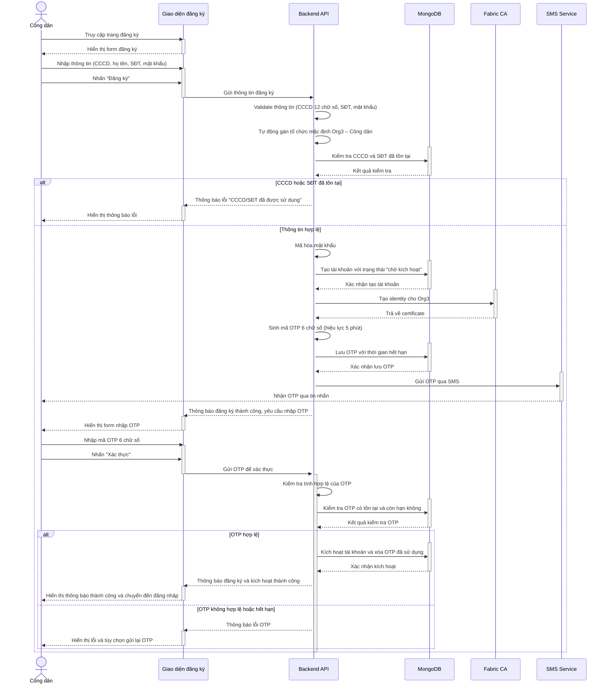
```mermaid
sequenceDiagram
    actor Citizen as Công dân
    participant UI as Giao diện đăng ký
    participant API as Backend API
    participant DB as MongoDB
    participant CA as Fabric CA
    participant SMS as SMS Service

    Citizen ->> UI: Truy cập trang đăng ký
    activate UI
    UI -->> Citizen: Hiển thị form đăng ký
    deactivate UI

    Citizen ->> UI: Nhập thông tin (CCCD, họ tên, SĐT, mật khẩu)
    activate UI
    Citizen ->> UI: Nhấn "Đăng ký"
    UI ->> API: Gửi thông tin đăng ký
    deactivate UI

    activate API
    API ->> API: Validate thông tin (CCCD 12 chữ số, SĐT, mật khẩu)
    API ->> API: Tự động gán tổ chức mặc định Org3 – Công dân

    activate DB
    API ->> DB: Kiểm tra CCCD và SĐT đã tồn tại
    DB -->> API: Kết quả kiểm tra
    deactivate DB

    alt CCCD hoặc SĐT đã tồn tại
        API -->> UI: Thông báo lỗi "CCCD/SĐT đã được sử dụng"
        activate UI
        UI -->> Citizen: Hiển thị thông báo lỗi
        deactivate UI
    else Thông tin hợp lệ
        API ->> API: Mã hóa mật khẩu

        activate DB
        API ->> DB: Tạo tài khoản với trạng thái "chờ kích hoạt"
        DB -->> API: Xác nhận tạo tài khoản
        deactivate DB

        activate CA
        API ->> CA: Tạo identity cho Org3
        CA -->> API: Trả về certificate
        deactivate CA

        API ->> API: Sinh mã OTP 6 chữ số (hiệu lực 5 phút)

        activate DB
        API ->> DB: Lưu OTP với thời gian hết hạn
        DB -->> API: Xác nhận lưu OTP
        deactivate DB

        activate SMS
        API ->> SMS: Gửi OTP qua SMS
        SMS -->> Citizen: Nhận OTP qua tin nhắn
        deactivate SMS

        API -->> UI: Thông báo đăng ký thành công, yêu cầu nhập OTP
        activate UI
        UI -->> Citizen: Hiển thị form nhập OTP
        deactivate UI

        Citizen ->> UI: Nhập mã OTP 6 chữ số
        activate UI
        Citizen ->> UI: Nhấn "Xác thực"
        UI ->> API: Gửi OTP để xác thực
        deactivate UI

        activate API
        API ->> API: Kiểm tra tính hợp lệ của OTP

        activate DB
        API ->> DB: Kiểm tra OTP có tồn tại và còn hạn không
        DB -->> API: Kết quả kiểm tra OTP
        deactivate DB

        alt OTP hợp lệ
            activate DB
            API ->> DB: Kích hoạt tài khoản và xóa OTP đã sử dụng
            DB -->> API: Xác nhận kích hoạt
            deactivate DB

            API -->> UI: Thông báo đăng ký và kích hoạt thành công
            activate UI
            UI -->> Citizen: Hiển thị thông báo thành công và chuyển đến đăng nhập
            deactivate UI
        else OTP không hợp lệ hoặc hết hạn
            API -->> UI: Thông báo lỗi OTP
            activate UI
            UI -->> Citizen: Hiển thị lỗi và tùy chọn gửi lại OTP
            deactivate UI
        end
    end

    deactivate API
```

### Các trường hợp ngoại lệ
- CCCD đã tồn tại: Hệ thống thông báo "CCCD đã được sử dụng cho tài khoản khác"
- Số điện thoại đã tồn tại: Hệ thống thông báo "Số điện thoại đã được đăng ký"
- OTP hết hạn: Hệ thống yêu cầu gửi lại OTP mới
- OTP sai: Hệ thống thông báo lỗi và yêu cầu nhập lại (tối đa 3 lần)
- Lỗi gửi SMS: Hệ thống thông báo lỗi và cho phép thử lại

### Quy tắc nghiệp vụ
- CCCD phải đúng 12 chữ số, duy nhất trong hệ thống
- Mỗi CCCD và số điện thoại chỉ đăng ký được một tài khoản
- Mã OTP có hiệu lực trong 5 phút
- Mật khẩu phải đủ mạnh để bảo mật
- Tài khoản chỉ được kích hoạt sau khi xác thực OTP thành công

---

## UC-02: Tạo tài khoản cán bộ

### Mô tả ngắn gọn
Admin tạo tài khoản cho cán bộ trong tổ chức của mình

### Sequence Diagram

```mermaid
sequenceDiagram
    actor Admin as Admin của tổ chức
    participant UI as Giao diện quản lý người dùng
    participant API as Backend API
    participant DB as MongoDB
    participant CA as Fabric CA
    participant SMS as SMS Service

    Admin ->> UI: Đăng nhập và truy cập "Quản lý người dùng"
    activate UI
    UI -->> Admin: Hiển thị trang quản lý người dùng
    deactivate UI

    Admin ->> UI: Chọn "Tạo tài khoản cán bộ"
    activate UI
    UI -->> Admin: Hiển thị form tạo tài khoản cán bộ
    deactivate UI

    Admin ->> UI: Nhập thông tin cán bộ (CCCD, họ tên, SĐT)
    activate UI
    Admin ->> UI: Nhấn "Tạo tài khoản"
    UI ->> API: Gửi thông tin tạo tài khoản cán bộ
    deactivate UI

    activate API
    API ->> API: Validate thông tin (CCCD, SĐT)
    API ->> API: Tự động gán vào tổ chức của Admin

    activate DB
    API ->> DB: Kiểm tra CCCD và SĐT đã tồn tại
    DB -->> API: Kết quả kiểm tra
    deactivate DB

    alt CCCD hoặc SĐT đã tồn tại
        API -->> UI: Thông báo lỗi "CCCD/SĐT đã được sử dụng"
        activate UI
        UI -->> Admin: Hiển thị thông báo lỗi
        deactivate UI
    else Thông tin hợp lệ
        API ->> API: Tạo mật khẩu tạm thời (hiệu lực 7 ngày)
        API ->> API: Mã hóa mật khẩu tạm

        activate DB
        API ->> DB: Tạo tài khoản với trạng thái "đã kích hoạt"
        DB -->> API: Xác nhận tạo tài khoản
        deactivate DB

        activate CA
        API ->> CA: Tạo identity cho tổ chức tương ứng
        CA -->> API: Trả về certificate
        deactivate CA

        activate SMS
        API ->> SMS: Gửi thông tin đăng nhập qua SĐT
        SMS -->> Cán bộ: Nhận thông tin đăng nhập qua tin nhắn
        deactivate SMS

        API -->> UI: Thông báo tạo tài khoản thành công
        activate UI
        UI -->> Admin: Hiển thị thông báo tạo tài khoản thành công
        deactivate UI
    end

    deactivate API
```

### Các trường hợp ngoại lệ
- CCCD hoặc SĐT đã tồn tại trong hệ thống
- Thông tin không hợp lệ
- Admin không có quyền tạo tài khoản
- Lỗi gửi SMS thông tin đăng nhập

### Quy tắc nghiệp vụ
- Chỉ Admin của tổ chức mới có quyền tạo tài khoản cho tổ chức đó
- Tài khoản được kích hoạt ngay khi tạo
- Cán bộ phải đổi mật khẩu ở lần đăng nhập đầu tiên
- Mật khẩu tạm có hiệu lực 7 ngày

---

### **Task 1.2: Đăng nhập và Quản lý phiên**

---

## UC-03: Đăng nhập hệ thống

### Mô tả ngắn gọn
Xác thực danh tính và truy cập vào hệ thống

### Sequence Diagram
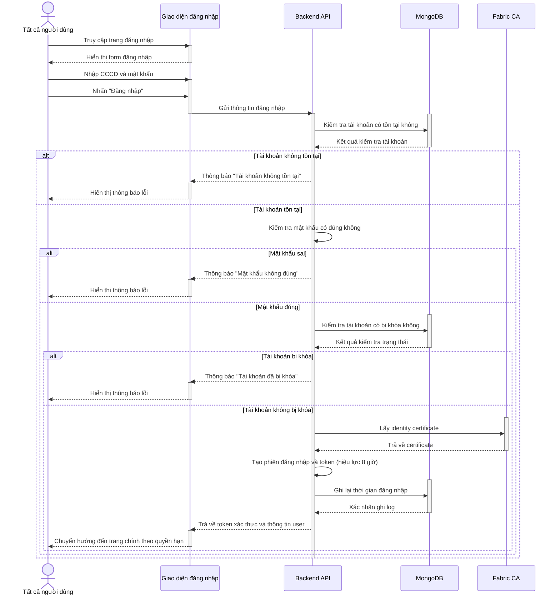
```mermaid
sequenceDiagram
    actor User as Tất cả người dùng
    participant UI as Giao diện đăng nhập
    participant API as Backend API
    participant DB as MongoDB
    participant CA as Fabric CA

    User ->> UI: Truy cập trang đăng nhập
    activate UI
    UI -->> User: Hiển thị form đăng nhập
    deactivate UI

    User ->> UI: Nhập CCCD và mật khẩu
    activate UI
    User ->> UI: Nhấn "Đăng nhập"
    UI ->> API: Gửi thông tin đăng nhập
    deactivate UI

    activate API
    activate DB
    API ->> DB: Kiểm tra tài khoản có tồn tại không
    DB -->> API: Kết quả kiểm tra tài khoản
    deactivate DB

    alt Tài khoản không tồn tại
        API -->> UI: Thông báo "Tài khoản không tồn tại"
        activate UI
        UI -->> User: Hiển thị thông báo lỗi
        deactivate UI
    else Tài khoản tồn tại
        API ->> API: Kiểm tra mật khẩu có đúng không

        alt Mật khẩu sai
            API -->> UI: Thông báo "Mật khẩu không đúng"
            activate UI
            UI -->> User: Hiển thị thông báo lỗi
            deactivate UI
        else Mật khẩu đúng
            activate DB
            API ->> DB: Kiểm tra tài khoản có bị khóa không
            DB -->> API: Kết quả kiểm tra trạng thái
            deactivate DB

            alt Tài khoản bị khóa
                API -->> UI: Thông báo "Tài khoản đã bị khóa"
                activate UI
                UI -->> User: Hiển thị thông báo lỗi
                deactivate UI
            else Tài khoản không bị khóa
                activate CA
                API ->> CA: Lấy identity certificate
                CA -->> API: Trả về certificate
                deactivate CA

                API ->> API: Tạo phiên đăng nhập và token (hiệu lực 8 giờ)
                activate DB
                API ->> DB: Ghi lại thời gian đăng nhập
                DB -->> API: Xác nhận ghi log
                deactivate DB

                API -->> UI: Trả về token xác thực và thông tin user
                activate UI
                UI -->> User: Chuyển hướng đến trang chính theo quyền hạn
                deactivate UI
            end
        end
    end

    deactivate API
```

### Các trường hợp ngoại lệ
- CCCD không tồn tại: Hệ thống thông báo "Tài khoản không tồn tại"
- Mật khẩu sai: Hệ thống thông báo "Mật khẩu không đúng"
- Tài khoản bị khóa: Hệ thống thông báo "Tài khoản đã bị khóa"

### Quy tắc nghiệp vụ
- Nhập sai mật khẩu 5 lần sẽ khóa tài khoản 30 phút
- Phiên đăng nhập có hiệu lực 8 giờ
- Mỗi người chỉ được đăng nhập một phiên tại một thời điểm

---

## UC-04: Đăng xuất hệ thống

### Mô tả ngắn gọn
Kết thúc phiên làm việc và bảo mật tài khoản

### Sequence Diagram
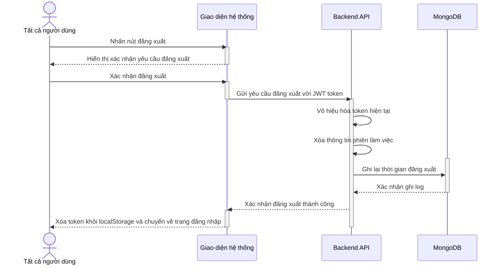
```mermaid
sequenceDiagram
    actor User as Tất cả người dùng
    participant UI as Giao diện hệ thống
    participant API as Backend API
    participant DB as MongoDB

    User ->> UI: Nhấn nút đăng xuất
    activate UI
    UI -->> User: Hiển thị xác nhận yêu cầu đăng xuất
    deactivate UI

    User ->> UI: Xác nhận đăng xuất
    activate UI
    UI ->> API: Gửi yêu cầu đăng xuất với JWT token
    deactivate UI

    activate API
    API ->> API: Vô hiệu hóa token hiện tại
    API ->> API: Xóa thông tin phiên làm việc

    activate DB
    API ->> DB: Ghi lại thời gian đăng xuất
    DB -->> API: Xác nhận ghi log
    deactivate DB

    API -->> UI: Xác nhận đăng xuất thành công
    activate UI
    UI -->> User: Xóa token khỏi localStorage và chuyển về trang đăng nhập
    deactivate UI

    deactivate API
```

### Các trường hợp ngoại lệ
- Mất kết nối: Hệ thống tự động đăng xuất sau thời gian timeout
- Lỗi hệ thống: Phiên vẫn được kết thúc để đảm bảo bảo mật

### Quy tắc nghiệp vụ
- Tự động đăng xuất sau 8 giờ không hoạt động
- Xóa hoàn toàn thông tin phiên trong bộ nhớ
- Không thể khôi phục phiên sau khi đăng xuất

---

### **Task 1.3: Quản lý mật khẩu**

---

## UC-05: Đổi mật khẩu

### Mô tả ngắn gọn
Cập nhật mật khẩu mới để tăng cường bảo mật

### Sequence Diagram
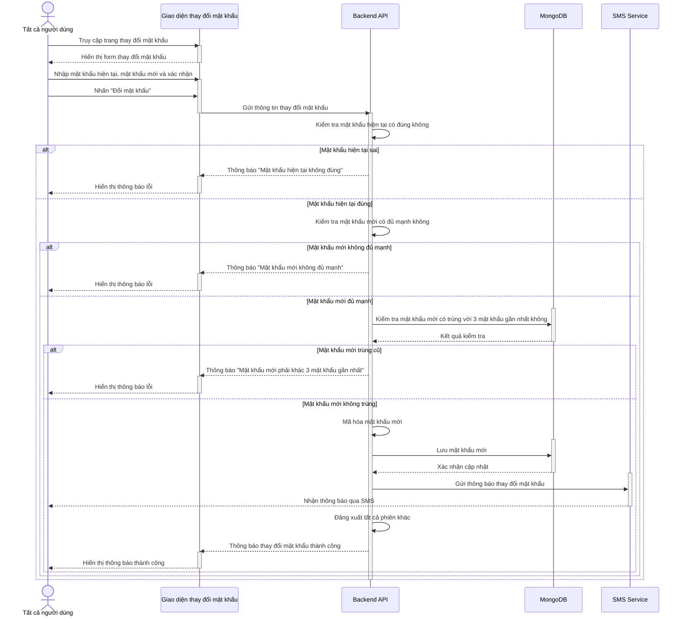
```mermaid
sequenceDiagram
    actor User as Tất cả người dùng
    participant UI as Giao diện thay đổi mật khẩu
    participant API as Backend API
    participant DB as MongoDB
    participant SMS as SMS Service

    User ->> UI: Truy cập trang thay đổi mật khẩu
    activate UI
    UI -->> User: Hiển thị form thay đổi mật khẩu
    deactivate UI

    User ->> UI: Nhập mật khẩu hiện tại, mật khẩu mới và xác nhận
    activate UI
    User ->> UI: Nhấn "Đổi mật khẩu"
    UI ->> API: Gửi thông tin thay đổi mật khẩu
    deactivate UI

    activate API
    API ->> API: Kiểm tra mật khẩu hiện tại có đúng không

    alt Mật khẩu hiện tại sai
        API -->> UI: Thông báo "Mật khẩu hiện tại không đúng"
        activate UI
        UI -->> User: Hiển thị thông báo lỗi
        deactivate UI
    else Mật khẩu hiện tại đúng
        API ->> API: Kiểm tra mật khẩu mới có đủ mạnh không

        alt Mật khẩu mới không đủ mạnh
            API -->> UI: Thông báo "Mật khẩu mới không đủ mạnh"
            activate UI
            UI -->> User: Hiển thị thông báo lỗi
            deactivate UI
        else Mật khẩu mới đủ mạnh
            activate DB
            API ->> DB: Kiểm tra mật khẩu mới có trùng với 3 mật khẩu gần nhất không
            DB -->> API: Kết quả kiểm tra
            deactivate DB

            alt Mật khẩu mới trùng cũ
                API -->> UI: Thông báo "Mật khẩu mới phải khác 3 mật khẩu gần nhất"
                activate UI
                UI -->> User: Hiển thị thông báo lỗi
                deactivate UI
            else Mật khẩu mới không trùng
                API ->> API: Mã hóa mật khẩu mới
                activate DB
                API ->> DB: Lưu mật khẩu mới
                DB -->> API: Xác nhận cập nhật
                deactivate DB

                activate SMS
                API ->> SMS: Gửi thông báo thay đổi mật khẩu
                SMS -->> User: Nhận thông báo qua SMS
                deactivate SMS

                API ->> API: Đăng xuất tất cả phiên khác
                API -->> UI: Thông báo thay đổi mật khẩu thành công
                activate UI
                UI -->> User: Hiển thị thông báo thành công
                deactivate UI
            end
        end
    end

    deactivate API
```

### Các trường hợp ngoại lệ
- Mật khẩu hiện tại sai: Hệ thống thông báo "Mật khẩu hiện tại không đúng"
- Mật khẩu mới không đủ mạnh: Hệ thống yêu cầu tạo mật khẩu mạnh hơn
- Mật khẩu mới trùng cũ: Hệ thống yêu cầu chọn mật khẩu khác

### Quy tắc nghiệp vụ
- Mật khẩu mới phải khác 3 mật khẩu gần nhất
- Độ dài tối thiểu 8 ký tự, có số và ký tự đặc biệt
- Thông báo qua SMS khi thay đổi
- Tất cả phiên khác bị đăng xuất

---

## UC-06: Quên mật khẩu

### Mô tả ngắn gọn
Khôi phục quyền truy cập tài khoản khi quên mật khẩu

### Sequence Diagram
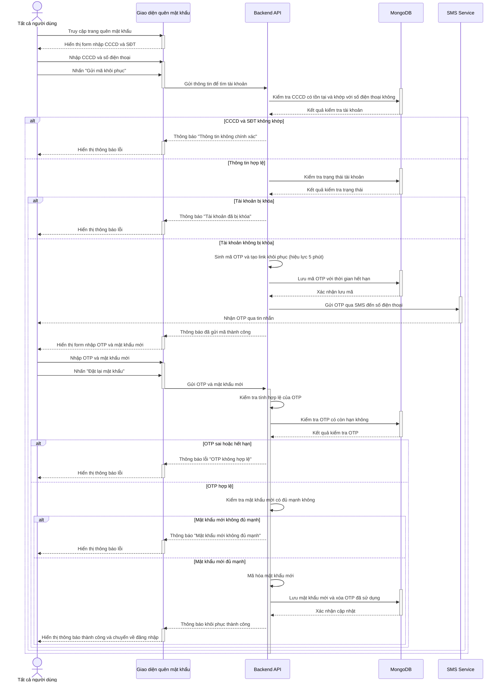
```mermaid
sequenceDiagram
    actor User as Tất cả người dùng
    participant UI as Giao diện quên mật khẩu
    participant API as Backend API
    participant DB as MongoDB
    participant SMS as SMS Service

    User ->> UI: Truy cập trang quên mật khẩu
    activate UI
    UI -->> User: Hiển thị form nhập CCCD và SĐT
    deactivate UI

    User ->> UI: Nhập CCCD và số điện thoại
    activate UI
    User ->> UI: Nhấn "Gửi mã khôi phục"
    UI ->> API: Gửi thông tin để tìm tài khoản
    deactivate UI

    activate API
    activate DB
    API ->> DB: Kiểm tra CCCD có tồn tại và khớp với số điện thoại không
    DB -->> API: Kết quả kiểm tra tài khoản
    deactivate DB

    alt CCCD và SĐT không khớp
        API -->> UI: Thông báo "Thông tin không chính xác"
        activate UI
        UI -->> User: Hiển thị thông báo lỗi
        deactivate UI
    else Thông tin hợp lệ
        activate DB
        API ->> DB: Kiểm tra trạng thái tài khoản
        DB -->> API: Kết quả kiểm tra trạng thái
        deactivate DB

        alt Tài khoản bị khóa
            API -->> UI: Thông báo "Tài khoản đã bị khóa"
            activate UI
            UI -->> User: Hiển thị thông báo lỗi
            deactivate UI
        else Tài khoản không bị khóa
            API ->> API: Sinh mã OTP và tạo link khôi phục (hiệu lực 5 phút)

            activate DB
            API ->> DB: Lưu mã OTP với thời gian hết hạn
            DB -->> API: Xác nhận lưu mã
            deactivate DB

            activate SMS
            API ->> SMS: Gửi OTP qua SMS đến số điện thoại
            SMS -->> User: Nhận OTP qua tin nhắn
            deactivate SMS

            API -->> UI: Thông báo đã gửi mã thành công
            activate UI
            UI -->> User: Hiển thị form nhập OTP và mật khẩu mới
            deactivate UI

            User ->> UI: Nhập OTP và mật khẩu mới
            activate UI
            User ->> UI: Nhấn "Đặt lại mật khẩu"
            UI ->> API: Gửi OTP và mật khẩu mới
            deactivate UI

            activate API
            API ->> API: Kiểm tra tính hợp lệ của OTP

            activate DB
            API ->> DB: Kiểm tra OTP có còn hạn không
            DB -->> API: Kết quả kiểm tra OTP
            deactivate DB

            alt OTP sai hoặc hết hạn
                API -->> UI: Thông báo lỗi "OTP không hợp lệ"
                activate UI
                UI -->> User: Hiển thị thông báo lỗi
                deactivate UI
            else OTP hợp lệ
                API ->> API: Kiểm tra mật khẩu mới có đủ mạnh không

                alt Mật khẩu mới không đủ mạnh
                    API -->> UI: Thông báo "Mật khẩu mới không đủ mạnh"
                    activate UI
                    UI -->> User: Hiển thị thông báo lỗi
                    deactivate UI
                else Mật khẩu mới đủ mạnh
                    API ->> API: Mã hóa mật khẩu mới
                    activate DB
                    API ->> DB: Lưu mật khẩu mới và xóa OTP đã sử dụng
                    DB -->> API: Xác nhận cập nhật
                    deactivate DB

                    API -->> UI: Thông báo khôi phục thành công
                    activate UI
                    UI -->> User: Hiển thị thông báo thành công và chuyển về đăng nhập
                    deactivate UI
                end
            end
        end
    end

    deactivate API
```

### Các trường hợp ngoại lệ
- CCCD và số điện thoại không khớp: Hệ thống thông báo "Thông tin không chính xác"
- OTP sai: Hệ thống yêu cầu nhập lại
- OTP hết hạn: Hệ thống yêu cầu gửi lại
- Mật khẩu mới không đủ mạnh: Hệ thống yêu cầu tạo mật khẩu mạnh hơn

### Quy tắc nghiệp vụ
- OTP có hiệu lực trong 5 phút
- Tối đa 5 lần nhập sai OTP
- Mật khẩu mới phải khác mật khẩu cũ
- Độ dài tối thiểu 8 ký tự, có số và ký tự đặc biệt

---

### **Task 1.4: Quản lý tài khoản**

---

## UC-07: Cập nhật thông tin tài khoản

### Mô tả ngắn gọn
Admin quản lý và cập nhật thông tin tài khoản người dùng trong tổ chức

### Sequence Diagram
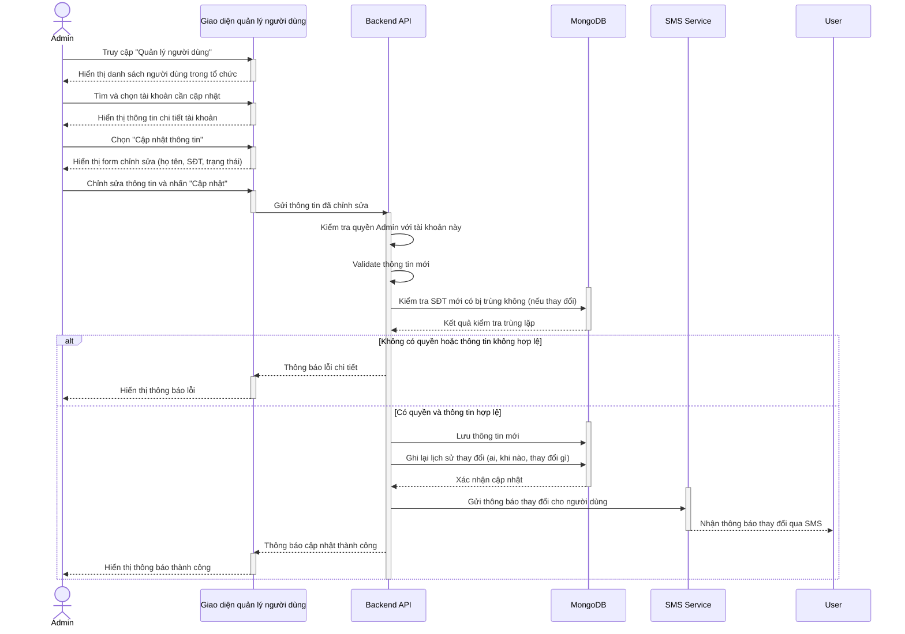
```mermaid
sequenceDiagram
    actor Admin as Admin
    participant UI as Giao diện quản lý người dùng
    participant API as Backend API
    participant DB as MongoDB
    participant SMS as SMS Service

    Admin ->> UI: Truy cập "Quản lý người dùng"
    activate UI
    UI -->> Admin: Hiển thị danh sách người dùng trong tổ chức
    deactivate UI

    Admin ->> UI: Tìm và chọn tài khoản cần cập nhật
    activate UI
    UI -->> Admin: Hiển thị thông tin chi tiết tài khoản
    deactivate UI

    Admin ->> UI: Chọn "Cập nhật thông tin"
    activate UI
    UI -->> Admin: Hiển thị form chỉnh sửa (họ tên, SĐT, trạng thái)
    deactivate UI

    Admin ->> UI: Chỉnh sửa thông tin và nhấn "Cập nhật"
    activate UI
    UI ->> API: Gửi thông tin đã chỉnh sửa
    deactivate UI

    activate API
    API ->> API: Kiểm tra quyền Admin với tài khoản này
    API ->> API: Validate thông tin mới

    activate DB
    API ->> DB: Kiểm tra SĐT mới có bị trùng không (nếu thay đổi)
    DB -->> API: Kết quả kiểm tra trùng lặp
    deactivate DB

    alt Không có quyền hoặc thông tin không hợp lệ
        API -->> UI: Thông báo lỗi chi tiết
        activate UI
        UI -->> Admin: Hiển thị thông báo lỗi
        deactivate UI
    else Có quyền và thông tin hợp lệ
        activate DB
        API ->> DB: Lưu thông tin mới
        API ->> DB: Ghi lại lịch sử thay đổi (ai, khi nào, thay đổi gì)
        DB -->> API: Xác nhận cập nhật
        deactivate DB

        activate SMS
        API ->> SMS: Gửi thông báo thay đổi cho người dùng
        SMS -->> User: Nhận thông báo thay đổi qua SMS
        deactivate SMS

        API -->> UI: Thông báo cập nhật thành công
        activate UI
        UI -->> Admin: Hiển thị thông báo thành công
        deactivate UI
    end

    deactivate API
```

### Các trường hợp ngoại lệ
- Số điện thoại đã được sử dụng: Hệ thống thông báo "Số điện thoại đã được đăng ký"
- Thông tin không hợp lệ: Hệ thống yêu cầu nhập lại
- Không có quyền quản lý tài khoản: Hệ thống từ chối thay đổi

### Quy tắc nghiệp vụ
- CCCD không được phép thay đổi
- Số điện thoại phải duy nhất trong hệ thống
- Chỉ Admin mới có quyền cập nhật thông tin tài khoản
- Ghi lại đầy đủ thông tin: ai thay đổi, khi nào, thay đổi gì
- Thông báo ngay cho người dùng về thay đổi

---

## UC-08: Khóa/Mở khóa tài khoản

### Mô tả ngắn gọn
Kiểm soát trạng thái hoạt động tài khoản

### Sequence Diagram
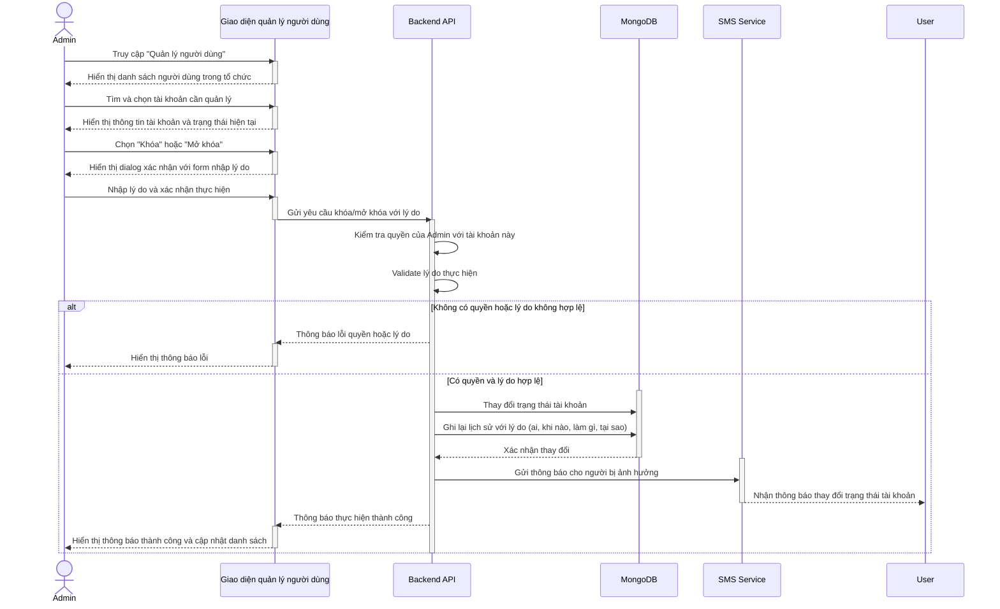
```mermaid
sequenceDiagram
    actor Admin as Admin
    participant UI as Giao diện quản lý người dùng
    participant API as Backend API
    participant DB as MongoDB
    participant SMS as SMS Service

    Admin ->> UI: Truy cập "Quản lý người dùng"
    activate UI
    UI -->> Admin: Hiển thị danh sách người dùng trong tổ chức
    deactivate UI

    Admin ->> UI: Tìm và chọn tài khoản cần quản lý
    activate UI
    UI -->> Admin: Hiển thị thông tin tài khoản và trạng thái hiện tại
    deactivate UI

    Admin ->> UI: Chọn "Khóa" hoặc "Mở khóa"
    activate UI
    UI -->> Admin: Hiển thị dialog xác nhận với form nhập lý do
    deactivate UI

    Admin ->> UI: Nhập lý do và xác nhận thực hiện
    activate UI
    UI ->> API: Gửi yêu cầu khóa/mở khóa với lý do
    deactivate UI

    activate API
    API ->> API: Kiểm tra quyền của Admin với tài khoản này
    API ->> API: Validate lý do thực hiện

    alt Không có quyền hoặc lý do không hợp lệ
        API -->> UI: Thông báo lỗi quyền hoặc lý do
        activate UI
        UI -->> Admin: Hiển thị thông báo lỗi
        deactivate UI
    else Có quyền và lý do hợp lệ
        activate DB
        API ->> DB: Thay đổi trạng thái tài khoản
        API ->> DB: Ghi lại lịch sử với lý do (ai, khi nào, làm gì, tại sao)
        DB -->> API: Xác nhận thay đổi
        deactivate DB

        activate SMS
        API ->> SMS: Gửi thông báo cho người bị ảnh hưởng
        SMS -->> User: Nhận thông báo thay đổi trạng thái tài khoản
        deactivate SMS

        API -->> UI: Thông báo thực hiện thành công
        activate UI
        UI -->> Admin: Hiển thị thông báo thành công và cập nhật danh sách
        deactivate UI
    end

    deactivate API
```

### Các trường hợp ngoại lệ
- Không có quyền: Hệ thống từ chối thao tác
- Tài khoản không thuộc tổ chức: Hệ thống thông báo lỗi
- Lý do không hợp lệ: Hệ thống yêu cầu nhập lý do

### Quy tắc nghiệp vụ
- Admin chỉ quản lý được tài khoản trong tổ chức của mình
- Phải có lý do khi khóa/mở khóa
- Ghi lại đầy đủ thông tin: ai, khi nào, làm gì, tại sao
- Thông báo ngay cho người bị ảnh hưởng

---

## 📋 **MODULE 2: QUẢN LÝ THỬA ĐẤT**

### **Task 2.1: Tạo và Cập nhật thửa đất**

---

## UC-09: Tạo thửa đất mới

### Mô tả ngắn gọn
Ghi nhận quyền sử dụng đất hợp pháp vào blockchain

### Sequence Diagram
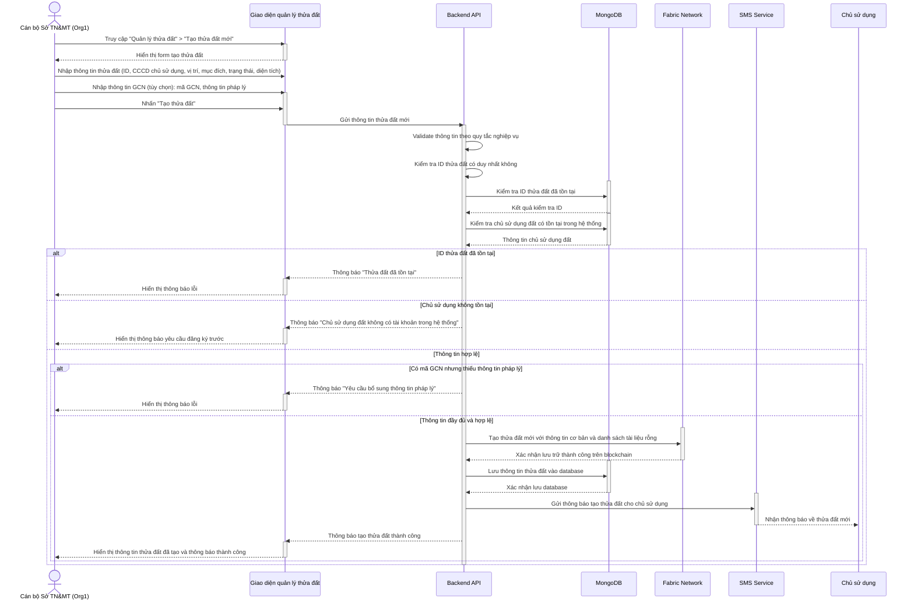
```mermaid
sequenceDiagram
    actor Officer as Cán bộ Sở TN&MT (Org1)
    participant UI as Giao diện quản lý thửa đất
    participant API as Backend API
    participant DB as MongoDB
    participant Blockchain as Fabric Network
    participant SMS as SMS Service

    Officer ->> UI: Truy cập "Quản lý thửa đất" > "Tạo thửa đất mới"
    activate UI
    UI -->> Officer: Hiển thị form tạo thửa đất
    deactivate UI

    Officer ->> UI: Nhập thông tin thửa đất (ID, CCCD chủ sử dụng, vị trí, mục đích, trạng thái, diện tích)
    Officer ->> UI: Nhập thông tin GCN (tùy chọn): mã GCN, thông tin pháp lý
    activate UI
    Officer ->> UI: Nhấn "Tạo thửa đất"
    UI ->> API: Gửi thông tin thửa đất mới
    deactivate UI

    activate API
    API ->> API: Validate thông tin theo quy tắc nghiệp vụ
    API ->> API: Kiểm tra ID thửa đất có duy nhất không

    activate DB
    API ->> DB: Kiểm tra ID thửa đất đã tồn tại
    DB -->> API: Kết quả kiểm tra ID
    deactivate DB

    activate DB
    API ->> DB: Kiểm tra chủ sử dụng đất có tồn tại trong hệ thống
    DB -->> API: Thông tin chủ sử dụng đất
    deactivate DB

    alt ID thửa đất đã tồn tại
        API -->> UI: Thông báo "Thửa đất đã tồn tại"
        activate UI
        UI -->> Officer: Hiển thị thông báo lỗi
        deactivate UI
    else Chủ sử dụng không tồn tại
        API -->> UI: Thông báo "Chủ sử dụng đất không có tài khoản trong hệ thống"
        activate UI
        UI -->> Officer: Hiển thị thông báo yêu cầu đăng ký trước
        deactivate UI
    else Thông tin hợp lệ
        alt Có mã GCN nhưng thiếu thông tin pháp lý
            API -->> UI: Thông báo "Yêu cầu bổ sung thông tin pháp lý"
            activate UI
            UI -->> Officer: Hiển thị thông báo lỗi
            deactivate UI
        else Thông tin đầy đủ và hợp lệ
            activate Blockchain
            API ->> Blockchain: Tạo thửa đất mới với thông tin cơ bản và danh sách tài liệu rỗng
            Blockchain -->> API: Xác nhận lưu trữ thành công trên blockchain
            deactivate Blockchain

            activate DB
            API ->> DB: Lưu thông tin thửa đất vào database
            DB -->> API: Xác nhận lưu database
            deactivate DB

            activate SMS
            API ->> SMS: Gửi thông báo tạo thửa đất cho chủ sử dụng
            SMS -->> Chủ sử dụng: Nhận thông báo về thửa đất mới
            deactivate SMS

            API -->> UI: Thông báo tạo thửa đất thành công
            activate UI
            UI -->> Officer: Hiển thị thông tin thửa đất đã tạo và thông báo thành công
            deactivate UI
        end
    end

    deactivate API
```

### Các trường hợp ngoại lệ
- ID thửa đất đã tồn tại: Hệ thống thông báo "Thửa đất đã tồn tại"
- Chủ sử dụng không tồn tại: Hệ thống yêu cầu đăng ký người sử dụng đất trước
- Thông tin không hợp lệ: Hệ thống hiển thị lỗi chi tiết để sửa
- Có mã GCN nhưng thiếu thông tin pháp lý: Hệ thống yêu cầu bổ sung

### Quy tắc nghiệp vụ
- Mỗi thửa đất có ID duy nhất trong toàn hệ thống
- Diện tích phải lớn hơn 0 và được ghi bằng mét vuông
- Mục đích sử dụng phải thuộc danh mục: Đất ở, Đất nông nghiệp, Đất thương mại, Đất công nghiệp, Đất phi nông nghiệp
- Trạng thái pháp lý phải thuộc: Có giấy chứng nhận, Chưa có GCN, Đang tranh chấp, Đang thế chấp
- Nếu có mã GCN thì phải có thông tin pháp lý
- Thông tin được lưu trữ bất biến trên blockchain

---

## UC-10: Cập nhật thông tin thửa đất

### Mô tả ngắn gọn
Cập nhật thông tin thửa đất khi có thay đổi

### Sequence Diagram
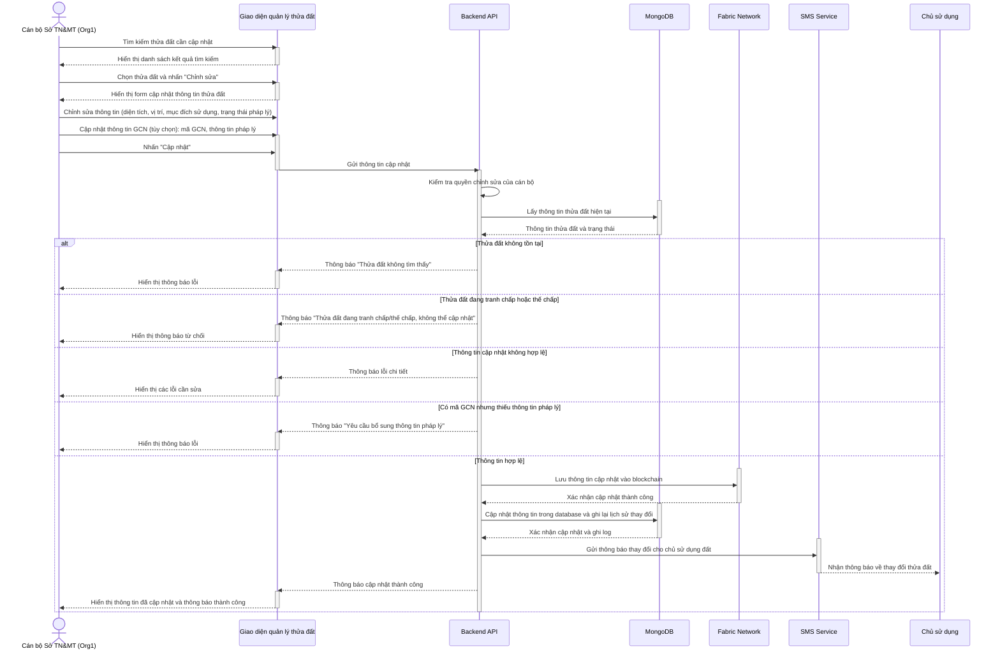
```mermaid
sequenceDiagram
    actor Officer as Cán bộ Sở TN&MT (Org1)
    participant UI as Giao diện quản lý thửa đất
    participant API as Backend API
    participant DB as MongoDB
    participant Blockchain as Fabric Network
    participant SMS as SMS Service

    Officer ->> UI: Tìm kiếm thửa đất cần cập nhật
    activate UI
    UI -->> Officer: Hiển thị danh sách kết quả tìm kiếm
    deactivate UI

    Officer ->> UI: Chọn thửa đất và nhấn "Chỉnh sửa"
    activate UI
    UI -->> Officer: Hiển thị form cập nhật thông tin thửa đất
    deactivate UI

    Officer ->> UI: Chỉnh sửa thông tin (diện tích, vị trí, mục đích sử dụng, trạng thái pháp lý)
    Officer ->> UI: Cập nhật thông tin GCN (tùy chọn): mã GCN, thông tin pháp lý
    activate UI
    Officer ->> UI: Nhấn "Cập nhật"
    UI ->> API: Gửi thông tin cập nhật
    deactivate UI

    activate API
    API ->> API: Kiểm tra quyền chỉnh sửa của cán bộ

    activate DB
    API ->> DB: Lấy thông tin thửa đất hiện tại
    DB -->> API: Thông tin thửa đất và trạng thái
    deactivate DB

    alt Thửa đất không tồn tại
        API -->> UI: Thông báo "Thửa đất không tìm thấy"
        activate UI
        UI -->> Officer: Hiển thị thông báo lỗi
        deactivate UI
    else Thửa đất đang tranh chấp hoặc thế chấp
        API -->> UI: Thông báo "Thửa đất đang tranh chấp/thế chấp, không thể cập nhật"
        activate UI
        UI -->> Officer: Hiển thị thông báo từ chối
        deactivate UI
    else Thông tin cập nhật không hợp lệ
        API -->> UI: Thông báo lỗi chi tiết
        activate UI
        UI -->> Officer: Hiển thị các lỗi cần sửa
        deactivate UI
    else Có mã GCN nhưng thiếu thông tin pháp lý
        API -->> UI: Thông báo "Yêu cầu bổ sung thông tin pháp lý"
        activate UI
        UI -->> Officer: Hiển thị thông báo lỗi
        deactivate UI
    else Thông tin hợp lệ
        activate Blockchain
        API ->> Blockchain: Lưu thông tin cập nhật vào blockchain
        Blockchain -->> API: Xác nhận cập nhật thành công
        deactivate Blockchain

        activate DB
        API ->> DB: Cập nhật thông tin trong database và ghi lại lịch sử thay đổi
        DB -->> API: Xác nhận cập nhật và ghi log
        deactivate DB

        activate SMS
        API ->> SMS: Gửi thông báo thay đổi cho chủ sử dụng đất
        SMS -->> Chủ sử dụng: Nhận thông báo về thay đổi thửa đất
        deactivate SMS

        API -->> UI: Thông báo cập nhật thành công
        activate UI
        UI -->> Officer: Hiển thị thông tin đã cập nhật và thông báo thành công
        deactivate UI
    end

    deactivate API
```

### Các trường hợp ngoại lệ
- Thửa đất không tồn tại: Hệ thống thông báo "Thửa đất không tìm thấy"
- Thửa đất đang tranh chấp/thế chấp: Hệ thống từ chối cập nhật
- Thông tin không hợp lệ: Hệ thống yêu cầu sửa lại
- Có mã GCN nhưng thiếu thông tin pháp lý: Hệ thống yêu cầu bổ sung

### Quy tắc nghiệp vụ
- Không được thay đổi ID thửa đất và người sử dụng đất
- Có thể cập nhật: diện tích, vị trí, mục đích sử dụng, trạng thái pháp lý
- Nếu có mã GCN thì phải có thông tin pháp lý
- Thửa đất đang tranh chấp hoặc thế chấp không thể cập nhật
- Mọi thay đổi phải được ghi lại lịch sử bất biến

---

### **Task 2.2: Tìm kiếm và Xem thông tin thửa đất**

---

## UC-11: Tìm kiếm thửa đất

### Mô tả ngắn gọn
Tra cứu thông tin thửa đất nhanh chóng và chính xác theo nhiều tiêu chí

### Sequence Diagram
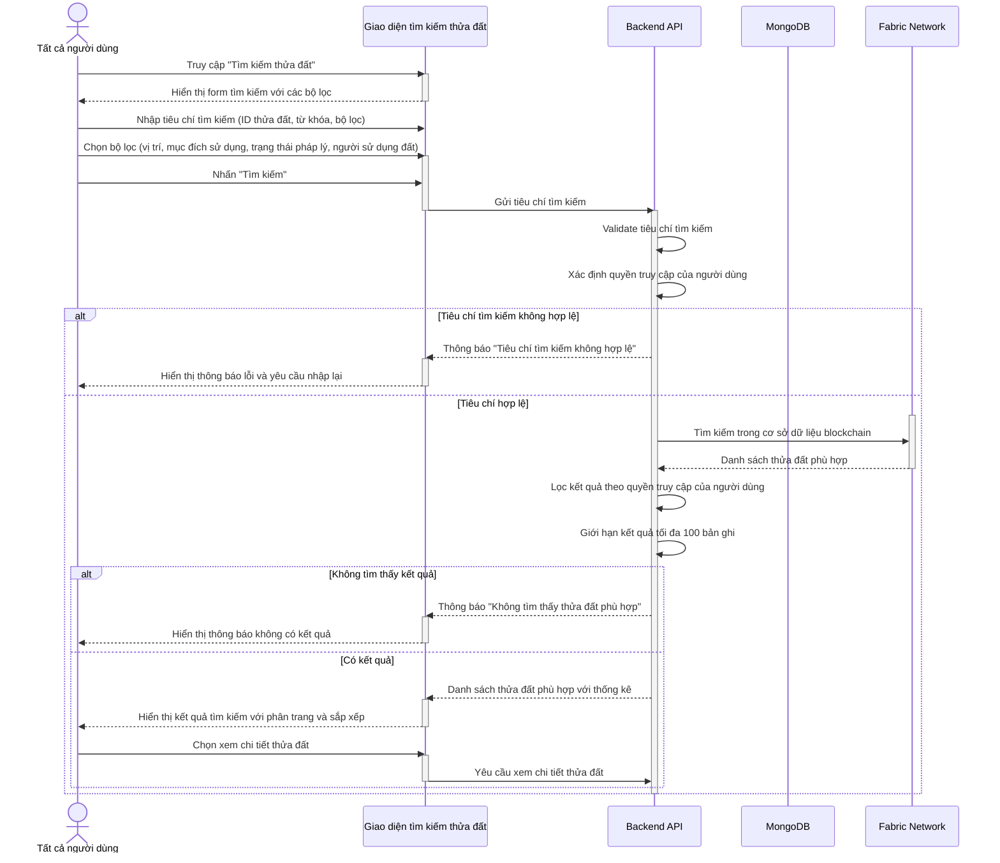
```mermaid
sequenceDiagram
    actor User as Tất cả người dùng
    participant UI as Giao diện tìm kiếm thửa đất
    participant API as Backend API
    participant DB as MongoDB
    participant Blockchain as Fabric Network

    User ->> UI: Truy cập "Tìm kiếm thửa đất"
    activate UI
    UI -->> User: Hiển thị form tìm kiếm với các bộ lọc
    deactivate UI

    User ->> UI: Nhập tiêu chí tìm kiếm (ID thửa đất, từ khóa, bộ lọc)
    User ->> UI: Chọn bộ lọc (vị trí, mục đích sử dụng, trạng thái pháp lý, người sử dụng đất)
    activate UI
    User ->> UI: Nhấn "Tìm kiếm"
    UI ->> API: Gửi tiêu chí tìm kiếm
    deactivate UI

    activate API
    API ->> API: Validate tiêu chí tìm kiếm
    API ->> API: Xác định quyền truy cập của người dùng

    alt Tiêu chí tìm kiếm không hợp lệ
        API -->> UI: Thông báo "Tiêu chí tìm kiếm không hợp lệ"
        activate UI
        UI -->> User: Hiển thị thông báo lỗi và yêu cầu nhập lại
        deactivate UI
    else Tiêu chí hợp lệ
        activate Blockchain
        API ->> Blockchain: Tìm kiếm trong cơ sở dữ liệu blockchain
        Blockchain -->> API: Danh sách thửa đất phù hợp
        deactivate Blockchain

        API ->> API: Lọc kết quả theo quyền truy cập của người dùng
        API ->> API: Giới hạn kết quả tối đa 100 bản ghi

        alt Không tìm thấy kết quả
            API -->> UI: Thông báo "Không tìm thấy thửa đất phù hợp"
            activate UI
            UI -->> User: Hiển thị thông báo không có kết quả
            deactivate UI
        else Có kết quả
            API -->> UI: Danh sách thửa đất phù hợp với thống kê
            activate UI
            UI -->> User: Hiển thị kết quả tìm kiếm với phân trang và sắp xếp
            deactivate UI

            User ->> UI: Chọn xem chi tiết thửa đất
            activate UI
            UI ->> API: Yêu cầu xem chi tiết thửa đất
            deactivate UI
        end
    end

    deactivate API
```

### Các trường hợp ngoại lệ
- Không tìm thấy kết quả: Hệ thống thông báo "Không tìm thấy thửa đất phù hợp"
- Tiêu chí tìm kiếm không hợp lệ: Hệ thống yêu cầu nhập lại
- Lỗi truy vấn: Hệ thống thông báo lỗi và cho phép thử lại

### Quy tắc nghiệp vụ
- Người dùng chỉ xem được thửa đất được phép theo quyền hạn
- Kết quả tìm kiếm được giới hạn 100 bản ghi
- Hỗ trợ tìm kiếm theo từ khóa và bộ lọc nâng cao
- Org3 chỉ xem được thửa đất thuộc quyền sử dụng
- Tích hợp các chức năng: xem theo người sử dụng, xem tất cả, xem theo tiêu chí

---

## UC-12: Xem chi tiết thửa đất

### Mô tả ngắn gọn
Xem đầy đủ thông tin và trạng thái hiện tại của thửa đất

### Sequence Diagram
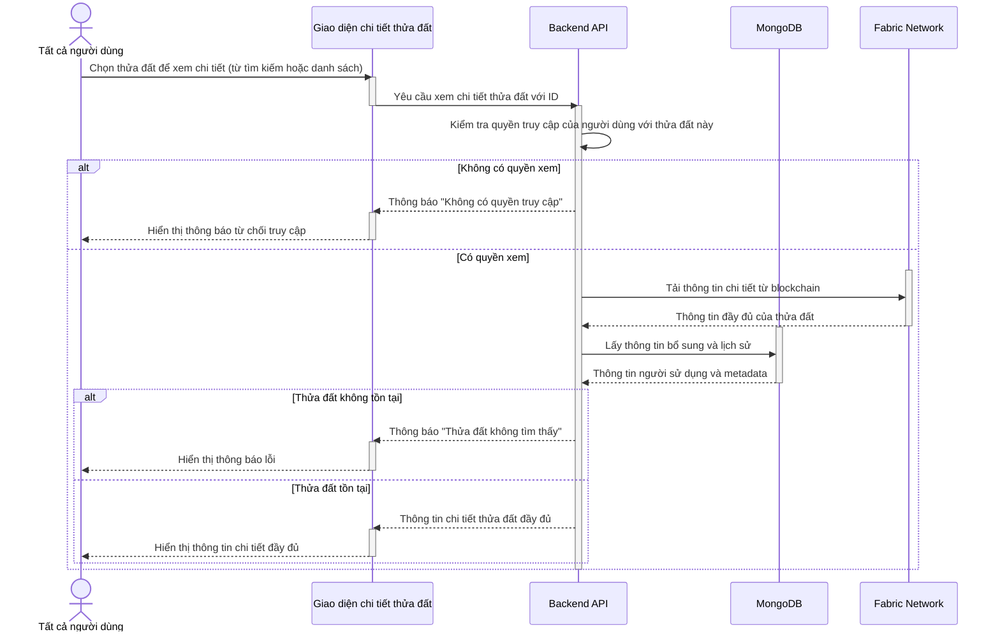
```mermaid
sequenceDiagram
    actor User as Tất cả người dùng
    participant UI as Giao diện chi tiết thửa đất
    participant API as Backend API
    participant DB as MongoDB
    participant Blockchain as Fabric Network

    User ->> UI: Chọn thửa đất để xem chi tiết (từ tìm kiếm hoặc danh sách)
    activate UI
    UI ->> API: Yêu cầu xem chi tiết thửa đất với ID
    deactivate UI

    activate API
    API ->> API: Kiểm tra quyền truy cập của người dùng với thửa đất này

    alt Không có quyền xem
        API -->> UI: Thông báo "Không có quyền truy cập"
        activate UI
        UI -->> User: Hiển thị thông báo từ chối truy cập
        deactivate UI
    else Có quyền xem
        activate Blockchain
        API ->> Blockchain: Tải thông tin chi tiết từ blockchain
        Blockchain -->> API: Thông tin đầy đủ của thửa đất
        deactivate Blockchain

        activate DB
        API ->> DB: Lấy thông tin bổ sung và lịch sử
        DB -->> API: Thông tin người sử dụng và metadata
        deactivate DB

        alt Thửa đất không tồn tại
            API -->> UI: Thông báo "Thửa đất không tìm thấy"
            activate UI
            UI -->> User: Hiển thị thông báo lỗi
            deactivate UI
        else Thửa đất tồn tại
            API -->> UI: Thông tin chi tiết thửa đất đầy đủ
            activate UI
            UI -->> User: Hiển thị thông tin chi tiết đầy đủ
            deactivate UI
        end
    end

    deactivate API
```

### Các trường hợp ngoại lệ
- Thửa đất không tồn tại: Hệ thống thông báo "Thửa đất không tìm thấy"
- Không có quyền xem: Hệ thống từ chối truy cập
- Lỗi tải dữ liệu: Hệ thống thông báo lỗi

### Quy tắc nghiệp vụ
- Thông tin được lấy trực tiếp từ blockchain
- Org3 chỉ xem được thửa đất thuộc quyền sử dụng
- Thông tin giấy chứng nhận chỉ hiển thị khi có GCN

---

## UC-13: Xem lịch sử thay đổi thửa đất

### Mô tả ngắn gọn
Theo dõi quá trình thay đổi thông tin thuộc tính của thửa đất theo thời gian

### Sequence Diagram
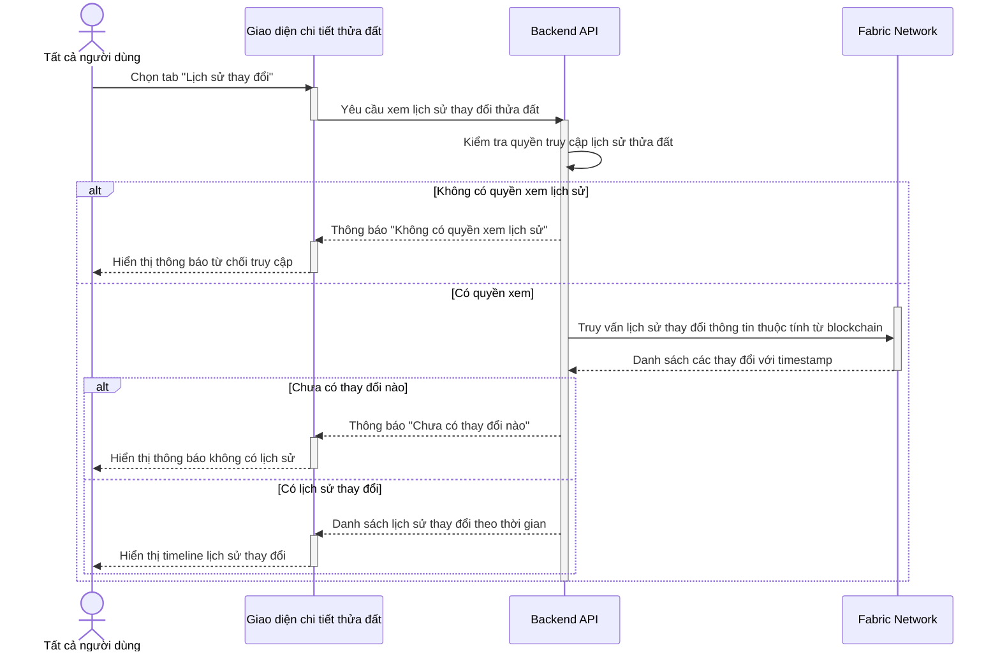
```mermaid
sequenceDiagram
    actor User as Tất cả người dùng
    participant UI as Giao diện chi tiết thửa đất
    participant API as Backend API
    participant Blockchain as Fabric Network

    User ->> UI: Chọn tab "Lịch sử thay đổi"
    activate UI
    UI ->> API: Yêu cầu xem lịch sử thay đổi thửa đất
    deactivate UI

    activate API
    API ->> API: Kiểm tra quyền truy cập lịch sử thửa đất

    alt Không có quyền xem lịch sử
        API -->> UI: Thông báo "Không có quyền xem lịch sử"
        activate UI
        UI -->> User: Hiển thị thông báo từ chối truy cập
        deactivate UI
    else Có quyền xem
        activate Blockchain
        API ->> Blockchain: Truy vấn lịch sử thay đổi thông tin thuộc tính từ blockchain
        Blockchain -->> API: Danh sách các thay đổi với timestamp
        deactivate Blockchain

        alt Chưa có thay đổi nào
            API -->> UI: Thông báo "Chưa có thay đổi nào"
            activate UI
            UI -->> User: Hiển thị thông báo không có lịch sử
            deactivate UI
        else Có lịch sử thay đổi
            API -->> UI: Danh sách lịch sử thay đổi theo thời gian
            activate UI
            UI -->> User: Hiển thị timeline lịch sử thay đổi
            deactivate UI
        end
    end

    deactivate API
```

### Các trường hợp ngoại lệ
- Thửa đất không có lịch sử thay đổi: Hệ thống thông báo "Chưa có thay đổi nào"
- Không có quyền xem lịch sử: Hệ thống từ chối truy cập
- Lỗi truy vấn blockchain: Hệ thống thông báo lỗi

### Quy tắc nghiệp vụ
- Lịch sử thay đổi được lưu trữ bất biến trên blockchain
- Org3 chỉ xem được lịch sử thửa đất thuộc quyền sở hữu
- Chỉ hiển thị các thay đổi thông tin thuộc tính được phép xem
- Mỗi lần thay đổi đều có timestamp và người thực hiện

---

### **Task 2.3: Cấp giấy chứng nhận**

---

## UC-14: Cấp giấy chứng nhận quyền sử dụng đất

### Mô tả ngắn gọn
Cấp giấy chứng nhận quyền sử dụng đất cho thửa đất đã đủ điều kiện

### Sequence Diagram
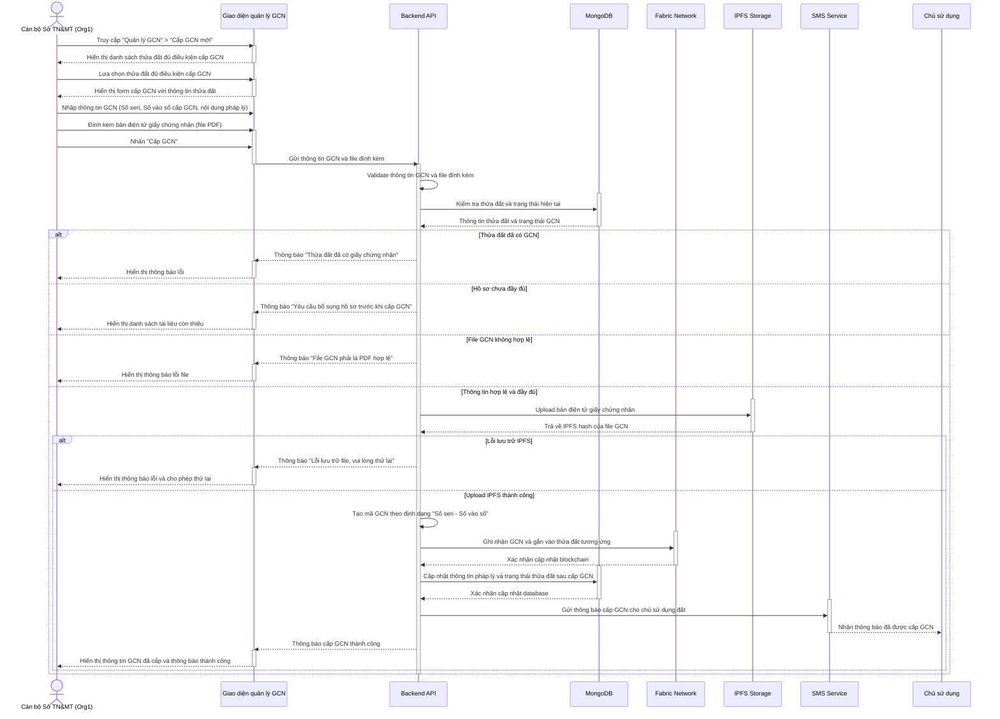
```mermaid
sequenceDiagram
    actor Officer as Cán bộ Sở TN&MT (Org1)
    participant UI as Giao diện quản lý GCN
    participant API as Backend API
    participant DB as MongoDB
    participant Blockchain as Fabric Network
    participant IPFS as IPFS Storage
    participant SMS as SMS Service

    Officer ->> UI: Truy cập "Quản lý GCN" > "Cấp GCN mới"
    activate UI
    UI -->> Officer: Hiển thị danh sách thửa đất đủ điều kiện cấp GCN
    deactivate UI

    Officer ->> UI: Lựa chọn thửa đất đủ điều kiện cấp GCN
    activate UI
    UI -->> Officer: Hiển thị form cấp GCN với thông tin thửa đất
    deactivate UI

    Officer ->> UI: Nhập thông tin GCN (Số seri, Số vào sổ cấp GCN, nội dung pháp lý)
    Officer ->> UI: Đính kèm bản điện tử giấy chứng nhận (file PDF)
    activate UI
    Officer ->> UI: Nhấn "Cấp GCN"
    UI ->> API: Gửi thông tin GCN và file đính kèm
    deactivate UI

    activate API
    API ->> API: Validate thông tin GCN và file đính kèm

    activate DB
    API ->> DB: Kiểm tra thửa đất và trạng thái hiện tại
    DB -->> API: Thông tin thửa đất và trạng thái GCN
    deactivate DB

    alt Thửa đất đã có GCN
        API -->> UI: Thông báo "Thửa đất đã có giấy chứng nhận"
        activate UI
        UI -->> Officer: Hiển thị thông báo lỗi
        deactivate UI
    else Hồ sơ chưa đầy đủ
        API -->> UI: Thông báo "Yêu cầu bổ sung hồ sơ trước khi cấp GCN"
        activate UI
        UI -->> Officer: Hiển thị danh sách tài liệu còn thiếu
        deactivate UI
    else File GCN không hợp lệ
        API -->> UI: Thông báo "File GCN phải là PDF hợp lệ"
        activate UI
        UI -->> Officer: Hiển thị thông báo lỗi file
        deactivate UI
    else Thông tin hợp lệ và đầy đủ
        activate IPFS
        API ->> IPFS: Upload bản điện tử giấy chứng nhận
        IPFS -->> API: Trả về IPFS hash của file GCN
        deactivate IPFS

        alt Lỗi lưu trữ IPFS
            API -->> UI: Thông báo "Lỗi lưu trữ file, vui lòng thử lại"
            activate UI
            UI -->> Officer: Hiển thị thông báo lỗi và cho phép thử lại
            deactivate UI
        else Upload IPFS thành công
            API ->> API: Tạo mã GCN theo định dạng "Số seri - Số vào sổ"

            activate Blockchain
            API ->> Blockchain: Ghi nhận GCN và gắn vào thửa đất tương ứng
            Blockchain -->> API: Xác nhận cập nhật blockchain
            deactivate Blockchain

            activate DB
            API ->> DB: Cập nhật thông tin pháp lý và trạng thái thửa đất sau cấp GCN
            DB -->> API: Xác nhận cập nhật database
            deactivate DB

            activate SMS
            API ->> SMS: Gửi thông báo cấp GCN cho chủ sử dụng đất
            SMS -->> Chủ sử dụng: Nhận thông báo đã được cấp GCN
            deactivate SMS

            API -->> UI: Thông báo cấp GCN thành công
            activate UI
            UI -->> Officer: Hiển thị thông tin GCN đã cấp và thông báo thành công
            deactivate UI
        end
    end

    deactivate API
```

### Các trường hợp ngoại lệ
- Thửa đất đã có GCN: Hệ thống thông báo "Thửa đất đã có giấy chứng nhận"
- Hồ sơ chưa đầy đủ: Hệ thống yêu cầu bổ sung trước khi cấp
- File GCN không hợp lệ: Hệ thống yêu cầu tải lên file PDF hợp lệ
- Lỗi lưu trữ IPFS: Hệ thống thông báo lỗi và yêu cầu thử lại

### Quy tắc nghiệp vụ
- Chỉ cán bộ Sở TN&MT (Org1) có thẩm quyền cấp GCN
- Một thửa đất chỉ có một giấy chứng nhận hợp lệ tại một thời điểm
- Mã GCN phải duy nhất, cấu trúc theo "Số seri - Số vào sổ cấp GCN" theo quy định quản lý hồ sơ
- Hồ sơ cấp GCN phải kèm bản điện tử giấy chứng nhận và nội dung pháp lý liên quan
- Trạng thái và thông tin pháp lý của thửa đất phải được cập nhật ngay sau khi cấp GCN

---

## 📋 **MODULE 3: QUẢN LÝ TÀI LIỆU**

### **Task 3.1: Tạo và Quản lý tài liệu**

---

## UC-15: Tạo tài liệu

### Mô tả ngắn gọn
Tạo và tải lên tài liệu mới vào hệ thống

### Sequence Diagram
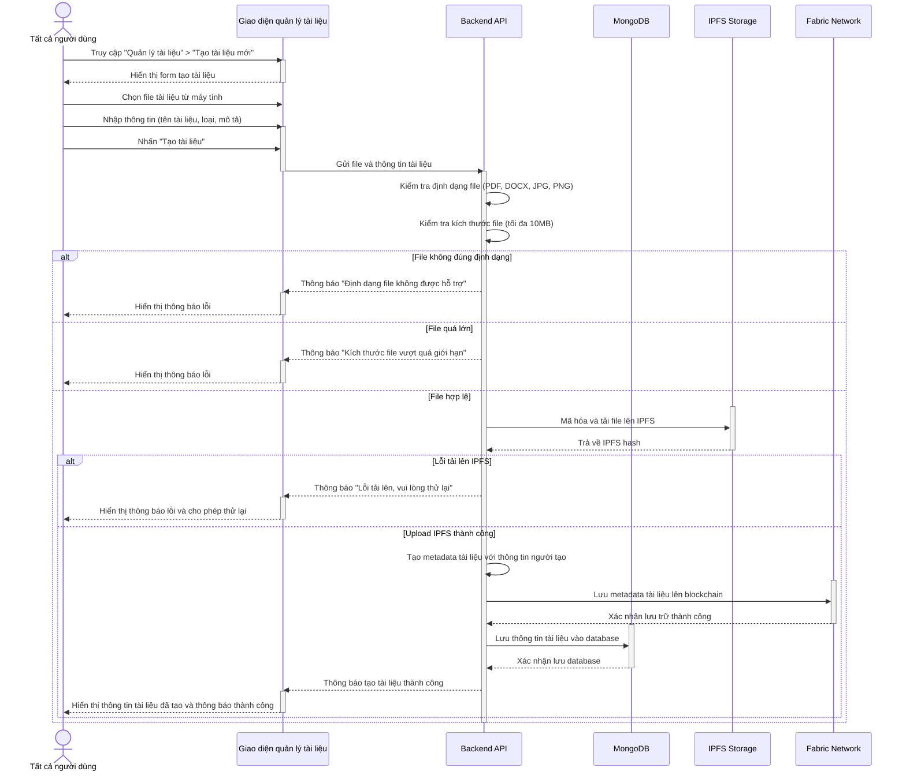
```mermaid
sequenceDiagram
    actor User as Tất cả người dùng
    participant UI as Giao diện quản lý tài liệu
    participant API as Backend API
    participant DB as MongoDB
    participant IPFS as IPFS Storage
    participant Blockchain as Fabric Network

    User ->> UI: Truy cập "Quản lý tài liệu" > "Tạo tài liệu mới"
    activate UI
    UI -->> User: Hiển thị form tạo tài liệu
    deactivate UI

    User ->> UI: Chọn file tài liệu từ máy tính
    User ->> UI: Nhập thông tin (tên tài liệu, loại, mô tả)
    activate UI
    User ->> UI: Nhấn "Tạo tài liệu"
    UI ->> API: Gửi file và thông tin tài liệu
    deactivate UI

    activate API
    API ->> API: Kiểm tra định dạng file (PDF, DOCX, JPG, PNG)
    API ->> API: Kiểm tra kích thước file (tối đa 10MB)

    alt File không đúng định dạng
        API -->> UI: Thông báo "Định dạng file không được hỗ trợ"
        activate UI
        UI -->> User: Hiển thị thông báo lỗi
        deactivate UI
    else File quá lớn
        API -->> UI: Thông báo "Kích thước file vượt quá giới hạn"
        activate UI
        UI -->> User: Hiển thị thông báo lỗi
        deactivate UI
    else File hợp lệ
        activate IPFS
        API ->> IPFS: Mã hóa và tải file lên IPFS
        IPFS -->> API: Trả về IPFS hash
        deactivate IPFS

        alt Lỗi tải lên IPFS
            API -->> UI: Thông báo "Lỗi tải lên, vui lòng thử lại"
            activate UI
            UI -->> User: Hiển thị thông báo lỗi và cho phép thử lại
            deactivate UI
        else Upload IPFS thành công
            API ->> API: Tạo metadata tài liệu với thông tin người tạo

            activate Blockchain
            API ->> Blockchain: Lưu metadata tài liệu lên blockchain
            Blockchain -->> API: Xác nhận lưu trữ thành công
            deactivate Blockchain

            activate DB
            API ->> DB: Lưu thông tin tài liệu vào database
            DB -->> API: Xác nhận lưu database
            deactivate DB

            API -->> UI: Thông báo tạo tài liệu thành công
            activate UI
            UI -->> User: Hiển thị thông tin tài liệu đã tạo và thông báo thành công
            deactivate UI
        end
    end

    deactivate API
```

### Các trường hợp ngoại lệ
- File không đúng định dạng: Hệ thống thông báo "Định dạng file không được hỗ trợ"
- File quá lớn: Hệ thống thông báo "Kích thước file vượt quá giới hạn"
- Lỗi tải lên IPFS: Hệ thống thông báo lỗi và cho phép thử lại

### Quy tắc nghiệp vụ
- Chỉ hỗ trợ file PDF, DOCX, JPG, PNG
- Kích thước file tối đa 10MB
- Metadata được lưu bất biến trên blockchain
- File được mã hóa trước khi lưu trữ

---

## UC-16: Xem chi tiết tài liệu

### Mô tả ngắn gọn
Hiển thị thông tin chi tiết và nội dung tài liệu

### Sequence Diagram
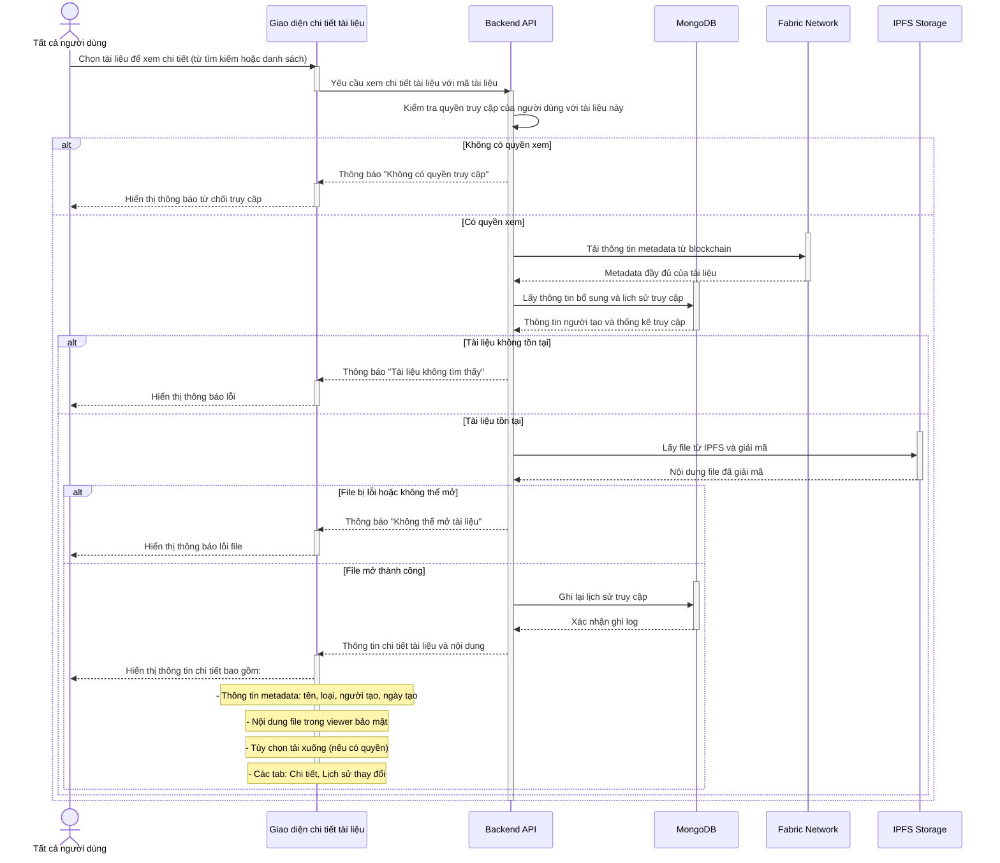
```mermaid
sequenceDiagram
    actor User as Tất cả người dùng
    participant UI as Giao diện chi tiết tài liệu
    participant API as Backend API
    participant DB as MongoDB
    participant Blockchain as Fabric Network
    participant IPFS as IPFS Storage

    User ->> UI: Chọn tài liệu để xem chi tiết (từ tìm kiếm hoặc danh sách)
    activate UI
    UI ->> API: Yêu cầu xem chi tiết tài liệu với mã tài liệu
    deactivate UI

    activate API
    API ->> API: Kiểm tra quyền truy cập của người dùng với tài liệu này

    alt Không có quyền xem
        API -->> UI: Thông báo "Không có quyền truy cập"
        activate UI
        UI -->> User: Hiển thị thông báo từ chối truy cập
        deactivate UI
    else Có quyền xem
        activate Blockchain
        API ->> Blockchain: Tải thông tin metadata từ blockchain
        Blockchain -->> API: Metadata đầy đủ của tài liệu
        deactivate Blockchain

        activate DB
        API ->> DB: Lấy thông tin bổ sung và lịch sử truy cập
        DB -->> API: Thông tin người tạo và thống kê truy cập
        deactivate DB

        alt Tài liệu không tồn tại
            API -->> UI: Thông báo "Tài liệu không tìm thấy"
            activate UI
            UI -->> User: Hiển thị thông báo lỗi
            deactivate UI
        else Tài liệu tồn tại
            activate IPFS
            API ->> IPFS: Lấy file từ IPFS và giải mã
            IPFS -->> API: Nội dung file đã giải mã
            deactivate IPFS

            alt File bị lỗi hoặc không thể mở
                API -->> UI: Thông báo "Không thể mở tài liệu"
                activate UI
                UI -->> User: Hiển thị thông báo lỗi file
                deactivate UI
            else File mở thành công
                activate DB
                API ->> DB: Ghi lại lịch sử truy cập
                DB -->> API: Xác nhận ghi log
                deactivate DB

                API -->> UI: Thông tin chi tiết tài liệu và nội dung
                activate UI
                UI -->> User: Hiển thị thông tin chi tiết bao gồm:
                Note over UI: - Thông tin metadata: tên, loại, người tạo, ngày tạo
                Note over UI: - Nội dung file trong viewer bảo mật
                Note over UI: - Tùy chọn tải xuống (nếu có quyền)
                Note over UI: - Các tab: Chi tiết, Lịch sử thay đổi
                deactivate UI
            end
        end
    end

    deactivate API
```

### Các trường hợp ngoại lệ
- Tài liệu không tồn tại: Hệ thống thông báo "Tài liệu không tìm thấy"
- Không có quyền xem: Hệ thống từ chối truy cập
- File bị lỗi: Hệ thống thông báo "Không thể mở tài liệu"

### Quy tắc nghiệp vụ
- Chỉ xem được tài liệu có quyền truy cập
- Mọi lần xem đều được ghi log
- Tài liệu được hiển thị trong viewer bảo mật

---

### **Task 3.2: Liên kết tài liệu**

---

## UC-17: Liên kết tài liệu bổ sung cho thửa đất

### Mô tả ngắn gọn
Liên kết tài liệu bổ sung với thửa đất; tài liệu được liên kết sẽ tự động được xác thực

### Sequence Diagram
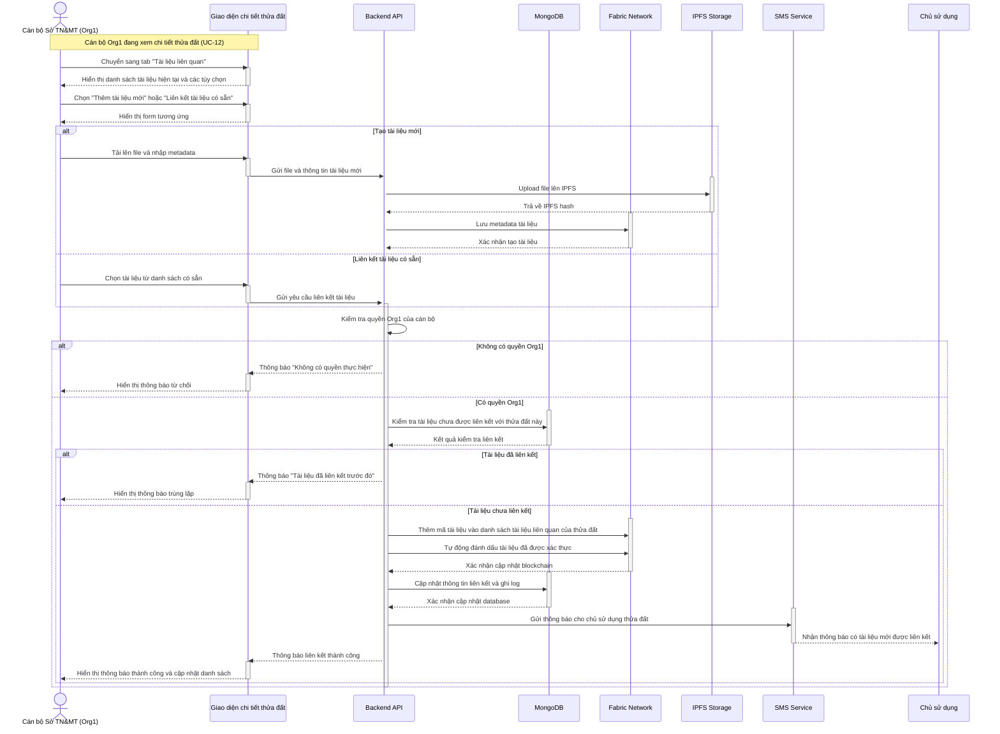
```mermaid
sequenceDiagram
    actor Officer as Cán bộ Sở TN&MT (Org1)
    participant UI as Giao diện chi tiết thửa đất
    participant API as Backend API
    participant DB as MongoDB
    participant Blockchain as Fabric Network
    participant IPFS as IPFS Storage
    participant SMS as SMS Service

    Note over Officer, UI: Cán bộ Org1 đang xem chi tiết thửa đất (UC-12)

    Officer ->> UI: Chuyển sang tab "Tài liệu liên quan"
    activate UI
    UI -->> Officer: Hiển thị danh sách tài liệu hiện tại và các tùy chọn
    deactivate UI

    Officer ->> UI: Chọn "Thêm tài liệu mới" hoặc "Liên kết tài liệu có sẵn"
    activate UI
    UI -->> Officer: Hiển thị form tương ứng
    deactivate UI

    alt Tạo tài liệu mới
        Officer ->> UI: Tải lên file và nhập metadata
        activate UI
        UI ->> API: Gửi file và thông tin tài liệu mới
        deactivate UI

        activate API
        activate IPFS
        API ->> IPFS: Upload file lên IPFS
        IPFS -->> API: Trả về IPFS hash
        deactivate IPFS

        activate Blockchain
        API ->> Blockchain: Lưu metadata tài liệu
        Blockchain -->> API: Xác nhận tạo tài liệu
        deactivate Blockchain
    else Liên kết tài liệu có sẵn
        Officer ->> UI: Chọn tài liệu từ danh sách có sẵn
        activate UI
        UI ->> API: Gửi yêu cầu liên kết tài liệu
        deactivate UI

        activate API
    end

    API ->> API: Kiểm tra quyền Org1 của cán bộ

    alt Không có quyền Org1
        API -->> UI: Thông báo "Không có quyền thực hiện"
        activate UI
        UI -->> Officer: Hiển thị thông báo từ chối
        deactivate UI
    else Có quyền Org1
        activate DB
        API ->> DB: Kiểm tra tài liệu chưa được liên kết với thửa đất này
        DB -->> API: Kết quả kiểm tra liên kết
        deactivate DB

        alt Tài liệu đã liên kết
            API -->> UI: Thông báo "Tài liệu đã liên kết trước đó"
            activate UI
            UI -->> Officer: Hiển thị thông báo trùng lặp
            deactivate UI
        else Tài liệu chưa liên kết
            activate Blockchain
            API ->> Blockchain: Thêm mã tài liệu vào danh sách tài liệu liên quan của thửa đất
            API ->> Blockchain: Tự động đánh dấu tài liệu đã được xác thực
            Blockchain -->> API: Xác nhận cập nhật blockchain
            deactivate Blockchain

            activate DB
            API ->> DB: Cập nhật thông tin liên kết và ghi log
            DB -->> API: Xác nhận cập nhật database
            deactivate DB

            activate SMS
            API ->> SMS: Gửi thông báo cho chủ sử dụng thửa đất
            SMS -->> Chủ sử dụng: Nhận thông báo có tài liệu mới được liên kết
            deactivate SMS

            API -->> UI: Thông báo liên kết thành công
            activate UI
            UI -->> Officer: Hiển thị thông báo thành công và cập nhật danh sách
            deactivate UI
        end
    end

    deactivate API
```

### Các trường hợp ngoại lệ
- Không có quyền Org1: Hệ thống từ chối truy cập
- Tài liệu không hợp lệ: Hệ thống thông báo lỗi
- Tài liệu đã liên kết: Hệ thống thông báo đã liên kết trước đó
- Lỗi lưu trữ IPFS: Hệ thống thông báo và cho phép thử lại

### Quy tắc nghiệp vụ
- Chỉ Org1 được phép liên kết tài liệu với thửa đất
- Liên kết xong tài liệu tự động ở trạng thái đã xác thực
- Một tài liệu có thể liên kết với nhiều thửa đất
- Liên kết được lưu bất biến và có timestamp

---

## UC-18: Liên kết tài liệu bổ sung cho giao dịch

### Mô tả ngắn gọn
Công dân đính kèm tài liệu bổ sung vào hồ sơ giao dịch theo yêu cầu của cán bộ Org2

### Sequence Diagram
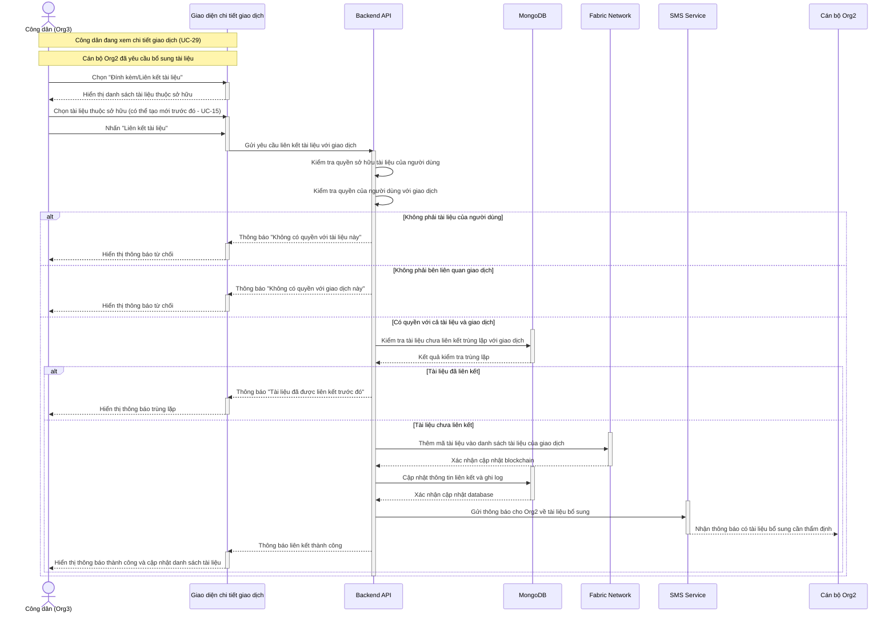
```mermaid
sequenceDiagram
    actor Citizen as Công dân (Org3)
    participant UI as Giao diện chi tiết giao dịch
    participant API as Backend API
    participant DB as MongoDB
    participant Blockchain as Fabric Network
    participant SMS as SMS Service

    Note over Citizen, UI: Công dân đang xem chi tiết giao dịch (UC-29)
    Note over Citizen, UI: Cán bộ Org2 đã yêu cầu bổ sung tài liệu

    Citizen ->> UI: Chọn "Đính kèm/Liên kết tài liệu"
    activate UI
    UI -->> Citizen: Hiển thị danh sách tài liệu thuộc sở hữu
    deactivate UI

    Citizen ->> UI: Chọn tài liệu thuộc sở hữu (có thể tạo mới trước đó - UC-15)
    activate UI
    Citizen ->> UI: Nhấn "Liên kết tài liệu"
    UI ->> API: Gửi yêu cầu liên kết tài liệu với giao dịch
    deactivate UI

    activate API
    API ->> API: Kiểm tra quyền sở hữu tài liệu của người dùng
    API ->> API: Kiểm tra quyền của người dùng với giao dịch

    alt Không phải tài liệu của người dùng
        API -->> UI: Thông báo "Không có quyền với tài liệu này"
        activate UI
        UI -->> Citizen: Hiển thị thông báo từ chối
        deactivate UI
    else Không phải bên liên quan giao dịch
        API -->> UI: Thông báo "Không có quyền với giao dịch này"
        activate UI
        UI -->> Citizen: Hiển thị thông báo từ chối
        deactivate UI
    else Có quyền với cả tài liệu và giao dịch
        activate DB
        API ->> DB: Kiểm tra tài liệu chưa liên kết trùng lặp với giao dịch
        DB -->> API: Kết quả kiểm tra trùng lặp
        deactivate DB

        alt Tài liệu đã liên kết
            API -->> UI: Thông báo "Tài liệu đã được liên kết trước đó"
            activate UI
            UI -->> Citizen: Hiển thị thông báo trùng lặp
            deactivate UI
        else Tài liệu chưa liên kết
            activate Blockchain
            API ->> Blockchain: Thêm mã tài liệu vào danh sách tài liệu của giao dịch
            Blockchain -->> API: Xác nhận cập nhật blockchain
            deactivate Blockchain

            activate DB
            API ->> DB: Cập nhật thông tin liên kết và ghi log
            DB -->> API: Xác nhận cập nhật database
            deactivate DB

            activate SMS
            API ->> SMS: Gửi thông báo cho Org2 về tài liệu bổ sung
            SMS -->> Cán bộ Org2: Nhận thông báo có tài liệu bổ sung cần thẩm định
            deactivate SMS

            API -->> UI: Thông báo liên kết thành công
            activate UI
            UI -->> Citizen: Hiển thị thông báo thành công và cập nhật danh sách tài liệu
            deactivate UI
        end
    end

    deactivate API
```

### Các trường hợp ngoại lệ
- Không phải tài liệu của người dùng: Hệ thống từ chối thao tác
- Không phải bên liên quan giao dịch: Hệ thống từ chối
- Tài liệu đã liên kết: Hệ thống thông báo trùng lặp
- Lỗi hệ thống: Hệ thống thông báo và cho phép thử lại

### Quy tắc nghiệp vụ
- Chỉ Org3 được phép liên kết tài liệu bổ sung vào giao dịch của mình
- Chức năng này chỉ được kích hoạt sau khi Org2 yêu cầu bổ sung tài liệu
- Tài liệu bổ sung có thể chưa được xác minh; Org2 sẽ xác minh các tài liệu bổ sung
- Mỗi liên kết được ghi log với timestamp

---

### **Task 3.3: Cập nhật và Xóa tài liệu**

---

## UC-19: Cập nhật tài liệu

### Mô tả ngắn gọn
Cập nhật thông tin mô tả và phân loại tài liệu

### Sequence Diagram
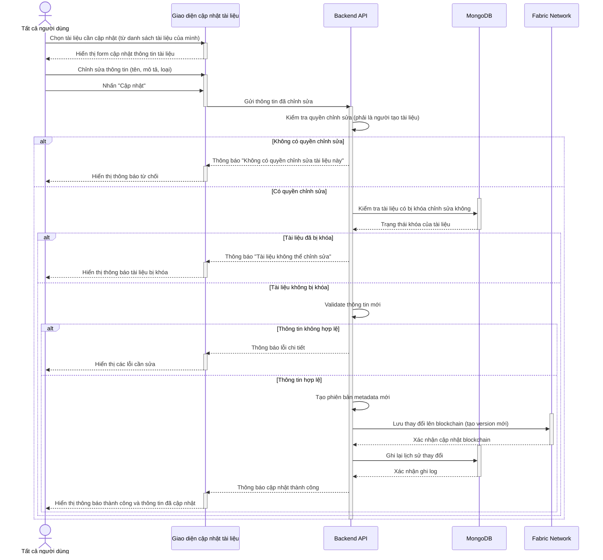
```mermaid
sequenceDiagram
    actor User as Tất cả người dùng
    participant UI as Giao diện cập nhật tài liệu
    participant API as Backend API
    participant DB as MongoDB
    participant Blockchain as Fabric Network

    User ->> UI: Chọn tài liệu cần cập nhật (từ danh sách tài liệu của mình)
    activate UI
    UI -->> User: Hiển thị form cập nhật thông tin tài liệu
    deactivate UI

    User ->> UI: Chỉnh sửa thông tin (tên, mô tả, loại)
    activate UI
    User ->> UI: Nhấn "Cập nhật"
    UI ->> API: Gửi thông tin đã chỉnh sửa
    deactivate UI

    activate API
    API ->> API: Kiểm tra quyền chỉnh sửa (phải là người tạo tài liệu)

    alt Không có quyền chỉnh sửa
        API -->> UI: Thông báo "Không có quyền chỉnh sửa tài liệu này"
        activate UI
        UI -->> User: Hiển thị thông báo từ chối
        deactivate UI
    else Có quyền chỉnh sửa
        activate DB
        API ->> DB: Kiểm tra tài liệu có bị khóa chỉnh sửa không
        DB -->> API: Trạng thái khóa của tài liệu
        deactivate DB

        alt Tài liệu đã bị khóa
            API -->> UI: Thông báo "Tài liệu không thể chỉnh sửa"
            activate UI
            UI -->> User: Hiển thị thông báo tài liệu bị khóa
            deactivate UI
        else Tài liệu không bị khóa
            API ->> API: Validate thông tin mới

            alt Thông tin không hợp lệ
                API -->> UI: Thông báo lỗi chi tiết
                activate UI
                UI -->> User: Hiển thị các lỗi cần sửa
                deactivate UI
            else Thông tin hợp lệ
                API ->> API: Tạo phiên bản metadata mới

                activate Blockchain
                API ->> Blockchain: Lưu thay đổi lên blockchain (tạo version mới)
                Blockchain -->> API: Xác nhận cập nhật blockchain
                deactivate Blockchain

                activate DB
                API ->> DB: Ghi lại lịch sử thay đổi
                DB -->> API: Xác nhận ghi log
                deactivate DB

                API -->> UI: Thông báo cập nhật thành công
                activate UI
                UI -->> User: Hiển thị thông báo thành công và thông tin đã cập nhật
                deactivate UI
            end
        end
    end

    deactivate API
```

### Các trường hợp ngoại lệ
- Không có quyền chỉnh sửa: Hệ thống từ chối thao tác
- Tài liệu đã bị khóa: Hệ thống thông báo "Tài liệu không thể chỉnh sửa"
- Thông tin không hợp lệ: Hệ thống yêu cầu sửa lại

### Quy tắc nghiệp vụ
- Không thể thay đổi file gốc, chỉ metadata
- Mọi thay đổi đều tạo version mới
- Lịch sử thay đổi được lưu vĩnh viễn
- Chỉ người upload (chủ sở hữu) mới được chỉnh sửa

---

## UC-20: Xóa tài liệu

### Mô tả ngắn gọn
Loại bỏ tài liệu không cần thiết hoặc sai sót

### Sequence Diagram
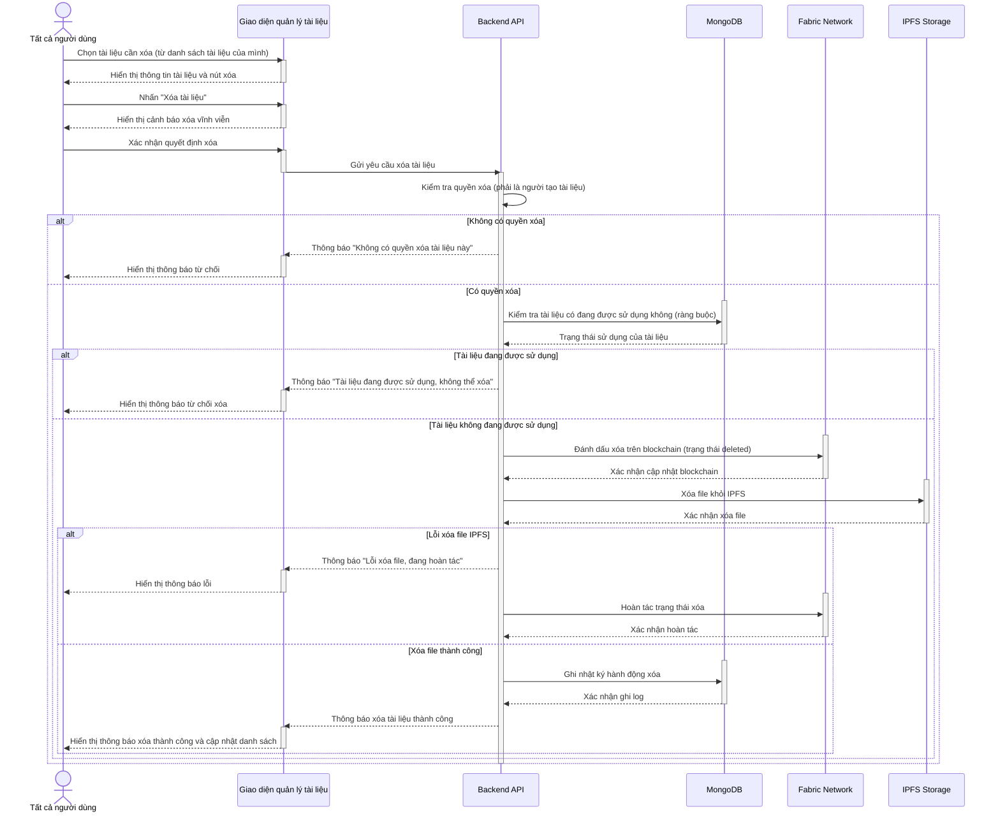
```mermaid
sequenceDiagram
    actor User as Tất cả người dùng
    participant UI as Giao diện quản lý tài liệu
    participant API as Backend API
    participant DB as MongoDB
    participant Blockchain as Fabric Network
    participant IPFS as IPFS Storage

    User ->> UI: Chọn tài liệu cần xóa (từ danh sách tài liệu của mình)
    activate UI
    UI -->> User: Hiển thị thông tin tài liệu và nút xóa
    deactivate UI

    User ->> UI: Nhấn "Xóa tài liệu"
    activate UI
    UI -->> User: Hiển thị cảnh báo xóa vĩnh viễn
    deactivate UI

    User ->> UI: Xác nhận quyết định xóa
    activate UI
    UI ->> API: Gửi yêu cầu xóa tài liệu
    deactivate UI

    activate API
    API ->> API: Kiểm tra quyền xóa (phải là người tạo tài liệu)

    alt Không có quyền xóa
        API -->> UI: Thông báo "Không có quyền xóa tài liệu này"
        activate UI
        UI -->> User: Hiển thị thông báo từ chối
        deactivate UI
    else Có quyền xóa
        activate DB
        API ->> DB: Kiểm tra tài liệu có đang được sử dụng không (ràng buộc)
        DB -->> API: Trạng thái sử dụng của tài liệu
        deactivate DB

        alt Tài liệu đang được sử dụng
            API -->> UI: Thông báo "Tài liệu đang được sử dụng, không thể xóa"
            activate UI
            UI -->> User: Hiển thị thông báo từ chối xóa
            deactivate UI
        else Tài liệu không đang được sử dụng
            activate Blockchain
            API ->> Blockchain: Đánh dấu xóa trên blockchain (trạng thái deleted)
            Blockchain -->> API: Xác nhận cập nhật blockchain
            deactivate Blockchain

            activate IPFS
            API ->> IPFS: Xóa file khỏi IPFS
            IPFS -->> API: Xác nhận xóa file
            deactivate IPFS

            alt Lỗi xóa file IPFS
                API -->> UI: Thông báo "Lỗi xóa file, đang hoàn tác"
                activate UI
                UI -->> User: Hiển thị thông báo lỗi
                deactivate UI

                activate Blockchain
                API ->> Blockchain: Hoàn tác trạng thái xóa
                Blockchain -->> API: Xác nhận hoàn tác
                deactivate Blockchain
            else Xóa file thành công
                activate DB
                API ->> DB: Ghi nhật ký hành động xóa
                DB -->> API: Xác nhận ghi log
                deactivate DB

                API -->> UI: Thông báo xóa tài liệu thành công
                activate UI
                UI -->> User: Hiển thị thông báo xóa thành công và cập nhật danh sách
                deactivate UI
            end
        end
    end

    deactivate API
```

### Các trường hợp ngoại lệ
- Tài liệu đang được sử dụng: Hệ thống từ chối xóa
- Không có quyền xóa: Hệ thống từ chối thao tác
- Lỗi xóa tệp: Hệ thống báo lỗi và hoàn tác

### Quy tắc nghiệp vụ
- Chỉ người upload (chủ sở hữu) mới được xóa tài liệu của mình
- Không thể xóa tài liệu đang liên kết với giao dịch đang xử lý
- Hành động xóa được ghi nhật ký vĩnh viễn

---

### **Task 3.4: Xác minh và Tìm kiếm tài liệu**

---

## UC-21: Xác minh tài liệu

### Mô tả ngắn gọn
Xác minh tính xác thực và hợp lệ của tài liệu, so khớp thông tin với dữ liệu blockchain

### Sequence Diagram
```mermaid
sequenceDiagram
    actor Officer as Cán bộ UBND cấp xã (Org2)
    participant UI as Giao diện xác minh tài liệu
    participant API as Backend API
    participant DB as MongoDB
    participant Blockchain as Fabric Network
    participant IPFS as IPFS Storage
    participant SMS as SMS Service

    Officer ->> UI: Truy cập "Xác minh tài liệu" > "Danh sách chờ xác minh"
    activate UI
    UI -->> Officer: Hiển thị danh sách tài liệu chờ xác minh
    deactivate UI

    Officer ->> UI: Chọn tài liệu cần xác minh
    activate UI
    UI -->> Officer: Hiển thị chi tiết tài liệu và form xác minh
    deactivate UI

    Officer ->> UI: Kiểm tra nội dung và tính hợp lệ
    Officer ->> UI: So khớp thông tin tài liệu với dữ liệu blockchain
    activate UI
    UI ->> API: Lấy dữ liệu blockchain để so khớp
    deactivate UI

    activate API
    activate Blockchain
    API ->> Blockchain: Truy vấn dữ liệu liên quan để so khớp
    Blockchain -->> API: Dữ liệu blockchain để đối chiếu
    deactivate Blockchain

    activate IPFS
    API ->> IPFS: Lấy nội dung file để kiểm tra
    IPFS -->> API: Nội dung file gốc
    deactivate IPFS

    API -->> UI: Dữ liệu để so khớp và nội dung file
    activate UI
    UI -->> Officer: Hiển thị thông tin so khớp
    deactivate UI

    Officer ->> UI: Nhập nhận xét và kết quả xác minh (Xác thực/Từ chối)
    activate UI
    Officer ->> UI: Nhấn "Hoàn thành xác minh"
    UI ->> API: Gửi kết quả xác minh
    deactivate UI

    alt Không có quyền xác minh
        API -->> UI: Thông báo "Không có quyền xác minh"
        activate UI
        UI -->> Officer: Hiển thị thông báo từ chối
        deactivate UI
    else Có quyền xác minh
        activate Blockchain
        API ->> Blockchain: Ghi nhận quyết định xác minh và cập nhật trạng thái
        Blockchain -->> API: Xác nhận cập nhật blockchain
        deactivate Blockchain

        activate DB
        API ->> DB: Ghi lại log xác minh với chi tiết
        DB -->> API: Xác nhận ghi log
        deactivate DB

        activate SMS
        API ->> SMS: Gửi thông báo kết quả cho người gửi tài liệu
        SMS -->> Người gửi: Nhận thông báo kết quả xác minh tài liệu
        deactivate SMS

        API -->> UI: Thông báo xác minh thành công
        activate UI
        UI -->> Officer: Hiển thị thông báo hoàn thành và cập nhật danh sách
        deactivate UI
    end

    deactivate API
```

### Các trường hợp ngoại lệ
- Tài liệu không hợp lệ: Hệ thống từ chối và yêu cầu sửa
- Thiếu thông tin: Hệ thống yêu cầu bổ sung
- Không có quyền xác minh: Hệ thống từ chối

### Quy tắc nghiệp vụ
- Chỉ cán bộ Org2 có quyền xác minh
- Mỗi tài liệu chỉ cần xác minh một lần
- Kết quả xác minh không thể thay đổi
- Phải so khớp thông tin với dữ liệu blockchain

---

## UC-22: Tìm kiếm tài liệu

### Mô tả ngắn gọn
Tra cứu tài liệu nhanh chóng và chính xác theo nhiều tiêu chí

### Sequence Diagram
```mermaid
sequenceDiagram
    actor User as Tất cả người dùng
    participant UI as Giao diện tìm kiếm tài liệu
    participant API as Backend API
    participant DB as MongoDB
    participant Blockchain as Fabric Network

    User ->> UI: Truy cập "Tìm kiếm tài liệu"
    activate UI
    UI -->> User: Hiển thị form tìm kiếm với các bộ lọc
    deactivate UI

    User ->> UI: Nhập tiêu chí tìm kiếm (tên, loại, người tạo)
    User ->> UI: Chọn bộ lọc (trạng thái, thửa đất, giao dịch, ngày tạo)
    activate UI
    User ->> UI: Nhấn "Tìm kiếm"
    UI ->> API: Gửi tiêu chí tìm kiếm
    deactivate UI

    activate API
    API ->> API: Validate tiêu chí tìm kiếm
    API ->> API: Xác định quyền truy cập của người dùng

    alt Tiêu chí tìm kiếm không hợp lệ
        API -->> UI: Thông báo "Tiêu chí tìm kiếm không hợp lệ"
        activate UI
        UI -->> User: Hiển thị thông báo lỗi và yêu cầu nhập lại
        deactivate UI
    else Tiêu chí hợp lệ
        activate Blockchain
        API ->> Blockchain: Tìm kiếm trong cơ sở dữ liệu blockchain
        Blockchain -->> API: Danh sách tài liệu phù hợp
        deactivate Blockchain

        API ->> API: Lọc kết quả theo quyền truy cập của người dùng
        API ->> API: Giới hạn kết quả tối đa 100 bản ghi

        alt Không tìm thấy kết quả
            API -->> UI: Thông báo "Không tìm thấy tài liệu phù hợp"
            activate UI
            UI -->> User: Hiển thị thông báo không có kết quả
            deactivate UI
        else Có kết quả
            API -->> UI: Danh sách tài liệu phù hợp
            activate UI
            UI -->> User: Hiển thị kết quả tìm kiếm với phân trang và sắp xếp
            deactivate UI

            User ->> UI: Chọn xem chi tiết tài liệu
            activate UI
            UI ->> API: Yêu cầu xem chi tiết tài liệu
            deactivate UI
        end
    end

    deactivate API
```

### Các trường hợp ngoại lệ
- Không tìm thấy kết quả: Hệ thống thông báo "Không tìm thấy tài liệu phù hợp"
- Tiêu chí không hợp lệ: Hệ thống yêu cầu nhập lại
- Lỗi truy vấn: Hệ thống thông báo lỗi

### Quy tắc nghiệp vụ
- Chỉ tìm được tài liệu có quyền truy cập
- Kết quả được giới hạn 100 bản ghi
- Hỗ trợ tìm kiếm mờ cho tên tài liệu
- Tích hợp các chức năng: xem theo thửa đất, xem theo giao dịch, xem theo trạng thái, xem theo loại, xem theo người tải lên

---

## UC-23: Xem lịch sử thay đổi tài liệu

```mermaid
sequenceDiagram
    actor User as Tất cả người dùng
    participant UI as Giao diện chi tiết tài liệu
    participant API as Backend API
    participant Blockchain as Fabric Network

    User ->> UI: Chọn tab "Lịch sử thay đổi"
    activate UI
    UI ->> API: Yêu cầu xem lịch sử thay đổi tài liệu
    deactivate UI

    activate API
    API ->> API: Kiểm tra quyền truy cập lịch sử tài liệu

    alt Không có quyền xem lịch sử
        API -->> UI: Thông báo "Không có quyền xem lịch sử"
        activate UI
        UI -->> User: Hiển thị thông báo từ chối truy cập
        deactivate UI
    else Có quyền xem
        activate Blockchain
        API ->> Blockchain: Truy vấn lịch sử thay đổi thông tin từ blockchain
        Blockchain -->> API: Danh sách các thay đổi với timestamp
        deactivate Blockchain

        alt Chưa có thay đổi nào
            API -->> UI: Thông báo "Chưa có thay đổi nào"
            activate UI
            UI -->> User: Hiển thị thông báo không có lịch sử
            deactivate UI
        else Có lịch sử thay đổi
            API -->> UI: Danh sách lịch sử thay đổi theo thời gian
            activate UI
            UI -->> User: Hiển thị timeline lịch sử thay đổi
            deactivate UI
        end
    end

    deactivate API
```

---

## 📋 **MODULE 4: QUẢN LÝ GIAO DỊCH**

### **Task 4.1: Tạo các loại giao dịch**

---

## UC-24: Tạo giao dịch chuyển nhượng

```mermaid
sequenceDiagram
    actor Owner as Chủ sử dụng đất (Org3)
    participant UI as Giao diện tạo giao dịch
    participant API as Backend API
    participant DB as MongoDB
    participant Blockchain as Fabric Network
    participant SMS as SMS Service

    Owner ->> UI: Truy cập "Quản lý giao dịch" > "Tạo giao dịch chuyển nhượng"
    activate UI
    UI -->> Owner: Hiển thị danh sách thửa đất thuộc sở hữu
    deactivate UI

    Owner ->> UI: Chọn thửa đất cần chuyển nhượng
    activate UI
    UI -->> Owner: Hiển thị form tạo giao dịch chuyển nhượng
    deactivate UI

    Owner ->> UI: Nhập thông tin bên nhận (CCCD)
    Owner ->> UI: Liên kết các tài liệu bắt buộc (UC-18)
    activate UI
    Owner ->> UI: Nhấn "Tạo giao dịch"
    UI ->> API: Gửi thông tin giao dịch chuyển nhượng
    deactivate UI

    activate API
    API ->> API: Kiểm tra quyền sở hữu thửa đất của người tạo

    activate Blockchain
    API ->> Blockchain: Kiểm tra trạng thái thửa đất trên blockchain
    Blockchain -->> API: Thông tin trạng thái thửa đất
    deactivate Blockchain

    activate Blockchain
    API ->> Blockchain: Kiểm tra bên nhận có tồn tại trong hệ thống
    Blockchain -->> API: Thông tin bên nhận
    deactivate Blockchain

    alt Không phải người sử dụng đất
        API -->> UI: Thông báo "Không có quyền chuyển nhượng thửa đất này"
        activate UI
        UI -->> Owner: Hiển thị thông báo từ chối
        deactivate UI
    else Thửa đất đang tranh chấp/thế chấp
        API -->> UI: Thông báo "Thửa đất không thể chuyển nhượng"
        activate UI
        UI -->> Owner: Hiển thị thông báo từ chối
        deactivate UI
    else Bên nhận không tồn tại
        API -->> UI: Thông báo "Bên nhận không có tài khoản trong hệ thống"
        activate UI
        UI -->> Owner: Hiển thị thông báo lỗi
        deactivate UI
    else Thửa đất đang trong giao dịch khác
        API -->> UI: Thông báo "Thửa đất đang trong giao dịch khác"
        activate UI
        UI -->> Owner: Hiển thị thông báo từ chối
        deactivate UI
    else Thông tin hợp lệ
        activate Blockchain
        API ->> Blockchain: Tạo giao dịch chuyển nhượng trên blockchain
        Blockchain -->> API: Xác nhận tạo giao dịch
        deactivate Blockchain

        activate Blockchain
        API ->> Blockchain: Cập nhật trạng thái thửa đất trên blockchain
        Blockchain -->> API: Xác nhận cập nhật trạng thái
        deactivate Blockchain

        activate DB
        API ->> DB: Ghi log giao dịch vào MongoDB
        DB -->> API: Xác nhận ghi log
        deactivate DB

        activate SMS
        API ->> SMS: Gửi thông báo cho bên nhận
        SMS -->> Bên nhận: Nhận thông báo có giao dịch chuyển nhượng
        deactivate SMS

        API ->> API: Tạo thông báo hệ thống cho cơ quan hành chính cấp xã (Org2)
        
        activate DB
        API ->> DB: Lưu thông báo vào hệ thống
        DB -->> API: Xác nhận lưu thông báo
        deactivate DB

        API -->> UI: Thông báo tạo giao dịch thành công
        activate UI
        UI -->> Owner: Hiển thị thông báo thành công và mã giao dịch
        deactivate UI
    end

    deactivate API
```

---

## UC-25: Tạo giao dịch tách thửa

```mermaid
sequenceDiagram
    actor Owner as Chủ sử dụng đất (Org3)
    participant UI as Giao diện tạo giao dịch
    participant API as Backend API
    participant DB as MongoDB
    participant Blockchain as Fabric Network
    participant SMS as SMS Service

    Owner ->> UI: Truy cập "Quản lý giao dịch" > "Tạo giao dịch tách thửa"
    activate UI
    UI -->> Owner: Hiển thị danh sách thửa đất thuộc sở hữu
    deactivate UI

    Owner ->> UI: Chọn thửa đất cần tách
    activate UI
    UI -->> Owner: Hiển thị form tạo giao dịch tách thửa
    deactivate UI

    Owner ->> UI: Nhập thông tin các thửa đất mới (diện tích, vị trí)
    Owner ->> UI: Liên kết tài liệu bắt buộc (bản đồ phân chia)
    activate UI
    Owner ->> UI: Nhấn "Tạo giao dịch"
    UI ->> API: Gửi thông tin giao dịch tách thửa
    deactivate UI

    activate API
    API ->> API: Kiểm tra quyền sở hữu thửa đất

    activate Blockchain
    API ->> Blockchain: Kiểm tra trạng thái và thông tin thửa đất trên blockchain
    Blockchain -->> API: Thông tin trạng thái và diện tích hiện tại
    deactivate Blockchain

    API ->> API: Validate thông tin thửa mới (tổng diện tích = diện tích gốc)

    alt Không phải người sử dụng đất
        API -->> UI: Thông báo "Không có quyền tách thửa đất này"
        activate UI
        UI -->> Owner: Hiển thị thông báo từ chối
        deactivate UI
    else Thửa đất đang tranh chấp/thế chấp
        API -->> UI: Thông báo "Thửa đất không thể tách"
        activate UI
        UI -->> Owner: Hiển thị thông báo từ chối
        deactivate UI
    else Thông tin diện tích không khớp
        API -->> UI: Thông báo "Tổng diện tích các thửa mới phải bằng diện tích gốc"
        activate UI
        UI -->> Owner: Hiển thị thông báo lỗi và yêu cầu sửa
        deactivate UI
    else Thông tin hợp lệ
        activate Blockchain
        API ->> Blockchain: Tạo giao dịch tách thửa trên blockchain
        Blockchain -->> API: Xác nhận tạo giao dịch
        deactivate Blockchain

        activate Blockchain
        API ->> Blockchain: Lưu thông tin thửa đất mới lên blockchain
        Blockchain -->> API: Xác nhận lưu dữ liệu
        deactivate Blockchain

        activate DB
        API ->> DB: Ghi log giao dịch vào MongoDB
        DB -->> API: Xác nhận ghi log
        deactivate DB

        API ->> API: Tạo thông báo hệ thống cho cơ quan hành chính cấp xã (Org2)
        
        activate DB
        API ->> DB: Lưu thông báo vào hệ thống
        DB -->> API: Xác nhận lưu thông báo
        deactivate DB

        API -->> UI: Thông báo tạo giao dịch thành công
        activate UI
        UI -->> Owner: Hiển thị thông báo thành công và mã giao dịch
        deactivate UI
    end

    deactivate API
```

---

## UC-26: Tạo giao dịch gộp thửa

```mermaid
sequenceDiagram
    actor Owner as Chủ sử dụng đất (Org3)
    participant UI as Giao diện tạo giao dịch
    participant API as Backend API
    participant DB as MongoDB
    participant Blockchain as Fabric Network

    Owner ->> UI: Truy cập "Quản lý giao dịch" > "Tạo giao dịch gộp thửa"
    activate UI
    UI -->> Owner: Hiển thị danh sách thửa đất thuộc sở hữu
    deactivate UI

    Owner ->> UI: Chọn các thửa đất cần gộp (tối thiểu 2 thửa)
    activate UI
    UI -->> Owner: Hiển thị form tạo giao dịch gộp thửa
    deactivate UI

    Owner ->> UI: Nhập thông tin thửa đất mới sau gộp
    Owner ->> UI: Liên kết tài liệu bắt buộc (bản đồ gộp)
    activate UI
    Owner ->> UI: Nhấn "Tạo giao dịch"
    UI ->> API: Gửi thông tin giao dịch gộp thửa
    deactivate UI

    activate API
    API ->> API: Kiểm tra quyền sở hữu tất cả thửa đất được chọn

    activate Blockchain
    API ->> Blockchain: Kiểm tra trạng thái tất cả thửa đất trên blockchain
    Blockchain -->> API: Thông tin trạng thái và diện tích các thửa
    deactivate Blockchain

    API ->> API: Validate diện tích thửa mới khớp với tổng diện tích các thửa gốc

    alt Không sở hữu tất cả thửa đất
        API -->> UI: Thông báo "Không có quyền gộp một hoặc nhiều thửa đất được chọn"
        activate UI
        UI -->> Owner: Hiển thị thông báo từ chối
        deactivate UI
    else Có thửa đất đang tranh chấp/thế chấp
        API -->> UI: Thông báo "Một hoặc nhiều thửa đất không thể gộp"
        activate UI
        UI -->> Owner: Hiển thị thông báo từ chối
        deactivate UI
    else Thửa đất không liền kề
        API -->> UI: Thông báo "Các thửa đất phải liền kề để có thể gộp"
        activate UI
        UI -->> Owner: Hiển thị thông báo từ chối
        deactivate UI
    else Diện tích không khớp
        API -->> UI: Thông báo "Diện tích thửa mới phải bằng tổng diện tích các thửa gốc"
        activate UI
        UI -->> Owner: Hiển thị thông báo lỗi
        deactivate UI
    else Thông tin hợp lệ
        activate Blockchain
        API ->> Blockchain: Tạo giao dịch gộp thửa trên blockchain
        Blockchain -->> API: Xác nhận tạo giao dịch
        deactivate Blockchain

        activate Blockchain
        API ->> Blockchain: Lưu thông tin thửa đất mới lên blockchain
        Blockchain -->> API: Xác nhận lưu dữ liệu
        deactivate Blockchain

        activate DB
        API ->> DB: Ghi log giao dịch vào MongoDB
        DB -->> API: Xác nhận ghi log
        deactivate DB

        API ->> API: Tạo thông báo hệ thống cho cơ quan hành chính cấp xã (Org2)
        
        activate DB
        API ->> DB: Lưu thông báo vào hệ thống
        DB -->> API: Xác nhận lưu thông báo
        deactivate DB

        API -->> UI: Thông báo tạo giao dịch thành công
        activate UI
        UI -->> Owner: Hiển thị thông báo thành công và mã giao dịch
        deactivate UI
    end

    deactivate API
```

---

## UC-27: Tạo giao dịch đổi mục đích sử dụng

```mermaid
sequenceDiagram
    actor Owner as Chủ sử dụng đất (Org3)
    participant UI as Giao diện tạo giao dịch
    participant API as Backend API
    participant DB as MongoDB
    participant Blockchain as Fabric Network

    Owner ->> UI: Truy cập "Quản lý giao dịch" > "Tạo giao dịch đổi mục đích sử dụng"
    activate UI
    UI -->> Owner: Hiển thị danh sách thửa đất thuộc sở hữu
    deactivate UI

    Owner ->> UI: Chọn thửa đất cần đổi mục đích
    activate UI
    UI -->> Owner: Hiển thị form đổi mục đích với mục đích hiện tại
    deactivate UI

    Owner ->> UI: Chọn mục đích sử dụng mới từ danh sách cho phép
    Owner ->> UI: Nhập lý do và kế hoạch sử dụng
    Owner ->> UI: Liên kết tài liệu bắt buộc (kế hoạch sử dụng, giấy phép)
    activate UI
    Owner ->> UI: Nhấn "Tạo giao dịch"
    UI ->> API: Gửi thông tin đổi mục đích
    deactivate UI

    activate API
    API ->> API: Kiểm tra quyền sở hữu thửa đất

    activate Blockchain
    API ->> Blockchain: Kiểm tra trạng thái thửa đất và mục đích hiện tại trên blockchain
    Blockchain -->> API: Thông tin trạng thái và mục đích sử dụng
    deactivate Blockchain

    API ->> API: Kiểm tra mục đích mới phù hợp với quy hoạch vùng

    alt Không phải người sử dụng đất
        API -->> UI: Thông báo "Không có quyền đổi mục đích thửa đất này"
        activate UI
        UI -->> Owner: Hiển thị thông báo từ chối
        deactivate UI
    else Thửa đất đang tranh chấp/thế chấp
        API -->> UI: Thông báo "Thửa đất không thể đổi mục đích sử dụng"
        activate UI
        UI -->> Owner: Hiển thị thông báo từ chối
        deactivate UI
    else Mục đích không phù hợp quy hoạch
        API -->> UI: Thông báo "Mục đích sử dụng mới không phù hợp với quy hoạch vùng"
        activate UI
        UI -->> Owner: Hiển thị thông báo từ chối và gợi ý mục đích phù hợp
        deactivate UI
    else Thông tin hợp lệ
        activate Blockchain
        API ->> Blockchain: Tạo giao dịch đổi mục đích trên blockchain
        Blockchain -->> API: Xác nhận tạo giao dịch
        deactivate Blockchain

        activate DB
        API ->> DB: Ghi log giao dịch vào MongoDB
        DB -->> API: Xác nhận ghi log
        deactivate DB

        API ->> API: Tạo thông báo hệ thống cho cơ quan hành chính cấp xã (Org2)
        
        activate DB
        API ->> DB: Lưu thông báo vào hệ thống
        DB -->> API: Xác nhận lưu thông báo
        deactivate DB

        API -->> UI: Thông báo tạo giao dịch thành công
        activate UI
        UI -->> Owner: Hiển thị thông báo thành công và mã giao dịch
        deactivate UI
    end

    deactivate API
```

---

## UC-28: Tạo giao dịch cấp lại GCN

```mermaid
sequenceDiagram
    actor Owner as Chủ sử dụng đất (Org3)
    participant UI as Giao diện tạo giao dịch
    participant API as Backend API
    participant DB as MongoDB
    participant Blockchain as Fabric Network

    Owner ->> UI: Truy cập "Quản lý giao dịch" > "Tạo giao dịch cấp lại GCN"
    activate UI
    UI -->> Owner: Hiển thị danh sách thửa đất thuộc sở hữu có GCN
    deactivate UI

    Owner ->> UI: Chọn thửa đất cần cấp lại GCN
    activate UI
    UI -->> Owner: Hiển thị form cấp lại GCN với thông tin GCN hiện tại
    deactivate UI

    Owner ->> UI: Chọn lý do cấp lại (mất, hỏng, sai thông tin, thay đổi thông tin)
    Owner ->> UI: Nhập mô tả chi tiết tình huống
    Owner ->> UI: Liên kết tài liệu bắt buộc (tùy theo lý do)
    activate UI
    Owner ->> UI: Nhấn "Tạo giao dịch"
    UI ->> API: Gửi thông tin cấp lại GCN
    deactivate UI

    activate API
    API ->> API: Kiểm tra quyền sở hữu thửa đất

    activate Blockchain
    API ->> Blockchain: Kiểm tra trạng thái thửa đất và thông tin GCN hiện tại trên blockchain
    Blockchain -->> API: Thông tin trạng thái và GCN
    deactivate Blockchain

    activate Blockchain
    API ->> Blockchain: Kiểm tra yêu cầu cấp lại GCN trùng lặp (đang xử lý)
    Blockchain -->> API: Kết quả kiểm tra trùng lặp
    deactivate Blockchain

    alt Không phải người sử dụng đất
        API -->> UI: Thông báo "Không có quyền yêu cầu cấp lại GCN cho thửa đất này"
        activate UI
        UI -->> Owner: Hiển thị thông báo từ chối
        deactivate UI
    else Thửa đất không có GCN
        API -->> UI: Thông báo "Thửa đất chưa có GCN để cấp lại"
        activate UI
        UI -->> Owner: Hiển thị thông báo từ chối
        deactivate UI
    else Đã có yêu cầu đang xử lý
        API -->> UI: Thông báo "Đã có yêu cầu cấp lại GCN đang được xử lý"
        activate UI
        UI -->> Owner: Hiển thị thông báo và mã giao dịch đang xử lý
        deactivate UI
    else Thông tin hợp lệ
        activate Blockchain
        API ->> Blockchain: Tạo giao dịch cấp lại GCN trên blockchain
        Blockchain -->> API: Xác nhận tạo giao dịch
        deactivate Blockchain

        activate DB
        API ->> DB: Ghi log giao dịch vào MongoDB
        DB -->> API: Xác nhận ghi log
        deactivate DB

        API ->> API: Tạo thông báo hệ thống cho cơ quan hành chính cấp xã (Org2)
        
        activate DB
        API ->> DB: Lưu thông báo vào hệ thống
        DB -->> API: Xác nhận lưu thông báo
        deactivate DB

        API -->> UI: Thông báo tạo giao dịch thành công
        activate UI
        UI -->> Owner: Hiển thị thông báo thành công và mã giao dịch
        deactivate UI
    end

    deactivate API
```

---
### **Task 4.2: Xem và xác nhận giao dịch**

---

## UC-29: Xem chi tiết giao dịch

```mermaid
sequenceDiagram
    actor User as Tất cả người dùng
    participant UI as Giao diện chi tiết giao dịch
    participant API as Backend API
    participant DB as MongoDB
    participant Blockchain as Fabric Network

    User ->> UI: Chọn giao dịch để xem chi tiết (từ danh sách hoặc tìm kiếm)
    activate UI
    UI ->> API: Yêu cầu thông tin chi tiết giao dịch
    deactivate UI

    activate API
    API ->> API: Kiểm tra quyền truy cập giao dịch

    alt Không có quyền xem giao dịch
        API -->> UI: Thông báo "Không có quyền xem giao dịch này"
        activate UI
        UI -->> User: Hiển thị thông báo từ chối truy cập
        deactivate UI
    else Có quyền xem
        activate Blockchain
        API ->> Blockchain: Tải thông tin giao dịch từ blockchain
        Blockchain -->> API: Thông tin chi tiết giao dịch và trạng thái
        deactivate Blockchain

        activate DB
        API ->> DB: Lấy thông tin bổ sung (log, nhận xét)
        DB -->> API: Thông tin bổ sung
        deactivate DB

        API -->> UI: Trả về thông tin đầy đủ
        activate UI
        UI -->> User: Hiển thị chi tiết giao dịch với các tab (Thông tin chính, Tài liệu, Lịch sử)
        deactivate UI

        User ->> UI: Chọn xem các tab khác nhau (Tài liệu, Lịch sử, Bên liên quan)
        activate UI
        UI ->> API: Lấy thông tin tab được chọn
        deactivate UI

        activate API
        activate Blockchain
        API ->> Blockchain: Truy vấn thông tin cụ thể theo tab
        Blockchain -->> API: Dữ liệu tab được yêu cầu
        deactivate Blockchain

        API -->> UI: Trả về dữ liệu
        activate UI
        UI -->> User: Hiển thị thông tin chi tiết theo tab
        deactivate UI
        deactivate API
    end

    deactivate API
```

---

## UC-30: Xác nhận nhận chuyển nhượng đất

```mermaid
sequenceDiagram
    actor Receiver as Bên nhận (Org3)
    participant UI as Giao diện xác nhận
    participant API as Backend API
    participant DB as MongoDB
    participant Blockchain as Fabric Network
    participant SMS as SMS Service

    Receiver ->> UI: Truy cập giao dịch chuyển nhượng (qua thông báo hoặc danh sách)
    activate UI
    UI ->> API: Lấy thông tin giao dịch chuyển nhượng
    deactivate UI

    activate API
    API ->> API: Kiểm tra quyền của bên nhận

    activate Blockchain
    API ->> Blockchain: Kiểm tra giao dịch hợp lệ và trạng thái trên blockchain
    Blockchain -->> API: Thông tin giao dịch và tính hợp lệ
    deactivate Blockchain

    alt Không phải bên nhận được chỉ định
        API -->> UI: Thông báo "Không có quyền xác nhận giao dịch này"
        activate UI
        UI -->> Receiver: Hiển thị thông báo từ chối
        deactivate UI
    else Giao dịch không hợp lệ hoặc đã hết hạn
        API -->> UI: Thông báo "Giao dịch không hợp lệ hoặc đã hết hạn"
        activate UI
        UI -->> Receiver: Hiển thị thông báo lỗi
        deactivate UI
    else Giao dịch hợp lệ
        API -->> UI: Hiển thị thông tin chi tiết giao dịch
        activate UI
        UI -->> Receiver: Hiển thị form xác nhận với thông tin thửa đất và điều kiện
        deactivate UI

        Receiver ->> UI: Xem xét thông tin và nhấn "Xác nhận nhận"
        activate UI
        UI ->> API: Gửi xác nhận nhận chuyển nhượng
        deactivate UI

        API ->> API: Kiểm tra lại quyền và tình trạng giao dịch

        activate Blockchain
        API ->> Blockchain: Cập nhật trạng thái giao dịch (đã xác nhận bởi bên nhận)
        Blockchain -->> API: Xác nhận cập nhật blockchain
        deactivate Blockchain

        activate DB
        API ->> DB: Ghi log thời điểm và thông tin xác nhận
        DB -->> API: Xác nhận ghi log
        deactivate DB

        activate SMS
        API ->> SMS: Thông báo cho bên chuyển nhượng về việc đã được xác nhận
        SMS -->> Bên chuyển nhượng: Nhận thông báo bên nhận đã xác nhận
        deactivate SMS

        API ->> API: Tạo thông báo hệ thống cho Org2 về giao dịch sẵn sàng xử lý
        
        activate DB
        API ->> DB: Lưu thông báo vào hệ thống
        DB -->> API: Xác nhận lưu thông báo
        deactivate DB

        API -->> UI: Thông báo xác nhận thành công
        activate UI
        UI -->> Receiver: Hiển thị thông báo xác nhận thành công và hướng dẫn bước tiếp theo
        deactivate UI
    end

    deactivate API
```

---
### **Task 4.3: Xử lý và phê duyệt giao dịch**

---

## UC-31: Xử lý hồ sơ giao dịch

```mermaid
sequenceDiagram
    actor Officer as Cán bộ UBND cấp xã (Org2)
    participant UI as Giao diện xử lý hồ sơ
    participant API as Backend API
    participant DB as MongoDB
    participant Blockchain as Fabric Network

    Officer ->> UI: Truy cập "Xử lý giao dịch" > "Danh sách giao dịch chờ xử lý"
    activate UI
    UI ->> API: Lấy danh sách giao dịch theo trạng thái chờ xử lý
    deactivate UI

    activate API
    API ->> API: Kiểm tra quyền xử lý của cán bộ

    activate Blockchain
    API ->> Blockchain: Truy vấn giao dịch theo trạng thái và khu vực quản lý
    Blockchain -->> API: Danh sách giao dịch cần xử lý
    deactivate Blockchain

    API -->> UI: Trả về danh sách giao dịch
    activate UI
    UI -->> Officer: Hiển thị danh sách giao dịch với thông tin tóm tắt
    deactivate UI

    Officer ->> UI: Chọn giao dịch cần xử lý
    activate UI
    UI ->> API: Lấy chi tiết giao dịch và hồ sơ đính kèm
    deactivate UI

    activate API
    activate Blockchain
    API ->> Blockchain: Lấy thông tin chi tiết giao dịch và tài liệu từ blockchain
    Blockchain -->> API: Thông tin đầy đủ giao dịch
    deactivate Blockchain

    API -->> UI: Hiển thị thông tin đầy đủ và form xử lý
    activate UI
    UI -->> Officer: Hiển thị thông tin giao dịch, tài liệu và tùy chọn xử lý
    deactivate UI

    Officer ->> UI: Kiểm tra hồ sơ và chọn hành động (Xác nhận/Yêu cầu bổ sung/Từ chối)
    Officer ->> UI: Nhập nhận xét và lý do (nếu từ chối hoặc yêu cầu bổ sung)
    activate UI
    Officer ->> UI: Nhấn "Xử lý hồ sơ"
    UI ->> API: Gửi kết quả xử lý và nhận xét
    deactivate UI

    API ->> API: Validate quyết định xử lý

    alt Quyết định xác nhận
        activate Blockchain
        API ->> Blockchain: Cập nhật trạng thái giao dịch (đã xác nhận bởi Org2)
        Blockchain -->> API: Xác nhận cập nhật
        deactivate Blockchain

        API ->> API: Tạo thông báo hệ thống cho Org1 về giao dịch sẵn sàng phê duyệt cuối
        
        activate DB
        API ->> DB: Lưu thông báo vào hệ thống
        DB -->> API: Xác nhận lưu thông báo
        deactivate DB
    else Quyết định yêu cầu bổ sung
        activate Blockchain
        API ->> Blockchain: Cập nhật trạng thái giao dịch (chờ bổ sung tài liệu)
        Blockchain -->> API: Xác nhận cập nhật
        deactivate Blockchain

        API ->> API: Tạo thông báo hệ thống yêu cầu bổ sung cho người tạo giao dịch
        
        activate DB
        API ->> DB: Lưu thông báo vào hệ thống
        DB -->> API: Xác nhận lưu thông báo
        deactivate DB
    else Quyết định từ chối
        activate Blockchain
        API ->> Blockchain: Cập nhật trạng thái giao dịch (bị từ chối)
        Blockchain -->> API: Xác nhận cập nhật
        deactivate Blockchain

        API ->> API: Tạo thông báo hệ thống từ chối với lý do cho người tạo giao dịch
        
        activate DB
        API ->> DB: Lưu thông báo vào hệ thống
        DB -->> API: Xác nhận lưu thông báo
        deactivate DB
    end

    activate DB
    API ->> DB: Ghi log lịch sử xử lý với timestamp và cán bộ xử lý
    DB -->> API: Xác nhận ghi log
    deactivate DB

    API -->> UI: Thông báo xử lý thành công
    activate UI
    UI -->> Officer: Hiển thị thông báo hoàn thành và cập nhật danh sách giao dịch
    deactivate UI

    deactivate API
```

---

## UC-32: Phê duyệt giao dịch chuyển nhượng

```mermaid
sequenceDiagram
    actor Officer as Cán bộ Sở TN&MT (Org1)
    participant UI as Giao diện phê duyệt
    participant API as Backend API
    participant DB as MongoDB
    participant Blockchain as Fabric Network
    participant SMS as SMS Service

    Officer ->> UI: Truy cập "Phê duyệt giao dịch" > "Giao dịch chuyển nhượng đã xác nhận"
    activate UI
    UI ->> API: Lấy danh sách giao dịch chuyển nhượng sẵn sàng phê duyệt
    deactivate UI

    activate API
    activate Blockchain
    API ->> Blockchain: Truy vấn giao dịch đã được Org2 xác nhận
    Blockchain -->> API: Danh sách giao dịch chuyển nhượng
    deactivate Blockchain

    API -->> UI: Trả về danh sách
    activate UI
    UI -->> Officer: Hiển thị danh sách giao dịch chuyển nhượng
    deactivate UI

    Officer ->> UI: Chọn giao dịch chuyển nhượng cần phê duyệt
    activate UI
    UI ->> API: Lấy thông tin chi tiết giao dịch chuyển nhượng
    deactivate UI

    activate Blockchain
    API ->> Blockchain: Kiểm tra trạng thái giao dịch và thông tin liên quan
    Blockchain -->> API: Thông tin chi tiết giao dịch
    deactivate Blockchain

    API -->> UI: Hiển thị thông tin chi tiết và form phê duyệt
    activate UI
    UI -->> Officer: Hiển thị thông tin giao dịch, thửa đất, bên liên quan và form phê duyệt
    deactivate UI

    Officer ->> UI: Kiểm tra toàn bộ hồ sơ và nhấn "Phê duyệt cuối cùng"
    activate UI
    UI ->> API: Gửi phê duyệt cuối cùng
    deactivate UI

    API ->> API: Kiểm tra quyền phê duyệt cuối cùng

    alt Không có quyền phê duyệt
        API -->> UI: Thông báo "Không có quyền phê duyệt giao dịch này"
        activate UI
        UI -->> Officer: Hiển thị thông báo từ chối
        deactivate UI
    else Có quyền phê duyệt
        activate Blockchain
        API ->> Blockchain: Thực hiện chuyển nhượng quyền sở hữu trên blockchain
        Blockchain -->> API: Xác nhận chuyển nhượng thành công
        deactivate Blockchain

        activate Blockchain
        API ->> Blockchain: Vô hiệu hóa GCN cũ và cập nhật trạng thái thửa đất
        Blockchain -->> API: Xác nhận cập nhật GCN và trạng thái
        deactivate Blockchain

        activate Blockchain
        API ->> Blockchain: Cập nhật quyền sở hữu cho bên nhận
        Blockchain -->> API: Xác nhận cập nhật quyền sở hữu
        deactivate Blockchain

        activate DB
        API ->> DB: Ghi log phê duyệt cuối cùng với timestamp
        DB -->> API: Xác nhận ghi log
        deactivate DB

        activate SMS
        API ->> SMS: Gửi thông báo hoàn thành chuyển nhượng cho bên chuyển nhượng
        SMS -->> Bên chuyển nhượng: Nhận thông báo chuyển nhượng hoàn thành
        deactivate SMS

        activate SMS
        API ->> SMS: Gửi thông báo hoàn thành chuyển nhượng cho bên nhận
        SMS -->> Bên nhận: Nhận thông báo đã trở thành chủ sử dụng đất
        deactivate SMS

        API -->> UI: Thông báo phê duyệt thành công
        activate UI
        UI -->> Officer: Hiển thị thông báo hoàn thành giao dịch chuyển nhượng
        deactivate UI
    end

    deactivate API
```

---

## UC-33: Phê duyệt giao dịch tách thửa

```mermaid
sequenceDiagram
    actor Officer as Cán bộ Sở TN&MT (Org1)
    participant UI as Giao diện phê duyệt
    participant API as Backend API
    participant DB as MongoDB
    participant Blockchain as Fabric Network
    participant SMS as SMS Service

    Officer ->> UI: Truy cập giao dịch tách thửa đã xác nhận
    activate UI
    UI ->> API: Lấy thông tin giao dịch tách
    deactivate UI

    activate API
    activate Blockchain
    API ->> Blockchain: Kiểm tra thông tin kế hoạch tách từ blockchain
    Blockchain -->> API: Chi tiết kế hoạch tách thửa
    deactivate Blockchain

    API -->> UI: Hiển thị chi tiết kế hoạch
    activate UI
    UI -->> Officer: Hiển thị form phê duyệt với thông tin tách thửa
    deactivate UI

    Officer ->> UI: Kiểm tra và nhấn "Phê duyệt"
    activate UI
    UI ->> API: Gửi phê duyệt
    deactivate UI

    activate Blockchain
    API ->> Blockchain: Vô hiệu hóa thửa đất gốc trên blockchain
    Blockchain -->> API: Xác nhận vô hiệu hóa
    deactivate Blockchain

    activate Blockchain
    API ->> Blockchain: Tạo các thửa đất mới theo kế hoạch tách
    Blockchain -->> API: Xác nhận tạo thửa đất mới
    deactivate Blockchain

    activate Blockchain
    API ->> Blockchain: Cập nhật quyền sở hữu cho chủ sở hữu
    Blockchain -->> API: Xác nhận cập nhật quyền sở hữu
    deactivate Blockchain

    activate DB
    API ->> DB: Ghi log phê duyệt tách thửa
    DB -->> API: Xác nhận ghi log
    deactivate DB

    activate SMS
    API ->> SMS: Thông báo hoàn thành tách thửa cho chủ sở hữu
    SMS -->> Chủ sở hữu: Nhận thông báo tách thửa hoàn thành
    deactivate SMS

    API -->> UI: Thông báo phê duyệt thành công
    activate UI
    UI -->> Officer: Hiển thị kết quả phê duyệt tách thửa
    deactivate UI

    deactivate API
```

---

## UC-34: Phê duyệt giao dịch gộp thửa

```mermaid
sequenceDiagram
    actor Officer as Cán bộ Sở TN&MT (Org1)
    participant UI as Giao diện phê duyệt
    participant API as Backend API
    participant DB as MongoDB
    participant Blockchain as Fabric Network
    participant SMS as SMS Service

    Officer ->> UI: Truy cập giao dịch gộp thửa đã xác nhận
    activate UI
    UI ->> API: Lấy thông tin giao dịch gộp
    deactivate UI

    activate API
    activate Blockchain
    API ->> Blockchain: Kiểm tra thông tin kế hoạch gộp từ blockchain
    Blockchain -->> API: Chi tiết kế hoạch gộp thửa
    deactivate Blockchain

    API -->> UI: Hiển thị chi tiết kế hoạch
    activate UI
    UI -->> Officer: Hiển thị form phê duyệt với thông tin gộp thửa
    deactivate UI

    Officer ->> UI: Kiểm tra và nhấn "Phê duyệt"
    activate UI
    UI ->> API: Gửi phê duyệt
    deactivate UI

    activate Blockchain
    API ->> Blockchain: Vô hiệu hóa các thửa đất gốc trên blockchain
    Blockchain -->> API: Xác nhận vô hiệu hóa
    deactivate Blockchain

    activate Blockchain
    API ->> Blockchain: Tạo thửa đất mới sau gộp
    Blockchain -->> API: Xác nhận tạo thửa đất mới
    deactivate Blockchain

    activate Blockchain
    API ->> Blockchain: Cập nhật quyền sở hữu cho chủ sở hữu
    Blockchain -->> API: Xác nhận cập nhật quyền sở hữu
    deactivate Blockchain

    activate DB
    API ->> DB: Ghi log phê duyệt gộp thửa
    DB -->> API: Xác nhận ghi log
    deactivate DB

    activate SMS
    API ->> SMS: Thông báo hoàn thành gộp thửa cho chủ sở hữu
    SMS -->> Chủ sở hữu: Nhận thông báo gộp thửa hoàn thành
    deactivate SMS

    API -->> UI: Thông báo phê duyệt thành công
    activate UI
    UI -->> Officer: Hiển thị kết quả phê duyệt gộp thửa
    deactivate UI

    deactivate API
```

---

## UC-35: Phê duyệt giao dịch đổi mục đích

```mermaid
sequenceDiagram
    actor Officer as Cán bộ Sở TN&MT (Org1)
    participant UI as Giao diện phê duyệt
    participant API as Backend API
    participant DB as MongoDB
    participant Blockchain as Fabric Network
    participant SMS as SMS Service

    Officer ->> UI: Truy cập giao dịch đổi mục đích đã xác nhận
    activate UI
    UI ->> API: Lấy thông tin giao dịch
    deactivate UI

    activate API
    activate Blockchain
    API ->> Blockchain: Kiểm tra thông tin đổi mục đích từ blockchain
    Blockchain -->> API: Chi tiết yêu cầu đổi mục đích và lý do
    deactivate Blockchain

    API -->> UI: Hiển thị chi tiết và lý do
    activate UI
    UI -->> Officer: Hiển thị form phê duyệt với thông tin đổi mục đích
    deactivate UI

    Officer ->> UI: Kiểm tra và nhấn "Phê duyệt"
    activate UI
    UI ->> API: Gửi phê duyệt
    deactivate UI

    activate Blockchain
    API ->> Blockchain: Cập nhật mục đích sử dụng đất trên blockchain
    Blockchain -->> API: Xác nhận cập nhật mục đích
    deactivate Blockchain

    activate Blockchain
    API ->> Blockchain: Vô hiệu hóa GCN cũ (nếu có)
    Blockchain -->> API: Xác nhận vô hiệu hóa GCN
    deactivate Blockchain

    activate DB
    API ->> DB: Ghi log phê duyệt đổi mục đích
    DB -->> API: Xác nhận ghi log
    deactivate DB

    activate SMS
    API ->> SMS: Thông báo hoàn thành đổi mục đích cho chủ sở hữu
    SMS -->> Chủ sở hữu: Nhận thông báo đổi mục đích hoàn thành
    deactivate SMS

    API -->> UI: Thông báo phê duyệt thành công
    activate UI
    UI -->> Officer: Hiển thị kết quả phê duyệt
    deactivate UI

    deactivate API
```

---

## UC-36: Phê duyệt giao dịch cấp lại GCN

```mermaid
sequenceDiagram
    actor Officer as Cán bộ Sở TN&MT (Org1)
    participant UI as Giao diện phê duyệt
    participant API as Backend API
    participant DB as MongoDB
    participant Blockchain as Fabric Network
    participant IPFS as IPFS Storage
    participant SMS as SMS Service

    Officer ->> UI: Truy cập giao dịch cấp lại GCN đã xác nhận
    activate UI
    UI ->> API: Lấy thông tin giao dịch
    deactivate UI

    activate API
    activate Blockchain
    API ->> Blockchain: Kiểm tra lý do cấp lại từ blockchain
    Blockchain -->> API: Chi tiết lý do và thông tin GCN cũ
    deactivate Blockchain

    API -->> UI: Hiển thị chi tiết và lý do
    activate UI
    UI -->> Officer: Hiển thị form phê duyệt cấp lại GCN
    deactivate UI

    Officer ->> UI: Nhập thông tin GCN mới
    Officer ->> UI: Upload file GCN mới
    activate UI
    Officer ->> UI: Nhấn "Phê duyệt"
    UI ->> API: Gửi phê duyệt và file GCN
    deactivate UI

    activate IPFS
    API ->> IPFS: Upload file GCN mới lên IPFS
    IPFS -->> API: Hash của file GCN mới
    deactivate IPFS

    activate Blockchain
    API ->> Blockchain: Cập nhật thông tin GCN mới trên blockchain
    Blockchain -->> API: Xác nhận cập nhật GCN
    deactivate Blockchain

    activate DB
    API ->> DB: Ghi log phê duyệt cấp lại GCN
    DB -->> API: Xác nhận ghi log
    deactivate DB

    activate SMS
    API ->> SMS: Thông báo hoàn thành cấp lại GCN cho chủ sở hữu
    SMS -->> Chủ sở hữu: Nhận thông báo GCN mới đã được cấp
    deactivate SMS

    API -->> UI: Thông báo phê duyệt thành công
    activate UI
    UI -->> Officer: Hiển thị kết quả phê duyệt
    deactivate UI

    deactivate API
```

---

## UC-37: Từ chối giao dịch

```mermaid
sequenceDiagram
    actor Officer as Cán bộ Sở TN&MT (Org1)
    participant UI as Giao diện xử lý
    participant API as Backend API
    participant DB as MongoDB
    participant Blockchain as Fabric Network

    Officer ->> UI: Truy cập giao dịch cần từ chối
    activate UI
    UI ->> API: Lấy thông tin giao dịch
    deactivate UI

    activate API
    activate Blockchain
    API ->> Blockchain: Kiểm tra trạng thái giao dịch từ blockchain
    Blockchain -->> API: Thông tin chi tiết giao dịch
    deactivate Blockchain

    API -->> UI: Hiển thị thông tin chi tiết
    activate UI
    UI -->> Officer: Hiển thị form từ chối với thông tin giao dịch
    deactivate UI

    Officer ->> UI: Nhập lý do từ chối chi tiết
    activate UI
    Officer ->> UI: Nhấn "Từ chối giao dịch"
    UI ->> API: Gửi quyết định từ chối
    deactivate UI

    activate Blockchain
    API ->> Blockchain: Cập nhật trạng thái từ chối trên blockchain
    Blockchain -->> API: Xác nhận cập nhật trạng thái
    deactivate Blockchain

    activate DB
    API ->> DB: Ghi log lý do từ chối
    DB -->> API: Xác nhận ghi log
    deactivate DB

    API ->> API: Tạo thông báo hệ thống từ chối với lý do cho các bên liên quan
    
    activate DB
    API ->> DB: Lưu thông báo vào hệ thống
    DB -->> API: Xác nhận lưu thông báo
    deactivate DB

    API -->> UI: Thông báo từ chối thành công
    activate UI
    UI -->> Officer: Hiển thị kết quả từ chối
    deactivate UI

    deactivate API
```

---

## UC-38: Tìm kiếm giao dịch

```mermaid
sequenceDiagram
    actor User as Tất cả người dùng
    participant UI as Giao diện tìm kiếm giao dịch
    participant API as Backend API
    participant DB as MongoDB
    participant Blockchain as Fabric Network

    User ->> UI: Truy cập "Tìm kiếm giao dịch"
    activate UI
    UI -->> User: Hiển thị form tìm kiếm với các bộ lọc
    deactivate UI

    User ->> UI: Nhập tiêu chí tìm kiếm (mã giao dịch, loại, trạng thái)
    User ->> UI: Chọn bộ lọc (ngày tạo, người tạo, thửa đất liên quan)
    activate UI
    User ->> UI: Nhấn "Tìm kiếm"
    UI ->> API: Gửi tiêu chí tìm kiếm
    deactivate UI

    activate API
    API ->> API: Validate tiêu chí tìm kiếm
    API ->> API: Xác định quyền truy cập của người dùng

    alt Tiêu chí tìm kiếm không hợp lệ
        API -->> UI: Thông báo "Tiêu chí tìm kiếm không hợp lệ"
        activate UI
        UI -->> User: Hiển thị thông báo lỗi và yêu cầu nhập lại
        deactivate UI
    else Tiêu chí hợp lệ
        activate Blockchain
        API ->> Blockchain: Tìm kiếm giao dịch trong blockchain
        Blockchain -->> API: Danh sách giao dịch phù hợp
        deactivate Blockchain

        API ->> API: Lọc kết quả theo quyền truy cập của người dùng
        API ->> API: Giới hạn kết quả tối đa 100 bản ghi

        alt Không tìm thấy kết quả
            API -->> UI: Thông báo "Không tìm thấy giao dịch phù hợp"
            activate UI
            UI -->> User: Hiển thị thông báo không có kết quả
            deactivate UI
        else Có kết quả
            API -->> UI: Danh sách giao dịch phù hợp
            activate UI
            UI -->> User: Hiển thị kết quả tìm kiếm với phân trang và sắp xếp
            deactivate UI

            User ->> UI: Chọn xem chi tiết giao dịch
            activate UI
            UI ->> API: Yêu cầu chi tiết giao dịch
            deactivate UI
        end
    end

    deactivate API
```

---

## UC-39: Xem lịch sử thay đổi giao dịch

```mermaid
sequenceDiagram
    actor User as Tất cả người dùng
    participant UI as Giao diện chi tiết giao dịch
    participant API as Backend API
    participant Blockchain as Fabric Network

    User ->> UI: Chọn tab "Lịch sử thay đổi" (trong UC-29)
    activate UI
    UI ->> API: Yêu cầu xem lịch sử giao dịch
    deactivate UI

    activate API
    API ->> API: Kiểm tra quyền truy cập lịch sử

    alt Không có quyền xem lịch sử
        API -->> UI: Thông báo "Không có quyền xem lịch sử"
        activate UI
        UI -->> User: Hiển thị thông báo từ chối truy cập
        deactivate UI
    else Có quyền xem
        activate Blockchain
        API ->> Blockchain: Truy vấn lịch sử thay đổi từ blockchain
        Blockchain -->> API: Danh sách thay đổi với timestamp
        deactivate Blockchain

        alt Chưa có thay đổi nào
            API -->> UI: Thông báo "Chưa có thay đổi nào"
            activate UI
            UI -->> User: Hiển thị thông báo không có lịch sử
            deactivate UI
        else Có lịch sử thay đổi
            API -->> UI: Danh sách lịch sử thay đổi theo thời gian
            activate UI
            UI -->> User: Hiển thị timeline lịch sử thay đổi
            deactivate UI

            User ->> UI: Xem chi tiết từng thay đổi
            activate UI
            UI ->> API: Lấy chi tiết thay đổi cụ thể
            deactivate UI

            activate API
            activate Blockchain
            API ->> Blockchain: Truy vấn chi tiết thay đổi
            Blockchain -->> API: Thông tin chi tiết thay đổi
            deactivate Blockchain

            API -->> UI: Trả về thông tin
            activate UI
            UI -->> User: Hiển thị chi tiết thay đổi
            deactivate UI
            deactivate API
        end
    end

    deactivate API
```

---
