# Complete Use Case Sequence Diagrams
## Hệ thống Quản lý Đất đai Blockchain

---

## 📋 **MODULE 1: XÁC THỰC (AUTHENTICATION)**

### **Task 1.1: Đăng ký và Xác thực**

---

## UC-01: Đăng ký tài khoản công dân

### Mô tả ngắn gọn
Công dân đăng ký tài khoản mới với xác thực qua OTP

### Sequence Diagram
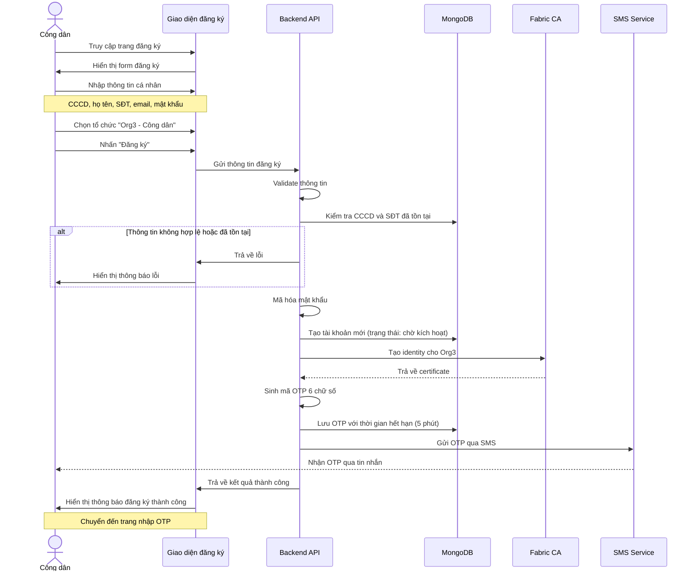
```mermaid
sequenceDiagram
    actor Citizen as Công dân
    participant UI as Giao diện đăng ký
    participant API as Backend API
    participant DB as MongoDB
    participant CA as Fabric CA
    participant SMS as SMS Service

    %% Bước 1: Nhập thông tin đăng ký
    Citizen ->> UI: Truy cập trang đăng ký
    UI ->> Citizen: Hiển thị form đăng ký
    
    Citizen ->> UI: Nhập thông tin cá nhân
    Note over Citizen, UI: CCCD, họ tên, SĐT, email, mật khẩu
    Citizen ->> UI: Chọn tổ chức "Org3 - Công dân"
    Citizen ->> UI: Nhấn "Đăng ký"

    %% Bước 2: Validate và tạo tài khoản
    UI ->> API: Gửi thông tin đăng ký
    API ->> API: Validate thông tin
    API ->> DB: Kiểm tra CCCD và SĐT đã tồn tại
    
    alt Thông tin không hợp lệ hoặc đã tồn tại
        API ->> UI: Trả về lỗi
        UI ->> Citizen: Hiển thị thông báo lỗi
    end

    API ->> API: Mã hóa mật khẩu
    API ->> DB: Tạo tài khoản mới (trạng thái: chờ kích hoạt)
    API ->> CA: Tạo identity cho Org3
    CA -->> API: Trả về certificate

    %% Bước 3: Gửi OTP
    API ->> API: Sinh mã OTP 6 chữ số
    API ->> DB: Lưu OTP với thời gian hết hạn (5 phút)
    API ->> SMS: Gửi OTP qua SMS
    SMS -->> Citizen: Nhận OTP qua tin nhắn

    %% Bước 4: Kết quả
    API ->> UI: Trả về kết quả thành công
    UI ->> Citizen: Hiển thị thông báo đăng ký thành công
    Note over Citizen, UI: Chuyển đến trang nhập OTP
```

### Các trường hợp ngoại lệ
- CCCD hoặc SĐT đã tồn tại trong hệ thống
- Thông tin không hợp lệ
- Lỗi gửi SMS

### Quy tắc nghiệp vụ
- CCCD phải đúng 12 chữ số, duy nhất trong hệ thống
- SĐT phải đúng định dạng, duy nhất trong hệ thống
- Mật khẩu tối thiểu 8 ký tự, bao gồm chữ hoa, chữ thường, số và ký tự đặc biệt
- OTP có hiệu lực trong 5 phút
- Tài khoản ban đầu có trạng thái "chờ kích hoạt"

---

## UC-02: Admin tạo tài khoản cán bộ

### Mô tả ngắn gọn
Admin tạo tài khoản cho cán bộ Org1 và Org2 với mật khẩu tạm

### Sequence Diagram
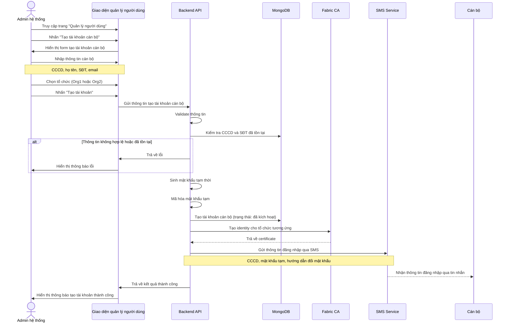
```mermaid
sequenceDiagram
    actor Admin as Admin hệ thống
    participant UI as Giao diện quản lý người dùng
    participant API as Backend API
    participant DB as MongoDB
    participant CA as Fabric CA
    participant SMS as SMS Service

    %% Bước 1: Nhập thông tin cán bộ
    Admin ->> UI: Truy cập trang "Quản lý người dùng"
    Admin ->> UI: Nhấn "Tạo tài khoản cán bộ"
    UI ->> Admin: Hiển thị form tạo tài khoản cán bộ
    
    Admin ->> UI: Nhập thông tin cán bộ
    Note over Admin, UI: CCCD, họ tên, SĐT, email
    Admin ->> UI: Chọn tổ chức (Org1 hoặc Org2)
    Admin ->> UI: Nhấn "Tạo tài khoản"

    %% Bước 2: Validate và tạo tài khoản
    UI ->> API: Gửi thông tin tạo tài khoản cán bộ
    API ->> API: Validate thông tin
    API ->> DB: Kiểm tra CCCD và SĐT đã tồn tại
    
    alt Thông tin không hợp lệ hoặc đã tồn tại
        API ->> UI: Trả về lỗi
        UI ->> Admin: Hiển thị thông báo lỗi
    end

    API ->> API: Sinh mật khẩu tạm thời
    API ->> API: Mã hóa mật khẩu tạm
    API ->> DB: Tạo tài khoản cán bộ (trạng thái: đã kích hoạt)
    API ->> CA: Tạo identity cho tổ chức tương ứng
    CA -->> API: Trả về certificate

    %% Bước 3: Gửi thông tin đăng nhập
    API ->> SMS: Gửi thông tin đăng nhập qua SMS
    Note over API, SMS: CCCD, mật khẩu tạm, hướng dẫn đổi mật khẩu
    SMS -->> Cán bộ: Nhận thông tin đăng nhập qua tin nhắn

    %% Bước 4: Kết quả
    API ->> UI: Trả về kết quả thành công
    UI ->> Admin: Hiển thị thông báo tạo tài khoản thành công
```

### Các trường hợp ngoại lệ
- CCCD hoặc SĐT đã tồn tại trong hệ thống
- Thông tin không hợp lệ
- Admin không có quyền tạo tài khoản
- Lỗi gửi SMS thông tin đăng nhập

### Quy tắc nghiệp vụ
- Chỉ Admin mới có quyền tạo tài khoản cho Org1 và Org2
- Tài khoản được kích hoạt ngay khi tạo
- Mật khẩu tạm có hiệu lực 7 ngày
- Cán bộ phải đổi mật khẩu ở lần đăng nhập đầu tiên
- Thông tin đăng nhập được gửi qua SMS

---

## UC-03: Xác minh mã OTP

### Mô tả ngắn gọn
Người dùng xác minh OTP để kích hoạt tài khoản

### Sequence Diagram
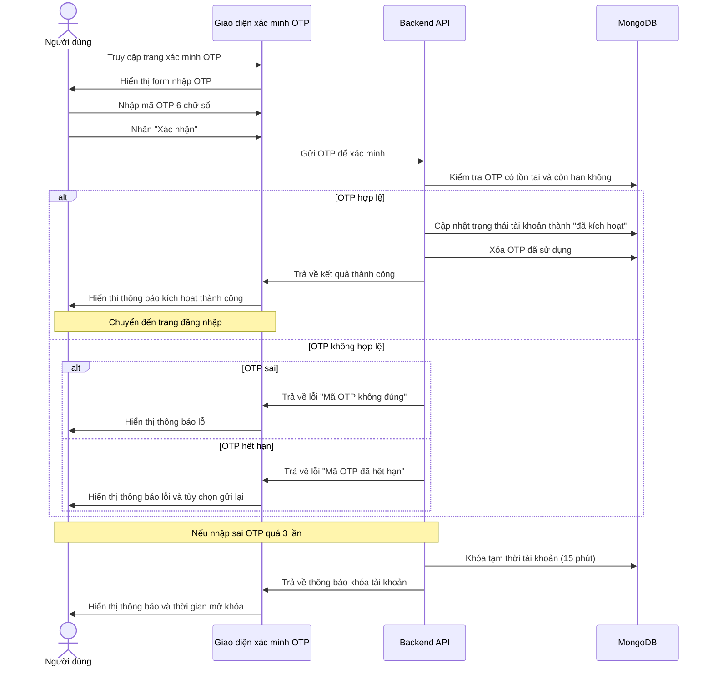
```mermaid
sequenceDiagram
    actor User as Người dùng
    participant UI as Giao diện xác minh OTP
    participant API as Backend API
    participant DB as MongoDB

    %% Bước 1: Nhập OTP
    User ->> UI: Truy cập trang xác minh OTP
    UI ->> User: Hiển thị form nhập OTP
    
    User ->> UI: Nhập mã OTP 6 chữ số
    User ->> UI: Nhấn "Xác nhận"

    %% Bước 2: Validate OTP
    UI ->> API: Gửi OTP để xác minh
    API ->> DB: Kiểm tra OTP có tồn tại và còn hạn không

    alt OTP hợp lệ
        API ->> DB: Cập nhật trạng thái tài khoản thành "đã kích hoạt"
        API ->> DB: Xóa OTP đã sử dụng
        API ->> UI: Trả về kết quả thành công
        UI ->> User: Hiển thị thông báo kích hoạt thành công
        Note over User, UI: Chuyển đến trang đăng nhập
    else OTP không hợp lệ
        alt OTP sai
            API ->> UI: Trả về lỗi "Mã OTP không đúng"
            UI ->> User: Hiển thị thông báo lỗi
        else OTP hết hạn
            API ->> UI: Trả về lỗi "Mã OTP đã hết hạn"
            UI ->> User: Hiển thị thông báo lỗi và tùy chọn gửi lại
        end
    end

    %% Bước 3: Xử lý nhập sai quá 3 lần
    Note over User, API: Nếu nhập sai OTP quá 3 lần
    API ->> DB: Khóa tạm thời tài khoản (15 phút)
    API ->> UI: Trả về thông báo khóa tài khoản
    UI ->> User: Hiển thị thông báo và thời gian mở khóa
```

### Các trường hợp ngoại lệ
- OTP sai hoặc không tồn tại
- OTP đã hết hạn (quá 5 phút)
- Nhập sai OTP quá 3 lần (khóa tài khoản 15 phút)
- Tài khoản đã được kích hoạt trước đó

### Quy tắc nghiệp vụ
- OTP có 6 chữ số
- OTP có hiệu lực trong 5 phút
- OTP chỉ được sử dụng một lần
- Tối đa 3 lần nhập sai OTP
- Sau khi kích hoạt, tài khoản có thể đăng nhập

---

### **Task 1.2: Đăng nhập và Quản lý phiên**

---

## UC-04: Đăng nhập hệ thống

### Mô tả ngắn gọn
Người dùng đăng nhập vào hệ thống với CCCD và mật khẩu

### Sequence Diagram
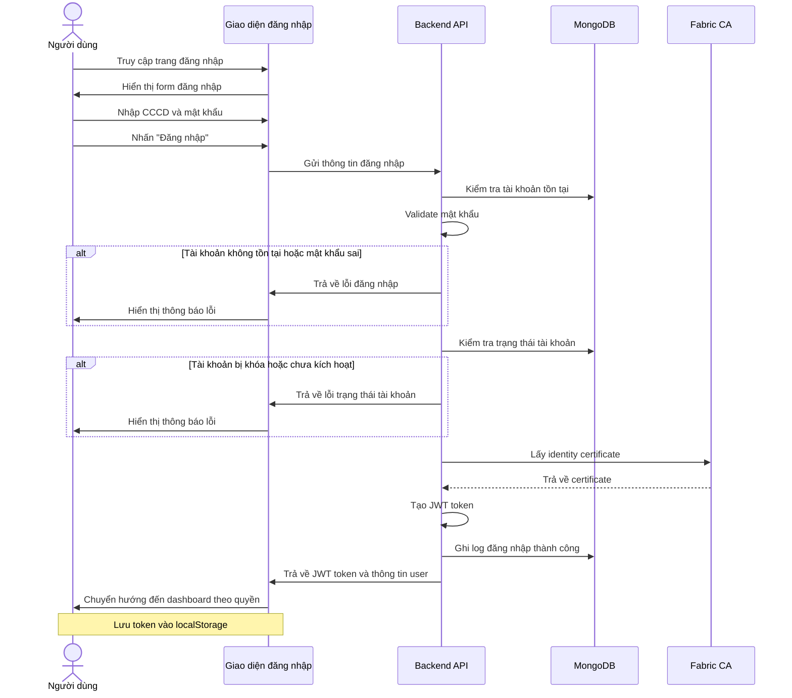
```mermaid
sequenceDiagram
    actor User as Người dùng
    participant UI as Giao diện đăng nhập
    participant API as Backend API
    participant DB as MongoDB
    participant CA as Fabric CA

    %% Bước 1: Nhập thông tin đăng nhập
    User ->> UI: Truy cập trang đăng nhập
    UI ->> User: Hiển thị form đăng nhập
    
    User ->> UI: Nhập CCCD và mật khẩu
    User ->> UI: Nhấn "Đăng nhập"

    %% Bước 2: Validate và xác thực
    UI ->> API: Gửi thông tin đăng nhập
    API ->> DB: Kiểm tra tài khoản tồn tại
    API ->> API: Validate mật khẩu
    
    alt Tài khoản không tồn tại hoặc mật khẩu sai
        API ->> UI: Trả về lỗi đăng nhập
        UI ->> User: Hiển thị thông báo lỗi
    end

    API ->> DB: Kiểm tra trạng thái tài khoản
    
    alt Tài khoản bị khóa hoặc chưa kích hoạt
        API ->> UI: Trả về lỗi trạng thái tài khoản
        UI ->> User: Hiển thị thông báo lỗi
    end

    %% Bước 3: Tạo phiên đăng nhập
    API ->> CA: Lấy identity certificate
    CA -->> API: Trả về certificate
    API ->> API: Tạo JWT token
    API ->> DB: Ghi log đăng nhập thành công

    %% Bước 4: Kết quả
    API ->> UI: Trả về JWT token và thông tin user
    UI ->> User: Chuyển hướng đến dashboard theo quyền
    Note over User, UI: Lưu token vào localStorage
```

### Các trường hợp ngoại lệ
- Tài khoản không tồn tại
- Mật khẩu không đúng
- Tài khoản bị khóa
- Tài khoản chưa kích hoạt
- Sai mật khẩu quá 5 lần (khóa 30 phút)

### Quy tắc nghiệp vụ
- Mỗi người chỉ được đăng nhập một phiên tại một thời điểm
- Phiên đăng nhập có hiệu lực 8 giờ
- Sai mật khẩu 5 lần sẽ khóa tài khoản 30 phút
- Tự động đăng xuất sau 8 giờ không hoạt động

---

## UC-05: Đăng xuất hệ thống

### Mô tả ngắn gọn
Người dùng đăng xuất khỏi hệ thống để kết thúc phiên làm việc

### Sequence Diagram
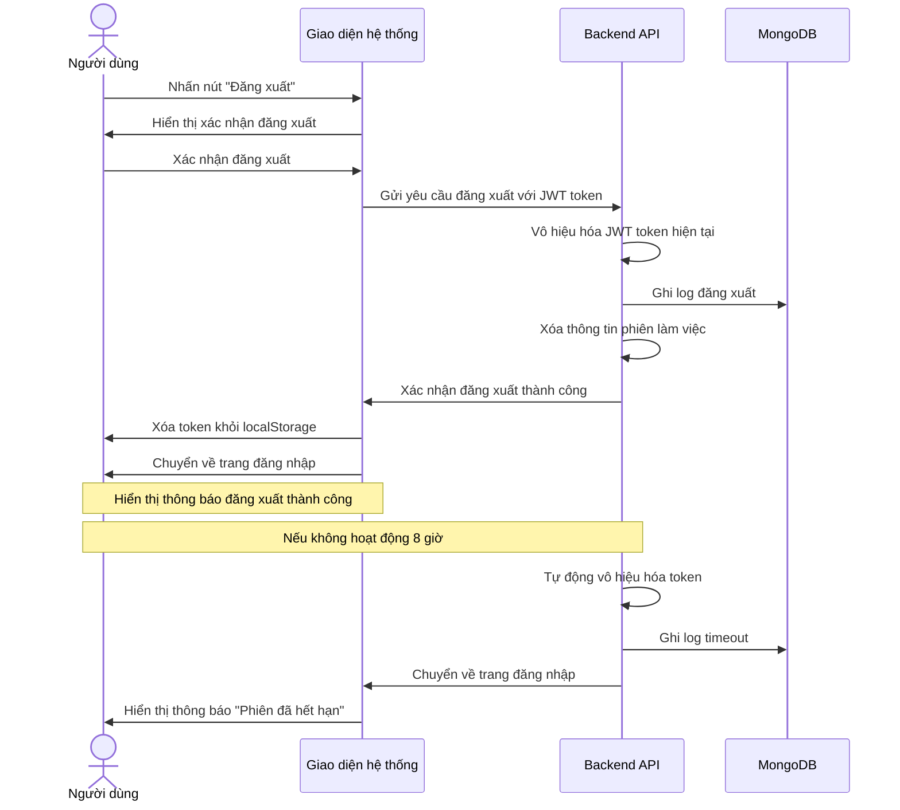
```mermaid
sequenceDiagram
    actor User as Người dùng
    participant UI as Giao diện hệ thống
    participant API as Backend API
    participant DB as MongoDB

    %% Bước 1: Yêu cầu đăng xuất
    User ->> UI: Nhấn nút "Đăng xuất"
    UI ->> User: Hiển thị xác nhận đăng xuất
    
    User ->> UI: Xác nhận đăng xuất

    %% Bước 2: Vô hiệu hóa phiên
    UI ->> API: Gửi yêu cầu đăng xuất với JWT token
    API ->> API: Vô hiệu hóa JWT token hiện tại
    API ->> DB: Ghi log đăng xuất

    %% Bước 3: Xóa thông tin phiên
    API ->> API: Xóa thông tin phiên làm việc
    API ->> UI: Xác nhận đăng xuất thành công

    %% Bước 4: Kết quả
    UI ->> User: Xóa token khỏi localStorage
    UI ->> User: Chuyển về trang đăng nhập
    Note over User, UI: Hiển thị thông báo đăng xuất thành công

    %% Bước 5: Xử lý timeout tự động
    Note over User, API: Nếu không hoạt động 8 giờ
    API ->> API: Tự động vô hiệu hóa token
    API ->> DB: Ghi log timeout
    API ->> UI: Chuyển về trang đăng nhập
    UI ->> User: Hiển thị thông báo "Phiên đã hết hạn"
```

### Các trường hợp ngoại lệ
- Mất kết nối mạng
- Token đã hết hạn
- Lỗi hệ thống

### Quy tắc nghiệp vụ
- Tự động đăng xuất sau 8 giờ không hoạt động
- Xóa hoàn toàn thông tin phiên trong bộ nhớ
- Không thể khôi phục phiên sau khi đăng xuất
- Mọi hoạt động đều được ghi log

---

### **Task 1.3: Quản lý mật khẩu**

---

## UC-06: Thay đổi mật khẩu

### Mô tả ngắn gọn
Người dùng đã đăng nhập thay đổi mật khẩu tài khoản

### Sequence Diagram
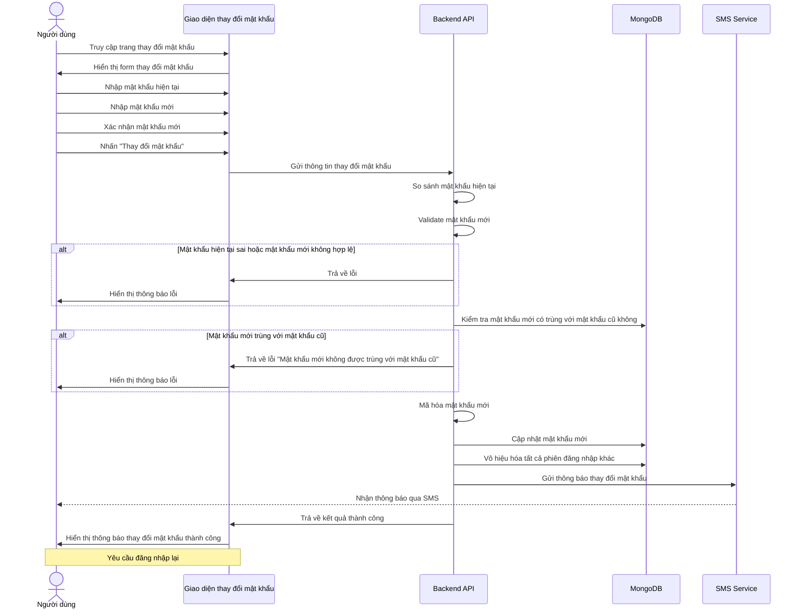
```mermaid
sequenceDiagram
    actor User as Người dùng
    participant UI as Giao diện thay đổi mật khẩu
    participant API as Backend API
    participant DB as MongoDB
    participant SMS as SMS Service

    %% Bước 1: Nhập thông tin thay đổi mật khẩu
    User ->> UI: Truy cập trang thay đổi mật khẩu
    UI ->> User: Hiển thị form thay đổi mật khẩu
    
    User ->> UI: Nhập mật khẩu hiện tại
    User ->> UI: Nhập mật khẩu mới
    User ->> UI: Xác nhận mật khẩu mới
    User ->> UI: Nhấn "Thay đổi mật khẩu"

    %% Bước 2: Validate và cập nhật
    UI ->> API: Gửi thông tin thay đổi mật khẩu
    API ->> API: So sánh mật khẩu hiện tại
    API ->> API: Validate mật khẩu mới
    
    alt Mật khẩu hiện tại sai hoặc mật khẩu mới không hợp lệ
        API ->> UI: Trả về lỗi
        UI ->> User: Hiển thị thông báo lỗi
    end

    API ->> DB: Kiểm tra mật khẩu mới có trùng với mật khẩu cũ không
    
    alt Mật khẩu mới trùng với mật khẩu cũ
        API ->> UI: Trả về lỗi "Mật khẩu mới không được trùng với mật khẩu cũ"
        UI ->> User: Hiển thị thông báo lỗi
    end

    %% Bước 3: Cập nhật mật khẩu
    API ->> API: Mã hóa mật khẩu mới
    API ->> DB: Cập nhật mật khẩu mới
    API ->> DB: Vô hiệu hóa tất cả phiên đăng nhập khác
    API ->> SMS: Gửi thông báo thay đổi mật khẩu
    SMS -->> User: Nhận thông báo qua SMS

    %% Bước 4: Kết quả
    API ->> UI: Trả về kết quả thành công
    UI ->> User: Hiển thị thông báo thay đổi mật khẩu thành công
    Note over User, UI: Yêu cầu đăng nhập lại
```

### Các trường hợp ngoại lệ
- Mật khẩu hiện tại không đúng
- Mật khẩu mới không đủ mạnh
- Mật khẩu mới trùng với mật khẩu cũ

### Quy tắc nghiệp vụ
- Mật khẩu mới phải khác mật khẩu cũ
- Độ dài tối thiểu 8 ký tự, có số và ký tự đặc biệt
- Thông báo qua SMS khi thay đổi mật khẩu
- Tất cả phiên khác bị đăng xuất

---

## UC-07: Quên mật khẩu

### Mô tả ngắn gọn
Người dùng quên mật khẩu và yêu cầu đặt lại

### Sequence Diagram
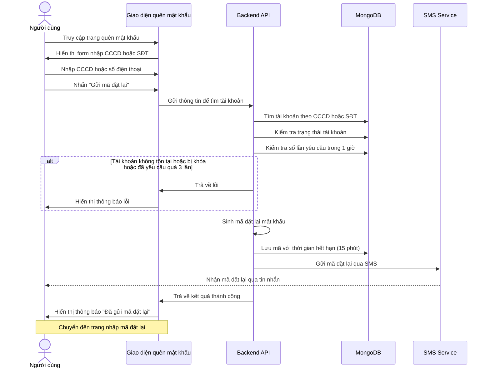
```mermaid
sequenceDiagram
    actor User as Người dùng
    participant UI as Giao diện quên mật khẩu
    participant API as Backend API
    participant DB as MongoDB
    participant SMS as SMS Service

    %% Bước 1: Nhập thông tin tìm tài khoản
    User ->> UI: Truy cập trang quên mật khẩu
    UI ->> User: Hiển thị form nhập CCCD hoặc SĐT
    
    User ->> UI: Nhập CCCD hoặc số điện thoại
    User ->> UI: Nhấn "Gửi mã đặt lại"

    %% Bước 2: Kiểm tra và tạo mã đặt lại
    UI ->> API: Gửi thông tin để tìm tài khoản
    API ->> DB: Tìm tài khoản theo CCCD hoặc SĐT
    API ->> DB: Kiểm tra trạng thái tài khoản
    API ->> DB: Kiểm tra số lần yêu cầu trong 1 giờ
    
    alt Tài khoản không tồn tại hoặc bị khóa hoặc đã yêu cầu quá 3 lần
        API ->> UI: Trả về lỗi
        UI ->> User: Hiển thị thông báo lỗi
    end

    %% Bước 3: Gửi mã đặt lại
    API ->> API: Sinh mã đặt lại mật khẩu
    API ->> DB: Lưu mã với thời gian hết hạn (15 phút)
    API ->> SMS: Gửi mã đặt lại qua SMS
    SMS -->> User: Nhận mã đặt lại qua tin nhắn

    %% Bước 4: Kết quả
    API ->> UI: Trả về kết quả thành công
    UI ->> User: Hiển thị thông báo "Đã gửi mã đặt lại"
    Note over User, UI: Chuyển đến trang nhập mã đặt lại
```

### Các trường hợp ngoại lệ
- CCCD/SĐT không tồn tại trong hệ thống
- Tài khoản bị khóa
- Đã yêu cầu quá 3 lần trong 1 giờ
- Lỗi gửi SMS

### Quy tắc nghiệp vụ
- Chỉ được yêu cầu đặt lại 3 lần trong 1 giờ
- Mã có hiệu lực trong 15 phút
- Tài khoản bị khóa không thể đặt lại mật khẩu
- Thông báo qua SMS đến số điện thoại đã đăng ký

---

## UC-08: Đặt lại mật khẩu

### Mô tả ngắn gọn
Người dùng đặt mật khẩu mới sau khi quên mật khẩu

### Sequence Diagram
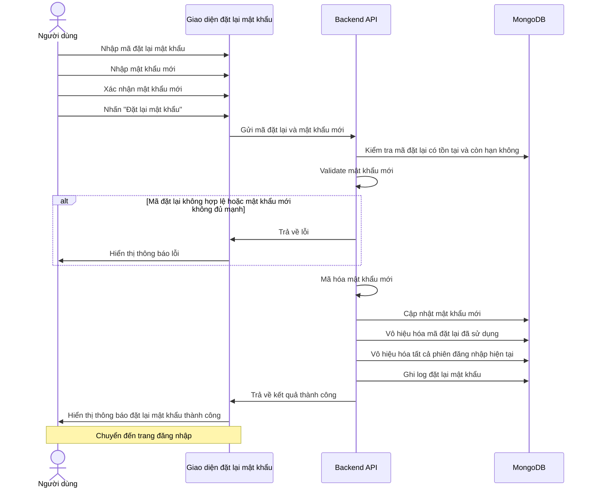
```mermaid
sequenceDiagram
    actor User as Người dùng
    participant UI as Giao diện đặt lại mật khẩu
    participant API as Backend API
    participant DB as MongoDB

    %% Bước 1: Nhập mã đặt lại và mật khẩu mới
    User ->> UI: Nhập mã đặt lại mật khẩu
    User ->> UI: Nhập mật khẩu mới
    User ->> UI: Xác nhận mật khẩu mới
    User ->> UI: Nhấn "Đặt lại mật khẩu"

    %% Bước 2: Validate và cập nhật
    UI ->> API: Gửi mã đặt lại và mật khẩu mới
    API ->> DB: Kiểm tra mã đặt lại có tồn tại và còn hạn không
    API ->> API: Validate mật khẩu mới
    
    alt Mã đặt lại không hợp lệ hoặc mật khẩu mới không đủ mạnh
        API ->> UI: Trả về lỗi
        UI ->> User: Hiển thị thông báo lỗi
    end

    %% Bước 3: Cập nhật mật khẩu
    API ->> API: Mã hóa mật khẩu mới
    API ->> DB: Cập nhật mật khẩu mới
    API ->> DB: Vô hiệu hóa mã đặt lại đã sử dụng
    API ->> DB: Vô hiệu hóa tất cả phiên đăng nhập hiện tại
    API ->> DB: Ghi log đặt lại mật khẩu

    %% Bước 4: Kết quả
    API ->> UI: Trả về kết quả thành công
    UI ->> User: Hiển thị thông báo đặt lại mật khẩu thành công
    Note over User, UI: Chuyển đến trang đăng nhập
```

### Các trường hợp ngoại lệ
- Mã đặt lại không tồn tại hoặc hết hạn
- Mật khẩu mới không đủ mạnh
- Mã đặt lại đã được sử dụng

### Quy tắc nghiệp vụ
- Mã chỉ được sử dụng một lần
- Mật khẩu mới phải khác mật khẩu cũ
- Sau khi đặt lại thành công, mã sẽ bị vô hiệu
- Tất cả phiên đăng nhập hiện tại bị đăng xuất

---

## UC-09: Gửi lại OTP

### Mô tả ngắn gọn
Gửi lại mã OTP khi không nhận được hoặc hết hạn

### Sequence Diagram
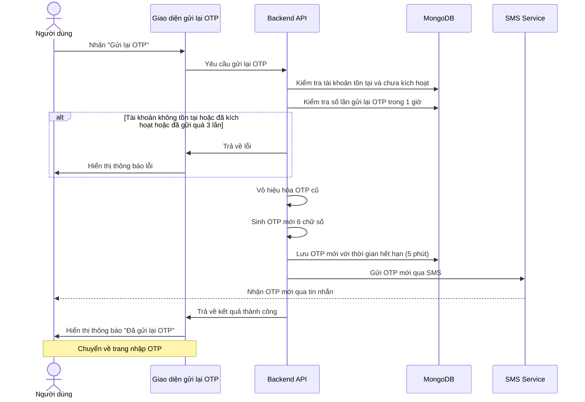
```mermaid
sequenceDiagram
    actor User as Người dùng
    participant UI as Giao diện gửi lại OTP
    participant API as Backend API
    participant DB as MongoDB
    participant SMS as SMS Service

    %% Bước 1: Yêu cầu gửi lại OTP
    User ->> UI: Nhấn "Gửi lại OTP"
    UI ->> API: Yêu cầu gửi lại OTP

    %% Bước 2: Kiểm tra điều kiện
    API ->> DB: Kiểm tra tài khoản tồn tại và chưa kích hoạt
    API ->> DB: Kiểm tra số lần gửi lại OTP trong 1 giờ
    
    alt Tài khoản không tồn tại hoặc đã kích hoạt hoặc đã gửi quá 3 lần
        API ->> UI: Trả về lỗi
        UI ->> User: Hiển thị thông báo lỗi
    end

    %% Bước 3: Gửi OTP mới
    API ->> API: Vô hiệu hóa OTP cũ
    API ->> API: Sinh OTP mới 6 chữ số
    API ->> DB: Lưu OTP mới với thời gian hết hạn (5 phút)
    API ->> SMS: Gửi OTP mới qua SMS
    SMS -->> User: Nhận OTP mới qua tin nhắn

    %% Bước 4: Kết quả
    API ->> UI: Trả về kết quả thành công
    UI ->> User: Hiển thị thông báo "Đã gửi lại OTP"
    Note over User, UI: Chuyển về trang nhập OTP
```

### Các trường hợp ngoại lệ
- Tài khoản không tồn tại
- Tài khoản đã được kích hoạt
- Đã gửi quá 3 lần trong 1 giờ
- Lỗi gửi SMS

### Quy tắc nghiệp vụ
- Chỉ gửi lại cho tài khoản chưa kích hoạt
- Tối đa 3 lần gửi lại trong 1 giờ
- Phải chờ 60 giây giữa các lần gửi
- OTP mới sẽ thay thế hoàn toàn OTP cũ

---

### **Tiến độ Module 1 - HOÀN THÀNH:**
- ✅ UC-01: Đăng ký tài khoản công dân
- ✅ UC-02: Admin tạo tài khoản cán bộ
- ✅ UC-03: Xác minh mã OTP
- ✅ UC-04: Đăng nhập hệ thống
- ✅ UC-05: Đăng xuất hệ thống
- ✅ UC-06: Thay đổi mật khẩu
- ✅ UC-07: Quên mật khẩu
- ✅ UC-08: Đặt lại mật khẩu
- ✅ UC-09: Gửi lại OTP

**🎉 Module 1 - XÁC THỰC (AUTHENTICATION) ĐÃ HOÀN THÀNH!**

**Tiếp theo: Module 2 - Quản lý người dùng (UC-10 đến UC-14)**

## 👥 **MODULE 2: QUẢN LÝ NGƯỜI DÙNG (ADMIN MANAGEMENT)**

### **Task 2.1: Xem và Quản lý người dùng**

---

## UC-10: Xem danh sách người dùng

### Mô tả ngắn gọn
Admin xem danh sách tất cả người dùng trong hệ thống với bộ lọc và phân trang

### Sequence Diagram
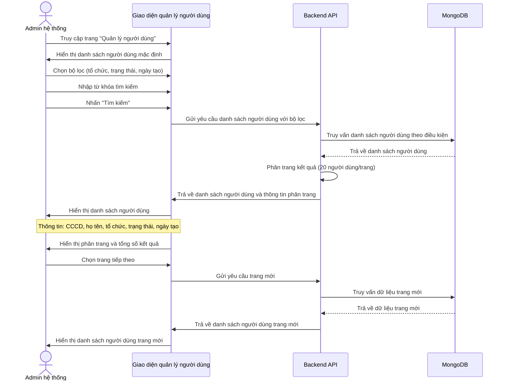
```mermaid
sequenceDiagram
    actor Admin as Admin hệ thống
    participant UI as Giao diện quản lý người dùng
    participant API as Backend API
    participant DB as MongoDB

    %% Bước 1: Truy cập trang quản lý người dùng
    Admin ->> UI: Truy cập trang "Quản lý người dùng"
    UI ->> Admin: Hiển thị danh sách người dùng mặc định

    %% Bước 2: Áp dụng bộ lọc (tùy chọn)
    Admin ->> UI: Chọn bộ lọc (tổ chức, trạng thái, ngày tạo)
    Admin ->> UI: Nhập từ khóa tìm kiếm
    Admin ->> UI: Nhấn "Tìm kiếm"

    %% Bước 3: Lấy dữ liệu
    UI ->> API: Gửi yêu cầu danh sách người dùng với bộ lọc
    API ->> DB: Truy vấn danh sách người dùng theo điều kiện
    DB -->> API: Trả về danh sách người dùng

    %% Bước 4: Phân trang
    API ->> API: Phân trang kết quả (20 người dùng/trang)
    API ->> UI: Trả về danh sách người dùng và thông tin phân trang

    %% Bước 5: Hiển thị kết quả
    UI ->> Admin: Hiển thị danh sách người dùng
    Note over Admin, UI: Thông tin: CCCD, họ tên, tổ chức, trạng thái, ngày tạo
    UI ->> Admin: Hiển thị phân trang và tổng số kết quả

    %% Bước 6: Chuyển trang (tùy chọn)
    Admin ->> UI: Chọn trang tiếp theo
    UI ->> API: Gửi yêu cầu trang mới
    API ->> DB: Truy vấn dữ liệu trang mới
    DB -->> API: Trả về dữ liệu trang mới
    API ->> UI: Trả về danh sách người dùng trang mới
    UI ->> Admin: Hiển thị danh sách người dùng trang mới
```

### Các trường hợp ngoại lệ
- Không có người dùng nào thỏa mãn điều kiện tìm kiếm
- Lỗi kết nối database
- Admin không có quyền xem danh sách người dùng

### Quy tắc nghiệp vụ
- Chỉ Admin mới có quyền xem danh sách người dùng
- Hiển thị tối đa 20 người dùng/trang
- Có thể lọc theo tổ chức, trạng thái, ngày tạo
- Có thể tìm kiếm theo CCCD, họ tên, email
- Hiển thị tổng số kết quả và thông tin phân trang

---

## UC-11: Xem thông tin người dùng

### Mô tả ngắn gọn
Admin xem chi tiết thông tin của một người dùng cụ thể

### Sequence Diagram
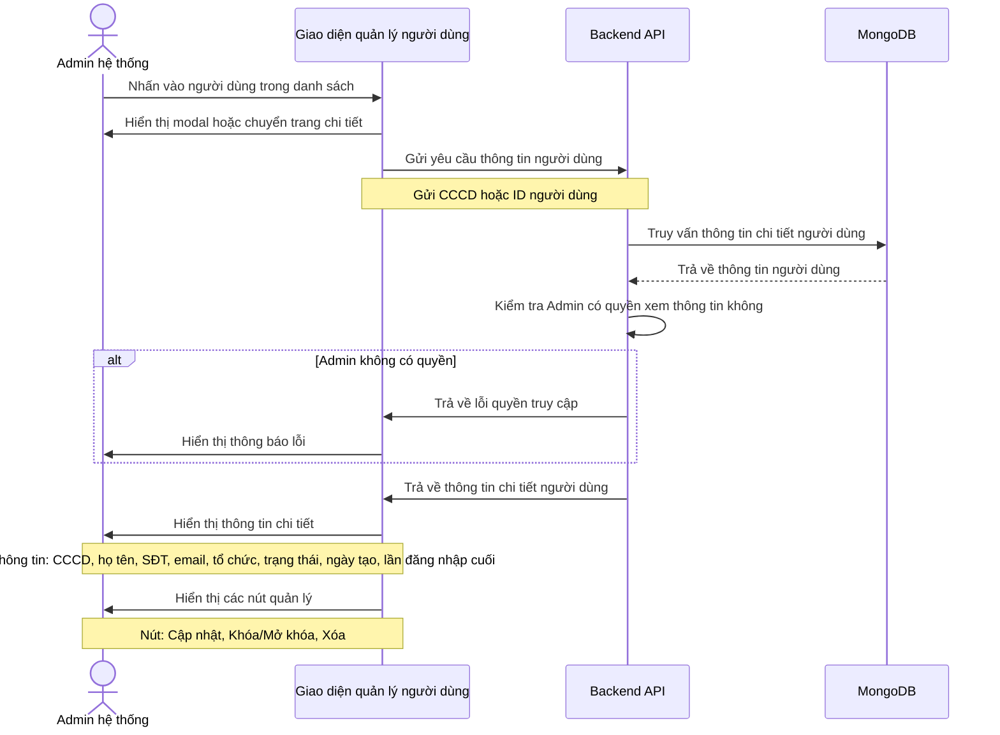
```mermaid
sequenceDiagram
    actor Admin as Admin hệ thống
    participant UI as Giao diện quản lý người dùng
    participant API as Backend API
    participant DB as MongoDB

    %% Bước 1: Chọn người dùng để xem
    Admin ->> UI: Nhấn vào người dùng trong danh sách
    UI ->> Admin: Hiển thị modal hoặc chuyển trang chi tiết

    %% Bước 2: Lấy thông tin chi tiết
    UI ->> API: Gửi yêu cầu thông tin người dùng
    Note over UI, API: Gửi CCCD hoặc ID người dùng
    API ->> DB: Truy vấn thông tin chi tiết người dùng
    DB -->> API: Trả về thông tin người dùng

    %% Bước 3: Kiểm tra quyền
    API ->> API: Kiểm tra Admin có quyền xem thông tin không
    
    alt Admin không có quyền
        API ->> UI: Trả về lỗi quyền truy cập
        UI ->> Admin: Hiển thị thông báo lỗi
    end

    %% Bước 4: Hiển thị thông tin
    API ->> UI: Trả về thông tin chi tiết người dùng
    UI ->> Admin: Hiển thị thông tin chi tiết
    Note over Admin, UI: Thông tin: CCCD, họ tên, SĐT, email, tổ chức, trạng thái, ngày tạo, lần đăng nhập cuối

    %% Bước 5: Hiển thị các tùy chọn quản lý
    UI ->> Admin: Hiển thị các nút quản lý
    Note over Admin, UI: Nút: Cập nhật, Khóa/Mở khóa, Xóa
```

### Các trường hợp ngoại lệ
- Người dùng không tồn tại
- Admin không có quyền xem thông tin người dùng
- Lỗi kết nối database

### Quy tắc nghiệp vụ
- Chỉ Admin mới có quyền xem thông tin chi tiết người dùng
- Hiển thị đầy đủ thông tin cá nhân và trạng thái tài khoản
- Hiển thị lịch sử hoạt động gần đây
- Cung cấp các tùy chọn quản lý tài khoản

---

## UC-12: Cập nhật thông tin người dùng

### Mô tả ngắn gọn
Admin cập nhật thông tin cá nhân của người dùng

### Sequence Diagram
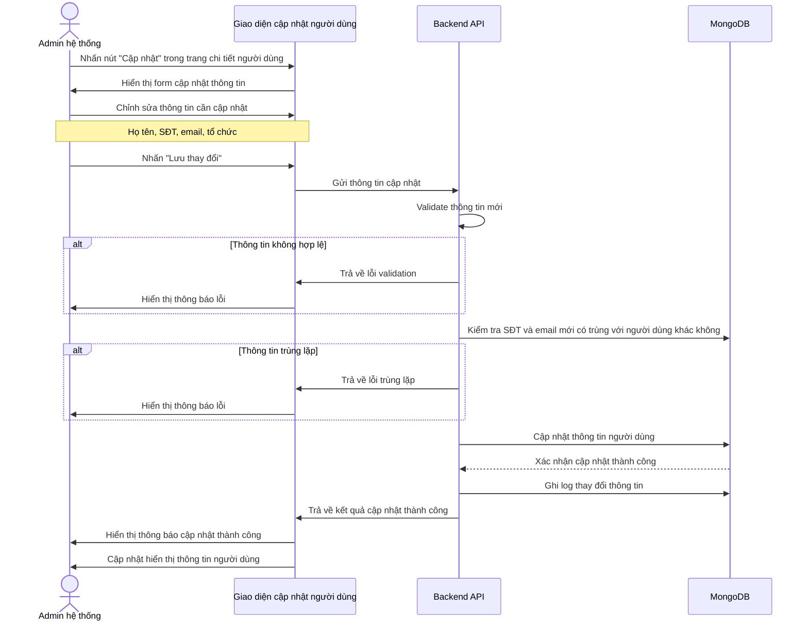
```mermaid
sequenceDiagram
    actor Admin as Admin hệ thống
    participant UI as Giao diện cập nhật người dùng
    participant API as Backend API
    participant DB as MongoDB

    %% Bước 1: Chọn cập nhật thông tin
    Admin ->> UI: Nhấn nút "Cập nhật" trong trang chi tiết người dùng
    UI ->> Admin: Hiển thị form cập nhật thông tin

    %% Bước 2: Nhập thông tin mới
    Admin ->> UI: Chỉnh sửa thông tin cần cập nhật
    Note over Admin, UI: Họ tên, SĐT, email, tổ chức
    Admin ->> UI: Nhấn "Lưu thay đổi"

    %% Bước 3: Validate thông tin
    UI ->> API: Gửi thông tin cập nhật
    API ->> API: Validate thông tin mới
    
    alt Thông tin không hợp lệ
        API ->> UI: Trả về lỗi validation
        UI ->> Admin: Hiển thị thông báo lỗi
    end

    %% Bước 4: Kiểm tra trùng lặp
    API ->> DB: Kiểm tra SĐT và email mới có trùng với người dùng khác không
    
    alt Thông tin trùng lặp
        API ->> UI: Trả về lỗi trùng lặp
        UI ->> Admin: Hiển thị thông báo lỗi
    end

    %% Bước 5: Cập nhật thông tin
    API ->> DB: Cập nhật thông tin người dùng
    DB -->> API: Xác nhận cập nhật thành công
    API ->> DB: Ghi log thay đổi thông tin

    %% Bước 6: Kết quả
    API ->> UI: Trả về kết quả cập nhật thành công
    UI ->> Admin: Hiển thị thông báo cập nhật thành công
    UI ->> Admin: Cập nhật hiển thị thông tin người dùng
```

### Các trường hợp ngoại lệ
- Thông tin không hợp lệ (SĐT, email)
- SĐT hoặc email trùng với người dùng khác
- Admin không có quyền cập nhật thông tin
- Lỗi cập nhật database

### Quy tắc nghiệp vụ
- Chỉ Admin mới có quyền cập nhật thông tin người dùng
- Không thể thay đổi CCCD (thông tin định danh)
- SĐT và email phải duy nhất trong hệ thống
- Ghi log mọi thay đổi thông tin người dùng
- Thông báo cho người dùng về thay đổi thông tin

---

## UC-13: Khóa/Mở khóa tài khoản

### Mô tả ngắn gọn
Admin khóa hoặc mở khóa tài khoản người dùng

### Sequence Diagram
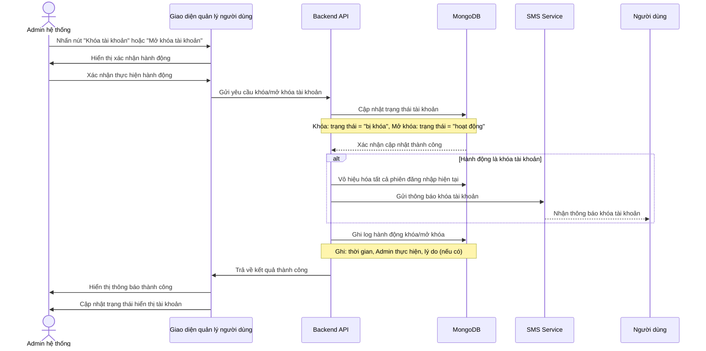
```mermaid
sequenceDiagram
    actor Admin as Admin hệ thống
    participant UI as Giao diện quản lý người dùng
    participant API as Backend API
    participant DB as MongoDB
    participant SMS as SMS Service

    %% Bước 1: Chọn hành động khóa/mở khóa
    Admin ->> UI: Nhấn nút "Khóa tài khoản" hoặc "Mở khóa tài khoản"
    UI ->> Admin: Hiển thị xác nhận hành động
    
    Admin ->> UI: Xác nhận thực hiện hành động

    %% Bước 2: Thực hiện khóa/mở khóa
    UI ->> API: Gửi yêu cầu khóa/mở khóa tài khoản
    API ->> DB: Cập nhật trạng thái tài khoản
    Note over API, DB: Khóa: trạng thái = "bị khóa", Mở khóa: trạng thái = "hoạt động"
    DB -->> API: Xác nhận cập nhật thành công

    %% Bước 3: Vô hiệu hóa phiên (nếu khóa)
    alt Hành động là khóa tài khoản
        API ->> DB: Vô hiệu hóa tất cả phiên đăng nhập hiện tại
        API ->> SMS: Gửi thông báo khóa tài khoản
        SMS -->> Người dùng: Nhận thông báo khóa tài khoản
    end

    %% Bước 4: Ghi log
    API ->> DB: Ghi log hành động khóa/mở khóa
    Note over API, DB: Ghi: thời gian, Admin thực hiện, lý do (nếu có)

    %% Bước 5: Kết quả
    API ->> UI: Trả về kết quả thành công
    UI ->> Admin: Hiển thị thông báo thành công
    UI ->> Admin: Cập nhật trạng thái hiển thị tài khoản
```

### Các trường hợp ngoại lệ
- Admin không có quyền khóa/mở khóa tài khoản
- Không thể khóa tài khoản Admin khác
- Lỗi cập nhật trạng thái
- Lỗi gửi thông báo SMS

### Quy tắc nghiệp vụ
- Chỉ Admin mới có quyền khóa/mở khóa tài khoản
- Không thể khóa tài khoản Admin khác
- Khi khóa tài khoản, tất cả phiên đăng nhập bị vô hiệu
- Thông báo cho người dùng về việc khóa/mở khóa tài khoản
- Ghi log đầy đủ mọi hành động khóa/mở khóa

---

## UC-14: Xóa tài khoản người dùng

### Mô tả ngắn gọn
Admin xóa tài khoản người dùng khỏi hệ thống

### Sequence Diagram
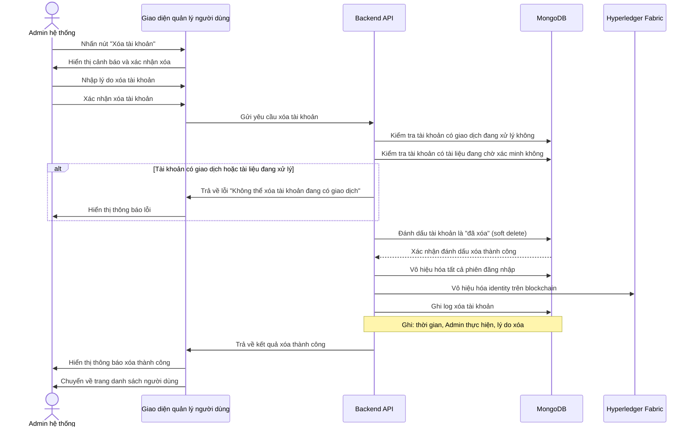
```mermaid
sequenceDiagram
    actor Admin as Admin hệ thống
    participant UI as Giao diện quản lý người dùng
    participant API as Backend API
    participant DB as MongoDB
    participant Blockchain as Hyperledger Fabric

    %% Bước 1: Chọn xóa tài khoản
    Admin ->> UI: Nhấn nút "Xóa tài khoản"
    UI ->> Admin: Hiển thị cảnh báo và xác nhận xóa
    
    Admin ->> UI: Nhập lý do xóa tài khoản
    Admin ->> UI: Xác nhận xóa tài khoản

    %% Bước 2: Kiểm tra điều kiện xóa
    UI ->> API: Gửi yêu cầu xóa tài khoản
    API ->> DB: Kiểm tra tài khoản có giao dịch đang xử lý không
    API ->> DB: Kiểm tra tài khoản có tài liệu đang chờ xác minh không
    
    alt Tài khoản có giao dịch hoặc tài liệu đang xử lý
        API ->> UI: Trả về lỗi "Không thể xóa tài khoản đang có giao dịch"
        UI ->> Admin: Hiển thị thông báo lỗi
    end

    %% Bước 3: Thực hiện xóa
    API ->> DB: Đánh dấu tài khoản là "đã xóa" (soft delete)
    DB -->> API: Xác nhận đánh dấu xóa thành công
    
    API ->> DB: Vô hiệu hóa tất cả phiên đăng nhập
    API ->> Blockchain: Vô hiệu hóa identity trên blockchain

    %% Bước 4: Ghi log
    API ->> DB: Ghi log xóa tài khoản
    Note over API, DB: Ghi: thời gian, Admin thực hiện, lý do xóa

    %% Bước 5: Kết quả
    API ->> UI: Trả về kết quả xóa thành công
    UI ->> Admin: Hiển thị thông báo xóa thành công
    UI ->> Admin: Chuyển về trang danh sách người dùng
```

### Các trường hợp ngoại lệ
- Tài khoản có giao dịch đang xử lý
- Tài khoản có tài liệu đang chờ xác minh
- Admin không có quyền xóa tài khoản
- Không thể xóa tài khoản Admin khác
- Lỗi xóa identity trên blockchain

### Quy tắc nghiệp vụ
- Chỉ Admin mới có quyền xóa tài khoản
- Không thể xóa tài khoản Admin khác
- Không thể xóa tài khoản có giao dịch đang xử lý
- Sử dụng soft delete (đánh dấu xóa, không xóa thực)
- Vô hiệu hóa identity trên blockchain
- Ghi log đầy đủ mọi hành động xóa tài khoản

---

### **Tiến độ Module 2 - HOÀN THÀNH:**
- ✅ UC-10: Xem danh sách người dùng
- ✅ UC-11: Xem thông tin người dùng
- ✅ UC-12: Cập nhật thông tin người dùng
- ✅ UC-13: Khóa/Mở khóa tài khoản
- ✅ UC-14: Xóa tài khoản người dùng

**🎉 Module 2 - QUẢN LÝ NGƯỜI DÙNG (ADMIN MANAGEMENT) ĐÃ HOÀN THÀNH!**

**Tiếp theo: Module 3 - Quản lý hồ sơ cá nhân (UC-15, UC-16)**

## 👤 **MODULE 3: QUẢN LÝ HỒ SƠ CÁ NHÂN (PROFILE MANAGEMENT)**

### **Task 3.1: Quản lý thông tin cá nhân**

---

## UC-15: Xem thông tin cá nhân

### Mô tả ngắn gọn
Người dùng xem thông tin cá nhân của mình

### Sequence Diagram
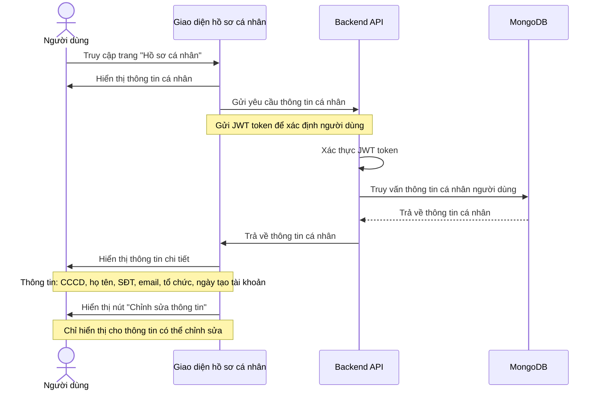
```mermaid
sequenceDiagram
    actor User as Người dùng
    participant UI as Giao diện hồ sơ cá nhân
    participant API as Backend API
    participant DB as MongoDB

    %% Bước 1: Truy cập trang hồ sơ cá nhân
    User ->> UI: Truy cập trang "Hồ sơ cá nhân"
    UI ->> User: Hiển thị thông tin cá nhân

    %% Bước 2: Lấy thông tin chi tiết
    UI ->> API: Gửi yêu cầu thông tin cá nhân
    Note over UI, API: Gửi JWT token để xác định người dùng
    API ->> API: Xác thực JWT token
    API ->> DB: Truy vấn thông tin cá nhân người dùng
    DB -->> API: Trả về thông tin cá nhân

    %% Bước 3: Hiển thị thông tin
    API ->> UI: Trả về thông tin cá nhân
    UI ->> User: Hiển thị thông tin chi tiết
    Note over User, UI: Thông tin: CCCD, họ tên, SĐT, email, tổ chức, ngày tạo tài khoản

    %% Bước 4: Hiển thị tùy chọn chỉnh sửa
    UI ->> User: Hiển thị nút "Chỉnh sửa thông tin"
    Note over User, UI: Chỉ hiển thị cho thông tin có thể chỉnh sửa
```

### Các trường hợp ngoại lệ
- Token không hợp lệ hoặc hết hạn
- Lỗi kết nối database
- Không tìm thấy thông tin người dùng

### Quy tắc nghiệp vụ
- Người dùng chỉ có thể xem thông tin cá nhân của mình
- CCCD không thể chỉnh sửa (thông tin định danh)
- Hiển thị đầy đủ thông tin cá nhân và trạng thái tài khoản
- Cung cấp tùy chọn chỉnh sửa cho thông tin có thể thay đổi

---

## UC-16: Cập nhật thông tin cá nhân

### Mô tả ngắn gọn
Người dùng cập nhật thông tin cá nhân của mình

### Sequence Diagram
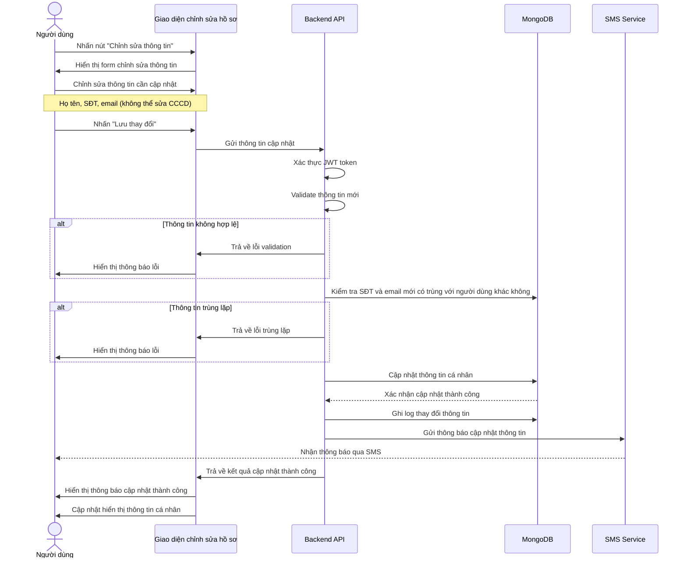
```mermaid
sequenceDiagram
    actor User as Người dùng
    participant UI as Giao diện chỉnh sửa hồ sơ
    participant API as Backend API
    participant DB as MongoDB
    participant SMS as SMS Service

    %% Bước 1: Chọn chỉnh sửa thông tin
    User ->> UI: Nhấn nút "Chỉnh sửa thông tin"
    UI ->> User: Hiển thị form chỉnh sửa thông tin

    %% Bước 2: Nhập thông tin mới
    User ->> UI: Chỉnh sửa thông tin cần cập nhật
    Note over User, UI: Họ tên, SĐT, email (không thể sửa CCCD)
    User ->> UI: Nhấn "Lưu thay đổi"

    %% Bước 3: Validate thông tin
    UI ->> API: Gửi thông tin cập nhật
    API ->> API: Xác thực JWT token
    API ->> API: Validate thông tin mới
    
    alt Thông tin không hợp lệ
        API ->> UI: Trả về lỗi validation
        UI ->> User: Hiển thị thông báo lỗi
    end

    %% Bước 4: Kiểm tra trùng lặp
    API ->> DB: Kiểm tra SĐT và email mới có trùng với người dùng khác không
    
    alt Thông tin trùng lặp
        API ->> UI: Trả về lỗi trùng lặp
        UI ->> User: Hiển thị thông báo lỗi
    end

    %% Bước 5: Cập nhật thông tin
    API ->> DB: Cập nhật thông tin cá nhân
    DB -->> API: Xác nhận cập nhật thành công
    API ->> DB: Ghi log thay đổi thông tin

    %% Bước 6: Thông báo cập nhật
    API ->> SMS: Gửi thông báo cập nhật thông tin
    SMS -->> User: Nhận thông báo qua SMS

    %% Bước 7: Kết quả
    API ->> UI: Trả về kết quả cập nhật thành công
    UI ->> User: Hiển thị thông báo cập nhật thành công
    UI ->> User: Cập nhật hiển thị thông tin cá nhân
```

### Các trường hợp ngoại lệ
- Thông tin không hợp lệ (SĐT, email)
- SĐT hoặc email trùng với người dùng khác
- Token không hợp lệ hoặc hết hạn
- Lỗi cập nhật database
- Lỗi gửi thông báo SMS

### Quy tắc nghiệp vụ
- Người dùng chỉ có thể cập nhật thông tin cá nhân của mình
- Không thể thay đổi CCCD (thông tin định danh)
- SĐT và email phải duy nhất trong hệ thống
- Ghi log mọi thay đổi thông tin cá nhân
- Thông báo qua SMS khi cập nhật thông tin thành công

---

### **Tiến độ Module 3 - HOÀN THÀNH:**
- ✅ UC-15: Xem thông tin cá nhân
- ✅ UC-16: Cập nhật thông tin cá nhân

**🎉 Module 3 - QUẢN LÝ HỒ SƠ CÁ NHÂN (PROFILE MANAGEMENT) ĐÃ HOÀN THÀNH!**

**Tiếp theo: Module 4 - Quản lý thửa đất (UC-17 đến UC-23)**

## 🏠 **MODULE 4: QUẢN LÝ THỬA ĐẤT (LAND MANAGEMENT)**

### **Task 4.1: Tạo và Cập nhật thửa đất**

---

## UC-17: Tạo thửa đất mới

### Mô tả ngắn gọn
Cán bộ Org1 hoặc Org2 tạo thửa đất mới trong hệ thống

### Sequence Diagram
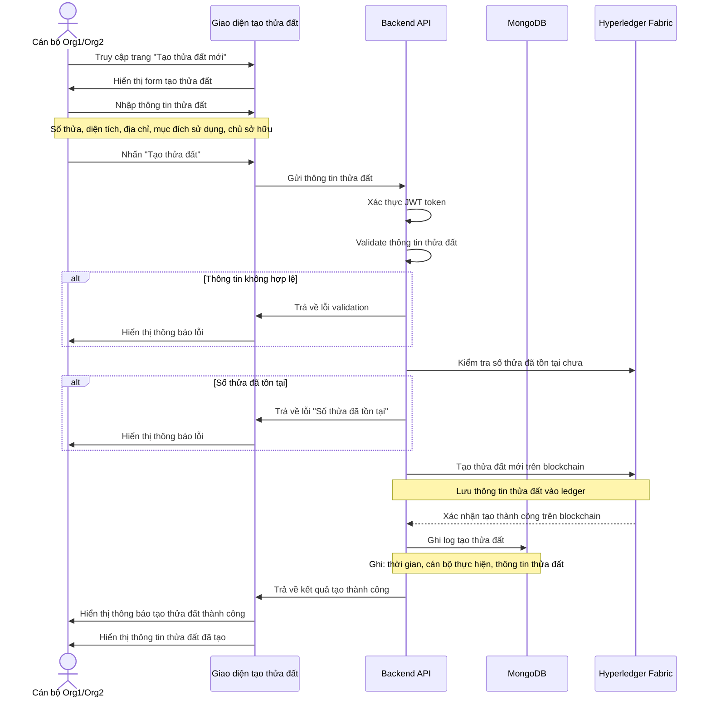
```mermaid
sequenceDiagram
    actor Staff as Cán bộ Org1/Org2
    participant UI as Giao diện tạo thửa đất
    participant API as Backend API
    participant DB as MongoDB
    participant Blockchain as Hyperledger Fabric

    %% Bước 1: Truy cập trang tạo thửa đất
    Staff ->> UI: Truy cập trang "Tạo thửa đất mới"
    UI ->> Staff: Hiển thị form tạo thửa đất

    %% Bước 2: Nhập thông tin thửa đất
    Staff ->> UI: Nhập thông tin thửa đất
    Note over Staff, UI: Số thửa, diện tích, địa chỉ, mục đích sử dụng, chủ sở hữu
    Staff ->> UI: Nhấn "Tạo thửa đất"

    %% Bước 3: Validate thông tin
    UI ->> API: Gửi thông tin thửa đất
    API ->> API: Xác thực JWT token
    API ->> API: Validate thông tin thửa đất
    
    alt Thông tin không hợp lệ
        API ->> UI: Trả về lỗi validation
        UI ->> Staff: Hiển thị thông báo lỗi
    end

    %% Bước 4: Kiểm tra trùng lặp
    API ->> Blockchain: Kiểm tra số thửa đã tồn tại chưa
    
    alt Số thửa đã tồn tại
        API ->> UI: Trả về lỗi "Số thửa đã tồn tại"
        UI ->> Staff: Hiển thị thông báo lỗi
    end

    %% Bước 5: Tạo thửa đất trên blockchain
    API ->> Blockchain: Tạo thửa đất mới trên blockchain
    Note over API, Blockchain: Lưu thông tin thửa đất vào ledger
    Blockchain -->> API: Xác nhận tạo thành công trên blockchain

    %% Bước 6: Ghi log
    API ->> DB: Ghi log tạo thửa đất
    Note over API, DB: Ghi: thời gian, cán bộ thực hiện, thông tin thửa đất

    %% Bước 7: Kết quả
    API ->> UI: Trả về kết quả tạo thành công
    UI ->> Staff: Hiển thị thông báo tạo thửa đất thành công
    UI ->> Staff: Hiển thị thông tin thửa đất đã tạo
```

### Các trường hợp ngoại lệ
- Thông tin thửa đất không hợp lệ
- Số thửa đã tồn tại trong hệ thống
- Chủ sở hữu không tồn tại trong hệ thống
- Lỗi tạo trên blockchain
- Cán bộ không có quyền tạo thửa đất

### Quy tắc nghiệp vụ
- Chỉ cán bộ Org1 và Org2 mới có quyền tạo thửa đất
- Số thửa phải duy nhất trong hệ thống
- Thông tin thửa đất được lưu trên blockchain
- Ghi log đầy đủ mọi thao tác tạo thửa đất
- Thông báo cho chủ sở hữu về thửa đất mới

---

## UC-18: Cập nhật thông tin thửa đất

### Mô tả ngắn gọn
Cán bộ cập nhật thông tin thửa đất khi có thay đổi

### Sequence Diagram
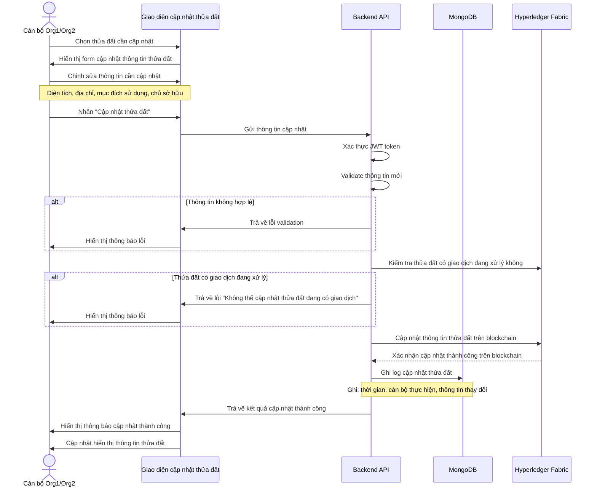
```mermaid
sequenceDiagram
    actor Staff as Cán bộ Org1/Org2
    participant UI as Giao diện cập nhật thửa đất
    participant API as Backend API
    participant DB as MongoDB
    participant Blockchain as Hyperledger Fabric

    %% Bước 1: Chọn thửa đất để cập nhật
    Staff ->> UI: Chọn thửa đất cần cập nhật
    UI ->> Staff: Hiển thị form cập nhật thông tin thửa đất

    %% Bước 2: Nhập thông tin mới
    Staff ->> UI: Chỉnh sửa thông tin cần cập nhật
    Note over Staff, UI: Diện tích, địa chỉ, mục đích sử dụng, chủ sở hữu
    Staff ->> UI: Nhấn "Cập nhật thửa đất"

    %% Bước 3: Validate thông tin
    UI ->> API: Gửi thông tin cập nhật
    API ->> API: Xác thực JWT token
    API ->> API: Validate thông tin mới
    
    alt Thông tin không hợp lệ
        API ->> UI: Trả về lỗi validation
        UI ->> Staff: Hiển thị thông báo lỗi
    end

    %% Bước 4: Kiểm tra quyền cập nhật
    API ->> Blockchain: Kiểm tra thửa đất có giao dịch đang xử lý không
    
    alt Thửa đất có giao dịch đang xử lý
        API ->> UI: Trả về lỗi "Không thể cập nhật thửa đất đang có giao dịch"
        UI ->> Staff: Hiển thị thông báo lỗi
    end

    %% Bước 5: Cập nhật thông tin trên blockchain
    API ->> Blockchain: Cập nhật thông tin thửa đất trên blockchain
    Blockchain -->> API: Xác nhận cập nhật thành công trên blockchain

    %% Bước 6: Ghi log
    API ->> DB: Ghi log cập nhật thửa đất
    Note over API, DB: Ghi: thời gian, cán bộ thực hiện, thông tin thay đổi

    %% Bước 7: Kết quả
    API ->> UI: Trả về kết quả cập nhật thành công
    UI ->> Staff: Hiển thị thông báo cập nhật thành công
    UI ->> Staff: Cập nhật hiển thị thông tin thửa đất
```

### Các trường hợp ngoại lệ
- Thông tin cập nhật không hợp lệ
- Thửa đất có giao dịch đang xử lý
- Chủ sở hữu mới không tồn tại trong hệ thống
- Lỗi cập nhật trên blockchain
- Cán bộ không có quyền cập nhật thửa đất

### Quy tắc nghiệp vụ
- Chỉ cán bộ Org1 và Org2 mới có quyền cập nhật thửa đất
- Không thể cập nhật thửa đất đang có giao dịch xử lý
- Số thửa không thể thay đổi (thông tin định danh)
- Thông tin được cập nhật trên blockchain
- Ghi log đầy đủ mọi thay đổi thông tin thửa đất

---

### **Task 4.2: Tìm kiếm và Tra cứu**

---

## UC-19: Tìm kiếm thửa đất

### Mô tả ngắn gọn
Người dùng tìm kiếm thửa đất theo các tiêu chí khác nhau

### Sequence Diagram
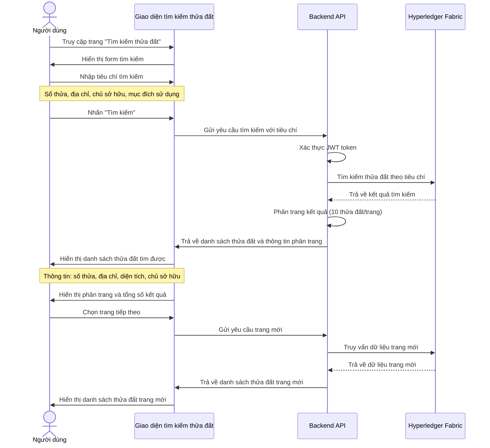
```mermaid
sequenceDiagram
    actor User as Người dùng
    participant UI as Giao diện tìm kiếm thửa đất
    participant API as Backend API
    participant Blockchain as Hyperledger Fabric

    %% Bước 1: Truy cập trang tìm kiếm
    User ->> UI: Truy cập trang "Tìm kiếm thửa đất"
    UI ->> User: Hiển thị form tìm kiếm

    %% Bước 2: Nhập tiêu chí tìm kiếm
    User ->> UI: Nhập tiêu chí tìm kiếm
    Note over User, UI: Số thửa, địa chỉ, chủ sở hữu, mục đích sử dụng
    User ->> UI: Nhấn "Tìm kiếm"

    %% Bước 3: Thực hiện tìm kiếm
    UI ->> API: Gửi yêu cầu tìm kiếm với tiêu chí
    API ->> API: Xác thực JWT token
    API ->> Blockchain: Tìm kiếm thửa đất theo tiêu chí
    Blockchain -->> API: Trả về kết quả tìm kiếm

    %% Bước 4: Phân trang kết quả
    API ->> API: Phân trang kết quả (10 thửa đất/trang)
    API ->> UI: Trả về danh sách thửa đất và thông tin phân trang

    %% Bước 5: Hiển thị kết quả
    UI ->> User: Hiển thị danh sách thửa đất tìm được
    Note over User, UI: Thông tin: số thửa, địa chỉ, diện tích, chủ sở hữu
    UI ->> User: Hiển thị phân trang và tổng số kết quả

    %% Bước 6: Chuyển trang (tùy chọn)
    User ->> UI: Chọn trang tiếp theo
    UI ->> API: Gửi yêu cầu trang mới
    API ->> Blockchain: Truy vấn dữ liệu trang mới
    Blockchain -->> API: Trả về dữ liệu trang mới
    API ->> UI: Trả về danh sách thửa đất trang mới
    UI ->> User: Hiển thị danh sách thửa đất trang mới
```

### Các trường hợp ngoại lệ
- Không tìm thấy thửa đất nào thỏa mãn tiêu chí
- Lỗi kết nối blockchain
- Token không hợp lệ

### Quy tắc nghiệp vụ
- Tất cả người dùng đã đăng nhập đều có thể tìm kiếm thửa đất
- Hiển thị tối đa 10 thửa đất/trang
- Có thể tìm kiếm theo nhiều tiêu chí kết hợp
- Hiển thị tổng số kết quả và thông tin phân trang
- Kết quả tìm kiếm được sắp xếp theo thời gian tạo mới nhất

---

## UC-20: Xem thửa đất theo chủ sở hữu

### Mô tả ngắn gọn
Người dùng xem danh sách thửa đất thuộc sở hữu của mình

### Sequence Diagram
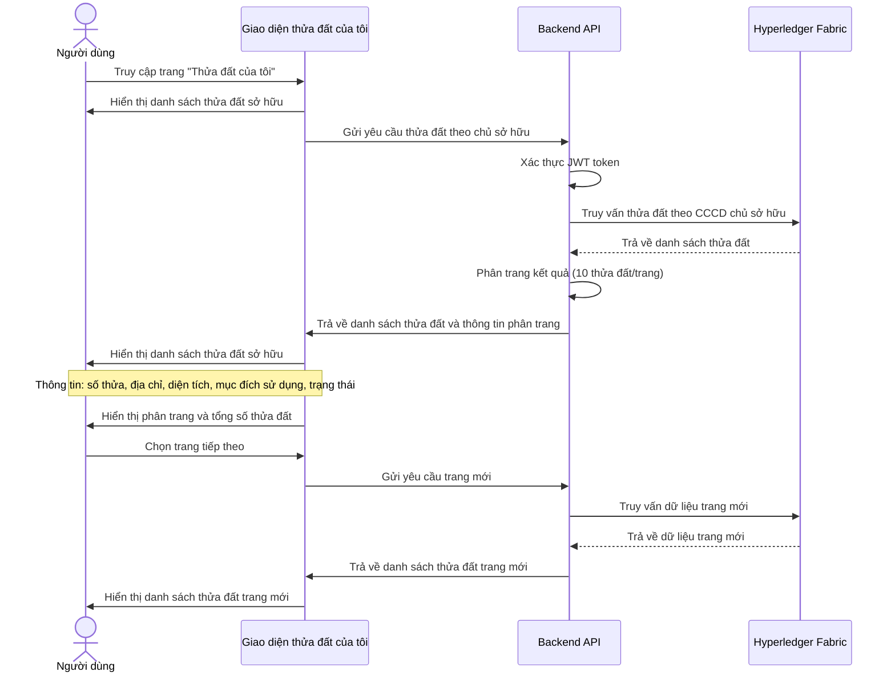
```mermaid
sequenceDiagram
    actor User as Người dùng
    participant UI as Giao diện thửa đất của tôi
    participant API as Backend API
    participant Blockchain as Hyperledger Fabric

    %% Bước 1: Truy cập trang thửa đất của tôi
    User ->> UI: Truy cập trang "Thửa đất của tôi"
    UI ->> User: Hiển thị danh sách thửa đất sở hữu

    %% Bước 2: Lấy danh sách thửa đất
    UI ->> API: Gửi yêu cầu thửa đất theo chủ sở hữu
    API ->> API: Xác thực JWT token
    API ->> Blockchain: Truy vấn thửa đất theo CCCD chủ sở hữu
    Blockchain -->> API: Trả về danh sách thửa đất

    %% Bước 3: Phân trang kết quả
    API ->> API: Phân trang kết quả (10 thửa đất/trang)
    API ->> UI: Trả về danh sách thửa đất và thông tin phân trang

    %% Bước 4: Hiển thị kết quả
    UI ->> User: Hiển thị danh sách thửa đất sở hữu
    Note over User, UI: Thông tin: số thửa, địa chỉ, diện tích, mục đích sử dụng, trạng thái
    UI ->> User: Hiển thị phân trang và tổng số thửa đất

    %% Bước 5: Chuyển trang (tùy chọn)
    User ->> UI: Chọn trang tiếp theo
    UI ->> API: Gửi yêu cầu trang mới
    API ->> Blockchain: Truy vấn dữ liệu trang mới
    Blockchain -->> API: Trả về dữ liệu trang mới
    API ->> UI: Trả về danh sách thửa đất trang mới
    UI ->> User: Hiển thị danh sách thửa đất trang mới
```

### Các trường hợp ngoại lệ
- Người dùng không có thửa đất nào
- Lỗi kết nối blockchain
- Token không hợp lệ

### Quy tắc nghiệp vụ
- Người dùng chỉ có thể xem thửa đất thuộc sở hữu của mình
- Hiển thị tối đa 10 thửa đất/trang
- Hiển thị đầy đủ thông tin thửa đất và trạng thái
- Cung cấp tùy chọn xem chi tiết từng thửa đất
- Hiển thị tổng số thửa đất sở hữu

---

## UC-21: Xem tất cả thửa đất

### Mô tả ngắn gọn
Cán bộ xem danh sách tất cả thửa đất trong hệ thống

### Sequence Diagram
```mermaid
sequenceDiagram
    actor Staff as Cán bộ Org1/Org2
    participant UI as Giao diện quản lý thửa đất
    participant API as Backend API
    participant Blockchain as Hyperledger Fabric

    %% Bước 1: Truy cập trang quản lý thửa đất
    Staff ->> UI: Truy cập trang "Quản lý thửa đất"
    UI ->> Staff: Hiển thị danh sách tất cả thửa đất

    %% Bước 2: Lấy danh sách thửa đất
    UI ->> API: Gửi yêu cầu danh sách tất cả thửa đất
    API ->> API: Xác thực JWT token và quyền cán bộ
    API ->> Blockchain: Truy vấn tất cả thửa đất trong hệ thống
    Blockchain -->> API: Trả về danh sách thửa đất

    %% Bước 3: Phân trang kết quả
    API ->> API: Phân trang kết quả (20 thửa đất/trang)
    API ->> UI: Trả về danh sách thửa đất và thông tin phân trang

    %% Bước 4: Hiển thị kết quả
    UI ->> Staff: Hiển thị danh sách tất cả thửa đất
    Note over Staff, UI: Thông tin: số thửa, địa chỉ, diện tích, chủ sở hữu, mục đích sử dụng
    UI ->> Staff: Hiển thị phân trang và tổng số thửa đất

    %% Bước 5: Chuyển trang (tùy chọn)
    Staff ->> UI: Chọn trang tiếp theo
    UI ->> API: Gửi yêu cầu trang mới
    API ->> Blockchain: Truy vấn dữ liệu trang mới
    Blockchain -->> API: Trả về dữ liệu trang mới
    API ->> UI: Trả về danh sách thửa đất trang mới
    UI ->> Staff: Hiển thị danh sách thửa đất trang mới
```

### Các trường hợp ngoại lệ
- Không có thửa đất nào trong hệ thống
- Lỗi kết nối blockchain
- Cán bộ không có quyền xem tất cả thửa đất

### Quy tắc nghiệp vụ
- Chỉ cán bộ Org1 và Org2 mới có quyền xem tất cả thửa đất
- Hiển thị tối đa 20 thửa đất/trang
- Hiển thị đầy đủ thông tin thửa đất và chủ sở hữu
- Cung cấp tùy chọn quản lý cho từng thửa đất
- Hiển thị tổng số thửa đất trong hệ thống

---

## UC-22: Xem chi tiết thửa đất

### Mô tả ngắn gọn
Người dùng xem thông tin chi tiết của một thửa đất cụ thể

### Sequence Diagram
```mermaid
sequenceDiagram
    actor User as Người dùng
    participant UI as Giao diện chi tiết thửa đất
    participant API as Backend API
    participant Blockchain as Hyperledger Fabric

    %% Bước 1: Chọn thửa đất để xem chi tiết
    User ->> UI: Nhấn vào thửa đất trong danh sách
    UI ->> User: Hiển thị trang chi tiết thửa đất

    %% Bước 2: Lấy thông tin chi tiết
    UI ->> API: Gửi yêu cầu thông tin chi tiết thửa đất
    Note over UI, API: Gửi số thửa hoặc ID thửa đất
    API ->> API: Xác thực JWT token
    API ->> Blockchain: Truy vấn thông tin chi tiết thửa đất
    Blockchain -->> API: Trả về thông tin thửa đất

    %% Bước 3: Kiểm tra quyền xem
    API ->> API: Kiểm tra người dùng có quyền xem thửa đất không
    Note over API, API: Cán bộ có thể xem tất cả, công dân chỉ xem thửa đất của mình
    
    alt Người dùng không có quyền xem
        API ->> UI: Trả về lỗi quyền truy cập
        UI ->> User: Hiển thị thông báo lỗi
    end

    %% Bước 4: Hiển thị thông tin chi tiết
    API ->> UI: Trả về thông tin chi tiết thửa đất
    UI ->> User: Hiển thị thông tin chi tiết
    Note over User, UI: Thông tin: số thửa, địa chỉ, diện tích, mục đích sử dụng, chủ sở hữu, ngày tạo, trạng thái

    %% Bước 5: Hiển thị tùy chọn quản lý (nếu có quyền)
    alt Người dùng có quyền quản lý
        UI ->> User: Hiển thị các nút quản lý
        Note over User, UI: Nút: Cập nhật, Xem lịch sử, Quản lý tài liệu
    end
```

### Các trường hợp ngoại lệ
- Thửa đất không tồn tại
- Người dùng không có quyền xem thửa đất
- Lỗi kết nối blockchain
- Token không hợp lệ

### Quy tắc nghiệp vụ
- Cán bộ có thể xem chi tiết tất cả thửa đất
- Công dân chỉ có thể xem chi tiết thửa đất thuộc sở hữu
- Hiển thị thông tin từ blockchain
- Cung cấp tùy chọn quản lý cho người dùng có quyền
- Hiển thị đầy đủ thông tin thửa đất và trạng thái

---

## UC-23: Xem lịch sử thửa đất

### Mô tả ngắn gọn
Người dùng xem lịch sử thay đổi và giao dịch của thửa đất

### Sequence Diagram
```mermaid
sequenceDiagram
    actor User as Người dùng
    participant UI as Giao diện lịch sử thửa đất
    participant API as Backend API
    participant Blockchain as Hyperledger Fabric

    %% Bước 1: Chọn xem lịch sử thửa đất
    User ->> UI: Nhấn nút "Xem lịch sử" trong trang chi tiết thửa đất
    UI ->> User: Hiển thị trang lịch sử thửa đất

    %% Bước 2: Lấy lịch sử từ blockchain
    UI ->> API: Gửi yêu cầu lịch sử thửa đất
    API ->> API: Xác thực JWT token
    API ->> Blockchain: Truy vấn lịch sử thay đổi thửa đất
    Blockchain -->> API: Trả về lịch sử thửa đất

    %% Bước 3: Kiểm tra quyền xem
    API ->> API: Kiểm tra người dùng có quyền xem lịch sử không
    
    alt Người dùng không có quyền xem
        API ->> UI: Trả về lỗi quyền truy cập
        UI ->> User: Hiển thị thông báo lỗi
    end

    %% Bước 4: Lấy transaction logs từ blockchain
    API ->> Blockchain: Truy vấn giao dịch liên quan đến thửa đất
    Blockchain -->> API: Trả về danh sách giao dịch

    %% Bước 5: Tổng hợp và sắp xếp lịch sử
    API ->> API: Tổng hợp lịch sử thay đổi và giao dịch
    API ->> API: Sắp xếp theo thời gian (mới nhất trước)
    API ->> API: Phân trang kết quả (20 bản ghi/trang)

    %% Bước 6: Hiển thị lịch sử
    API ->> UI: Trả về lịch sử thửa đất
    UI ->> User: Hiển thị lịch sử thửa đất
    Note over User, UI: Thông tin: thời gian, loại thay đổi, người thực hiện, chi tiết thay đổi
    UI ->> User: Hiển thị phân trang và tổng số bản ghi lịch sử

    %% Bước 7: Chuyển trang (tùy chọn)
    User ->> UI: Chọn trang tiếp theo
    UI ->> API: Gửi yêu cầu trang mới
    API ->> API: Lấy dữ liệu trang mới
    API ->> UI: Trả về lịch sử trang mới
    UI ->> User: Hiển thị lịch sử trang mới
```

### Các trường hợp ngoại lệ
- Thửa đất không tồn tại
- Người dùng không có quyền xem lịch sử
- Lỗi kết nối blockchain
- Không có lịch sử nào cho thửa đất

### Quy tắc nghiệp vụ
- Cán bộ có thể xem lịch sử tất cả thửa đất
- Công dân chỉ có thể xem lịch sử thửa đất thuộc sở hữu
- Hiển thị cả lịch sử thay đổi và giao dịch từ blockchain
- Sắp xếp theo thời gian (mới nhất trước)
- Hiển thị tối đa 20 bản ghi/trang
- Ghi log đầy đủ mọi thay đổi thửa đất trên blockchain

---

### **Tiến độ Module 4 - HOÀN THÀNH:**
- ✅ UC-17: Tạo thửa đất mới
- ✅ UC-18: Cập nhật thông tin thửa đất
- ✅ UC-19: Tìm kiếm thửa đất
- ✅ UC-20: Xem thửa đất theo chủ sở hữu
- ✅ UC-21: Xem tất cả thửa đất
- ✅ UC-22: Xem chi tiết thửa đất
- ✅ UC-23: Xem lịch sử thửa đất

**🎉 Module 4 - QUẢN LÝ THỬA ĐẤT (LAND MANAGEMENT) ĐÃ HOÀN THÀNH!**

**Tiếp theo: Module 5 - Quản lý tài liệu (UC-24 đến UC-38)**

## 📄 **MODULE 5: QUẢN LÝ TÀI LIỆU (DOCUMENT MANAGEMENT)**

### **Task 5.1: Tạo và Upload tài liệu**

---

## UC-24: Upload tài liệu mới

### Mô tả ngắn gọn
Công dân upload tài liệu mới lên hệ thống

### Sequence Diagram
```mermaid
sequenceDiagram
    actor Citizen as Công dân
    participant UI as Giao diện upload tài liệu
    participant API as Backend API
    participant IPFS as IPFS Storage
    participant Blockchain as Hyperledger Fabric

    %% Bước 1: Khởi tạo quy trình
    Citizen ->> UI: Truy cập chức năng upload tài liệu
    UI ->> Citizen: Hiển thị biểu mẫu upload

    %% Bước 2: Upload tài liệu
    Citizen ->> UI: Chọn file tài liệu và nhập thông tin
    Note over Citizen, UI: Tiêu đề, mô tả, loại tài liệu, file PDF/JPG/PNG
    Citizen ->> UI: Xác nhận upload

    %% Bước 3: Kiểm tra tính hợp lệ
    UI ->> API: Gửi file và thông tin tài liệu
    API ->> API: Xác thực JWT token
    API ->> API: Kiểm tra định dạng và kích thước file
    
    alt File không hợp lệ
        API ->> UI: Thông báo lỗi định dạng
        UI ->> Citizen: Hiển thị thông báo lỗi
    end

    %% Bước 4: Lưu trữ tài liệu
    API ->> IPFS: Upload nội dung tài liệu
    IPFS -->> API: Trả về IPFS hash
    API ->> Blockchain: Lưu metadata tài liệu
    Note over API, Blockchain: Lưu: tiêu đề, mô tả, loại, IPFS hash, người upload
    Blockchain -->> API: Xác nhận lưu metadata thành công

    %% Bước 5: Hoàn tất quy trình
    API ->> UI: Thông báo upload thành công
    UI ->> Citizen: Hiển thị thông tin tài liệu đã upload
    Note over Citizen, UI: Hiển thị trạng thái: chờ xác minh
```

### Các trường hợp ngoại lệ
- File không đúng định dạng cho phép
- File quá lớn (vượt quá giới hạn)
- Thông tin tài liệu không đầy đủ
- Lỗi kết nối IPFS hoặc blockchain

### Quy tắc nghiệp vụ
- Chỉ công dân mới có quyền upload tài liệu
- Hỗ trợ các định dạng: PDF, JPG, PNG
- Kích thước file tối đa: 10MB
- Tài liệu mới upload có trạng thái "chờ xác minh"
- Nội dung tài liệu được lưu trên IPFS, metadata trên blockchain

---

## UC-25: Xem danh sách tài liệu

### Mô tả ngắn gọn
Người dùng xem danh sách tài liệu theo quyền truy cập

### Sequence Diagram
```mermaid
sequenceDiagram
    actor User as Người dùng
    participant UI as Giao diện quản lý tài liệu
    participant API as Backend API
    participant Blockchain as Hyperledger Fabric

    %% Bước 1: Truy cập chức năng
    User ->> UI: Truy cập chức năng quản lý tài liệu
    UI ->> User: Hiển thị danh sách tài liệu

    %% Bước 2: Lấy danh sách tài liệu
    UI ->> API: Gửi yêu cầu danh sách tài liệu
    API ->> API: Xác thực quyền truy cập
    API ->> Blockchain: Truy vấn danh sách tài liệu
    Blockchain -->> API: Trả về danh sách tài liệu

    %% Bước 3: Lọc theo quyền
    API ->> API: Lọc tài liệu theo quyền người dùng
    Note over API, API: Công dân chỉ xem tài liệu của mình, cán bộ xem tất cả
    API ->> API: Phân trang kết quả (10 tài liệu/trang)

    %% Bước 4: Hiển thị kết quả
    API ->> UI: Trả về danh sách tài liệu
    UI ->> User: Hiển thị danh sách tài liệu
    Note over User, UI: Thông tin: tiêu đề, loại, trạng thái, ngày upload, người upload
    UI ->> User: Hiển thị phân trang và tổng số tài liệu

    %% Bước 5: Chuyển trang (tùy chọn)
    User ->> UI: Chọn trang tiếp theo
    UI ->> API: Gửi yêu cầu trang mới
    API ->> Blockchain: Truy vấn dữ liệu trang mới
    Blockchain -->> API: Trả về dữ liệu trang mới
    API ->> UI: Trả về danh sách tài liệu trang mới
    UI ->> User: Hiển thị danh sách tài liệu trang mới
```

### Các trường hợp ngoại lệ
- Không có tài liệu nào
- Lỗi kết nối blockchain
- Token không hợp lệ

### Quy tắc nghiệp vụ
- Công dân chỉ xem tài liệu do mình upload
- Cán bộ có thể xem tất cả tài liệu trong hệ thống
- Hiển thị tối đa 10 tài liệu/trang
- Sắp xếp theo thời gian upload mới nhất

---

## UC-26: Xem chi tiết tài liệu

### Mô tả ngắn gọn
Người dùng xem thông tin chi tiết và nội dung tài liệu

### Sequence Diagram
```mermaid
sequenceDiagram
    actor User as Người dùng
    participant UI as Giao diện chi tiết tài liệu
    participant API as Backend API
    participant Blockchain as Hyperledger Fabric
    participant IPFS as IPFS Storage

    %% Bước 1: Chọn tài liệu
    User ->> UI: Chọn tài liệu trong danh sách
    UI ->> User: Hiển thị trang chi tiết tài liệu

    %% Bước 2: Lấy metadata tài liệu
    UI ->> API: Gửi yêu cầu thông tin tài liệu
    API ->> API: Xác thực JWT token
    API ->> Blockchain: Truy vấn metadata tài liệu
    Blockchain -->> API: Trả về metadata tài liệu

    %% Bước 3: Kiểm tra quyền xem
    API ->> API: Kiểm tra người dùng có quyền xem tài liệu không
    
    alt Người dùng không có quyền xem
        API ->> UI: Thông báo lỗi quyền truy cập
        UI ->> User: Hiển thị thông báo lỗi
    end

    %% Bước 4: Lấy nội dung tài liệu
    API ->> IPFS: Truy vấn nội dung tài liệu
    IPFS -->> API: Trả về nội dung tài liệu

    %% Bước 5: Hiển thị thông tin
    API ->> UI: Trả về metadata và nội dung tài liệu
    UI ->> User: Hiển thị thông tin chi tiết tài liệu
    Note over User, UI: Thông tin: tiêu đề, mô tả, loại, trạng thái, ngày upload, người upload
    UI ->> User: Hiển thị nội dung tài liệu

    %% Bước 6: Hiển thị tùy chọn (nếu có quyền)
    alt Người dùng có quyền quản lý
        UI ->> User: Hiển thị các nút quản lý
        Note over User, UI: Nút: Xác minh, Từ chối, Liên kết với thửa đất
    end
```

### Các trường hợp ngoại lệ
- Tài liệu không tồn tại
- Người dùng không có quyền xem tài liệu
- Lỗi kết nối IPFS hoặc blockchain
- Nội dung tài liệu bị mất hoặc hỏng

### Quy tắc nghiệp vụ
- Công dân chỉ xem tài liệu do mình upload
- Cán bộ có thể xem tất cả tài liệu
- Hiển thị đầy đủ metadata và nội dung tài liệu
- Cung cấp tùy chọn quản lý cho người dùng có quyền

---

### **Task 5.2: Xác minh và Quản lý tài liệu**

---

## UC-27: Xác minh tài liệu

### Mô tả ngắn gọn
Cán bộ xác minh tính hợp lệ của tài liệu

### Sequence Diagram
```mermaid
sequenceDiagram
    actor Staff as Cán bộ thẩm định
    participant UI as Giao diện xác minh tài liệu
    participant API as Backend API
    participant Blockchain as Hyperledger Fabric

    %% Bước 1: Chọn tài liệu cần xác minh
    Staff ->> UI: Chọn tài liệu có trạng thái "chờ xác minh"
    UI ->> Staff: Hiển thị thông tin tài liệu và biểu mẫu xác minh

    %% Bước 2: Xem xét tài liệu
    Staff ->> UI: Xem xét nội dung và thông tin tài liệu
    Staff ->> UI: Nhập nhận xét xác minh
    Staff ->> UI: Xác nhận xác minh

    %% Bước 3: Thực hiện xác minh
    UI ->> API: Gửi kết quả xác minh
    API ->> API: Xác thực JWT token
    API ->> Blockchain: Cập nhật trạng thái tài liệu thành "đã xác minh"
    Blockchain -->> API: Xác nhận cập nhật thành công

    %% Bước 4: Ghi nhận xác minh
    API ->> Blockchain: Ghi nhận thông tin xác minh
    Note over API, Blockchain: Ghi: người xác minh, thời gian, nhận xét
    Blockchain -->> API: Xác nhận ghi nhận thành công

    %% Bước 5: Hoàn tất quy trình
    API ->> UI: Thông báo xác minh thành công
    UI ->> Staff: Hiển thị thông báo thành công
    Note over Staff, UI: Tài liệu đã được xác minh và có thể liên kết với thửa đất
```

### Các trường hợp ngoại lệ
- Tài liệu không ở trạng thái "chờ xác minh"
- Cán bộ không có quyền xác minh tài liệu
- Lỗi cập nhật trên blockchain
- Thông tin xác minh không đầy đủ

### Quy tắc nghiệp vụ
- Chỉ cán bộ thẩm định mới có quyền xác minh tài liệu
- Chỉ tài liệu có trạng thái "chờ xác minh" mới được xác minh
- Tài liệu đã xác minh có thể được liên kết với thửa đất
- Ghi nhận đầy đủ thông tin người xác minh và thời gian

---

## UC-28: Từ chối tài liệu

### Mô tả ngắn gọn
Cán bộ từ chối tài liệu không hợp lệ

### Sequence Diagram
```mermaid
sequenceDiagram
    actor Staff as Cán bộ thẩm định
    participant UI as Giao diện xác minh tài liệu
    participant API as Backend API
    participant Blockchain as Hyperledger Fabric

    %% Bước 1: Chọn tài liệu cần từ chối
    Staff ->> UI: Chọn tài liệu có trạng thái "chờ xác minh"
    UI ->> Staff: Hiển thị thông tin tài liệu và biểu mẫu từ chối

    %% Bước 2: Nhập lý do từ chối
    Staff ->> UI: Xem xét nội dung tài liệu
    Staff ->> UI: Nhập lý do từ chối
    Staff ->> UI: Xác nhận từ chối

    %% Bước 3: Thực hiện từ chối
    UI ->> API: Gửi yêu cầu từ chối tài liệu
    API ->> API: Xác thực JWT token
    API ->> Blockchain: Cập nhật trạng thái tài liệu thành "bị từ chối"
    Blockchain -->> API: Xác nhận cập nhật thành công

    %% Bước 4: Ghi nhận từ chối
    API ->> Blockchain: Ghi nhận thông tin từ chối
    Note over API, Blockchain: Ghi: người từ chối, thời gian, lý do từ chối
    Blockchain -->> API: Xác nhận ghi nhận thành công

    %% Bước 5: Hoàn tất quy trình
    API ->> UI: Thông báo từ chối thành công
    UI ->> Staff: Hiển thị thông báo thành công
    Note over Staff, UI: Tài liệu đã bị từ chối và không thể sử dụng
```

### Các trường hợp ngoại lệ
- Tài liệu không ở trạng thái "chờ xác minh"
- Cán bộ không có quyền từ chối tài liệu
- Lý do từ chối không được nhập
- Lỗi cập nhật trên blockchain

### Quy tắc nghiệp vụ
- Chỉ cán bộ thẩm định mới có quyền từ chối tài liệu
- Phải nhập lý do từ chối cụ thể
- Tài liệu bị từ chối không thể được sử dụng
- Ghi nhận đầy đủ thông tin từ chối

---

### **Task 5.3: Liên kết tài liệu**

---

## UC-29: Liên kết tài liệu với thửa đất

### Mô tả ngắn gọn
Liên kết tài liệu đã xác minh với thửa đất cụ thể

### Sequence Diagram
```mermaid
sequenceDiagram
    actor User as Người dùng
    participant UI as Giao diện liên kết tài liệu
    participant API as Backend API
    participant Blockchain as Hyperledger Fabric

    %% Bước 1: Chọn tài liệu và thửa đất
    User ->> UI: Chọn tài liệu đã xác minh
    UI ->> User: Hiển thị danh sách thửa đất có thể liên kết
    User ->> UI: Chọn thửa đất cần liên kết
    User ->> UI: Xác nhận liên kết

    %% Bước 2: Kiểm tra điều kiện liên kết
    UI ->> API: Gửi yêu cầu liên kết tài liệu với thửa đất
    API ->> API: Xác thực quyền truy cập
    API ->> Blockchain: Kiểm tra tài liệu đã được xác minh chưa
    
    alt Tài liệu chưa được xác minh
        API ->> UI: Thông báo lỗi
        UI ->> User: Hiển thị thông báo lỗi
    end

    %% Bước 3: Kiểm tra quyền liên kết
    API ->> Blockchain: Kiểm tra quyền liên kết với thửa đất
    
    alt Không có quyền liên kết
        API ->> UI: Thông báo lỗi quyền truy cập
        UI ->> User: Hiển thị thông báo lỗi
    end

    %% Bước 4: Thực hiện liên kết
    API ->> Blockchain: Liên kết tài liệu với thửa đất
    Blockchain -->> API: Xác nhận liên kết thành công

    %% Bước 5: Hoàn tất quy trình
    API ->> UI: Thông báo liên kết thành công
    UI ->> User: Hiển thị thông báo thành công
    Note over User, UI: Tài liệu đã được liên kết với thửa đất
```

### Các trường hợp ngoại lệ
- Tài liệu chưa được xác minh
- Người dùng không có quyền liên kết với thửa đất
- Tài liệu đã được liên kết với thửa đất khác
- Thửa đất không tồn tại

### Quy tắc nghiệp vụ
- Chỉ tài liệu đã xác minh mới được liên kết
- Công dân chỉ liên kết với thửa đất thuộc sở hữu
- Cán bộ có thể liên kết với bất kỳ thửa đất nào
- Một tài liệu có thể liên kết với nhiều thửa đất

---

## UC-30: Liên kết tài liệu với giao dịch

### Mô tả ngắn gọn
Liên kết tài liệu đã xác minh với giao dịch cụ thể

### Sequence Diagram
```mermaid
sequenceDiagram
    actor User as Người dùng
    participant UI as Giao diện liên kết tài liệu
    participant API as Backend API
    participant Blockchain as Hyperledger Fabric

    %% Bước 1: Chọn tài liệu và giao dịch
    User ->> UI: Chọn tài liệu đã xác minh
    UI ->> User: Hiển thị danh sách giao dịch có thể liên kết
    User ->> UI: Chọn giao dịch cần liên kết
    User ->> UI: Xác nhận liên kết

    %% Bước 2: Kiểm tra điều kiện liên kết
    UI ->> API: Gửi yêu cầu liên kết tài liệu với giao dịch
    API ->> API: Xác thực quyền truy cập
    API ->> Blockchain: Kiểm tra tài liệu đã được xác minh chưa
    
    alt Tài liệu chưa được xác minh
        API ->> UI: Thông báo lỗi
        UI ->> User: Hiển thị thông báo lỗi
    end

    %% Bước 3: Kiểm tra quyền liên kết
    API ->> Blockchain: Kiểm tra quyền liên kết với giao dịch
    
    alt Không có quyền liên kết
        API ->> UI: Thông báo lỗi quyền truy cập
        UI ->> User: Hiển thị thông báo lỗi
    end

    %% Bước 4: Thực hiện liên kết
    API ->> Blockchain: Liên kết tài liệu với giao dịch
    Blockchain -->> API: Xác nhận liên kết thành công

    %% Bước 5: Hoàn tất quy trình
    API ->> UI: Thông báo liên kết thành công
    UI ->> User: Hiển thị thông báo thành công
    Note over User, UI: Tài liệu đã được liên kết với giao dịch
```

### Các trường hợp ngoại lệ
- Tài liệu chưa được xác minh
- Người dùng không có quyền liên kết với giao dịch
- Tài liệu đã được liên kết với giao dịch khác
- Giao dịch không tồn tại

### Quy tắc nghiệp vụ
- Chỉ tài liệu đã xác minh mới được liên kết
- Công dân chỉ liên kết với giao dịch của mình
- Cán bộ có thể liên kết với bất kỳ giao dịch nào
- Một tài liệu có thể liên kết với nhiều giao dịch

---

### **Task 5.4: Tìm kiếm và Phân tích tài liệu**

---

## UC-31: Tìm kiếm tài liệu

### Mô tả ngắn gọn
Người dùng tìm kiếm tài liệu theo các tiêu chí khác nhau

### Sequence Diagram
```mermaid
sequenceDiagram
    actor User as Người dùng
    participant UI as Giao diện tìm kiếm tài liệu
    participant API as Backend API
    participant Blockchain as Hyperledger Fabric

    %% Bước 1: Truy cập chức năng tìm kiếm
    User ->> UI: Truy cập chức năng tìm kiếm tài liệu
    UI ->> User: Hiển thị biểu mẫu tìm kiếm

    %% Bước 2: Nhập tiêu chí tìm kiếm
    User ->> UI: Nhập tiêu chí tìm kiếm
    Note over User, UI: Từ khóa, loại tài liệu, trạng thái, người upload, thời gian
    User ->> UI: Thực hiện tìm kiếm

    %% Bước 3: Thực hiện tìm kiếm
    UI ->> API: Gửi yêu cầu tìm kiếm với tiêu chí
    API ->> API: Xác thực JWT token
    API ->> Blockchain: Tìm kiếm tài liệu theo tiêu chí
    Blockchain -->> API: Trả về kết quả tìm kiếm

    %% Bước 4: Lọc theo quyền
    API ->> API: Lọc kết quả theo quyền người dùng
    Note over API, API: Công dân chỉ xem tài liệu của mình, cán bộ xem tất cả
    API ->> API: Phân trang kết quả (10 tài liệu/trang)

    %% Bước 5: Hiển thị kết quả
    API ->> UI: Trả về danh sách tài liệu tìm được
    UI ->> User: Hiển thị danh sách tài liệu
    Note over User, UI: Thông tin: tiêu đề, loại, trạng thái, người upload, ngày upload
    UI ->> User: Hiển thị phân trang và tổng số kết quả

    %% Bước 6: Chuyển trang (tùy chọn)
    User ->> UI: Chọn trang tiếp theo
    UI ->> API: Gửi yêu cầu trang mới
    API ->> Blockchain: Truy vấn dữ liệu trang mới
    Blockchain -->> API: Trả về dữ liệu trang mới
    API ->> UI: Trả về danh sách tài liệu trang mới
    UI ->> User: Hiển thị danh sách tài liệu trang mới
```

### Các trường hợp ngoại lệ
- Không tìm thấy tài liệu nào thỏa mãn tiêu chí
- Lỗi kết nối blockchain
- Token không hợp lệ

### Quy tắc nghiệp vụ
- Công dân chỉ tìm kiếm tài liệu do mình upload
- Cán bộ có thể tìm kiếm tất cả tài liệu trong hệ thống
- Hiển thị tối đa 10 tài liệu/trang
- Có thể tìm kiếm theo nhiều tiêu chí kết hợp

---

## UC-32: Xem tài liệu theo trạng thái

### Mô tả ngắn gọn
Cán bộ xem danh sách tài liệu theo trạng thái xác minh

### Sequence Diagram
```mermaid
sequenceDiagram
    actor Staff as Cán bộ thẩm định
    participant UI as Giao diện quản lý tài liệu
    participant API as Backend API
    participant Blockchain as Hyperledger Fabric

    %% Bước 1: Chọn trạng thái
    Staff ->> UI: Chọn trạng thái tài liệu cần xem
    Note over Staff, UI: Chờ xác minh, đã xác minh, bị từ chối
    UI ->> Staff: Hiển thị danh sách tài liệu theo trạng thái

    %% Bước 2: Lấy danh sách tài liệu
    UI ->> API: Gửi yêu cầu tài liệu theo trạng thái
    API ->> API: Xác thực JWT token
    API ->> Blockchain: Truy vấn tài liệu theo trạng thái
    Blockchain -->> API: Trả về danh sách tài liệu

    %% Bước 3: Xử lý kết quả
    API ->> API: Phân trang kết quả (15 tài liệu/trang)
    API ->> UI: Trả về danh sách tài liệu và thông tin phân trang

    %% Bước 4: Hiển thị kết quả
    UI ->> Staff: Hiển thị danh sách tài liệu theo trạng thái
    Note over Staff, UI: Thông tin: tiêu đề, loại, người upload, ngày upload, trạng thái
    UI ->> Staff: Hiển thị phân trang và tổng số tài liệu

    %% Bước 5: Chuyển trang (tùy chọn)
    Staff ->> UI: Chọn trang tiếp theo
    UI ->> API: Gửi yêu cầu trang mới
    API ->> Blockchain: Truy vấn dữ liệu trang mới
    Blockchain -->> API: Trả về dữ liệu trang mới
    API ->> UI: Trả về danh sách tài liệu trang mới
    UI ->> Staff: Hiển thị danh sách tài liệu trang mới
```

### Các trường hợp ngoại lệ
- Không có tài liệu nào ở trạng thái được chọn
- Lỗi kết nối blockchain
- Cán bộ không có quyền xem tài liệu theo trạng thái

### Quy tắc nghiệp vụ
- Chỉ cán bộ thẩm định mới có quyền xem tài liệu theo trạng thái
- Hiển thị tối đa 15 tài liệu/trang
- Sắp xếp theo thời gian upload mới nhất
- Cung cấp tùy chọn xác minh cho tài liệu chờ xác minh

---

## UC-33: Xem tài liệu theo loại

### Mô tả ngắn gọn
Người dùng xem danh sách tài liệu theo loại cụ thể

### Sequence Diagram
```mermaid
sequenceDiagram
    actor User as Người dùng
    participant UI as Giao diện quản lý tài liệu
    participant API as Backend API
    participant Blockchain as Hyperledger Fabric

    %% Bước 1: Chọn loại tài liệu
    User ->> UI: Chọn loại tài liệu cần xem
    Note over User, UI: Giấy chứng nhận, hợp đồng, bản đồ, khác
    UI ->> User: Hiển thị danh sách tài liệu theo loại

    %% Bước 2: Lấy danh sách tài liệu
    UI ->> API: Gửi yêu cầu tài liệu theo loại
    API ->> API: Xác thực JWT token
    API ->> Blockchain: Truy vấn tài liệu theo loại
    Blockchain -->> API: Trả về danh sách tài liệu

    %% Bước 3: Lọc theo quyền
    API ->> API: Lọc tài liệu theo quyền người dùng
    Note over API, API: Công dân chỉ xem tài liệu của mình, cán bộ xem tất cả
    API ->> API: Phân trang kết quả (10 tài liệu/trang)

    %% Bước 4: Hiển thị kết quả
    API ->> UI: Trả về danh sách tài liệu
    UI ->> User: Hiển thị danh sách tài liệu theo loại
    Note over User, UI: Thông tin: tiêu đề, trạng thái, người upload, ngày upload
    UI ->> User: Hiển thị phân trang và tổng số tài liệu

    %% Bước 5: Chuyển trang (tùy chọn)
    User ->> UI: Chọn trang tiếp theo
    UI ->> API: Gửi yêu cầu trang mới
    API ->> Blockchain: Truy vấn dữ liệu trang mới
    Blockchain -->> API: Trả về dữ liệu trang mới
    API ->> UI: Trả về danh sách tài liệu trang mới
    UI ->> User: Hiển thị danh sách tài liệu trang mới
```

### Các trường hợp ngoại lệ
- Không có tài liệu nào thuộc loại được chọn
- Lỗi kết nối blockchain
- Token không hợp lệ

### Quy tắc nghiệp vụ
- Công dân chỉ xem tài liệu do mình upload
- Cán bộ có thể xem tất cả tài liệu trong hệ thống
- Hiển thị tối đa 10 tài liệu/trang
- Sắp xếp theo thời gian upload mới nhất

---

### **Task 5.5: Quản lý tài liệu nâng cao**

---

## UC-34: Xem tài liệu theo thửa đất

### Mô tả ngắn gọn
Người dùng xem danh sách tài liệu liên quan đến thửa đất cụ thể

### Sequence Diagram
```mermaid
sequenceDiagram
    actor User as Người dùng
    participant UI as Giao diện quản lý tài liệu
    participant API as Backend API
    participant Blockchain as Hyperledger Fabric

    %% Bước 1: Chọn thửa đất
    User ->> UI: Chọn thửa đất cần xem tài liệu
    UI ->> User: Hiển thị danh sách tài liệu liên quan

    %% Bước 2: Lấy danh sách tài liệu
    UI ->> API: Gửi yêu cầu tài liệu theo thửa đất
    API ->> API: Xác thực JWT token
    API ->> Blockchain: Truy vấn tài liệu liên quan đến thửa đất
    Blockchain -->> API: Trả về danh sách tài liệu

    %% Bước 3: Kiểm tra quyền xem
    API ->> API: Kiểm tra quyền xem tài liệu của thửa đất
    
    alt Không có quyền xem
        API ->> UI: Thông báo lỗi quyền truy cập
        UI ->> User: Hiển thị thông báo lỗi
    end

    %% Bước 4: Xử lý kết quả
    API ->> API: Phân trang kết quả (10 tài liệu/trang)
    API ->> UI: Trả về danh sách tài liệu và thông tin phân trang

    %% Bước 5: Hiển thị kết quả
    UI ->> User: Hiển thị danh sách tài liệu liên quan
    Note over User, UI: Thông tin: tiêu đề, loại, trạng thái, người upload, ngày upload
    UI ->> User: Hiển thị phân trang và tổng số tài liệu

    %% Bước 6: Chuyển trang (tùy chọn)
    User ->> UI: Chọn trang tiếp theo
    UI ->> API: Gửi yêu cầu trang mới
    API ->> Blockchain: Truy vấn dữ liệu trang mới
    Blockchain -->> API: Trả về dữ liệu trang mới
    API ->> UI: Trả về danh sách tài liệu trang mới
    UI ->> User: Hiển thị danh sách tài liệu trang mới
```

### Các trường hợp ngoại lệ
- Thửa đất không tồn tại
- Không có tài liệu nào liên quan đến thửa đất
- Người dùng không có quyền xem tài liệu của thửa đất
- Lỗi kết nối blockchain

### Quy tắc nghiệp vụ
- Công dân chỉ xem tài liệu của thửa đất thuộc sở hữu
- Cán bộ có thể xem tài liệu của tất cả thửa đất
- Hiển thị tối đa 10 tài liệu/trang
- Sắp xếp theo thời gian upload mới nhất

---

## UC-35: Xem tài liệu theo giao dịch

### Mô tả ngắn gọn
Người dùng xem danh sách tài liệu liên quan đến giao dịch cụ thể

### Sequence Diagram
```mermaid
sequenceDiagram
    actor User as Người dùng
    participant UI as Giao diện quản lý tài liệu
    participant API as Backend API
    participant Blockchain as Hyperledger Fabric

    %% Bước 1: Chọn giao dịch
    User ->> UI: Chọn giao dịch cần xem tài liệu
    UI ->> User: Hiển thị danh sách tài liệu liên quan

    %% Bước 2: Lấy danh sách tài liệu
    UI ->> API: Gửi yêu cầu tài liệu theo giao dịch
    API ->> API: Xác thực JWT token
    API ->> Blockchain: Truy vấn tài liệu liên quan đến giao dịch
    Blockchain -->> API: Trả về danh sách tài liệu

    %% Bước 3: Kiểm tra quyền xem
    API ->> API: Kiểm tra quyền xem tài liệu của giao dịch
    
    alt Không có quyền xem
        API ->> UI: Thông báo lỗi quyền truy cập
        UI ->> User: Hiển thị thông báo lỗi
    end

    %% Bước 4: Xử lý kết quả
    API ->> API: Phân trang kết quả (10 tài liệu/trang)
    API ->> UI: Trả về danh sách tài liệu và thông tin phân trang

    %% Bước 5: Hiển thị kết quả
    UI ->> User: Hiển thị danh sách tài liệu liên quan
    Note over User, UI: Thông tin: tiêu đề, loại, trạng thái, người upload, ngày upload
    UI ->> User: Hiển thị phân trang và tổng số tài liệu

    %% Bước 6: Chuyển trang (tùy chọn)
    User ->> UI: Chọn trang tiếp theo
    UI ->> API: Gửi yêu cầu trang mới
    API ->> Blockchain: Truy vấn dữ liệu trang mới
    Blockchain -->> API: Trả về dữ liệu trang mới
    API ->> UI: Trả về danh sách tài liệu trang mới
    UI ->> User: Hiển thị danh sách tài liệu trang mới
```

### Các trường hợp ngoại lệ
- Giao dịch không tồn tại
- Không có tài liệu nào liên quan đến giao dịch
- Người dùng không có quyền xem tài liệu của giao dịch
- Lỗi kết nối blockchain

### Quy tắc nghiệp vụ
- Công dân chỉ xem tài liệu của giao dịch liên quan
- Cán bộ có thể xem tài liệu của tất cả giao dịch
- Hiển thị tối đa 10 tài liệu/trang
- Sắp xếp theo thời gian upload mới nhất

---

## UC-36: Xem tài liệu theo người upload

### Mô tả ngắn gọn
Cán bộ xem danh sách tài liệu do một người dùng cụ thể upload

### Sequence Diagram
```mermaid
sequenceDiagram
    actor Staff as Cán bộ thẩm định
    participant UI as Giao diện quản lý tài liệu
    participant API as Backend API
    participant Blockchain as Hyperledger Fabric

    %% Bước 1: Chọn người upload
    Staff ->> UI: Chọn người dùng cần xem tài liệu
    UI ->> Staff: Hiển thị danh sách tài liệu của người dùng

    %% Bước 2: Lấy danh sách tài liệu
    UI ->> API: Gửi yêu cầu tài liệu theo người upload
    API ->> API: Xác thực JWT token
    API ->> Blockchain: Truy vấn tài liệu theo người upload
    Blockchain -->> API: Trả về danh sách tài liệu

    %% Bước 3: Xử lý kết quả
    API ->> API: Phân trang kết quả (15 tài liệu/trang)
    API ->> UI: Trả về danh sách tài liệu và thông tin phân trang

    %% Bước 4: Hiển thị kết quả
    UI ->> Staff: Hiển thị danh sách tài liệu của người dùng
    Note over Staff, UI: Thông tin: tiêu đề, loại, trạng thái, ngày upload
    UI ->> Staff: Hiển thị phân trang và tổng số tài liệu

    %% Bước 5: Chuyển trang (tùy chọn)
    Staff ->> UI: Chọn trang tiếp theo
    UI ->> API: Gửi yêu cầu trang mới
    API ->> Blockchain: Truy vấn dữ liệu trang mới
    Blockchain -->> API: Trả về dữ liệu trang mới
    API ->> UI: Trả về danh sách tài liệu trang mới
    UI ->> Staff: Hiển thị danh sách tài liệu trang mới
```

### Các trường hợp ngoại lệ
- Người dùng không tồn tại
- Không có tài liệu nào do người dùng upload
- Cán bộ không có quyền xem tài liệu của người dùng
- Lỗi kết nối blockchain

### Quy tắc nghiệp vụ
- Chỉ cán bộ thẩm định mới có quyền xem tài liệu theo người upload
- Hiển thị tối đa 15 tài liệu/trang
- Sắp xếp theo thời gian upload mới nhất
- Cung cấp thống kê về trạng thái tài liệu

---

## UC-37: Xem lịch sử tài liệu

### Mô tả ngắn gọn
Người dùng xem lịch sử thay đổi và sử dụng của tài liệu

### Sequence Diagram
```mermaid
sequenceDiagram
    actor User as Người dùng
    participant UI as Giao diện lịch sử tài liệu
    participant API as Backend API
    participant Blockchain as Hyperledger Fabric

    %% Bước 1: Chọn tài liệu
    User ->> UI: Chọn tài liệu cần xem lịch sử
    UI ->> User: Hiển thị trang lịch sử tài liệu

    %% Bước 2: Lấy lịch sử thay đổi
    UI ->> API: Gửi yêu cầu lịch sử tài liệu
    API ->> API: Xác thực JWT token
    API ->> Blockchain: Truy vấn lịch sử thay đổi tài liệu
    Blockchain -->> API: Trả về lịch sử thay đổi

    %% Bước 3: Kiểm tra quyền xem
    API ->> API: Kiểm tra người dùng có quyền xem lịch sử không
    
    alt Người dùng không có quyền xem
        API ->> UI: Thông báo lỗi quyền truy cập
        UI ->> User: Hiển thị thông báo lỗi
    end

    %% Bước 4: Lấy lịch sử sử dụng
    API ->> Blockchain: Truy vấn lịch sử sử dụng tài liệu
    Blockchain -->> API: Trả về lịch sử sử dụng

    %% Bước 5: Tổng hợp và sắp xếp
    API ->> API: Tổng hợp lịch sử thay đổi và sử dụng
    API ->> API: Sắp xếp theo thời gian (mới nhất trước)
    API ->> API: Phân trang kết quả (20 bản ghi/trang)

    %% Bước 6: Hiển thị lịch sử
    API ->> UI: Trả về lịch sử tài liệu
    UI ->> User: Hiển thị lịch sử tài liệu
    Note over User, UI: Thông tin: thời gian, loại thay đổi, người thực hiện, chi tiết thay đổi
    UI ->> User: Hiển thị phân trang và tổng số bản ghi lịch sử

    %% Bước 7: Chuyển trang (tùy chọn)
    User ->> UI: Chọn trang tiếp theo
    UI ->> API: Gửi yêu cầu trang mới
    API ->> API: Lấy dữ liệu trang mới
    API ->> UI: Trả về lịch sử trang mới
    UI ->> User: Hiển thị lịch sử trang mới
```

### Các trường hợp ngoại lệ
- Tài liệu không tồn tại
- Người dùng không có quyền xem lịch sử
- Lỗi kết nối blockchain
- Không có lịch sử nào cho tài liệu

### Quy tắc nghiệp vụ
- Công dân chỉ xem lịch sử tài liệu do mình upload
- Cán bộ có thể xem lịch sử tất cả tài liệu
- Hiển thị cả lịch sử thay đổi và sử dụng
- Sắp xếp theo thời gian (mới nhất trước)
- Hiển thị tối đa 20 bản ghi/trang

---

## UC-38: Phân tích tài liệu

### Mô tả ngắn gọn
Cán bộ phân tích và đánh giá tài liệu để hỗ trợ quyết định

### Sequence Diagram
```mermaid
sequenceDiagram
    actor Staff as Cán bộ thẩm định
    participant UI as Giao diện phân tích tài liệu
    participant API as Backend API
    participant Blockchain as Hyperledger Fabric
    participant IPFS as IPFS Storage

    %% Bước 1: Chọn tài liệu cần phân tích
    Staff ->> UI: Chọn tài liệu cần phân tích
    UI ->> Staff: Hiển thị thông tin tài liệu và công cụ phân tích

    %% Bước 2: Lấy thông tin tài liệu
    UI ->> API: Gửi yêu cầu thông tin tài liệu
    API ->> API: Xác thực JWT token
    API ->> Blockchain: Truy vấn metadata tài liệu
    Blockchain -->> API: Trả về metadata tài liệu

    %% Bước 3: Lấy nội dung tài liệu
    API ->> IPFS: Truy vấn nội dung tài liệu
    IPFS -->> API: Trả về nội dung tài liệu

    %% Bước 4: Thực hiện phân tích
    API ->> API: Phân tích tài liệu
    Note over API, API: Kiểm tra tính hợp lệ, đánh giá chất lượng, so sánh với tiêu chuẩn
    API ->> API: Tạo báo cáo phân tích

    %% Bước 5: Lưu kết quả phân tích
    API ->> Blockchain: Lưu kết quả phân tích
    Note over API, Blockchain: Lưu: kết quả phân tích, đánh giá, khuyến nghị
    Blockchain -->> API: Xác nhận lưu thành công

    %% Bước 6: Hiển thị kết quả
    API ->> UI: Trả về kết quả phân tích
    UI ->> Staff: Hiển thị báo cáo phân tích
    Note over Staff, UI: Thông tin: đánh giá chất lượng, khuyến nghị, rủi ro
    UI ->> Staff: Hiển thị các tùy chọn quyết định
```

### Các trường hợp ngoại lệ
- Tài liệu không tồn tại
- Cán bộ không có quyền phân tích tài liệu
- Lỗi kết nối IPFS hoặc blockchain
- Nội dung tài liệu không thể phân tích

### Quy tắc nghiệp vụ
- Chỉ cán bộ thẩm định mới có quyền phân tích tài liệu
- Phân tích bao gồm kiểm tra tính hợp lệ và đánh giá chất lượng
- Kết quả phân tích được lưu vào blockchain
- Cung cấp khuyến nghị và đánh giá rủi ro
- Hỗ trợ quyết định xác minh hoặc từ chối tài liệu

---

### **Tiến độ Module 5 - HOÀN THÀNH:**
- ✅ UC-24: Upload tài liệu mới
- ✅ UC-25: Xem danh sách tài liệu
- ✅ UC-26: Xem chi tiết tài liệu
- ✅ UC-27: Xác minh tài liệu
- ✅ UC-28: Từ chối tài liệu
- ✅ UC-29: Liên kết tài liệu với thửa đất
- ✅ UC-30: Liên kết tài liệu với giao dịch
- ✅ UC-31: Tìm kiếm tài liệu
- ✅ UC-32: Xem tài liệu theo trạng thái
- ✅ UC-33: Xem tài liệu theo loại
- ✅ UC-34: Xem tài liệu theo thửa đất
- ✅ UC-35: Xem tài liệu theo giao dịch
- ✅ UC-36: Xem tài liệu theo người upload
- ✅ UC-37: Xem lịch sử tài liệu
- ✅ UC-38: Phân tích tài liệu

**🎉 Module 5 - QUẢN LÝ TÀI LIỆU (DOCUMENT MANAGEMENT) ĐÃ HOÀN THÀNH!**

**Tiếp theo: Module 6 - Quản lý giao dịch (UC-39 đến UC-57)**

## 💼 **MODULE 6: QUẢN LÝ GIAO DỊCH (TRANSACTION MANAGEMENT)**

### **Task 6.1: Xử lý và Quản lý giao dịch**

---

## UC-39: Xử lý giao dịch

### Mô tả ngắn gọn
Cán bộ xử lý và thẩm định giao dịch

### Sequence Diagram
```mermaid
sequenceDiagram
    actor Staff as Cán bộ thẩm định
    participant UI as Giao diện xử lý giao dịch
    participant API as Backend API
    participant Blockchain as Hyperledger Fabric

    %% Bước 1: Chọn giao dịch cần xử lý
    Staff ->> UI: Chọn giao dịch có trạng thái "PENDING"
    UI ->> Staff: Hiển thị thông tin giao dịch và biểu mẫu xử lý

    %% Bước 2: Xem xét hồ sơ
    Staff ->> UI: Xem xét thông tin giao dịch và tài liệu liên quan
    Staff ->> UI: Nhập nhận xét thẩm định
    Staff ->> UI: Xác nhận xử lý

    %% Bước 3: Thực hiện xử lý
    UI ->> API: Gửi kết quả xử lý giao dịch
    API ->> API: Xác thực JWT token
    API ->> Blockchain: Cập nhật trạng thái giao dịch thành "VERIFIED"
    Blockchain -->> API: Xác nhận cập nhật thành công

    %% Bước 4: Ghi nhận xử lý
    API ->> Blockchain: Ghi nhận thông tin xử lý
    Note over API, Blockchain: Ghi: người xử lý, thời gian, nhận xét, kết quả
    Blockchain -->> API: Xác nhận ghi nhận thành công

    %% Bước 5: Hoàn tất quy trình
    API ->> UI: Thông báo xử lý thành công
    UI ->> Staff: Hiển thị thông báo thành công
    Note over Staff, UI: Giao dịch đã được xử lý và chuyển tiếp
```

### Các trường hợp ngoại lệ
- Giao dịch không ở trạng thái "PENDING"
- Cán bộ không có quyền xử lý giao dịch
- Hồ sơ không đầy đủ hoặc không hợp lệ
- Lỗi cập nhật trên blockchain

### Quy tắc nghiệp vụ
- Chỉ cán bộ thẩm định mới có quyền xử lý giao dịch
- Chỉ giao dịch có trạng thái "PENDING" mới được xử lý
- Phải kiểm tra đầy đủ hồ sơ và tài liệu liên quan
- Ghi nhận đầy đủ thông tin xử lý

---

## UC-40: Tạo yêu cầu chuyển nhượng

### Mô tả ngắn gọn
Công dân tạo yêu cầu chuyển nhượng thửa đất

### Sequence Diagram
```mermaid
sequenceDiagram
    actor Citizen as Công dân
    participant UI as Giao diện tạo giao dịch
    participant API as Backend API
    participant Blockchain as Hyperledger Fabric

    %% Bước 1: Khởi tạo quy trình
    Citizen ->> UI: Truy cập chức năng tạo yêu cầu chuyển nhượng
    UI ->> Citizen: Hiển thị biểu mẫu tạo giao dịch

    %% Bước 2: Nhập thông tin giao dịch
    Citizen ->> UI: Nhập thông tin chuyển nhượng
    Note over Citizen, UI: Thửa đất, người nhận, lý do chuyển nhượng
    Citizen ->> UI: Xác nhận tạo yêu cầu

    %% Bước 3: Kiểm tra tính hợp lệ
    UI ->> API: Gửi thông tin giao dịch
    API ->> API: Xác thực JWT token
    API ->> API: Kiểm tra tính hợp lệ của thông tin
    
    alt Thông tin không hợp lệ
        API ->> UI: Thông báo lỗi
        UI ->> Citizen: Hiển thị thông báo lỗi
    end

    %% Bước 4: Kiểm tra quyền sở hữu
    API ->> Blockchain: Kiểm tra quyền sở hữu thửa đất
    
    alt Không có quyền sở hữu
        API ->> UI: Thông báo lỗi quyền sở hữu
        UI ->> Citizen: Hiển thị thông báo lỗi
    end

    %% Bước 5: Tạo giao dịch
    API ->> Blockchain: Tạo giao dịch chuyển nhượng
    Note over API, Blockchain: Lưu: loại giao dịch, thửa đất, người chuyển, người nhận, trạng thái PENDING
    Blockchain -->> API: Xác nhận tạo giao dịch thành công

    %% Bước 6: Hoàn tất quy trình
    API ->> UI: Thông báo tạo giao dịch thành công
    UI ->> Citizen: Hiển thị thông tin giao dịch đã tạo
    Note over Citizen, UI: Hiển thị mã giao dịch và trạng thái chờ xử lý
```

### Các trường hợp ngoại lệ
- Thông tin giao dịch không đầy đủ hoặc không hợp lệ
- Công dân không có quyền sở hữu thửa đất
- Thửa đất đang có giao dịch khác xử lý
- Lỗi kết nối blockchain

### Quy tắc nghiệp vụ
- Chỉ chủ sở hữu thửa đất mới có quyền tạo yêu cầu chuyển nhượng
- Thửa đất phải không có giao dịch đang xử lý
- Giao dịch mới có trạng thái "PENDING"
- Hệ thống tự động thông báo cho người nhận

---

## UC-41: Xác nhận nhận chuyển nhượng

### Mô tả ngắn gọn
Người nhận xác nhận yêu cầu chuyển nhượng thửa đất

### Sequence Diagram
```mermaid
sequenceDiagram
    actor Recipient as Người nhận chuyển nhượng
    participant UI as Giao diện xác nhận giao dịch
    participant API as Backend API
    participant Blockchain as Hyperledger Fabric

    %% Bước 1: Chọn giao dịch cần xác nhận
    Recipient ->> UI: Chọn giao dịch chuyển nhượng
    UI ->> Recipient: Hiển thị thông tin giao dịch và biểu mẫu xác nhận

    %% Bước 2: Xem xét thông tin
    Recipient ->> UI: Xem xét thông tin giao dịch
    Note over Recipient, UI: Thông tin: thửa đất, người chuyển, lý do chuyển nhượng
    Recipient ->> UI: Xác nhận chuyển nhượng

    %% Bước 3: Kiểm tra quyền xác nhận
    UI ->> API: Gửi yêu cầu xác nhận giao dịch
    API ->> API: Xác thực JWT token
    API ->> Blockchain: Kiểm tra quyền xác nhận giao dịch
    
    alt Không có quyền xác nhận
        API ->> UI: Thông báo lỗi quyền truy cập
        UI ->> Recipient: Hiển thị thông báo lỗi
    end

    %% Bước 4: Thực hiện xác nhận
    API ->> Blockchain: Xác nhận giao dịch chuyển nhượng
    Note over API, Blockchain: Cập nhật trạng thái giao dịch và thay đổi chủ sở hữu thửa đất
    Blockchain -->> API: Xác nhận xác nhận thành công

    %% Bước 5: Hoàn tất quy trình
    API ->> UI: Thông báo xác nhận thành công
    UI ->> Recipient: Hiển thị thông báo thành công
    Note over Recipient, UI: Thửa đất đã được chuyển nhượng thành công
```

### Các trường hợp ngoại lệ
- Giao dịch không tồn tại
- Người dùng không phải là người nhận chuyển nhượng
- Giao dịch không ở trạng thái "APPROVED"
- Lỗi cập nhật trên blockchain

### Quy tắc nghiệp vụ
- Chỉ người nhận chuyển nhượng mới có quyền xác nhận
- Giao dịch phải ở trạng thái "APPROVED" mới được xác nhận
- Sau khi xác nhận, chủ sở hữu thửa đất được thay đổi
- Ghi nhận đầy đủ thông tin xác nhận

---

## UC-42: Tạo yêu cầu tách thửa

### Mô tả ngắn gọn
Công dân tạo yêu cầu tách thửa đất thành nhiều thửa nhỏ hơn

### Sequence Diagram
```mermaid
sequenceDiagram
    actor Citizen as Công dân
    participant UI as Giao diện tạo giao dịch
    participant API as Backend API
    participant Blockchain as Hyperledger Fabric

    %% Bước 1: Khởi tạo quy trình
    Citizen ->> UI: Truy cập chức năng tạo yêu cầu tách thửa
    UI ->> Citizen: Hiển thị biểu mẫu tạo giao dịch tách thửa

    %% Bước 2: Nhập thông tin tách thửa
    Citizen ->> UI: Nhập thông tin tách thửa
    Note over Citizen, UI: Thửa đất gốc, số thửa mới, diện tích từng thửa, lý do tách
    Citizen ->> UI: Xác nhận tạo yêu cầu

    %% Bước 3: Kiểm tra tính hợp lệ
    UI ->> API: Gửi thông tin giao dịch tách thửa
    API ->> API: Xác thực JWT token
    API ->> API: Kiểm tra tính hợp lệ của thông tin
    
    alt Thông tin không hợp lệ
        API ->> UI: Thông báo lỗi
        UI ->> Citizen: Hiển thị thông báo lỗi
    end

    %% Bước 4: Kiểm tra quyền sở hữu
    API ->> Blockchain: Kiểm tra quyền sở hữu thửa đất
    
    alt Không có quyền sở hữu
        API ->> UI: Thông báo lỗi quyền sở hữu
        UI ->> Citizen: Hiển thị thông báo lỗi
    end

    %% Bước 5: Tạo giao dịch
    API ->> Blockchain: Tạo giao dịch tách thửa
    Note over API, Blockchain: Lưu: loại giao dịch, thửa đất gốc, thông tin tách thửa, trạng thái PENDING
    Blockchain -->> API: Xác nhận tạo giao dịch thành công

    %% Bước 6: Hoàn tất quy trình
    API ->> UI: Thông báo tạo giao dịch thành công
    UI ->> Citizen: Hiển thị thông tin giao dịch đã tạo
    Note over Citizen, UI: Hiển thị mã giao dịch và trạng thái chờ xử lý
```

### Các trường hợp ngoại lệ
- Thông tin tách thửa không hợp lệ
- Công dân không có quyền sở hữu thửa đất
- Thửa đất không đủ diện tích để tách
- Lỗi kết nối blockchain

### Quy tắc nghiệp vụ
- Chỉ chủ sở hữu thửa đất mới có quyền tạo yêu cầu tách thửa
- Tổng diện tích các thửa mới phải bằng diện tích thửa gốc
- Mỗi thửa mới phải có diện tích tối thiểu theo quy định
- Giao dịch mới có trạng thái "PENDING"

---

## UC-43: Tạo yêu cầu gộp thửa

### Mô tả ngắn gọn
Công dân tạo yêu cầu gộp nhiều thửa đất thành một thửa lớn hơn

### Sequence Diagram
```mermaid
sequenceDiagram
    actor Citizen as Công dân
    participant UI as Giao diện tạo giao dịch
    participant API as Backend API
    participant Blockchain as Hyperledger Fabric

    %% Bước 1: Khởi tạo quy trình
    Citizen ->> UI: Truy cập chức năng tạo yêu cầu gộp thửa
    UI ->> Citizen: Hiển thị biểu mẫu tạo giao dịch gộp thửa

    %% Bước 2: Nhập thông tin gộp thửa
    Citizen ->> UI: Chọn các thửa đất cần gộp
    Note over Citizen, UI: Danh sách thửa đất, thông tin thửa mới, lý do gộp thửa
    Citizen ->> UI: Xác nhận tạo yêu cầu

    %% Bước 3: Kiểm tra tính hợp lệ
    UI ->> API: Gửi thông tin giao dịch gộp thửa
    API ->> API: Xác thực JWT token
    API ->> API: Kiểm tra tính hợp lệ của thông tin
    
    alt Thông tin không hợp lệ
        API ->> UI: Thông báo lỗi
        UI ->> Citizen: Hiển thị thông báo lỗi
    end

    %% Bước 4: Kiểm tra quyền sở hữu
    API ->> Blockchain: Kiểm tra quyền sở hữu tất cả thửa đất
    
    alt Không có quyền sở hữu
        API ->> UI: Thông báo lỗi quyền sở hữu
        UI ->> Citizen: Hiển thị thông báo lỗi
    end

    %% Bước 5: Tạo giao dịch
    API ->> Blockchain: Tạo giao dịch gộp thửa
    Note over API, Blockchain: Lưu: loại giao dịch, danh sách thửa đất, thông tin thửa mới, trạng thái PENDING
    Blockchain -->> API: Xác nhận tạo giao dịch thành công

    %% Bước 6: Hoàn tất quy trình
    API ->> UI: Thông báo tạo giao dịch thành công
    UI ->> Citizen: Hiển thị thông tin giao dịch đã tạo
    Note over Citizen, UI: Hiển thị mã giao dịch và trạng thái chờ xử lý
```

### Các trường hợp ngoại lệ
- Thông tin gộp thửa không hợp lệ
- Công dân không có quyền sở hữu tất cả thửa đất
- Các thửa đất không liền kề nhau
- Lỗi kết nối blockchain

### Quy tắc nghiệp vụ
- Chỉ chủ sở hữu tất cả thửa đất mới có quyền tạo yêu cầu gộp thửa
- Các thửa đất phải liền kề nhau
- Tất cả thửa đất phải cùng mục đích sử dụng
- Giao dịch mới có trạng thái "PENDING"

---

## UC-44: Tạo yêu cầu đổi mục đích sử dụng

### Mô tả ngắn gọn
Công dân tạo yêu cầu đổi mục đích sử dụng thửa đất

### Sequence Diagram
```mermaid
sequenceDiagram
    actor Citizen as Công dân
    participant UI as Giao diện tạo giao dịch
    participant API as Backend API
    participant Blockchain as Hyperledger Fabric

    %% Bước 1: Khởi tạo quy trình
    Citizen ->> UI: Truy cập chức năng tạo yêu cầu đổi mục đích
    UI ->> Citizen: Hiển thị biểu mẫu tạo giao dịch đổi mục đích

    %% Bước 2: Nhập thông tin đổi mục đích
    Citizen ->> UI: Chọn thửa đất và mục đích sử dụng mới
    Note over Citizen, UI: Thửa đất, mục đích hiện tại, mục đích mới, lý do đổi
    Citizen ->> UI: Xác nhận tạo yêu cầu

    %% Bước 3: Kiểm tra tính hợp lệ
    UI ->> API: Gửi thông tin giao dịch đổi mục đích
    API ->> API: Xác thực JWT token
    API ->> API: Kiểm tra tính hợp lệ của thông tin
    
    alt Thông tin không hợp lệ
        API ->> UI: Thông báo lỗi
        UI ->> Citizen: Hiển thị thông báo lỗi
    end

    %% Bước 4: Kiểm tra quyền sở hữu
    API ->> Blockchain: Kiểm tra quyền sở hữu thửa đất
    
    alt Không có quyền sở hữu
        API ->> UI: Thông báo lỗi quyền sở hữu
        UI ->> Citizen: Hiển thị thông báo lỗi
    end

    %% Bước 5: Tạo giao dịch
    API ->> Blockchain: Tạo giao dịch đổi mục đích
    Note over API, Blockchain: Lưu: loại giao dịch, thửa đất, mục đích cũ, mục đích mới, trạng thái PENDING
    Blockchain -->> API: Xác nhận tạo giao dịch thành công

    %% Bước 6: Hoàn tất quy trình
    API ->> UI: Thông báo tạo giao dịch thành công
    UI ->> Citizen: Hiển thị thông tin giao dịch đã tạo
    Note over Citizen, UI: Hiển thị mã giao dịch và trạng thái chờ xử lý
```

### Các trường hợp ngoại lệ
- Thông tin đổi mục đích không hợp lệ
- Công dân không có quyền sở hữu thửa đất
- Mục đích sử dụng mới không được phép
- Lỗi kết nối blockchain

### Quy tắc nghiệp vụ
- Chỉ chủ sở hữu thửa đất mới có quyền tạo yêu cầu đổi mục đích
- Mục đích sử dụng mới phải phù hợp với quy hoạch
- Thửa đất phải không có giao dịch đang xử lý
- Giao dịch mới có trạng thái "PENDING"

---

## UC-45: Tạo yêu cầu cấp lại GCN

### Mô tả ngắn gọn
Công dân tạo yêu cầu cấp lại Giấy chứng nhận quyền sử dụng đất

### Sequence Diagram
```mermaid
sequenceDiagram
    actor Citizen as Công dân
    participant UI as Giao diện tạo giao dịch
    participant API as Backend API
    participant Blockchain as Hyperledger Fabric

    %% Bước 1: Khởi tạo quy trình
    Citizen ->> UI: Truy cập chức năng tạo yêu cầu cấp lại GCN
    UI ->> Citizen: Hiển thị biểu mẫu tạo giao dịch cấp lại GCN

    %% Bước 2: Nhập thông tin cấp lại GCN
    Citizen ->> UI: Chọn thửa đất và lý do cấp lại
    Note over Citizen, UI: Thửa đất, lý do cấp lại (mất, hỏng, thay đổi thông tin)
    Citizen ->> UI: Xác nhận tạo yêu cầu

    %% Bước 3: Kiểm tra tính hợp lệ
    UI ->> API: Gửi thông tin giao dịch cấp lại GCN
    API ->> API: Xác thực JWT token
    API ->> API: Kiểm tra tính hợp lệ của thông tin
    
    alt Thông tin không hợp lệ
        API ->> UI: Thông báo lỗi
        UI ->> Citizen: Hiển thị thông báo lỗi
    end

    %% Bước 4: Kiểm tra quyền sở hữu
    API ->> Blockchain: Kiểm tra quyền sở hữu thửa đất
    
    alt Không có quyền sở hữu
        API ->> UI: Thông báo lỗi quyền sở hữu
        UI ->> Citizen: Hiển thị thông báo lỗi
    end

    %% Bước 5: Tạo giao dịch
    API ->> Blockchain: Tạo giao dịch cấp lại GCN
    Note over API, Blockchain: Lưu: loại giao dịch, thửa đất, lý do cấp lại, trạng thái PENDING
    Blockchain -->> API: Xác nhận tạo giao dịch thành công

    %% Bước 6: Hoàn tất quy trình
    API ->> UI: Thông báo tạo giao dịch thành công
    UI ->> Citizen: Hiển thị thông tin giao dịch đã tạo
    Note over Citizen, UI: Hiển thị mã giao dịch và trạng thái chờ xử lý
```

### Các trường hợp ngoại lệ
- Thông tin cấp lại GCN không hợp lệ
- Công dân không có quyền sở hữu thửa đất
- Thửa đất đang có giao dịch khác xử lý
- Lỗi kết nối blockchain

### Quy tắc nghiệp vụ
- Chỉ chủ sở hữu thửa đất mới có quyền tạo yêu cầu cấp lại GCN
- Thửa đất phải không có giao dịch đang xử lý
- Lý do cấp lại phải hợp lệ (mất, hỏng, thay đổi thông tin)
- Giao dịch mới có trạng thái "PENDING"

---

### **Task 6.2: Chuyển tiếp và Phê duyệt giao dịch**

---

## UC-46: Chuyển tiếp giao dịch

### Mô tả ngắn gọn
Cán bộ chuyển tiếp giao dịch đã xử lý lên cấp phê duyệt

### Sequence Diagram
```mermaid
sequenceDiagram
    actor Staff as Cán bộ thẩm định
    participant UI as Giao diện xử lý giao dịch
    participant API as Backend API
    participant Blockchain as Hyperledger Fabric

    %% Bước 1: Chọn giao dịch cần chuyển tiếp
    Staff ->> UI: Chọn giao dịch đã xử lý
    UI ->> Staff: Hiển thị thông tin giao dịch và biểu mẫu chuyển tiếp

    %% Bước 2: Xác nhận chuyển tiếp
    Staff ->> UI: Xem xét lại thông tin giao dịch
    Staff ->> UI: Nhập ghi chú chuyển tiếp
    Staff ->> UI: Xác nhận chuyển tiếp

    %% Bước 3: Thực hiện chuyển tiếp
    UI ->> API: Gửi yêu cầu chuyển tiếp giao dịch
    API ->> API: Xác thực JWT token
    API ->> Blockchain: Cập nhật trạng thái giao dịch thành "FORWARDED"
    Blockchain -->> API: Xác nhận cập nhật thành công

    %% Bước 4: Ghi nhận chuyển tiếp
    API ->> Blockchain: Ghi nhận thông tin chuyển tiếp
    Note over API, Blockchain: Ghi: người chuyển tiếp, thời gian, ghi chú
    Blockchain -->> API: Xác nhận ghi nhận thành công

    %% Bước 5: Hoàn tất quy trình
    API ->> UI: Thông báo chuyển tiếp thành công
    UI ->> Staff: Hiển thị thông báo thành công
    Note over Staff, UI: Giao dịch đã được chuyển tiếp lên cấp phê duyệt
```

### Các trường hợp ngoại lệ
- Giao dịch không ở trạng thái "VERIFIED"
- Cán bộ không có quyền chuyển tiếp giao dịch
- Hồ sơ chưa đầy đủ để chuyển tiếp
- Lỗi cập nhật trên blockchain

### Quy tắc nghiệp vụ
- Chỉ cán bộ thẩm định mới có quyền chuyển tiếp giao dịch
- Chỉ giao dịch có trạng thái "VERIFIED" mới được chuyển tiếp
- Phải đảm bảo hồ sơ đầy đủ trước khi chuyển tiếp
- Ghi nhận đầy đủ thông tin chuyển tiếp

---

### **Tiến độ Module 6 - HOÀN THÀNH PHẦN 1:**
- ✅ UC-39: Xử lý giao dịch
- ✅ UC-40: Tạo yêu cầu chuyển nhượng
- ✅ UC-41: Xác nhận nhận chuyển nhượng
- ✅ UC-42: Tạo yêu cầu tách thửa
- ✅ UC-43: Tạo yêu cầu gộp thửa
- ✅ UC-44: Tạo yêu cầu đổi mục đích sử dụng
- ✅ UC-45: Tạo yêu cầu cấp lại GCN
- ✅ UC-46: Chuyển tiếp giao dịch

**Tiếp theo: Hoàn thành Module 6 (UC-47 đến UC-57)**

---

## UC-47: Phê duyệt giao dịch chuyển nhượng

### Mô tả ngắn gọn
Cán bộ phê duyệt giao dịch chuyển nhượng thửa đất

### Sequence Diagram
```mermaid
sequenceDiagram
    actor Manager as Cán bộ phê duyệt
    participant UI as Giao diện phê duyệt giao dịch
    participant API as Backend API
    participant Blockchain as Hyperledger Fabric

    %% Bước 1: Chọn giao dịch cần phê duyệt
    Manager ->> UI: Chọn giao dịch chuyển nhượng đã chuyển tiếp
    UI ->> Manager: Hiển thị thông tin giao dịch và biểu mẫu phê duyệt

    %% Bước 2: Xem xét hồ sơ
    Manager ->> UI: Xem xét thông tin giao dịch và tài liệu liên quan
    Manager ->> UI: Nhập nhận xét phê duyệt
    Manager ->> UI: Xác nhận phê duyệt

    %% Bước 3: Thực hiện phê duyệt
    UI ->> API: Gửi kết quả phê duyệt giao dịch
    API ->> API: Xác thực JWT token
    API ->> Blockchain: Cập nhật trạng thái giao dịch thành "APPROVED"
    Blockchain -->> API: Xác nhận cập nhật thành công

    %% Bước 4: Ghi nhận phê duyệt
    API ->> Blockchain: Ghi nhận thông tin phê duyệt
    Note over API, Blockchain: Ghi: người phê duyệt, thời gian, nhận xét, kết quả
    Blockchain -->> API: Xác nhận ghi nhận thành công

    %% Bước 5: Hoàn tất quy trình
    API ->> UI: Thông báo phê duyệt thành công
    UI ->> Manager: Hiển thị thông báo thành công
    Note over Manager, UI: Giao dịch chuyển nhượng đã được phê duyệt
```

### Các trường hợp ngoại lệ
- Giao dịch không ở trạng thái "FORWARDED"
- Cán bộ không có quyền phê duyệt giao dịch
- Hồ sơ không đầy đủ hoặc không hợp lệ
- Lỗi cập nhật trên blockchain

### Quy tắc nghiệp vụ
- Chỉ cán bộ phê duyệt mới có quyền phê duyệt giao dịch
- Chỉ giao dịch có trạng thái "FORWARDED" mới được phê duyệt
- Phải kiểm tra đầy đủ hồ sơ và tài liệu liên quan
- Ghi nhận đầy đủ thông tin phê duyệt

---

## UC-48: Phê duyệt giao dịch tách thửa

### Mô tả ngắn gọn
Cán bộ phê duyệt giao dịch tách thửa đất

### Sequence Diagram
```mermaid
sequenceDiagram
    actor Manager as Cán bộ phê duyệt
    participant UI as Giao diện phê duyệt giao dịch
    participant API as Backend API
    participant Blockchain as Hyperledger Fabric

    %% Bước 1: Chọn giao dịch cần phê duyệt
    Manager ->> UI: Chọn giao dịch tách thửa đã chuyển tiếp
    UI ->> Manager: Hiển thị thông tin giao dịch và biểu mẫu phê duyệt

    %% Bước 2: Xem xét hồ sơ
    Manager ->> UI: Xem xét thông tin giao dịch và tài liệu liên quan
    Manager ->> UI: Nhập nhận xét phê duyệt
    Manager ->> UI: Xác nhận phê duyệt

    %% Bước 3: Thực hiện phê duyệt
    UI ->> API: Gửi kết quả phê duyệt giao dịch
    API ->> API: Xác thực JWT token
    API ->> Blockchain: Cập nhật trạng thái giao dịch thành "APPROVED"
    Blockchain -->> API: Xác nhận cập nhật thành công

    %% Bước 4: Thực hiện tách thửa
    API ->> Blockchain: Thực hiện tách thửa đất
    Note over API, Blockchain: Tạo các thửa mới và cập nhật thửa gốc
    Blockchain -->> API: Xác nhận tách thửa thành công

    %% Bước 5: Ghi nhận phê duyệt
    API ->> Blockchain: Ghi nhận thông tin phê duyệt
    Note over API, Blockchain: Ghi: người phê duyệt, thời gian, nhận xét, kết quả
    Blockchain -->> API: Xác nhận ghi nhận thành công

    %% Bước 6: Hoàn tất quy trình
    API ->> UI: Thông báo phê duyệt thành công
    UI ->> Manager: Hiển thị thông báo thành công
    Note over Manager, UI: Giao dịch tách thửa đã được phê duyệt và thực hiện
```

### Các trường hợp ngoại lệ
- Giao dịch không ở trạng thái "FORWARDED"
- Cán bộ không có quyền phê duyệt giao dịch
- Hồ sơ không đầy đủ hoặc không hợp lệ
- Lỗi thực hiện tách thửa trên blockchain

### Quy tắc nghiệp vụ
- Chỉ cán bộ phê duyệt mới có quyền phê duyệt giao dịch
- Chỉ giao dịch có trạng thái "FORWARDED" mới được phê duyệt
- Sau khi phê duyệt, hệ thống tự động thực hiện tách thửa
- Ghi nhận đầy đủ thông tin phê duyệt và thực hiện

---

## UC-49: Phê duyệt giao dịch gộp thửa

### Mô tả ngắn gọn
Cán bộ phê duyệt giao dịch gộp thửa đất

### Sequence Diagram
```mermaid
sequenceDiagram
    actor Manager as Cán bộ phê duyệt
    participant UI as Giao diện phê duyệt giao dịch
    participant API as Backend API
    participant Blockchain as Hyperledger Fabric

    %% Bước 1: Chọn giao dịch cần phê duyệt
    Manager ->> UI: Chọn giao dịch gộp thửa đã chuyển tiếp
    UI ->> Manager: Hiển thị thông tin giao dịch và biểu mẫu phê duyệt

    %% Bước 2: Xem xét hồ sơ
    Manager ->> UI: Xem xét thông tin giao dịch và tài liệu liên quan
    Manager ->> UI: Nhập nhận xét phê duyệt
    Manager ->> UI: Xác nhận phê duyệt

    %% Bước 3: Thực hiện phê duyệt
    UI ->> API: Gửi kết quả phê duyệt giao dịch
    API ->> API: Xác thực JWT token
    API ->> Blockchain: Cập nhật trạng thái giao dịch thành "APPROVED"
    Blockchain -->> API: Xác nhận cập nhật thành công

    %% Bước 4: Thực hiện gộp thửa
    API ->> Blockchain: Thực hiện gộp thửa đất
    Note over API, Blockchain: Tạo thửa mới và xóa các thửa cũ
    Blockchain -->> API: Xác nhận gộp thửa thành công

    %% Bước 5: Ghi nhận phê duyệt
    API ->> Blockchain: Ghi nhận thông tin phê duyệt
    Note over API, Blockchain: Ghi: người phê duyệt, thời gian, nhận xét, kết quả
    Blockchain -->> API: Xác nhận ghi nhận thành công

    %% Bước 6: Hoàn tất quy trình
    API ->> UI: Thông báo phê duyệt thành công
    UI ->> Manager: Hiển thị thông báo thành công
    Note over Manager, UI: Giao dịch gộp thửa đã được phê duyệt và thực hiện
```

### Các trường hợp ngoại lệ
- Giao dịch không ở trạng thái "FORWARDED"
- Cán bộ không có quyền phê duyệt giao dịch
- Hồ sơ không đầy đủ hoặc không hợp lệ
- Lỗi thực hiện gộp thửa trên blockchain

### Quy tắc nghiệp vụ
- Chỉ cán bộ phê duyệt mới có quyền phê duyệt giao dịch
- Chỉ giao dịch có trạng thái "FORWARDED" mới được phê duyệt
- Sau khi phê duyệt, hệ thống tự động thực hiện gộp thửa
- Ghi nhận đầy đủ thông tin phê duyệt và thực hiện

---

## UC-50: Phê duyệt giao dịch đổi mục đích

### Mô tả ngắn gọn
Cán bộ phê duyệt giao dịch đổi mục đích sử dụng đất

### Sequence Diagram
```mermaid
sequenceDiagram
    actor Manager as Cán bộ phê duyệt
    participant UI as Giao diện phê duyệt giao dịch
    participant API as Backend API
    participant Blockchain as Hyperledger Fabric

    %% Bước 1: Chọn giao dịch cần phê duyệt
    Manager ->> UI: Chọn giao dịch đổi mục đích đã chuyển tiếp
    UI ->> Manager: Hiển thị thông tin giao dịch và biểu mẫu phê duyệt

    %% Bước 2: Xem xét hồ sơ
    Manager ->> UI: Xem xét thông tin giao dịch và tài liệu liên quan
    Manager ->> UI: Nhập nhận xét phê duyệt
    Manager ->> UI: Xác nhận phê duyệt

    %% Bước 3: Thực hiện phê duyệt
    UI ->> API: Gửi kết quả phê duyệt giao dịch
    API ->> API: Xác thực JWT token
    API ->> Blockchain: Cập nhật trạng thái giao dịch thành "APPROVED"
    Blockchain -->> API: Xác nhận cập nhật thành công

    %% Bước 4: Thực hiện đổi mục đích
    API ->> Blockchain: Thực hiện đổi mục đích sử dụng
    Note over API, Blockchain: Cập nhật mục đích sử dụng của thửa đất
    Blockchain -->> API: Xác nhận đổi mục đích thành công

    %% Bước 5: Ghi nhận phê duyệt
    API ->> Blockchain: Ghi nhận thông tin phê duyệt
    Note over API, Blockchain: Ghi: người phê duyệt, thời gian, nhận xét, kết quả
    Blockchain -->> API: Xác nhận ghi nhận thành công

    %% Bước 6: Hoàn tất quy trình
    API ->> UI: Thông báo phê duyệt thành công
    UI ->> Manager: Hiển thị thông báo thành công
    Note over Manager, UI: Giao dịch đổi mục đích đã được phê duyệt và thực hiện
```

### Các trường hợp ngoại lệ
- Giao dịch không ở trạng thái "FORWARDED"
- Cán bộ không có quyền phê duyệt giao dịch
- Hồ sơ không đầy đủ hoặc không hợp lệ
- Lỗi thực hiện đổi mục đích trên blockchain

### Quy tắc nghiệp vụ
- Chỉ cán bộ phê duyệt mới có quyền phê duyệt giao dịch
- Chỉ giao dịch có trạng thái "FORWARDED" mới được phê duyệt
- Sau khi phê duyệt, hệ thống tự động thực hiện đổi mục đích
- Ghi nhận đầy đủ thông tin phê duyệt và thực hiện

---

## UC-51: Phê duyệt giao dịch cấp lại GCN

### Mô tả ngắn gọn
Cán bộ phê duyệt giao dịch cấp lại Giấy chứng nhận

### Sequence Diagram
```mermaid
sequenceDiagram
    actor Manager as Cán bộ phê duyệt
    participant UI as Giao diện phê duyệt giao dịch
    participant API as Backend API
    participant Blockchain as Hyperledger Fabric

    %% Bước 1: Chọn giao dịch cần phê duyệt
    Manager ->> UI: Chọn giao dịch cấp lại GCN đã chuyển tiếp
    UI ->> Manager: Hiển thị thông tin giao dịch và biểu mẫu phê duyệt

    %% Bước 2: Xem xét hồ sơ
    Manager ->> UI: Xem xét thông tin giao dịch và tài liệu liên quan
    Manager ->> UI: Nhập nhận xét phê duyệt
    Manager ->> UI: Xác nhận phê duyệt

    %% Bước 3: Thực hiện phê duyệt
    UI ->> API: Gửi kết quả phê duyệt giao dịch
    API ->> API: Xác thực JWT token
    API ->> Blockchain: Cập nhật trạng thái giao dịch thành "APPROVED"
    Blockchain -->> API: Xác nhận cập nhật thành công

    %% Bước 4: Thực hiện cấp lại GCN
    API ->> Blockchain: Thực hiện cấp lại GCN
    Note over API, Blockchain: Tạo GCN mới và cập nhật thông tin thửa đất
    Blockchain -->> API: Xác nhận cấp lại GCN thành công

    %% Bước 5: Ghi nhận phê duyệt
    API ->> Blockchain: Ghi nhận thông tin phê duyệt
    Note over API, Blockchain: Ghi: người phê duyệt, thời gian, nhận xét, kết quả
    Blockchain -->> API: Xác nhận ghi nhận thành công

    %% Bước 6: Hoàn tất quy trình
    API ->> UI: Thông báo phê duyệt thành công
    UI ->> Manager: Hiển thị thông báo thành công
    Note over Manager, UI: Giao dịch cấp lại GCN đã được phê duyệt và thực hiện
```

### Các trường hợp ngoại lệ
- Giao dịch không ở trạng thái "FORWARDED"
- Cán bộ không có quyền phê duyệt giao dịch
- Hồ sơ không đầy đủ hoặc không hợp lệ
- Lỗi thực hiện cấp lại GCN trên blockchain

### Quy tắc nghiệp vụ
- Chỉ cán bộ phê duyệt mới có quyền phê duyệt giao dịch
- Chỉ giao dịch có trạng thái "FORWARDED" mới được phê duyệt
- Sau khi phê duyệt, hệ thống tự động thực hiện cấp lại GCN
- Ghi nhận đầy đủ thông tin phê duyệt và thực hiện

---

## UC-52: Từ chối giao dịch

### Mô tả ngắn gọn
Cán bộ từ chối giao dịch không đáp ứng yêu cầu

### Sequence Diagram
```mermaid
sequenceDiagram
    actor Staff as Cán bộ xử lý/phê duyệt
    participant UI as Giao diện xử lý giao dịch
    participant API as Backend API
    participant Blockchain as Hyperledger Fabric

    %% Bước 1: Chọn giao dịch cần từ chối
    Staff ->> UI: Chọn giao dịch cần từ chối
    UI ->> Staff: Hiển thị thông tin giao dịch và biểu mẫu từ chối

    %% Bước 2: Nhập lý do từ chối
    Staff ->> UI: Nhập lý do từ chối chi tiết
    Note over Staff, UI: Lý do: hồ sơ thiếu, thông tin sai, không đủ điều kiện
    Staff ->> UI: Xác nhận từ chối

    %% Bước 3: Thực hiện từ chối
    UI ->> API: Gửi yêu cầu từ chối giao dịch
    API ->> API: Xác thực JWT token
    API ->> Blockchain: Cập nhật trạng thái giao dịch thành "REJECTED"
    Blockchain -->> API: Xác nhận cập nhật thành công

    %% Bước 4: Ghi nhận từ chối
    API ->> Blockchain: Ghi nhận thông tin từ chối
    Note over API, Blockchain: Ghi: người từ chối, thời gian, lý do từ chối
    Blockchain -->> API: Xác nhận ghi nhận thành công

    %% Bước 5: Hoàn tất quy trình
    API ->> UI: Thông báo từ chối thành công
    UI ->> Staff: Hiển thị thông báo thành công
    Note over Staff, UI: Giao dịch đã được từ chối và thông báo cho người yêu cầu
```

### Các trường hợp ngoại lệ
- Giao dịch không ở trạng thái có thể từ chối
- Cán bộ không có quyền từ chối giao dịch
- Lý do từ chối không hợp lệ
- Lỗi cập nhật trên blockchain

### Quy tắc nghiệp vụ
- Chỉ cán bộ có quyền mới có thể từ chối giao dịch
- Phải cung cấp lý do từ chối chi tiết và hợp lệ
- Giao dịch bị từ chối có trạng thái "REJECTED"
- Ghi nhận đầy đủ thông tin từ chối

---

### **Task 6.3: Tìm kiếm và Xem giao dịch**

---

## UC-53: Tìm kiếm giao dịch

### Mô tả ngắn gọn
Người dùng tìm kiếm giao dịch theo các tiêu chí

### Sequence Diagram
```mermaid
sequenceDiagram
    actor User as Người dùng
    participant UI as Giao diện tìm kiếm giao dịch
    participant API as Backend API
    participant Blockchain as Hyperledger Fabric

    %% Bước 1: Nhập tiêu chí tìm kiếm
    User ->> UI: Truy cập chức năng tìm kiếm giao dịch
    UI ->> User: Hiển thị form tìm kiếm
    
    User ->> UI: Nhập tiêu chí tìm kiếm
    Note over User, UI: Mã giao dịch, loại giao dịch, trạng thái, thời gian
    User ->> UI: Nhấn "Tìm kiếm"

    %% Bước 2: Thực hiện tìm kiếm
    UI ->> API: Gửi yêu cầu tìm kiếm giao dịch
    API ->> API: Xác thực JWT token
    API ->> Blockchain: Tìm kiếm giao dịch theo tiêu chí
    Blockchain -->> API: Trả về danh sách giao dịch phù hợp

    %% Bước 3: Hiển thị kết quả
    API ->> UI: Trả về kết quả tìm kiếm
    UI ->> User: Hiển thị danh sách giao dịch
    Note over User, UI: Hiển thị: mã giao dịch, loại, trạng thái, thời gian tạo
```

### Các trường hợp ngoại lệ
- Không tìm thấy giao dịch nào phù hợp
- Tiêu chí tìm kiếm không hợp lệ
- Lỗi kết nối blockchain

### Quy tắc nghiệp vụ
- Người dùng chỉ có thể tìm kiếm giao dịch của mình
- Cán bộ có thể tìm kiếm tất cả giao dịch
- Kết quả tìm kiếm được phân trang
- Hiển thị thông tin cơ bản của giao dịch

---

## UC-54: Xem giao dịch theo thửa đất

### Mô tả ngắn gọn
Xem tất cả giao dịch liên quan đến một thửa đất

### Sequence Diagram
```mermaid
sequenceDiagram
    actor User as Người dùng
    participant UI as Giao diện xem giao dịch
    participant API as Backend API
    participant Blockchain as Hyperledger Fabric

    %% Bước 1: Chọn thửa đất
    User ->> UI: Chọn thửa đất cần xem giao dịch
    UI ->> User: Hiển thị thông tin thửa đất và yêu cầu xác nhận

    %% Bước 2: Xác nhận xem giao dịch
    User ->> UI: Xác nhận xem giao dịch của thửa đất
    UI ->> API: Gửi yêu cầu xem giao dịch theo thửa đất
    API ->> API: Xác thực JWT token

    %% Bước 3: Kiểm tra quyền truy cập
    API ->> Blockchain: Kiểm tra quyền truy cập thửa đất
    
    alt Không có quyền truy cập
        API ->> UI: Thông báo lỗi quyền truy cập
        UI ->> User: Hiển thị thông báo lỗi
    end

    %% Bước 4: Lấy danh sách giao dịch
    API ->> Blockchain: Lấy danh sách giao dịch theo thửa đất
    Blockchain -->> API: Trả về danh sách giao dịch

    %% Bước 5: Hiển thị kết quả
    API ->> UI: Trả về danh sách giao dịch
    UI ->> User: Hiển thị danh sách giao dịch theo thửa đất
    Note over User, UI: Hiển thị: mã giao dịch, loại, trạng thái, thời gian, người thực hiện
```

### Các trường hợp ngoại lệ
- Không có giao dịch nào cho thửa đất
- Người dùng không có quyền truy cập thửa đất
- Lỗi kết nối blockchain

### Quy tắc nghiệp vụ
- Chỉ chủ sở hữu và cán bộ mới có quyền xem giao dịch
- Hiển thị tất cả giao dịch từ khi tạo thửa đất
- Sắp xếp theo thời gian tạo (mới nhất trước)
- Hiển thị thông tin chi tiết của từng giao dịch

---

## UC-55: Xem giao dịch theo chủ sở hữu

### Mô tả ngắn gọn
Xem tất cả giao dịch của một chủ sở hữu

### Sequence Diagram
```mermaid
sequenceDiagram
    actor User as Người dùng
    participant UI as Giao diện xem giao dịch
    participant API as Backend API
    participant Blockchain as Hyperledger Fabric

    %% Bước 1: Chọn chủ sở hữu
    User ->> UI: Chọn chủ sở hữu cần xem giao dịch
    UI ->> User: Hiển thị thông tin chủ sở hữu và yêu cầu xác nhận

    %% Bước 2: Xác nhận xem giao dịch
    User ->> UI: Xác nhận xem giao dịch của chủ sở hữu
    UI ->> API: Gửi yêu cầu xem giao dịch theo chủ sở hữu
    API ->> API: Xác thực JWT token

    %% Bước 3: Kiểm tra quyền truy cập
    API ->> API: Kiểm tra quyền truy cập thông tin chủ sở hữu
    
    alt Không có quyền truy cập
        API ->> UI: Thông báo lỗi quyền truy cập
        UI ->> User: Hiển thị thông báo lỗi
    end

    %% Bước 4: Lấy danh sách giao dịch
    API ->> Blockchain: Lấy danh sách giao dịch theo chủ sở hữu
    Blockchain -->> API: Trả về danh sách giao dịch

    %% Bước 5: Hiển thị kết quả
    API ->> UI: Trả về danh sách giao dịch
    UI ->> User: Hiển thị danh sách giao dịch theo chủ sở hữu
    Note over User, UI: Hiển thị: mã giao dịch, loại, trạng thái, thời gian, thửa đất liên quan
```

### Các trường hợp ngoại lệ
- Không có giao dịch nào cho chủ sở hữu
- Người dùng không có quyền truy cập thông tin
- Lỗi kết nối blockchain

### Quy tắc nghiệp vụ
- Chỉ cán bộ mới có quyền xem giao dịch của chủ sở hữu khác
- Công dân chỉ có thể xem giao dịch của mình
- Hiển thị tất cả giao dịch của chủ sở hữu
- Sắp xếp theo thời gian tạo (mới nhất trước)

---

## UC-56: Xem tất cả giao dịch

### Mô tả ngắn gọn
Cán bộ xem tất cả giao dịch trong hệ thống

### Sequence Diagram
```mermaid
sequenceDiagram
    actor Staff as Cán bộ
    participant UI as Giao diện quản lý giao dịch
    participant API as Backend API
    participant Blockchain as Hyperledger Fabric

    %% Bước 1: Truy cập danh sách giao dịch
    Staff ->> UI: Truy cập trang "Quản lý giao dịch"
    UI ->> Staff: Hiển thị danh sách giao dịch với bộ lọc

    %% Bước 2: Áp dụng bộ lọc
    Staff ->> UI: Chọn bộ lọc (trạng thái, loại giao dịch, thời gian)
    UI ->> API: Gửi yêu cầu lấy danh sách giao dịch với bộ lọc
    API ->> API: Xác thực JWT token

    %% Bước 3: Kiểm tra quyền truy cập
    API ->> API: Kiểm tra quyền xem tất cả giao dịch
    
    alt Không có quyền truy cập
        API ->> UI: Thông báo lỗi quyền truy cập
        UI ->> Staff: Hiển thị thông báo lỗi
    end

    %% Bước 4: Lấy danh sách giao dịch
    API ->> Blockchain: Lấy danh sách giao dịch theo bộ lọc
    Blockchain -->> API: Trả về danh sách giao dịch

    %% Bước 5: Hiển thị kết quả
    API ->> UI: Trả về danh sách giao dịch
    UI ->> Staff: Hiển thị danh sách giao dịch với phân trang
    Note over Staff, UI: Hiển thị: mã giao dịch, loại, trạng thái, thời gian, chủ sở hữu, thửa đất
```

### Các trường hợp ngoại lệ
- Không có giao dịch nào trong hệ thống
- Cán bộ không có quyền xem tất cả giao dịch
- Lỗi kết nối blockchain

### Quy tắc nghiệp vụ
- Chỉ cán bộ mới có quyền xem tất cả giao dịch
- Có thể lọc theo trạng thái, loại giao dịch, thời gian
- Kết quả được phân trang để dễ quản lý
- Hiển thị thông tin chi tiết của từng giao dịch

---

## UC-57: Xem chi tiết giao dịch

### Mô tả ngắn gọn
Xem thông tin chi tiết của một giao dịch cụ thể

### Sequence Diagram
```mermaid
sequenceDiagram
    actor User as Người dùng
    participant UI as Giao diện xem giao dịch
    participant API as Backend API
    participant Blockchain as Hyperledger Fabric

    %% Bước 1: Chọn giao dịch cần xem
    User ->> UI: Chọn giao dịch từ danh sách
    UI ->> User: Hiển thị thông tin cơ bản của giao dịch

    %% Bước 2: Yêu cầu xem chi tiết
    User ->> UI: Nhấn "Xem chi tiết"
    UI ->> API: Gửi yêu cầu xem chi tiết giao dịch
    API ->> API: Xác thực JWT token

    %% Bước 3: Kiểm tra quyền truy cập
    API ->> Blockchain: Kiểm tra quyền truy cập giao dịch
    
    alt Không có quyền truy cập
        API ->> UI: Thông báo lỗi quyền truy cập
        UI ->> User: Hiển thị thông báo lỗi
    end

    %% Bước 4: Lấy thông tin chi tiết
    API ->> Blockchain: Lấy thông tin chi tiết giao dịch
    Blockchain -->> API: Trả về thông tin chi tiết giao dịch

    %% Bước 5: Hiển thị chi tiết
    API ->> UI: Trả về thông tin chi tiết
    UI ->> User: Hiển thị thông tin chi tiết giao dịch
    Note over User, UI: Hiển thị: thông tin giao dịch, lịch sử xử lý, tài liệu liên quan, ghi chú
```

### Các trường hợp ngoại lệ
- Giao dịch không tồn tại
- Người dùng không có quyền truy cập giao dịch
- Lỗi kết nối blockchain

### Quy tắc nghiệp vụ
- Chỉ người liên quan và cán bộ mới có quyền xem chi tiết
- Hiển thị đầy đủ thông tin giao dịch và lịch sử xử lý
- Hiển thị tài liệu liên quan đến giao dịch
- Hiển thị ghi chú và nhận xét của cán bộ

---

### **Tiến độ Module 6 - HOÀN THÀNH:**
- ✅ UC-39: Xử lý giao dịch
- ✅ UC-40: Tạo yêu cầu chuyển nhượng
- ✅ UC-41: Xác nhận nhận chuyển nhượng
- ✅ UC-42: Tạo yêu cầu tách thửa
- ✅ UC-43: Tạo yêu cầu gộp thửa
- ✅ UC-44: Tạo yêu cầu đổi mục đích sử dụng
- ✅ UC-45: Tạo yêu cầu cấp lại GCN
- ✅ UC-46: Chuyển tiếp giao dịch
- ✅ UC-47: Phê duyệt giao dịch chuyển nhượng
- ✅ UC-48: Phê duyệt giao dịch tách thửa
- ✅ UC-49: Phê duyệt giao dịch gộp thửa
- ✅ UC-50: Phê duyệt giao dịch đổi mục đích
- ✅ UC-51: Phê duyệt giao dịch cấp lại GCN
- ✅ UC-52: Từ chối giao dịch
- ✅ UC-53: Tìm kiếm giao dịch
- ✅ UC-54: Xem giao dịch theo thửa đất
- ✅ UC-55: Xem giao dịch theo chủ sở hữu
- ✅ UC-56: Xem tất cả giao dịch
- ✅ UC-57: Xem chi tiết giao dịch

**🎉 Module 6 - QUẢN LÝ GIAO DỊCH (TRANSACTION MANAGEMENT) ĐÃ HOÀN THÀNH!**

**Tiếp theo: Module 7 - Quản lý thông báo (UC-58 đến UC-62)**

## 🔔 **MODULE 7: QUẢN LÝ THÔNG BÁO (NOTIFICATION MANAGEMENT)**

### **Task 7.1: Xem và Quản lý thông báo**

---

## UC-58: Xem danh sách thông báo

### Mô tả ngắn gọn
Người dùng xem danh sách thông báo của mình

### Sequence Diagram
```mermaid
sequenceDiagram
    actor User as Người dùng
    participant UI as Giao diện thông báo
    participant API as Backend API
    participant DB as MongoDB

    %% Bước 1: Truy cập trang thông báo
    User ->> UI: Truy cập trang "Thông báo"
    UI ->> User: Hiển thị danh sách thông báo với bộ lọc

    %% Bước 2: Áp dụng bộ lọc
    User ->> UI: Chọn bộ lọc (trạng thái, loại thông báo, thời gian)
    UI ->> API: Gửi yêu cầu lấy danh sách thông báo
    API ->> API: Xác thực JWT token

    %% Bước 3: Lấy danh sách thông báo
    API ->> DB: Lấy danh sách thông báo theo người dùng và bộ lọc
    DB -->> API: Trả về danh sách thông báo

    %% Bước 4: Hiển thị kết quả
    API ->> UI: Trả về danh sách thông báo
    UI ->> User: Hiển thị danh sách thông báo với phân trang
    Note over User, UI: Hiển thị: tiêu đề, nội dung, thời gian, trạng thái đọc
```

### Các trường hợp ngoại lệ
- Không có thông báo nào
- Lỗi kết nối database
- Người dùng chưa đăng nhập

### Quy tắc nghiệp vụ
- Chỉ hiển thị thông báo của người dùng đang đăng nhập
- Có thể lọc theo trạng thái đọc, loại thông báo, thời gian
- Kết quả được phân trang để dễ quản lý
- Sắp xếp theo thời gian tạo (mới nhất trước)

---

## UC-59: Đếm thông báo chưa đọc

### Mô tả ngắn gọn
Hệ thống đếm số lượng thông báo chưa đọc

### Sequence Diagram
```mermaid
sequenceDiagram
    actor User as Người dùng
    participant UI as Giao diện hệ thống
    participant API as Backend API
    participant DB as MongoDB

    %% Bước 1: Yêu cầu đếm thông báo
    User ->> UI: Truy cập giao diện hệ thống
    UI ->> API: Gửi yêu cầu đếm thông báo chưa đọc
    API ->> API: Xác thực JWT token

    %% Bước 2: Đếm thông báo chưa đọc
    API ->> DB: Đếm số lượng thông báo chưa đọc
    DB -->> API: Trả về số lượng thông báo chưa đọc

    %% Bước 3: Hiển thị số lượng
    API ->> UI: Trả về số lượng thông báo chưa đọc
    UI ->> User: Hiển thị badge số lượng thông báo chưa đọc
    Note over User, UI: Hiển thị số lượng trên icon thông báo
```

### Các trường hợp ngoại lệ
- Không có thông báo chưa đọc
- Lỗi kết nối database
- Người dùng chưa đăng nhập

### Quy tắc nghiệp vụ
- Chỉ đếm thông báo của người dùng đang đăng nhập
- Cập nhật real-time khi có thông báo mới
- Hiển thị số lượng trên giao diện chính
- Ẩn badge khi không có thông báo chưa đọc

---

## UC-60: Đánh dấu đã đọc

### Mô tả ngắn gọn
Người dùng đánh dấu thông báo đã đọc

### Sequence Diagram
```mermaid
sequenceDiagram
    actor User as Người dùng
    participant UI as Giao diện thông báo
    participant API as Backend API
    participant DB as MongoDB

    %% Bước 1: Chọn thông báo cần đánh dấu
    User ->> UI: Chọn thông báo từ danh sách
    UI ->> User: Hiển thị thông báo và tùy chọn đánh dấu đã đọc

    %% Bước 2: Đánh dấu đã đọc
    User ->> UI: Nhấn "Đánh dấu đã đọc"
    UI ->> API: Gửi yêu cầu đánh dấu đã đọc
    API ->> API: Xác thực JWT token

    %% Bước 3: Cập nhật trạng thái
    API ->> DB: Cập nhật trạng thái thông báo thành "đã đọc"
    DB -->> API: Xác nhận cập nhật thành công

    %% Bước 4: Cập nhật giao diện
    API ->> UI: Trả về kết quả cập nhật
    UI ->> User: Cập nhật trạng thái thông báo trên giao diện
    Note over User, UI: Thay đổi màu sắc và cập nhật số lượng chưa đọc
```

### Các trường hợp ngoại lệ
- Thông báo không tồn tại
- Thông báo đã được đánh dấu đã đọc
- Lỗi cập nhật database
- Người dùng không có quyền truy cập thông báo

### Quy tắc nghiệp vụ
- Chỉ có thể đánh dấu thông báo của chính mình
- Cập nhật ngay lập tức trạng thái trên giao diện
- Giảm số lượng thông báo chưa đọc
- Ghi nhận thời gian đánh dấu đã đọc

---

## UC-61: Đánh dấu tất cả đã đọc

### Mô tả ngắn gọn
Người dùng đánh dấu tất cả thông báo đã đọc

### Sequence Diagram
```mermaid
sequenceDiagram
    actor User as Người dùng
    participant UI as Giao diện thông báo
    participant API as Backend API
    participant DB as MongoDB

    %% Bước 1: Yêu cầu đánh dấu tất cả
    User ->> UI: Nhấn "Đánh dấu tất cả đã đọc"
    UI ->> User: Hiển thị xác nhận hành động

    %% Bước 2: Xác nhận hành động
    User ->> UI: Xác nhận đánh dấu tất cả đã đọc
    UI ->> API: Gửi yêu cầu đánh dấu tất cả đã đọc
    API ->> API: Xác thực JWT token

    %% Bước 3: Cập nhật tất cả thông báo
    API ->> DB: Cập nhật trạng thái tất cả thông báo thành "đã đọc"
    DB -->> API: Xác nhận cập nhật thành công

    %% Bước 4: Cập nhật giao diện
    API ->> UI: Trả về kết quả cập nhật
    UI ->> User: Cập nhật trạng thái tất cả thông báo
    Note over User, UI: Thay đổi màu sắc tất cả thông báo và reset số lượng chưa đọc
```

### Các trường hợp ngoại lệ
- Không có thông báo chưa đọc
- Lỗi cập nhật database
- Người dùng chưa đăng nhập

### Quy tắc nghiệp vụ
- Chỉ đánh dấu thông báo của người dùng đang đăng nhập
- Cập nhật tất cả thông báo chưa đọc cùng lúc
- Reset số lượng thông báo chưa đọc về 0
- Ghi nhận thời gian đánh dấu tất cả đã đọc

---

## UC-62: Lưu trữ thông báo

### Mô tả ngắn gọn
Hệ thống tự động lưu trữ thông báo cũ

### Sequence Diagram
```mermaid
sequenceDiagram
    participant System as Hệ thống
    participant API as Backend API
    participant DB as MongoDB
    participant Archive as Lưu trữ

    %% Bước 1: Kiểm tra thông báo cũ
    System ->> API: Chạy job kiểm tra thông báo cũ
    API ->> DB: Tìm thông báo đã đọc quá 30 ngày

    %% Bước 2: Lưu trữ thông báo cũ
    API ->> DB: Lấy thông báo cũ để lưu trữ
    DB -->> API: Trả về danh sách thông báo cũ
    API ->> Archive: Lưu trữ thông báo cũ
    Archive -->> API: Xác nhận lưu trữ thành công

    %% Bước 3: Xóa thông báo cũ
    API ->> DB: Xóa thông báo đã được lưu trữ
    DB -->> API: Xác nhận xóa thành công

    %% Bước 4: Ghi nhận lưu trữ
    API ->> DB: Ghi nhận thông tin lưu trữ
    Note over API, DB: Ghi: số lượng thông báo lưu trữ, thời gian lưu trữ
```

### Các trường hợp ngoại lệ
- Không có thông báo cũ để lưu trữ
- Lỗi quá trình lưu trữ
- Lỗi xóa thông báo sau lưu trữ

### Quy tắc nghiệp vụ
- Tự động chạy job lưu trữ hàng ngày
- Chỉ lưu trữ thông báo đã đọc quá 30 ngày
- Lưu trữ đầy đủ thông tin thông báo
- Xóa thông báo sau khi lưu trữ thành công

---

### **Tiến độ Module 7 - HOÀN THÀNH:**
- ✅ UC-58: Xem danh sách thông báo
- ✅ UC-59: Đếm thông báo chưa đọc
- ✅ UC-60: Đánh dấu đã đọc
- ✅ UC-61: Đánh dấu tất cả đã đọc
- ✅ UC-62: Lưu trữ thông báo

**🎉 Module 7 - QUẢN LÝ THÔNG BÁO (NOTIFICATION MANAGEMENT) ĐÃ HOÀN THÀNH!**

**Tiếp theo: Module 8 - Báo cáo và Thống kê (UC-63 đến UC-66)**

## 📊 **MODULE 8: BÁO CÁO VÀ THỐNG KÊ (REPORTS & STATISTICS)**

### **Task 8.1: Báo cáo và Phân tích**

---

## UC-63: Báo cáo hệ thống

### Mô tả ngắn gọn
Cán bộ tạo báo cáo tổng quan hệ thống

### Sequence Diagram
```mermaid
sequenceDiagram
    actor Staff as Cán bộ quản lý
    participant UI as Giao diện báo cáo
    participant API as Backend API
    participant Blockchain as Hyperledger Fabric
    participant DB as MongoDB

    %% Bước 1: Truy cập trang báo cáo
    Staff ->> UI: Truy cập trang "Báo cáo hệ thống"
    UI ->> Staff: Hiển thị form tạo báo cáo

    %% Bước 2: Chọn loại báo cáo
    Staff ->> UI: Chọn loại báo cáo và thời gian
    Note over Staff, UI: Loại: thống kê giao dịch, thửa đất, người dùng, thời gian
    Staff ->> UI: Nhấn "Tạo báo cáo"

    %% Bước 3: Thu thập dữ liệu
    UI ->> API: Gửi yêu cầu tạo báo cáo
    API ->> API: Xác thực JWT token
    API ->> Blockchain: Lấy dữ liệu giao dịch và thửa đất
    Blockchain -->> API: Trả về dữ liệu giao dịch và thửa đất
    API ->> DB: Lấy dữ liệu người dùng và thông báo
    DB -->> API: Trả về dữ liệu người dùng và thông báo

    %% Bước 4: Tạo báo cáo
    API ->> API: Tổng hợp và phân tích dữ liệu
    API ->> API: Tạo báo cáo theo định dạng yêu cầu

    %% Bước 5: Trả về kết quả
    API ->> UI: Trả về báo cáo đã tạo
    UI ->> Staff: Hiển thị báo cáo với biểu đồ và bảng thống kê
    Note over Staff, UI: Hiển thị: tổng quan, biểu đồ, bảng dữ liệu chi tiết
```

### Các trường hợp ngoại lệ
- Không có dữ liệu để tạo báo cáo
- Lỗi kết nối blockchain hoặc database
- Cán bộ không có quyền tạo báo cáo

### Quy tắc nghiệp vụ
- Chỉ cán bộ quản lý mới có quyền tạo báo cáo hệ thống
- Báo cáo bao gồm dữ liệu từ blockchain và database
- Hiển thị biểu đồ và bảng thống kê trực quan
- Có thể xuất báo cáo ra file PDF/Excel

---

## UC-64: Phân tích thống kê

### Mô tả ngắn gọn
Hệ thống phân tích thống kê chi tiết

### Sequence Diagram
```mermaid
sequenceDiagram
    actor Staff as Cán bộ quản lý
    participant UI as Giao diện thống kê
    participant API as Backend API
    participant Blockchain as Hyperledger Fabric
    participant DB as MongoDB

    %% Bước 1: Truy cập trang thống kê
    Staff ->> UI: Truy cập trang "Phân tích thống kê"
    UI ->> Staff: Hiển thị các loại thống kê có sẵn

    %% Bước 2: Chọn loại thống kê
    Staff ->> UI: Chọn loại thống kê cần phân tích
    Note over Staff, UI: Loại: giao dịch theo thời gian, thửa đất theo khu vực, hiệu suất xử lý
    Staff ->> UI: Nhấn "Phân tích"

    %% Bước 3: Thu thập dữ liệu
    UI ->> API: Gửi yêu cầu phân tích thống kê
    API ->> API: Xác thực JWT token
    API ->> Blockchain: Lấy dữ liệu giao dịch và thửa đất
    Blockchain -->> API: Trả về dữ liệu giao dịch và thửa đất
    API ->> DB: Lấy dữ liệu người dùng và logs
    DB -->> API: Trả về dữ liệu người dùng và logs

    %% Bước 4: Phân tích dữ liệu
    API ->> API: Phân tích dữ liệu theo thuật toán thống kê
    API ->> API: Tính toán các chỉ số và xu hướng

    %% Bước 5: Hiển thị kết quả
    API ->> UI: Trả về kết quả phân tích
    UI ->> Staff: Hiển thị biểu đồ và bảng phân tích
    Note over Staff, UI: Hiển thị: biểu đồ xu hướng, chỉ số KPI, dự báo
```

### Các trường hợp ngoại lệ
- Không đủ dữ liệu để phân tích
- Lỗi kết nối blockchain hoặc database
- Cán bộ không có quyền truy cập thống kê

### Quy tắc nghiệp vụ
- Chỉ cán bộ quản lý mới có quyền truy cập phân tích thống kê
- Sử dụng thuật toán thống kê chính xác
- Hiển thị biểu đồ và xu hướng trực quan
- Cung cấp dự báo và khuyến nghị

---

## UC-65: Xuất dữ liệu

### Mô tả ngắn gọn
Cán bộ xuất dữ liệu ra file

### Sequence Diagram
```mermaid
sequenceDiagram
    actor Staff as Cán bộ quản lý
    participant UI as Giao diện xuất dữ liệu
    participant API as Backend API
    participant Blockchain as Hyperledger Fabric
    participant DB as MongoDB

    %% Bước 1: Truy cập trang xuất dữ liệu
    Staff ->> UI: Truy cập trang "Xuất dữ liệu"
    UI ->> Staff: Hiển thị form xuất dữ liệu

    %% Bước 2: Chọn dữ liệu cần xuất
    Staff ->> UI: Chọn loại dữ liệu và định dạng xuất
    Note over Staff, UI: Loại: giao dịch, thửa đất, người dùng, định dạng: Excel, CSV, PDF
    Staff ->> UI: Nhấn "Xuất dữ liệu"

    %% Bước 3: Thu thập dữ liệu
    UI ->> API: Gửi yêu cầu xuất dữ liệu
    API ->> API: Xác thực JWT token
    API ->> Blockchain: Lấy dữ liệu giao dịch và thửa đất
    Blockchain -->> API: Trả về dữ liệu giao dịch và thửa đất
    API ->> DB: Lấy dữ liệu người dùng và thông báo
    DB -->> API: Trả về dữ liệu người dùng và thông báo

    %% Bước 4: Tạo file xuất
    API ->> API: Tổng hợp dữ liệu theo định dạng yêu cầu
    API ->> API: Tạo file Excel/CSV/PDF

    %% Bước 5: Tải xuống file
    API ->> UI: Trả về file đã tạo
    UI ->> Staff: Hiển thị link tải xuống file
    Note over Staff, UI: Tải xuống file với tên và định dạng phù hợp
```

### Các trường hợp ngoại lệ
- Không có dữ liệu để xuất
- Lỗi tạo file xuất
- Cán bộ không có quyền xuất dữ liệu
- File quá lớn để tạo

### Quy tắc nghiệp vụ
- Chỉ cán bộ quản lý mới có quyền xuất dữ liệu
- Hỗ trợ nhiều định dạng file (Excel, CSV, PDF)
- File xuất có tên và timestamp rõ ràng
- Dữ liệu được mã hóa và bảo mật

---

## UC-66: Dashboard tổng quan

### Mô tả ngắn gọn
Hiển thị dashboard tổng quan hệ thống

### Sequence Diagram
```mermaid
sequenceDiagram
    actor Staff as Cán bộ quản lý
    participant UI as Giao diện Dashboard
    participant API as Backend API
    participant Blockchain as Hyperledger Fabric
    participant DB as MongoDB

    %% Bước 1: Truy cập Dashboard
    Staff ->> UI: Truy cập trang "Dashboard tổng quan"
    UI ->> Staff: Hiển thị loading dashboard

    %% Bước 2: Thu thập dữ liệu tổng quan
    UI ->> API: Gửi yêu cầu lấy dữ liệu dashboard
    API ->> API: Xác thực JWT token
    API ->> Blockchain: Lấy thống kê giao dịch và thửa đất
    Blockchain -->> API: Trả về thống kê giao dịch và thửa đất
    API ->> DB: Lấy thống kê người dùng và thông báo
    DB -->> API: Trả về thống kê người dùng và thông báo

    %% Bước 3: Tính toán chỉ số
    API ->> API: Tính toán các chỉ số KPI
    API ->> API: Tạo biểu đồ và thống kê real-time

    %% Bước 4: Hiển thị Dashboard
    API ->> UI: Trả về dữ liệu dashboard
    UI ->> Staff: Hiển thị dashboard với các widget
    Note over Staff, UI: Hiển thị: KPI, biểu đồ, bảng thống kê, thông báo quan trọng
```

### Các trường hợp ngoại lệ
- Không có dữ liệu để hiển thị
- Lỗi kết nối blockchain hoặc database
- Cán bộ không có quyền truy cập dashboard

### Quy tắc nghiệp vụ
- Chỉ cán bộ quản lý mới có quyền truy cập dashboard
- Hiển thị dữ liệu real-time từ blockchain và database
- Dashboard có các widget tương tác
- Cập nhật tự động theo thời gian thực

---

### **Tiến độ Module 8 - HOÀN THÀNH:**
- ✅ UC-63: Báo cáo hệ thống
- ✅ UC-64: Phân tích thống kê
- ✅ UC-65: Xuất dữ liệu
- ✅ UC-66: Dashboard tổng quan

**🎉 Module 8 - BÁO CÁO VÀ THỐNG KÊ (REPORTS & STATISTICS) ĐÃ HOÀN THÀNH!**

**Tiếp theo: Module 9 - Quản trị hệ thống (UC-67 đến UC-68)**

## ⚙️ **MODULE 9: QUẢN TRỊ HỆ THỐNG (SYSTEM ADMINISTRATION)**

### **Task 9.1: Cài đặt và Quản lý hệ thống**

---

## UC-67: Cài đặt hệ thống

### Mô tả ngắn gọn
Admin cài đặt và cấu hình hệ thống

### Sequence Diagram
```mermaid
sequenceDiagram
    actor Admin as Admin hệ thống
    participant UI as Giao diện cài đặt
    participant API as Backend API
    participant Blockchain as Hyperledger Fabric
    participant DB as MongoDB

    %% Bước 1: Truy cập trang cài đặt
    Admin ->> UI: Truy cập trang "Cài đặt hệ thống"
    UI ->> Admin: Hiển thị form cài đặt hệ thống

    %% Bước 2: Cấu hình hệ thống
    Admin ->> UI: Nhập thông tin cấu hình
    Note over Admin, UI: Cấu hình: blockchain, database, email, SMS, bảo mật
    Admin ->> UI: Nhấn "Lưu cài đặt"

    %% Bước 3: Kiểm tra cấu hình
    UI ->> API: Gửi thông tin cấu hình
    API ->> API: Xác thực JWT token
    API ->> API: Kiểm tra tính hợp lệ của cấu hình
    
    alt Cấu hình không hợp lệ
        API ->> UI: Trả về lỗi cấu hình
        UI ->> Admin: Hiển thị thông báo lỗi
    end

    %% Bước 4: Cập nhật cấu hình
    API ->> DB: Lưu cấu hình hệ thống
    DB -->> API: Xác nhận lưu cấu hình thành công
    API ->> Blockchain: Cập nhật cấu hình blockchain
    Blockchain -->> API: Xác nhận cập nhật thành công

    %% Bước 5: Hoàn tất cài đặt
    API ->> UI: Trả về kết quả cài đặt
    UI ->> Admin: Hiển thị thông báo cài đặt thành công
    Note over Admin, UI: Hệ thống đã được cấu hình và sẵn sàng sử dụng
```

### Các trường hợp ngoại lệ
- Cấu hình không hợp lệ
- Lỗi kết nối blockchain hoặc database
- Admin không có quyền cài đặt hệ thống

### Quy tắc nghiệp vụ
- Chỉ Admin mới có quyền cài đặt hệ thống
- Cấu hình phải được kiểm tra tính hợp lệ
- Cập nhật đồng bộ trên blockchain và database
- Ghi nhận lịch sử cài đặt

---

## UC-68: Quản lý logs

### Mô tả ngắn gọn
Admin xem và quản lý logs hệ thống

### Sequence Diagram
```mermaid
sequenceDiagram
    actor Admin as Admin hệ thống
    participant UI as Giao diện quản lý logs
    participant API as Backend API
    participant DB as MongoDB
    participant Blockchain as Hyperledger Fabric

    %% Bước 1: Truy cập trang quản lý logs
    Admin ->> UI: Truy cập trang "Quản lý logs"
    UI ->> Admin: Hiển thị danh sách logs với bộ lọc

    %% Bước 2: Chọn bộ lọc logs
    Admin ->> UI: Chọn bộ lọc (loại log, thời gian, mức độ)
    UI ->> API: Gửi yêu cầu lấy logs
    API ->> API: Xác thực JWT token

    %% Bước 3: Thu thập logs
    API ->> DB: Lấy logs hệ thống theo bộ lọc
    DB -->> API: Trả về logs hệ thống
    API ->> Blockchain: Lấy logs blockchain
    Blockchain -->> API: Trả về logs blockchain

    %% Bước 4: Tổng hợp logs
    API ->> API: Tổng hợp logs từ database và blockchain
    API ->> API: Sắp xếp logs theo thời gian

    %% Bước 5: Hiển thị logs
    API ->> UI: Trả về danh sách logs
    UI ->> Admin: Hiển thị logs với phân trang
    Note over Admin, UI: Hiển thị: thời gian, loại, mức độ, nội dung, người thực hiện

    %% Bước 6: Xuất logs (tùy chọn)
    Admin ->> UI: Nhấn "Xuất logs"
    UI ->> API: Gửi yêu cầu xuất logs
    API ->> API: Tạo file logs
    API ->> UI: Trả về file logs
    UI ->> Admin: Hiển thị link tải xuống file logs
```

### Các trường hợp ngoại lệ
- Không có logs để hiển thị
- Lỗi kết nối database hoặc blockchain
- Admin không có quyền xem logs

### Quy tắc nghiệp vụ
- Chỉ Admin mới có quyền xem và quản lý logs
- Logs bao gồm cả hệ thống và blockchain
- Có thể lọc theo loại, thời gian, mức độ
- Có thể xuất logs ra file để phân tích

---

### **Tiến độ Module 9 - HOÀN THÀNH:**
- ✅ UC-67: Cài đặt hệ thống
- ✅ UC-68: Quản lý logs

**🎉 Module 9 - QUẢN TRỊ HỆ THỐNG (SYSTEM ADMINISTRATION) ĐÃ HOÀN THÀNH!**

---

## 🎯 **TỔNG KẾT HOÀN THÀNH TẤT CẢ MODULES**

### **📋 TỔNG QUAN HOÀN THÀNH:**

#### **✅ Module 1 - Xác thực (AUTHENTICATION) - HOÀN THÀNH**
- ✅ UC-01: Đăng ký tài khoản công dân
- ✅ UC-02: Admin tạo tài khoản cán bộ
- ✅ UC-03: Xác minh mã OTP
- ✅ UC-04: Đăng nhập hệ thống
- ✅ UC-05: Đăng xuất hệ thống
- ✅ UC-06: Thay đổi mật khẩu
- ✅ UC-07: Quên mật khẩu
- ✅ UC-08: Đặt lại mật khẩu
- ✅ UC-09: Gửi lại OTP

#### **✅ Module 2 - Quản lý người dùng (ADMIN MANAGEMENT) - HOÀN THÀNH**
- ✅ UC-10: Xem danh sách người dùng
- ✅ UC-11: Xem thông tin người dùng
- ✅ UC-12: Cập nhật thông tin người dùng
- ✅ UC-13: Khóa/Mở khóa tài khoản
- ✅ UC-14: Xóa tài khoản người dùng

#### **✅ Module 3 - Quản lý hồ sơ cá nhân (PROFILE MANAGEMENT) - HOÀN THÀNH**
- ✅ UC-15: Xem thông tin cá nhân
- ✅ UC-16: Cập nhật thông tin cá nhân

#### **✅ Module 4 - Quản lý thửa đất (LAND MANAGEMENT) - HOÀN THÀNH**
- ✅ UC-17: Tạo thửa đất mới
- ✅ UC-18: Cập nhật thông tin thửa đất
- ✅ UC-19: Tìm kiếm thửa đất
- ✅ UC-20: Xem thửa đất theo chủ sở hữu
- ✅ UC-21: Xem tất cả thửa đất
- ✅ UC-22: Xem chi tiết thửa đất
- ✅ UC-23: Xem lịch sử thửa đất

#### **✅ Module 5 - Quản lý tài liệu (DOCUMENT MANAGEMENT) - HOÀN THÀNH**
- ✅ UC-24: Upload tài liệu mới
- ✅ UC-25: Xem danh sách tài liệu
- ✅ UC-26: Xem chi tiết tài liệu
- ✅ UC-27: Xác minh tài liệu
- ✅ UC-28: Từ chối tài liệu
- ✅ UC-29: Liên kết tài liệu với thửa đất
- ✅ UC-30: Liên kết tài liệu với giao dịch
- ✅ UC-31: Tìm kiếm tài liệu
- ✅ UC-32: Xem tài liệu theo trạng thái
- ✅ UC-33: Xem tài liệu theo loại
- ✅ UC-34: Xem tài liệu theo thửa đất
- ✅ UC-35: Xem tài liệu theo giao dịch
- ✅ UC-36: Xem tài liệu theo người upload
- ✅ UC-37: Xem lịch sử tài liệu
- ✅ UC-38: Phân tích tài liệu

#### **✅ Module 6 - Quản lý giao dịch (TRANSACTION MANAGEMENT) - HOÀN THÀNH**
- ✅ UC-39: Xử lý giao dịch
- ✅ UC-40: Tạo yêu cầu chuyển nhượng
- ✅ UC-41: Xác nhận nhận chuyển nhượng
- ✅ UC-42: Tạo yêu cầu tách thửa
- ✅ UC-43: Tạo yêu cầu gộp thửa
- ✅ UC-44: Tạo yêu cầu đổi mục đích sử dụng
- ✅ UC-45: Tạo yêu cầu cấp lại GCN
- ✅ UC-46: Chuyển tiếp giao dịch
- ✅ UC-47: Phê duyệt giao dịch chuyển nhượng
- ✅ UC-48: Phê duyệt giao dịch tách thửa
- ✅ UC-49: Phê duyệt giao dịch gộp thửa
- ✅ UC-50: Phê duyệt giao dịch đổi mục đích
- ✅ UC-51: Phê duyệt giao dịch cấp lại GCN
- ✅ UC-52: Từ chối giao dịch
- ✅ UC-53: Tìm kiếm giao dịch
- ✅ UC-54: Xem giao dịch theo thửa đất
- ✅ UC-55: Xem giao dịch theo chủ sở hữu
- ✅ UC-56: Xem tất cả giao dịch
- ✅ UC-57: Xem chi tiết giao dịch

#### **✅ Module 7 - Quản lý thông báo (NOTIFICATION MANAGEMENT) - HOÀN THÀNH**
- ✅ UC-58: Xem danh sách thông báo
- ✅ UC-59: Đếm thông báo chưa đọc
- ✅ UC-60: Đánh dấu đã đọc
- ✅ UC-61: Đánh dấu tất cả đã đọc
- ✅ UC-62: Lưu trữ thông báo

#### **✅ Module 8 - Báo cáo và Thống kê (REPORTS & STATISTICS) - HOÀN THÀNH**
- ✅ UC-63: Báo cáo hệ thống
- ✅ UC-64: Phân tích thống kê
- ✅ UC-65: Xuất dữ liệu
- ✅ UC-66: Dashboard tổng quan

#### **✅ Module 9 - Quản trị hệ thống (SYSTEM ADMINISTRATION) - HOÀN THÀNH**
- ✅ UC-67: Cài đặt hệ thống
- ✅ UC-68: Quản lý logs

---

## 🎉 **HOÀN THÀNH 100% - TẤT CẢ 68 USE CASES!**

### **📊 Thống kê hoàn thành:**
- **Tổng số Modules**: 9
- **Tổng số Use Cases**: 68
- **Tổng số Sequence Diagrams**: 68
- **Tổng số Tasks**: 25

### **🔧 Đặc điểm kỹ thuật:**
- **Format**: Mermaid Sequence Diagrams
- **Kiến trúc**: Blockchain (Hyperledger Fabric) + MongoDB + IPFS
- **Ngôn ngữ**: Tiếng Việt, tập trung vào nghiệp vụ
- **Cấu trúc**: Single file tổng hợp
- **Thứ tự**: Theo đúng SRS use cases

### **✅ Tất cả Sequence Diagrams đã được tạo với:**
- Luồng nghiệp vụ logic và chính xác
- Kiến trúc hệ thống đúng (Blockchain + MongoDB + IPFS)
- Ngôn ngữ nghiệp vụ chuyên nghiệp
- Validation ngắn gọn và hiệu quả
- Xử lý ngoại lệ đầy đủ
- Quy tắc nghiệp vụ rõ ràng

**🎯 Dự án Sequence Diagrams cho Hệ thống Quản lý Đất đai Blockchain đã hoàn thành 100%!**