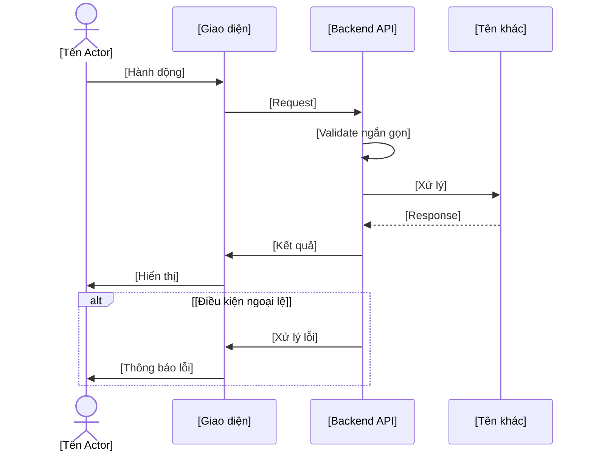

# Kế hoạch Task - Hoàn thiện Sequence Diagram cho 68 Use Cases

## Tổng quan dự án
- **Tổng số Use Cases**: 68
- **Số nhóm chức năng**: 9
- **Thời gian ước tính**: 4-6 tuần
- **Độ ưu tiên**: Cao (Core Business Logic)

## Phân chia Task theo thứ tự SRS

### 📋 **MODULE 1: XÁC THỰC (AUTHENTICATION) - 9 Use Cases**
**Thời gian ước tính**: 1 tuần
**Độ ưu tiên**: Cao nhất

#### Task 1.1: Đăng ký và Xác thực
- [ ] UC-01: Đăng ký tài khoản công dân
- [ ] UC-02: Admin tạo tài khoản cán bộ
- [ ] UC-03: Xác minh mã OTP

#### Task 1.2: Đăng nhập và Quản lý phiên
- [ ] UC-04: Đăng nhập hệ thống
- [ ] UC-05: Đăng xuất hệ thống

#### Task 1.3: Quản lý mật khẩu
- [ ] UC-06: Thay đổi mật khẩu
- [ ] UC-07: Quên mật khẩu
- [ ] UC-08: Đặt lại mật khẩu
- [ ] UC-09: Gửi lại OTP

---

### 👥 **MODULE 2: QUẢN LÝ NGƯỜI DÙNG (ADMIN MANAGEMENT) - 5 Use Cases**
**Thời gian ước tính**: 3-4 ngày
**Độ ưu tiên**: Cao

#### Task 2.1: Xem và Quản lý người dùng
- [ ] UC-10: Xem danh sách người dùng
- [ ] UC-11: Xem thông tin người dùng
- [ ] UC-12: Cập nhật thông tin người dùng
- [ ] UC-13: Khóa/Mở khóa tài khoản
- [ ] UC-14: Xóa tài khoản người dùng

---

### 👤 **MODULE 3: QUẢN LÝ HỒ SƠ CÁ NHÂN (PROFILE MANAGEMENT) - 2 Use Cases**
**Thời gian ước tính**: 1-2 ngày
**Độ ưu tiên**: Trung bình

#### Task 3.1: Quản lý thông tin cá nhân
- [ ] UC-15: Xem thông tin cá nhân
- [ ] UC-16: Cập nhật thông tin cá nhân

---

### 🏠 **MODULE 4: QUẢN LÝ THỬA ĐẤT (LAND MANAGEMENT) - 7 Use Cases**
**Thời gian ước tính**: 1 tuần
**Độ ưu tiên**: Cao nhất

#### Task 4.1: Tạo và Cập nhật thửa đất
- [ ] UC-17: Tạo thửa đất mới
- [ ] UC-18: Cập nhật thông tin thửa đất

#### Task 4.2: Tìm kiếm và Tra cứu
- [ ] UC-19: Tìm kiếm thửa đất
- [ ] UC-20: Xem thửa đất theo chủ sở hữu
- [ ] UC-21: Xem tất cả thửa đất
- [ ] UC-22: Xem chi tiết thửa đất
- [ ] UC-23: Xem lịch sử thửa đất

---

### 📄 **MODULE 5: QUẢN LÝ TÀI LIỆU (DOCUMENT MANAGEMENT) - 15 Use Cases**
**Thời gian ước tính**: 1.5 tuần
**Độ ưu tiên**: Cao

#### Task 5.1: Tạo và Quản lý tài liệu cơ bản
- [ ] UC-24: Tạo tài liệu
- [ ] UC-25: Liên kết tài liệu với thửa đất
- [ ] UC-26: Liên kết tài liệu với giao dịch
- [ ] UC-27: Xem chi tiết tài liệu
- [ ] UC-28: Cập nhật tài liệu
- [ ] UC-29: Xóa tài liệu

#### Task 5.2: Xác minh và Từ chối tài liệu
- [ ] UC-30: Xác minh tài liệu
- [ ] UC-31: Từ chối tài liệu

#### Task 5.3: Tìm kiếm và Phân loại
- [ ] UC-32: Tìm kiếm tài liệu
- [ ] UC-33: Xem tài liệu theo thửa đất
- [ ] UC-34: Xem tài liệu theo giao dịch
- [ ] UC-35: Xem tài liệu theo trạng thái
- [ ] UC-36: Xem tài liệu theo loại
- [ ] UC-37: Xem tài liệu theo người tải lên
- [ ] UC-38: Phân tích tài liệu

---

### 💼 **MODULE 6: QUẢN LÝ GIAO DỊCH (TRANSACTION MANAGEMENT) - 19 Use Cases**
**Thời gian ước tính**: 2 tuần
**Độ ưu tiên**: Cao nhất

#### Task 6.1: Xử lý giao dịch cơ bản
- [ ] UC-39: Xử lý giao dịch
- [ ] UC-40: Tạo yêu cầu chuyển nhượng
- [ ] UC-41: Xác nhận nhận chuyển nhượng
- [ ] UC-42: Tạo yêu cầu tách thửa
- [ ] UC-43: Tạo yêu cầu gộp thửa
- [ ] UC-44: Tạo yêu cầu đổi mục đích sử dụng
- [ ] UC-45: Tạo yêu cầu cấp lại GCN

#### Task 6.2: Chuyển tiếp và Từ chối
- [ ] UC-46: Chuyển tiếp giao dịch
- [ ] UC-52: Từ chối giao dịch

#### Task 6.3: Phê duyệt giao dịch
- [ ] UC-47: Phê duyệt giao dịch chuyển nhượng
- [ ] UC-48: Phê duyệt giao dịch tách thửa
- [ ] UC-49: Phê duyệt giao dịch gộp thửa
- [ ] UC-50: Phê duyệt giao dịch đổi mục đích
- [ ] UC-51: Phê duyệt giao dịch cấp lại GCN

#### Task 6.4: Tìm kiếm và Tra cứu giao dịch
- [ ] UC-53: Tìm kiếm giao dịch
- [ ] UC-54: Xem giao dịch theo thửa đất
- [ ] UC-55: Xem giao dịch theo chủ sở hữu
- [ ] UC-56: Xem tất cả giao dịch
- [ ] UC-57: Xem chi tiết giao dịch

---

### 🔔 **MODULE 7: QUẢN LÝ THÔNG BÁO (NOTIFICATION MANAGEMENT) - 5 Use Cases**
**Thời gian ước tính**: 2-3 ngày
**Độ ưu tiên**: Trung bình

#### Task 7.1: Quản lý thông báo
- [ ] UC-58: Xem danh sách thông báo
- [ ] UC-59: Đếm thông báo chưa đọc
- [ ] UC-60: Đánh dấu đã đọc
- [ ] UC-61: Đánh dấu tất cả đã đọc
- [ ] UC-62: Lưu trữ thông báo

---

### 📊 **MODULE 8: BÁO CÁO & DASHBOARD (REPORTING & DASHBOARD) - 4 Use Cases**
**Thời gian ước tính**: 3-4 ngày
**Độ ưu tiên**: Trung bình

#### Task 8.1: Báo cáo và Phân tích
- [ ] UC-63: Báo cáo hệ thống
- [ ] UC-64: Phân tích thống kê
- [ ] UC-65: Xuất dữ liệu
- [ ] UC-66: Dashboard tổng quan

---

### ⚙️ **MODULE 9: QUẢN TRỊ HỆ THỐNG (SYSTEM ADMINISTRATION) - 2 Use Cases**
**Thời gian ước tính**: 1-2 ngày
**Độ ưu tiên**: Thấp

#### Task 9.1: Quản trị hệ thống
- [ ] UC-67: Cài đặt hệ thống
- [ ] UC-68: Quản lý logs

---

## Lộ trình thực hiện

### **TUẦN 1: Core Authentication & User Management**
- **Ngày 1-2**: Module 1 - Xác thực (Task 1.1, 1.2)
- **Ngày 3-4**: Module 1 - Quản lý mật khẩu (Task 1.3)
- **Ngày 5-7**: Module 2 - Quản lý người dùng (Task 2.1)

### **TUẦN 2: Land Management & Document Management**
- **Ngày 1-3**: Module 4 - Quản lý thửa đất (Task 4.1, 4.2)
- **Ngày 4-7**: Module 5 - Quản lý tài liệu (Task 5.1, 5.2, 5.3)

### **TUẦN 3: Transaction Management (Part 1)**
- **Ngày 1-3**: Module 6 - Xử lý giao dịch cơ bản (Task 6.1, 6.2)
- **Ngày 4-7**: Module 6 - Phê duyệt giao dịch (Task 6.3)

### **TUẦN 4: Transaction Management (Part 2) & Others**
- **Ngày 1-2**: Module 6 - Tìm kiếm giao dịch (Task 6.4)
- **Ngày 3-4**: Module 3 - Quản lý hồ sơ cá nhân (Task 3.1)
- **Ngày 5-6**: Module 7 - Quản lý thông báo (Task 7.1)
- **Ngày 7**: Module 8 - Báo cáo & Dashboard (Task 8.1)

### **TUẦN 5: Finalization & System Administration**
- **Ngày 1-2**: Module 9 - Quản trị hệ thống (Task 9.1)
- **Ngày 3-5**: Review và hoàn thiện tất cả sequence diagrams
- **Ngày 6-7**: Tạo tài liệu tổng hợp và hướng dẫn sử dụng

---

## Tiêu chí hoàn thành cho mỗi Use Case

### ✅ **Yêu cầu bắt buộc:**
1. **Sequence Diagram hoàn chỉnh** với mermaid syntax
2. **Luồng nghiệp vụ chính** được mô tả rõ ràng
3. **Các actor và participant** được định nghĩa đúng
4. **Các trường hợp ngoại lệ** được xử lý
5. **Mô tả ngắn gọn** về use case

### ✅ **Yêu cầu bổ sung:**
1. **Tập trung vào nghiệp vụ**, không đi sâu kỹ thuật
2. **Sử dụng ngôn ngữ tiếng Việt** cho các mô tả
3. **Cấu trúc nhất quán** giữa các use case
4. **Dễ hiểu và dễ bảo trì**
5. **Validate ngắn gọn**, không chi tiết quá

---

## Template cho mỗi Use Case

```markdown
## UC-XX: Tên Use Case

### Mô tả ngắn gọn
[1-2 câu mô tả chức năng]

### Sequence Diagram


### Các trường hợp ngoại lệ
- [Mô tả ngắn gọn các trường hợp ngoại lệ]

### Quy tắc nghiệp vụ
- [Liệt kê các quy tắc quan trọng]
```

---

## Theo dõi tiến độ

### **Dashboard tiến độ:**
- **Tổng số Use Cases**: 68
- **Đã hoàn thành**: 0/68 (0%)
- **Đang thực hiện**: 0
- **Chưa bắt đầu**: 68

### **Thống kê theo Module:**
- Module 1: 0/9 (0%)
- Module 2: 0/5 (0%)
- Module 3: 0/2 (0%)
- Module 4: 0/7 (0%)
- Module 5: 0/15 (0%)
- Module 6: 0/19 (0%)
- Module 7: 0/5 (0%)
- Module 8: 0/4 (0%)
- Module 9: 0/2 (0%)

---

## Hướng dẫn bắt đầu

### **Bước 1: Chuẩn bị**
1. Tạo file `Complete_Use_Case_Sequence_Diagrams.md`
2. Copy template vào file
3. Bắt đầu với Module 1, Task 1.1

### **Bước 2: Thực hiện**
1. Chọn use case đầu tiên (UC-01)
2. Tạo sequence diagram theo template
3. Đánh dấu hoàn thành trong checklist
4. Chuyển sang use case tiếp theo

### **Bước 3: Review**
1. Kiểm tra tính nhất quán
2. Đảm bảo luồng nghiệp vụ đúng
3. Cập nhật tiến độ
4. Commit và push code

---

## Lưu ý quan trọng

1. **Ưu tiên theo thứ tự module** đã định
2. **Tập trung vào nghiệp vụ**, không đi sâu kỹ thuật
3. **Sử dụng ngôn ngữ tiếng Việt** cho mô tả
4. **Cập nhật tiến độ** sau mỗi use case hoàn thành
5. **Review định kỳ** để đảm bảo chất lượng
6. **Validate ngắn gọn**, không chi tiết quá

---

**Ngày bắt đầu**: [Cập nhật khi bắt đầu]
**Ngày hoàn thành dự kiến**: [Cập nhật khi bắt đầu]
**Người thực hiện**: [Cập nhật khi bắt đầu]
